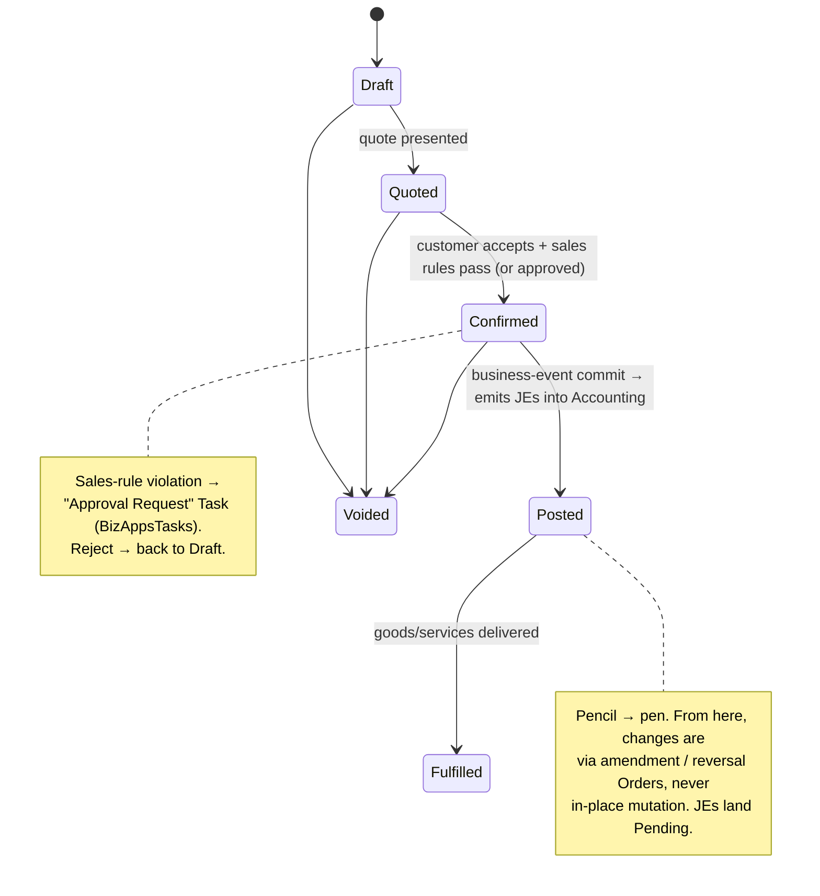

<p align="center">
  
</p>

<h1 align="center">BizApps Orders</h1>

<p align="center">
  <strong>Unified order-management substrate — products, orders, invoicing, payments, subscriptions, and intercompany flows — for the <a href="https://github.com/MemberJunction/MJ">MemberJunction</a> platform</strong>
</p>

<p align="center">
  <a href="#what-this-is--and-is-not">What this is</a> &middot;
  <a href="#installation">Install</a> &middot;
  <a href="#what-you-get">What you get</a> &middot;
  <a href="#entity-model">Entity Model</a> &middot;
  <a href="#using-bizapps-orders-in-your-code">Code</a> &middot;
  <a href="plans/bizapps-orders-master.md">Design Doc</a>
</p>

<p align="center">
  
  
  
  
  
  
  
</p>

---

> **⚠️ Status: design / pre-implementation.** This repository currently holds the [master plan](plans/bizapps-orders-master.md); schema and code land once the [BizApps Accounting](https://github.com/MemberJunction/bizapps-accounting) schema locks (imminent). Code samples below describe the **v1 surface as designed** and are forward-looking — see [Phasing](#phasing) for what's buildable when.

A customer commits to pay; the system tracks both **what they're getting** and **how they're paying**. BizApps Orders treats orders, invoices, payments, and subscriptions as **aspects of the same business event** and ships them as one **MemberJunction Open App** — so an MJ adopter installs a single dependency and has working order management in days, rather than stitching together separate payments and subscriptions packages.

Orders is the **orchestrator**; it does not keep the ledger. Every business event that requires accounting (order booked, payment captured, revenue recognized, refund issued) is emitted as a balanced journal entry into [BizApps Accounting](https://github.com/MemberJunction/bizapps-accounting), which batches the subledger to the ERP. Tax calculation delegates to Accounting's pluggable tax engine; contract terms live upstream in BizApps Contracts; the customer master lives in [BizApps Common](https://github.com/MemberJunction/bizapps-common).

---

## What This Is — and Is Not

| ✅ This is | ❌ This is not |
|---|---|
| The transactional substrate: products, orders, invoices, payments, subscriptions | The general ledger (calls into BizApps Accounting) |
| Multi-company native — one order can span subsidiaries, with intercompany Due-From/Due-To JEs generated at book time | A tax engine (delegates to Accounting's pluggable `TaxCalculationProvider`) |
| Payment-provider agnostic (Stripe first; others pluggable via `RegisterClass`) | The contract layer (terms / escalators / renewals live in BizApps Contracts) |
| Subscription-aware with revenue-recognition schedules | An e-commerce storefront / customer portal |
| Reversal-disciplined — returns, refunds, chargebacks, credit memos, cancellations at every layer | A CRM (customer master lives in BizApps Common) |

See [`plans/bizapps-orders-master.md`](plans/bizapps-orders-master.md) §1 and §16 for the full positioning (BO-D1) and the explicit out-of-scope list.

---

## Installation

BizApps Orders is a [MemberJunction Open App](https://github.com/MemberJunction/MJ/tree/main/packages/OpenApp). Once published, install it into any MJ environment using the [MJ CLI](https://github.com/MemberJunction/MJ/tree/main/packages/MJCLI):

```bash
mj app install https://github.com/MemberJunction/bizapps-orders
```

The CLI resolves dependencies automatically — installing this app pulls in [BizApps Accounting](https://github.com/MemberJunction/bizapps-accounting) (GL primitives, Currency/FX, tax), [BizApps Common](https://github.com/MemberJunction/bizapps-common) (Person, Organization, Address), and [BizApps Tasks](https://github.com/MemberJunction/bizapps-tasks) (the workflow/approval substrate).

### Managing an installed app

```bash
mj app info mj-bizapps-orders     # Show details and version
mj app upgrade mj-bizapps-orders  # Upgrade to latest release
mj app disable mj-bizapps-orders  # Temporarily disable
mj app enable mj-bizapps-orders   # Re-enable
mj app remove mj-bizapps-orders   # Uninstall (--keep-data to preserve schema)
```

---

## What You Get

### Database (`__mj_BizAppsOrders` schema)

| Area | Tables | Purpose |
|---|---|---|
| **Catalog** | `Product`, `ProductCategory`, `ProductPrice`, `ProductTaxCategory` | Sellable items with revenue-recognition policy, pricing, and tax categorization |
| **Orders** | `Order`, `OrderLine`, `OrderLineTaxLine` | The customer commitment; multi-line, multi-company, multi-currency, with per-jurisdiction tax breakdown |
| **Invoicing** | `Invoice` | Standard + CreditMemo invoices generated from posted orders |
| **Payments** | `Payment`, `PaymentProvider`, `PaymentIntent`, `PaymentAllocation` | Provider-agnostic capture / refund / chargeback, allocated across invoices |
| **Subscriptions** | `SubscriptionPlan`, `Subscription`, `SubscriptionEvent` | Full lifecycle (trial / active / paused / canceled / migrated) with an immutable event log |
| **Revenue recognition** | `RevenueRecognitionSchedule`, `RevRecScheduleLine` | The ratable waterfall (display + computation source); JE materialization is Accounting's job |
| **Intercompany** | `IntercompanyFlow` | Due-From/Due-To linkage between subsidiaries for a multi-company order |
| **Sales governance** | `SalesRule`, `SalesAuthority`, `PaymentTermsType` | Metadata-driven discount/credit/authorization rules; per-rep limits; payment terms |

### TypeScript Packages

| Package | NPM Name | Role |
|---|---|---|
| **Entities** | `@mj-biz-apps/orders-entities` | Strongly-typed entity classes with Zod validation |
| **Actions** | `@mj-biz-apps/orders-actions` | Server-side action handlers (order post, invoice generation, payment capture, webhook processing) |
| **Server** | `@mj-biz-apps/orders-server` | GraphQL resolvers, server bootstrap, and the pluggable `PaymentProvider` implementations |
| **Angular** | `@mj-biz-apps/orders-ng` | UI components, form overrides, custom widgets |
| **Core Entities Server** | `@mj-biz-apps/orders-core-entities-server` | Server-only entity lifecycle hooks (order numbering, line-total validation, JE emission) |

---

## Core Principles

### Order is the substrate, everything else is fallout
The `Order` is the customer's commitment. Subscriptions are born from order lines; invoices generate from orders; payments allocate to invoices; revenue-recognition schedules hang off subscriptions. Model the order correctly and the rest is mechanical *(BO-D4)*.

### Multi-company is native (no single `CompanyID` on the order)
Each `OrderLine` owns its revenue-recognizing `CompanyID`; the receiving company (where cash lands) is on the `Payment`. A customer can buy from three subsidiaries in one transaction, and Orders generates the **intercompany Due-From/Due-To journal entries** at book time — replacing the old Power-BI consolidation hack *(BO-D5, BO-D6)*.

### Generate JEs; Accounting batches them
Orders generates balanced journal entries from domain logic and persists them into Accounting via a thin `AccountingService` façade. They land **`Pending`**; Accounting's batch run flips them to **`Batched`** and ships the consolidated subledger to the ERP. **"Post" means create a Pending JE — not post to the GL.** Lineage back to the order/payment is via soft-ref columns + Accounting's polymorphic `JournalEntryLink` — **never hard FKs into Orders** *(BO-D7, BO-D28)*.

### Reversal discipline at every layer
Every business event has a reversal at its own layer — Order returns/cancellations, Payment refunds/chargebacks, Invoice credit memos, Subscription cancellations — each emitting its own reversal JE (with `ReversesJournalEntryID`). Nothing is erased; the audit chain is the source of truth *(BO-D9, BO-D10)*.

### Workflow runs on BizApps Tasks
Any human gate — a discount beyond a rep's authority, a customer-requested credit-limit override, a large refund authorization — is raised as an **"Approval Request" Task** in [BizApps Tasks](https://github.com/MemberJunction/bizapps-tasks), linked to the subject record and routed to an approver role. The recorded decision drives the downstream state transition *(BO-D17, BO-D27)*.

---

## Entity Model

```
   BizAppsCommon                          __mj.Company
   Organization / Person                       │ (per-line owner)
        │ customer                              │
        ▼                                       ▼
  ┌─────────────┐   1   ►   N   ┌───────────────────────────┐
  │   Order     │──────────────►│        OrderLine          │──► Product ──► ProductPrice
  │ (Draft→     │               │ CompanyID, Qty, UnitPrice │       │        ProductCategory
  │  Quoted→    │               │ tax / FX / rev-rec / sub  │       └──► ProductTaxCategory
  │  Confirmed→ │               └───────────┬───────────────┘
  │  Posted→    │                           │
  │  Fulfilled) │              ┌────────────┼───────────────┬───────────────┐
  └──────┬──────┘              ▼            ▼               ▼               ▼
         │              OrderLineTaxLine  Subscription  RevenueRecognition  IntercompanyFlow
         │                                    │          Schedule              │
         ▼                                    ▼              │                 ▼
     ┌────────┐   N ◄─ allocate ─► N   ┌──────────────┐  RevRecScheduleLine   (Due-From / Due-To
     │Invoice │◄────────────────────── │   Payment    │      │                 JE legs in Accounting)
     │ (Std / │     PaymentAllocation  │ (capture /   │      ▼
     │ Credit │                        │  refund /    │  ScheduledJournalEntry  ──► BizAppsAccounting
     │ Memo)  │                        │  chargeback) │  (materialized at period close)
     └───┬────┘                        └──────┬───────┘
         │ PostedJournalEntryID               │ PaymentIntent ◄── PaymentProvider (Stripe / Manual / …)
         ▼                                    ▼
   BizAppsAccounting.JournalEntry  ◄──  lineage via JournalEntryLink (no hard FK)
```

### Cross-app references

| FK on an Orders entity | Refers to | Lives in |
|---|---|---|
| `Order.CustomerOrganizationID` | `Organization.ID` | `bizapps-common` |
| `Order.CustomerPersonID`, `SalesRepUserID` | `Person.ID`, `__mj.User` | `bizapps-common`, `__mj` |
| `OrderLine.CompanyID` | `Company.ID` | `__mj` |
| `OrderLine.CurrencyCode`, `ProductPrice.CurrencyCode` | `Currency.Code` | **`bizapps-accounting`** (BA-D11) |
| `Product.RevenueGLAccountID`, `DeferredRevenueGLAccountID` | `GLAccount.ID` | `bizapps-accounting` |
| `OrderLineTaxLine.TaxJurisdictionID` / `TaxRateID` | tax entities | `bizapps-accounting` |
| `Invoice.PostedJournalEntryID`, `Payment.PostedJournalEntryID` | `JournalEntry.ID` | `bizapps-accounting` |
| `Order` approval | `Task` ("Approval Request") | `bizapps-tasks` |
| `Order.ContractID` | `Contract.ID` (soft ref) | `bizapps-contracts` (future) |

See [Entity Model in the master plan](plans/bizapps-orders-master.md#4-entity-model) for the complete reference.

---

## Order Lifecycle



**Reversal pattern**: a return/cancellation/amendment is a **new** `Order` (`OrderType ∈ {Return, Cancellation, Amendment}`, `ReversesOrderID` set), with negative-quantity lines for the slice being reversed. Posting it emits a reversal JE. Both orders and both JEs persist; net is zero; the audit chain — not erasure — is the source of truth.

---

## Multi-Company Orders

The canonical scenario: a customer buys from three subsidiaries on one order. Payment lands at the receiving company (BCHQ); Orders auto-generates the per-company revenue/AR JEs **and** the intercompany legs at Post time.

```
Order for "Acme Corp" — payment to BCHQ:
  Line 1: Sidecar Pro subscription  $99/mo   (CompanyID = Sidecar)
  Line 2: Cimatri analytics         $5,000    (CompanyID = Cimatri)
  Line 3: BCHQ consulting           $10,000   (CompanyID = BCHQ)

At Order Post, Orders emits (each a Pending JE in Accounting):
  JE in BCHQ:     Dr Accounts Receivable (Acme)   $15,099 + tax
                  Cr Sales Revenue                 $10,000
                  Cr Intercompany AP (Sidecar)     $99 + tax
                  Cr Intercompany AP (Cimatri)     $5,000 + tax
                  Cr Sales Tax Payable             (BCHQ portion)
  JE in Sidecar:  Dr Intercompany AR (BCHQ)        $99 + tax
                  Cr Deferred Revenue              $99        (subscription → ratable)
                  Cr Sales Tax Payable             (portion)
  JE in Cimatri:  Dr Intercompany AR (BCHQ)        $5,000 + tax
                  Cr Sales Revenue                 $5,000
                  Cr Sales Tax Payable             (portion)
```

An `IntercompanyFlow` record links each non-receiving leg for analytics and reconciliation. Per BA-D17 the **orchestration lives here in Orders** — Accounting just receives each balanced leg.

---

## Revenue Recognition

Orders **computes** the recognition waterfall (period count, per-period amounts, front-loaded rounding remainder in entry 1) and generates one **`ScheduledJournalEntry`** per accounting period in BizApps Accounting. Accounting's **period-close engine materializes** each into a Pending JE (Dr Deferred Revenue / Cr Revenue) on its target period and freezes it. There is **no Orders-side rev-rec cron** — Orders keeps a lightweight `RevenueRecognitionSchedule` only for MRR/ARR display *(BO-D11, accounting BA-D25)*.

---

## Payment Providers (Pluggable)

Providers register against an abstract `PaymentProvider` base via MJ's `@RegisterClass` / `ClassFactory` — new providers ship without a schema change. Inbound webhooks are received by an **unauthenticated Express route** (mirroring MJ's `SignatureWebhookHandler`) that captures the raw body and verifies the provider HMAC signature in the driver before handing off to processing; idempotency is enforced via `ProviderEventID` uniqueness *(BO-D12, BO-D13)*.

| Provider | Status |
|---|---|
| **Stripe** (PaymentIntents, Subscriptions, Refunds, webhooks) | v1 |
| **Manual** (Wire / ACH / Check / Cash recorded by finance) | v1 |
| PayPal | v1.5 |
| Square / Authorize.Net / Adyen | v2 |

---

## Using BizApps Orders in Your Code

> Forward-looking — these illustrate the v1 surface as designed in [`plans/bizapps-orders-master.md`](plans/bizapps-orders-master.md). See [Phasing](#phasing) for what's currently buildable.

### Creating and posting an order

```typescript
import { Metadata, RunView } from '@memberjunction/core';
import type { OrderEntity, OrderLineEntity } from '@mj-biz-apps/orders-entities';

const md = new Metadata();
const order = await md.GetEntityObject<OrderEntity>('MJ_BizApps_Orders: Orders', contextUser);
order.NewRecord();
order.CustomerOrganizationID = acmeOrgId;
order.OrderType = 'Sale';
order.Status = 'Draft';
order.OrderDate = new Date();
await order.Save();

const line = await md.GetEntityObject<OrderLineEntity>('MJ_BizApps_Orders: Order Lines', contextUser);
line.NewRecord();
line.OrderID = order.ID;
line.ProductID = sidecarProProductId;
line.CompanyID = sidecarCompanyId;   // per-line revenue owner (multi-company)
line.Quantity = 1;
line.UnitPrice = 99.0;
line.CurrencyCode = 'USD';           // Currency owned by BizApps Accounting
await line.Save();                   // server hook validates line totals
```

### Emitting the journal entries (via the Accounting façade)

```typescript
import { AccountingService, type JournalEntryDraft } from '@mj-biz-apps/accounting-server';

// On Order Post, Orders builds one balanced JE per company involved.
const draft: JournalEntryDraft = {
  companyId: bchqCompanyId,
  effectiveDate: new Date(),
  entryType: 'OrderBooking',
  orderId: order.ID,                 // soft-ref lineage; recorded via JournalEntryLink
  lines: [
    { glAccountCode: '11201', dr: 15099.0, counterpartyOrganizationId: acmeOrgId }, // AR
    { glAccountCode: '40100', cr: 10000.0 },                                          // Sales (BCHQ)
    { glAccountCode: '21501', cr:    99.0 },                                          // Intercompany AP (Sidecar)
    { glAccountCode: '21501', cr:  5000.0 },                                          // Intercompany AP (Cimatri)
  ],
};
const je = await AccountingService.createJournalEntry(draft, contextUser); // Status='Pending'
```

### Scheduling ratable revenue (Accounting materializes it)

```typescript
import { AccountingService, type ScheduledJournalEntryDraft } from '@mj-biz-apps/accounting-server';

// 12 monthly Dr Deferred Revenue / Cr Revenue entries; entry 1 carries the rounding remainder.
const schedule: ScheduledJournalEntryDraft[] = buildRevRecWaterfall(subscription);
await AccountingService.createScheduledJournalEntries(schedule, contextUser);
// Accounting materializes each into a Pending JE at its target period close — no Orders cron.
```

### Routing a sales-rule violation for approval (via BizApps Tasks)

```typescript
import { TaskService } from '@mj-biz-apps/tasks-core';

// Discount exceeds the rep's SalesAuthority → raise an Approval Request task,
// linked to the Order and routed to the approver role. On approve → Post proceeds;
// on reject → Order returns to Draft with the decision notes annotated.
await new TaskService().createApprovalRequest({
  taskType: 'Approval Request',
  subjectEntity: 'MJ_BizApps_Orders: Orders',
  subjectRecordId: order.ID,
  approverRoleId: financeApproverRoleId,
}, contextUser);
```

---

## Database Support

SQL Server is the **source of truth** for migrations. PostgreSQL is supported via automatic conversion using [`@memberjunction/sql-converter`](https://github.com/MemberJunction/MJ/tree/main/packages/SQLConverter) — we consume MJ's toolchain directly.

```
migrations/                       ←  T-SQL, hand-written
  V<TS>__v<X.Y.x>__Foo.sql

migrations-pg/                    ←  PG, produced by `npx mj sql-convert`
  V<TS>__v<X.Y.x>__Foo.pg.sql        (converter output)
  V<TS>__v<X.Y.x>__Bar.pg-only.sql   (PG-only patches when needed)
```

At runtime `mj migrate` reads `DB_PLATFORM` and picks the right directory (`sqlserver` → `migrations/`, `postgresql` → `migrations-pg/`). CI applies the PG set to a fresh `postgres:17` container on every PR that touches migrations — a T-SQL migration cannot land without a working PG counterpart.

---

## Repository Structure

```
bizapps-orders/
├── mj-app.json                    # MJ Open App manifest (schema __mj_BizAppsOrders)
├── mj.config.cjs                  # CodeGen config + SQL → PG placeholder rules
├── apps/
│   ├── MJAPI/                     # GraphQL API server (port 4103)
│   └── MJExplorer/                # Angular UI application (port 4303)
├── packages/
│   ├── Entities/                  # @mj-biz-apps/orders-entities
│   ├── Actions/                   # @mj-biz-apps/orders-actions
│   ├── Server/                    # @mj-biz-apps/orders-server (+ PaymentProvider implementations)
│   ├── CoreEntitiesServer/        # @mj-biz-apps/orders-core-entities-server (server-only lifecycle hooks)
│   └── Angular/                   # @mj-biz-apps/orders-ng
├── migrations/                    # T-SQL migrations (source of truth)
├── migrations-pg/                 # PG migrations (converter output + .pg-only patches)
├── metadata/                      # Seed data + entity metadata (synced via mj-sync)
└── plans/
    └── bizapps-orders-master.md   # Full design doc & decision log (BO-D1..BO-D29)
```

Ports follow the BizApps convention (MJ core 4001/4201, common 4101/4301, accounting 4102/4302); Orders uses **4103 / 4303**.

---

## Phasing

Modular delivery (~18 weeks), co-evolving with BizApps Accounting. v1 ships **Stripe + Manual** providers only; phases that consume not-yet-built accounting surface are sequenced behind their accounting counterparts *(BO-D29)*. Full detail in [master plan §14](plans/bizapps-orders-master.md#14-phasing-and-delivery).

| Phase | Scope |
|---|---|
| **A** | Product catalog + basic single-company Order lifecycle (Draft → Posted), line validation |
| **B** | Multi-company + `IntercompanyFlow`, JE emission via the Accounting façade, invoice generation, reversal orders |
| **C** | `PaymentProvider` abstraction + Stripe, `PaymentIntent`, `Payment`, allocation, capture JE, webhook receiver |
| **D** | Subscriptions + lifecycle, `ScheduledJournalEntry` generation (Accounting materializes) |
| **E** | Manual payment provider + non-Stripe billing + dunning |
| **F** | Sales rules + **Tasks-based approvals** (depends on bizapps-tasks workflow features) |
| **G** | Tax integration (Accounting's `TaxCalculationProvider`) + advanced multi-currency / realized FX |
| **H** | Provider expansion (PayPal v1.5; Square/Authorize/Adyen v2) + reconciliation |

---

## Cross-Repo Coordination

This app's integration surface depends on companion work, tracked as issues (see [master plan §17](plans/bizapps-orders-master.md#17-cross-repo-coordination)):

| Dependency | Issue |
|---|---|
| `AccountingService` façade (`createJournalEntry` / `createScheduledJournalEntries`) | [bizapps-accounting #9](https://github.com/MemberJunction/bizapps-accounting/issues/9) |
| Accounting adopts BizApps Tasks for approvals | [bizapps-accounting #10](https://github.com/MemberJunction/bizapps-accounting/issues/10) |
| Generic approval/workflow features in BizApps Tasks | [bizapps-tasks #8](https://github.com/MemberJunction/bizapps-tasks/issues/8) |

---

## Documentation

| Document | Description |
|---|---|
| [Master Plan](plans/bizapps-orders-master.md) | Full design doc, decision log (BO-D1..BO-D29), entity model, multi-company mechanics, reversal patterns, phasing |
| [BizApps Accounting](https://github.com/MemberJunction/bizapps-accounting) | The ledger primitives Orders emits into |
| [BizApps Common](https://github.com/MemberJunction/bizapps-common) | Person / Organization / Address master data |
| [BizApps Tasks](https://github.com/MemberJunction/bizapps-tasks) | The workflow / approval substrate |

---

## Tech Stack

| Layer | Technology | Version |
|---|---|---|
| **Platform** | [MemberJunction](https://github.com/MemberJunction/MJ) | 5.40+ |
| **Runtime** | Node.js | 18+ |
| **Language** | TypeScript | 5.9 (strict) |
| **Database (primary)** | SQL Server / Azure SQL | 2019+ |
| **Database (secondary)** | PostgreSQL | 17 |
| **API** | GraphQL (Apollo Server) | -- |
| **UI Framework** | Angular | 21 |
| **Build** | Turborepo | 2.7 |
| **Validation** | Zod | 3.24 |
| **SQL Conversion** | [`@memberjunction/sql-converter`](https://github.com/MemberJunction/MJ/tree/main/packages/SQLConverter) | 5.40+ |

---

## License

ISC

---

<p align="center">
  Built on <a href="https://github.com/MemberJunction/MJ">MemberJunction</a> — the open-source metadata-driven application platform.
</p>
