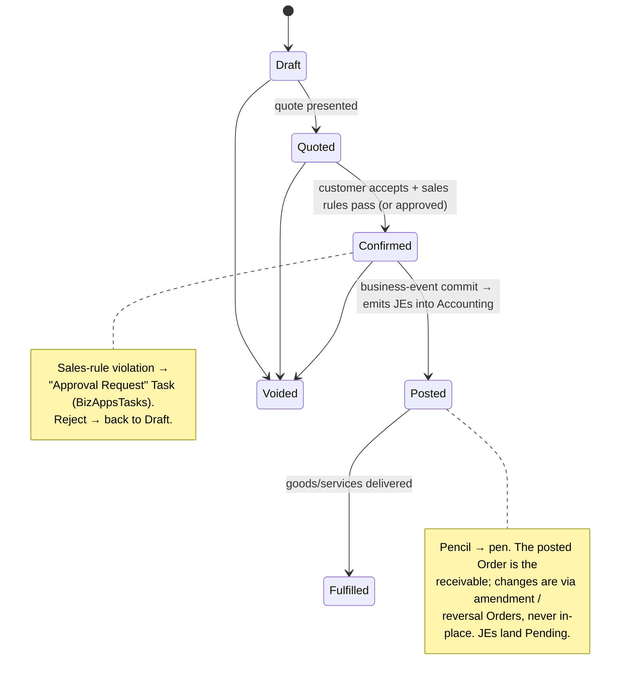

<p align="center">
  
</p>

<h1 align="center">BizApps Orders</h1>

<p align="center">
  <strong>Unified order-management substrate — products, orders, payments, subscriptions, and intercompany flows — for the <a href="https://github.com/MemberJunction/MJ">MemberJunction</a> platform</strong>
</p>

<p align="center">
  <a href="#what-this-is--and-is-not">What this is</a> &middot;
  <a href="#installation">Install</a> &middot;
  <a href="#what-you-get">What you get</a> &middot;
  <a href="#product-management">Products</a> &middot;
  <a href="#entity-model">Entity Model</a> &middot;
  <a href="#using-bizapps-orders-in-your-code">Code</a> &middot;
  <a href="plans/bizapps-orders-master.md">Design Doc</a>
</p>

<p align="center">
  
  
  
  
  
  
  
</p>

---

> **⚠️ Status: design / pre-implementation.** This repository currently holds the [master plan](plans/bizapps-orders-master.md) (decision log **BO-D1 … BO-D47**); schema and code land once the [BizApps Accounting](https://github.com/MemberJunction/bizapps-accounting) schema locks (imminent). Code samples below describe the **v1 surface as designed** and are forward-looking — see [Phasing](#phasing) for what's buildable when.

A customer commits to pay; the system tracks both **what they're getting** and **how they're paying**. BizApps Orders treats orders, payments, and subscriptions as **aspects of the same business event** and ships them as one **MemberJunction Open App** — so an MJ adopter installs a single dependency and has working order management in days, rather than stitching together separate payments and subscriptions packages.

The model is deliberately lean: **the substrate is Products → Orders → Payments.** A posted **Order is both the customer's commitment and the A/R document** (its own bill) — there is no separate Invoice entity. Recurring and milestone cadence lives one level up, in Subscriptions and Contracts that spawn a fresh Order each cycle/milestone.

Orders is the **orchestrator**; it does not keep the ledger. Every business event that requires accounting (order booked, payment captured, revenue recognized, refund issued) is emitted as a balanced journal entry into [BizApps Accounting](https://github.com/MemberJunction/bizapps-accounting), which batches the subledger to the ERP. Tax calculation delegates to Accounting's pluggable tax engine; contract terms live upstream in BizApps Contracts; the customer master lives in [BizApps Common](https://github.com/MemberJunction/bizapps-common); workflow/approvals run on [BizApps Tasks](https://github.com/MemberJunction/bizapps-tasks).

---

## What This Is — and Is Not

| ✅ This is | ❌ This is not |
|---|---|
| The transactional substrate: products, orders, payments, subscriptions | The general ledger (calls into BizApps Accounting) |
| **Order as the A/R primitive** — the posted order *is* the receivable & the bill | A separate invoicing system (no Invoice entity; bills/statements are reports) |
| Multi-company native — one order can span subsidiaries, with intercompany Due-From/Due-To JEs generated at book time | A tax engine (delegates to Accounting's pluggable `TaxCalculationProvider`) |
| Payment-provider agnostic (Stripe first; others — incl. internal gift-card — pluggable via `RegisterClass`) | The contract layer (terms / escalators / renewals live in BizApps Contracts) |
| Subscription-aware with revenue-recognition schedules | An e-commerce storefront / customer portal |
| Reversal-disciplined — returns, refunds, chargebacks, credit-memo orders, cancellations at every layer | A CRM (customer master lives in BizApps Common) |

See [`plans/bizapps-orders-master.md`](plans/bizapps-orders-master.md) §1 and §16 for the full positioning (BO-D1) and the explicit out-of-scope list.

---

## Installation

BizApps Orders is a [MemberJunction Open App](https://github.com/MemberJunction/MJ/tree/main/packages/OpenApp). Once published, install it into any MJ environment using the [MJ CLI](https://github.com/MemberJunction/MJ/tree/main/packages/MJCLI):

```bash
mj app install https://github.com/MemberJunction/bizapps-orders
```

The CLI resolves dependencies automatically — installing this app pulls in [BizApps Accounting](https://github.com/MemberJunction/bizapps-accounting) (GL primitives, Currency/FX, tax), [BizApps Common](https://github.com/MemberJunction/bizapps-common) (Person, Organization, Address), and [BizApps Tasks](https://github.com/MemberJunction/bizapps-tasks) (the workflow/approval substrate).

### Managing an installed app

```bash
mj app info mj-bizapps-orders     # Show details and version
mj app upgrade mj-bizapps-orders  # Upgrade to latest release
mj app disable mj-bizapps-orders  # Temporarily disable
mj app enable mj-bizapps-orders   # Re-enable
mj app remove mj-bizapps-orders   # Uninstall (--keep-data to preserve schema)
```

---

## What You Get

### Database (`__mj_BizAppsOrders` schema)

| Area | Tables | Purpose |
|---|---|---|
| **Catalog** | `ProductType`, `Product`, `ProductCategory`, `ProductPrice`, `PriceList`, `PriceTier`, `ProductTaxCategory` | Sellable items with type-driven behavior, segmented & tiered pricing, rev-rec policy, tax categorization |
| **Composite & policy** | `ProductBundleItem`, `ProductPerformanceObligation`, `ProductEntitlement` | Bundles/kits, ASC-606 performance obligations (SSP), and *what a purchase grants* |
| **Type extensions (IsA)** | `EventProduct` / `EventOrderLine`, `MembershipProduct`, `DigitalGoodProduct`, … | Per-type attributes via MJ IsA disjoint subtypes (shared UUID), at Product *and* OrderLine level |
| **Orders & A/R** | `Order`, `OrderLine`, `OrderLineTaxLine` | The commitment **and the receivable** (Order carries `Balance` / `PaymentStatus` / `DueDate`); multi-line, multi-company, multi-currency, per-jurisdiction tax |
| **Payments** | `Payment`, `PaymentProvider`, `PaymentIntent`, `PaymentLine`, `CustomerPaymentMethod` | Provider-agnostic capture / refund / chargeback; `PaymentLine` applies cash to Orders; saved-instrument token vault (charge-on-file) |
| **Stored value** | `StoredValueAccount`, `StoredValueTransaction` | Gift cards / stored value — issued as a product, redeemed as an internal payment provider |
| **Subscriptions** | `SubscriptionPlan`, `Subscription`, `SubscriptionEvent` | Continuity record that spawns a renewal Order each cycle; lifecycle (trial/active/paused/canceled/migrated) + immutable event log |
| **Revenue recognition** | `RevenueRecognitionSchedule`, `RevRecScheduleLine` | The ratable waterfall (display + computation source); JE materialization is Accounting's job |
| **Entitlement grants** | `EntitlementGrant` | The provisioned instance of an entitlement, with a **beneficiary** (may differ from the buyer) |
| **Intercompany** | `IntercompanyFlow` | Due-From/Due-To linkage between subsidiaries for a multi-company order |
| **Sales governance** | `SalesRule`, `SalesAuthority`, `PaymentTermsType` | Metadata-driven discount/credit/authorization rules; per-rep limits; payment terms |

### TypeScript Packages

| Package | NPM Name | Role |
|---|---|---|
| **Entities** | `@mj-biz-apps/orders-entities` | Strongly-typed entity classes with Zod validation |
| **Actions** | `@mj-biz-apps/orders-actions` | Server-side action handlers (order post, payment capture, webhook processing, scheduled billing) |
| **Server** | `@mj-biz-apps/orders-server` | GraphQL resolvers, server bootstrap, the `OrdersEngine` (cached metadata + helpers), and the pluggable `PaymentProvider` / `ProductBehavior` implementations |
| **Angular** | `@mj-biz-apps/orders-ng` | UI components, form overrides, custom widgets |
| **Core Entities Server** | `@mj-biz-apps/orders-core-entities-server` | Server-only entity lifecycle hooks (order numbering, line-total & balance maintenance, entitlement/subscription provisioning) |

---

## Core Principles

### Order is the substrate *and* the A/R primitive
The `Order` is the customer's commitment **and the bill**. Subscriptions are born from order lines; payments apply to orders; revenue-recognition schedules hang off subscriptions. There is **no Invoice entity** — a posted Order *is* the receivable, with `Balance = TotalGross − SUM(posted PaymentLine.Amount)` and a `PaymentStatus`. The customer-facing "invoice" and any consolidated statement are **rendered reports**, not entities *(BO-D4, BO-D15, BO-D45)*.

### Type-driven products
`ProductType` is the keystone: it carries behavior defaults, names the **IsA extension entities** (e.g. `EventProduct` / `EventOrderLine`) that add per-type attributes without bloating base tables, declares subscription semantics, and points to a `ProductBehavior` plugin. A product's pricing, rev-rec, tax, entitlements, and billing cadence all attach here, so everything downstream inherits correct behavior *(BO-D31, BO-D37, BO-D38)*.

### Generate JEs; Accounting batches them
Orders generates balanced journal entries from domain logic and persists them into Accounting via the `AccountingEngine` (a cached MJ `BaseEngine` with helper methods). They land **`Pending`**; Accounting's batch run flips them to **`Batched`** and ships the consolidated subledger to the ERP. **"Post" means create a Pending JE — not post to the GL.** Lineage back to the order/payment is via soft-ref columns + Accounting's polymorphic `JournalEntryLink` — **never hard FKs into Orders** *(BO-D7, BO-D28, BO-D30)*.

### Cached engines + helper methods
Both apps expose an MJ `BaseEngine` that caches slow-changing metadata and provides domain helpers (`Config()` + `ObserveProperty` + lazy singleton). **`OrdersEngine`** caches the catalog/config (products, prices, plans, providers, sales rules) and exposes `ResolvePrice`, `ComputeOrderTotals`, `BuildBookingJEs`, `BuildRevRecWaterfall`, `EvaluateSalesRules`, `InvokeTax`; **`AccountingEngine`** caches GL accounts/periods/currency/tax and exposes `CreateJournalEntry` / `CreateScheduledJournalEntries` *(BO-D30; accounting [#9](https://github.com/MemberJunction/bizapps-accounting/issues/9))*.

### Multi-company is native (no single `CompanyID` on the order)
Each `OrderLine` owns its revenue-recognizing `CompanyID`; the receiving company (where cash lands) is on the `Payment`. A customer can buy from three subsidiaries in one transaction, and Orders generates the **intercompany Due-From/Due-To journal entries** at book time *(BO-D5, BO-D6)*.

### Reversal discipline at every layer
Every business event has a reversal at its own layer — Order returns/cancellations, **credit-memo Orders** (an Order with a negative balance), Payment refunds/chargebacks, Subscription cancellations — each emitting its own reversal JE (`ReversesJournalEntryID`). Nothing is erased; the audit chain is the source of truth *(BO-D9, BO-D10)*.

### Workflow runs on BizApps Tasks
Any human gate — a discount beyond a rep's authority, a customer-requested credit-limit override, a large refund authorization — is raised as an **"Approval Request" Task** in [BizApps Tasks](https://github.com/MemberJunction/bizapps-tasks), linked to the subject record and routed to an approver role. The recorded decision drives the downstream state transition *(BO-D17, BO-D27)*.

---

## Product Management

Product is the root of the app: it defines **how an item is billed** (one-time / subscription / usage), **how revenue is recognized & allocated**, **how it's taxed**, **what the purchase grants**, and **how it's priced**. Nail the catalog and orders / invoicing / subscriptions / rev-rec / tax / intercompany all inherit correct behavior.

- **`ProductType`** — a first-class kind with behavior defaults: *Physical Good, Digital Good, Service, Subscription, Usage, Bundle, Add-on, Fee, Donation, Gift Card* *(BO-D31)*.
- **Type-driven IsA extensions** — each type names a Product-level and an OrderLine-level subtype (shared-UUID disjoint child). E.g. `EventProduct` (date/venue/capacity) + `EventOrderLine` (attendee). Adopters register their own *(BO-D37)*.
- **`ProductBehavior` plugins** — resolved `Product → ProductType → default` via `ClassFactory`, with a full Before/After hook surface (pricing, order-entry, lifecycle, provisioning, subscription, rev-rec, tax). The default implements the deterministic pricing precedence; plugins augment *(BO-D38)*.
- **Pricing** — `PriceList` (segment/region/channel/tier), `PriceTier` (volume breaks), a `PricingModel` (flat / per-unit / tiered / volume / package / usage), and setup/recurring/overage fee types; effective-dated, currency-specific *(BO-D33)*.
- **Bundles** — `ProductBundleItem` powers two order modes: a single **bundle line** (revenue allocated across components by SSP) or a **fast-path expansion** into individual lines (`OrderLine.SourceBundleProductID`) *(BO-D32, BO-D41)*.
- **Entitlements** — `ProductEntitlement` defines *what a purchase grants*; `EntitlementGrant` is the provisioned instance with a **beneficiary** (the event attendee, gift-card recipient, donation honoree) *(BO-D34, BO-D39)*.
- **ASC 606** — `ProductPerformanceObligation` + standalone selling price (SSP) drive bundle revenue allocation into the `ScheduledJournalEntry` waterfall (fields in v1; allocation engine v2) *(BO-D35)*.

**Out-of-the-box types** (extensible): Event, Membership, PhysicalGood, DigitalGood, Service, Donation, GiftCard, plus structural Bundle and attribute-only AddOn/Fee. *PhysicalGood* is inventory-aware via seams — full inventory + costing (FIFO/LIFO/Average) + COGS lives in a future bolt-on **BizAppsInventory** app *(BO-D42, BO-D43; see [master plan Appendix B](plans/bizapps-orders-master.md#appendix-b--bizappsinventory-boundary))*.

---

## Entity Model

```
 BizAppsCommon          __mj.Company            BizAppsAccounting
 Org / Person           (per-line owner)        Currency · GLAccount · Tax*
      │ customer             │                        ▲ FK refs (into Accounting)
      ▼                      ▼                        │
 ┌──────────────┐ 1 → N ┌──────────────┐      ┌───────────────────────────────┐
 │    Order     │──────►│  OrderLine   │─────►│ Product ◄─IsA─ EventProduct …  │
 │ the deal AND │       │ Company, Qty │      │  ProductType · ProductPrice    │
 │ the A/R doc  │       │ price/tax/FX │      │  PriceList/Tier · BundleItem   │
 │ Balance,     │       └──────┬───────┘      │  Entitlement · PerfObligation  │
 │ PaymentStat  │              │              └───────────────────────────────┘
 └──────┬───────┘   ┌──────────┼──────────┬───────────────┐
        │           ▼          ▼           ▼               ▼
        │   OrderLineTaxLine Subscription RevRecSchedule  IntercompanyFlow
        │ PaymentLine          │ (spawns      │            (Due-From/Due-To
        │ (clears Orders)      │  renewal   RevRecScheduleLine  legs in Accounting)
        ▼                      │  Orders)     │ → ScheduledJournalEntry ─► Accounting
 ┌──────────────┐             ▼            (materialized at period close)
 │   Payment    │      SubscriptionEvent · EntitlementGrant (beneficiary)
 │ capture /    │── PaymentIntent ◄── PaymentProvider (Stripe / Manual / StoredValue)
 │ refund /     │── PaymentMethodID ─► CustomerPaymentMethod (token vault)
 │ gift card    │── StoredValueAccountID ─► StoredValueAccount → StoredValueTransaction
 └──────┬───────┘
        │ PostedJournalEntryID  +  lineage via JournalEntryLink (no hard FK)
        ▼
 BizAppsAccounting.JournalEntry   (Pending → Batched → GLPosted)
```

### Cross-app references

| FK on an Orders entity | Refers to | Lives in |
|---|---|---|
| `Order.CustomerOrganizationID` | `Organization.ID` | `bizapps-common` |
| `Order.CustomerPersonID`, `SalesRepUserID` | `Person.ID`, `__mj.User` | `bizapps-common`, `__mj` |
| `OrderLine.CompanyID`, `Product.OwningCompanyID` | `Company.ID` | `__mj` |
| `OrderLine.CurrencyCode`, `ProductPrice.CurrencyCode` | `Currency.Code` | **`bizapps-accounting`** (BA-D11) |
| `Product.RevenueGLAccountID`, `DeferredRevenueGLAccountID`, `COGSGLAccountID` | `GLAccount.ID` | `bizapps-accounting` |
| `OrderLineTaxLine.TaxJurisdictionID` / `TaxRateID` | tax entities | `bizapps-accounting` |
| `Payment.PostedJournalEntryID` | `JournalEntry.ID` | `bizapps-accounting` |
| `PaymentProvider.CredentialsRef` | `MJ: Credentials` | `__mj` |
| `Order` approval (via `Task Links`) | `Task` ("Approval Request") | `bizapps-tasks` |
| `Order.ContractID` | `Contract.ID` (soft ref) | `bizapps-contracts` (future) |

See [Entity Model in the master plan](plans/bizapps-orders-master.md#4-entity-model) for the complete reference.

---

## Order Lifecycle



**Reversal pattern**: a return / cancellation / amendment — and a **credit memo** — is a **new** `Order` (`OrderType ∈ {Return, Cancellation, Amendment, CreditMemoOrder}`, `ReversesOrderID` set), with negative-quantity lines for the slice being reversed. A credit-memo Order has a **negative `Balance`** (we owe the customer), settled by a Refund Payment, applied to another Order, or written off. Posting emits a reversal JE; both orders and both JEs persist; net is zero.

---

## Multi-Company Orders

The canonical scenario: a customer buys from three subsidiaries on one order. Payment lands at the receiving company (BCHQ); Orders auto-generates the per-company revenue/AR JEs **and** the intercompany legs at Post time.

```
Order for "Acme Corp" — payment to BCHQ:
  Line 1: Sidecar Pro subscription  $99/mo   (CompanyID = Sidecar)
  Line 2: Cimatri analytics         $5,000    (CompanyID = Cimatri)
  Line 3: BCHQ consulting           $10,000   (CompanyID = BCHQ)

At Order Post, Orders emits (each a Pending JE in Accounting):
  JE in BCHQ:     Dr Accounts Receivable (Acme)   $15,099 + tax
                  Cr Sales Revenue                 $10,000
                  Cr Intercompany AP (Sidecar)     $99 + tax
                  Cr Intercompany AP (Cimatri)     $5,000 + tax
                  Cr Sales Tax Payable             (BCHQ portion)
  JE in Sidecar:  Dr Intercompany AR (BCHQ)        $99 + tax
                  Cr Deferred Revenue              $99        (subscription → ratable)
  JE in Cimatri:  Dr Intercompany AR (BCHQ)        $5,000 + tax
                  Cr Sales Revenue                 $5,000
```

An `IntercompanyFlow` record links each non-receiving leg for analytics and reconciliation. Per BA-D17 the **orchestration lives here in Orders** — Accounting just receives each balanced leg.

---

## Revenue Recognition

Orders **computes** the recognition waterfall (period count, per-period amounts, front-loaded rounding remainder in entry 1) and generates one **`ScheduledJournalEntry`** per accounting period in BizApps Accounting. Accounting's **period-close engine materializes** each into a Pending JE (Dr Deferred Revenue / Cr Revenue) on its target period and freezes it. There is **no Orders-side rev-rec cron** — Orders keeps a lightweight `RevenueRecognitionSchedule` for MRR/ARR display *(BO-D11, accounting BA-D25)*.

A year subscription **billed annually** = one Order deferred and recognized ratably over 12 months. The same sub **billed monthly** = twelve per-cycle Orders, each recognized for the period it covers — the billing cadence *is* the order cadence.

---

## Payments & A/R

Payments apply to **Orders** (the A/R primitive) via `PaymentLine` — supporting split tender (multiple payments per order) and partial application. Refunds/chargebacks are negative Payments pointing back via `ReversesPaymentID`. `Payment` carries `ProcessingFeeAmount` / `NetAmount` so capture JEs and bank reconciliation are accurate.

- **Saved instruments**: `CustomerPaymentMethod` is a token vault (provider token + brand/last4/expiry; **never the PAN**) for subscriptions and charge-on-file *(BO-D46)*.
- **Gift cards / stored value**: selling a GiftCard product issues a `StoredValueAccount` and books a **liability** (Dr Cash / Cr Gift Card Liability — not revenue); redeeming it is an internal `StoredValuePaymentProvider` that debits the balance and posts **liability relief** (Dr Gift Card Liability / Cr A/R) *(BO-D44)*.

### Payment providers (pluggable)

Providers register against an abstract `PaymentProvider` base via `@RegisterClass` / `ClassFactory` — new providers ship without a schema change. Inbound webhooks are received by an **unauthenticated Express route** (mirroring MJ's `SignatureWebhookHandler`) that captures the raw body and verifies the provider HMAC signature in the driver; idempotency via `ProviderEventID` uniqueness *(BO-D12, BO-D13)*.

| Provider | Status |
|---|---|
| **Stripe** (PaymentIntents, Subscriptions, Refunds, webhooks) | v1 |
| **Manual** (Wire / ACH / Check / Cash recorded by finance) | v1 |
| **StoredValue** (internal — gift-card redemption) | v1 |
| PayPal | v1.5 |
| Square / Authorize.Net / Adyen | v2 |

---

## Using BizApps Orders in Your Code

> Forward-looking — these illustrate the v1 surface as designed in [`plans/bizapps-orders-master.md`](plans/bizapps-orders-master.md). See [Phasing](#phasing) for what's currently buildable.

### Creating and posting an order

```typescript
import { Metadata } from '@memberjunction/core';
import type { OrderEntity, OrderLineEntity } from '@mj-biz-apps/orders-entities';

const md = new Metadata();
const order = await md.GetEntityObject<OrderEntity>('MJ_BizApps_Orders: Orders', contextUser);
order.NewRecord();
order.CustomerOrganizationID = acmeOrgId;
order.OrderType = 'Sale';
order.Status = 'Draft';
order.OrderDate = new Date();
await order.Save();

const line = await md.GetEntityObject<OrderLineEntity>('MJ_BizApps_Orders: Order Lines', contextUser);
line.NewRecord();
line.OrderID = order.ID;
line.ProductID = sidecarProProductId;
line.CompanyID = sidecarCompanyId;   // per-line revenue owner (multi-company)
line.Quantity = 1;
line.UnitPrice = 99.0;               // or resolved via OrdersEngine.ResolvePrice(...)
line.CurrencyCode = 'USD';           // Currency owned by BizApps Accounting
await line.Save();                   // server hook validates line totals
```

### Emitting the journal entries (via the Accounting engine)

```typescript
import { AccountingEngine, type JournalEntryDraft } from '@mj-biz-apps/accounting-server';

// On Order Post, Orders builds one balanced JE per company involved.
const draft: JournalEntryDraft = {
  companyId: bchqCompanyId,
  effectiveDate: new Date(),
  entryType: 'OrderBooking',
  orderId: order.ID,                 // soft-ref lineage; recorded via JournalEntryLink
  lines: [
    { glAccountCode: '11201', dr: 15099.0, counterpartyOrganizationId: acmeOrgId }, // AR
    { glAccountCode: '40100', cr: 10000.0 },                                          // Sales (BCHQ)
    { glAccountCode: '21501', cr:    99.0 },                                          // Intercompany AP (Sidecar)
    { glAccountCode: '21501', cr:  5000.0 },                                          // Intercompany AP (Cimatri)
  ],
};
const je = await AccountingEngine.Instance.CreateJournalEntry(draft, contextUser); // Status='Pending'
```

### Applying a payment to an order

```typescript
import { Metadata } from '@memberjunction/core';
import type { PaymentEntity, PaymentLineEntity } from '@mj-biz-apps/orders-entities';

const md = new Metadata();
const payment = await md.GetEntityObject<PaymentEntity>('MJ_BizApps_Orders: Payments', contextUser);
payment.NewRecord();
payment.ReceivingCompanyID = bchqCompanyId;
payment.Method = 'CreditCard';
payment.Amount = 108.0;
payment.CurrencyCode = 'USD';
payment.Status = 'Captured';
await payment.Save();

// PaymentLine applies cash to the Order (the A/R primitive) — supports split tender
const pl = await md.GetEntityObject<PaymentLineEntity>('MJ_BizApps_Orders: Payment Lines', contextUser);
pl.NewRecord();
pl.PaymentID = payment.ID;
pl.OrderID = order.ID;               // Order.Balance = TotalGross - SUM(posted PaymentLine.Amount)
pl.Amount = 108.0;
await pl.Save();
```

### Routing a sales-rule violation for approval (via BizApps Tasks)

```typescript
import { TaskService } from '@mj-biz-apps/tasks-core';

// Discount exceeds the rep's SalesAuthority → raise an Approval Request task,
// linked to the Order and routed to the approver role. On approve → Post proceeds;
// on reject → Order returns to Draft with the decision notes annotated.
await new TaskService().createApprovalRequest({
  taskType: 'Approval Request',
  subjectEntity: 'MJ_BizApps_Orders: Orders',
  subjectRecordId: order.ID,
  approverRoleId: financeApproverRoleId,
}, contextUser);
```

---

## Database Support

SQL Server is the **source of truth** for migrations. PostgreSQL is supported via automatic conversion using [`@memberjunction/sql-converter`](https://github.com/MemberJunction/MJ/tree/main/packages/SQLConverter) — we consume MJ's toolchain directly.

```
migrations/                       ←  T-SQL, hand-written
  V<TS>__v<X.Y.x>__Foo.sql

migrations-pg/                    ←  PG, produced by `npx mj sql-convert`
  V<TS>__v<X.Y.x>__Foo.pg.sql        (converter output)
  V<TS>__v<X.Y.x>__Bar.pg-only.sql   (PG-only patches when needed)
```

At runtime `mj migrate` reads `DB_PLATFORM` and picks the right directory (`sqlserver` → `migrations/`, `postgresql` → `migrations-pg/`). CI applies the PG set to a fresh `postgres:17` container on every PR that touches migrations — a T-SQL migration cannot land without a working PG counterpart.

---

## Repository Structure

```
bizapps-orders/
├── mj-app.json                    # MJ Open App manifest (schema __mj_BizAppsOrders)
├── mj.config.cjs                  # CodeGen config + SQL → PG placeholder rules
├── apps/
│   ├── MJAPI/                     # GraphQL API server (port 4103)
│   └── MJExplorer/                # Angular UI application (port 4303)
├── packages/
│   ├── Entities/                  # @mj-biz-apps/orders-entities
│   ├── Actions/                   # @mj-biz-apps/orders-actions
│   ├── Server/                    # @mj-biz-apps/orders-server (OrdersEngine + PaymentProvider/ProductBehavior)
│   ├── CoreEntitiesServer/        # @mj-biz-apps/orders-core-entities-server (server-only lifecycle hooks)
│   └── Angular/                   # @mj-biz-apps/orders-ng
├── migrations/                    # T-SQL migrations (source of truth)
├── migrations-pg/                 # PG migrations (converter output + .pg-only patches)
├── metadata/                      # Seed data + entity metadata (synced via mj-sync)
└── plans/
    └── bizapps-orders-master.md   # Full design doc & decision log (BO-D1..BO-D47)
```

Ports follow the BizApps convention (MJ core 4001/4201, common 4101/4301, accounting 4102/4302); Orders uses **4103 / 4303**.

---

## Phasing

Modular delivery (~18 weeks), co-evolving with BizApps Accounting. v1 ships **Stripe + Manual** (and internal gift-card) providers only; phases that consume not-yet-built accounting surface are sequenced behind their accounting counterparts *(BO-D29)*. Full detail in [master plan §14](plans/bizapps-orders-master.md#14-phasing-and-delivery).

| Phase | Scope |
|---|---|
| **A** | Catalog (`ProductType`, IsA extensions, `ProductBehavior`, pricing/bundles/entitlements) + `OrdersEngine` + basic single-company Order lifecycle |
| **B** | Multi-company + `IntercompanyFlow`, JE emission via `AccountingEngine`, Order A/R fields (Balance / PaymentStatus), reversal & credit-memo Orders |
| **C** | `PaymentProvider` abstraction + Stripe, `PaymentIntent`, `Payment`, `PaymentLine`, `CustomerPaymentMethod`, gift card / stored value, webhook receiver |
| **D** | Subscriptions + lifecycle, renewal-Order spawning, `ScheduledJournalEntry` generation (Accounting materializes) |
| **E** | Manual payment provider + non-Stripe billing + dunning |
| **F** | Sales rules + **Tasks-based approvals** (depends on bizapps-tasks workflow features) |
| **G** | Tax integration (Accounting's `TaxCalculationProvider`) + advanced multi-currency / realized FX |
| **H** | Provider expansion (PayPal v1.5; Square/Authorize/Adyen v2) + reconciliation |

---

## Cross-Repo Coordination

This app's integration surface depends on companion work, tracked as issues (see [master plan §17](plans/bizapps-orders-master.md#17-cross-repo-coordination)):

| Dependency | Issue |
|---|---|
| `AccountingEngine` (BaseEngine) — `CreateJournalEntry` / `CreateScheduledJournalEntries` helpers + draft contracts | [bizapps-accounting #9](https://github.com/MemberJunction/bizapps-accounting/issues/9) |
| Accounting adopts BizApps Tasks for approvals | [bizapps-accounting #10](https://github.com/MemberJunction/bizapps-accounting/issues/10) |
| Generic approval/workflow features in BizApps Tasks | [bizapps-tasks #8](https://github.com/MemberJunction/bizapps-tasks/issues/8) |

Future bolt-on apps layer on via documented seams: **BizAppsContracts** ([Appendix A](plans/bizapps-orders-master.md#appendix-a--bizappscontracts-boundary)) and **BizAppsInventory** ([Appendix B](plans/bizapps-orders-master.md#appendix-b--bizappsinventory-boundary)).

---

## Documentation

| Document | Description |
|---|---|
| [Master Plan](plans/bizapps-orders-master.md) | Full design doc, decision log (BO-D1..BO-D47), entity model, multi-company mechanics, reversal patterns, Product Management, phasing, Contracts/Inventory appendices |
| [BizApps Accounting](https://github.com/MemberJunction/bizapps-accounting) | The ledger primitives Orders emits into |
| [BizApps Common](https://github.com/MemberJunction/bizapps-common) | Person / Organization / Address master data |
| [BizApps Tasks](https://github.com/MemberJunction/bizapps-tasks) | The workflow / approval substrate |

---

## Tech Stack

| Layer | Technology | Version |
|---|---|---|
| **Platform** | [MemberJunction](https://github.com/MemberJunction/MJ) | 5.40+ |
| **Runtime** | Node.js | 18+ |
| **Language** | TypeScript | 5.9 (strict) |
| **Database (primary)** | SQL Server / Azure SQL | 2019+ |
| **Database (secondary)** | PostgreSQL | 17 |
| **API** | GraphQL (Apollo Server) | -- |
| **UI Framework** | Angular | 21 |
| **Build** | Turborepo | 2.7 |
| **Validation** | Zod | 3.24 |
| **SQL Conversion** | [`@memberjunction/sql-converter`](https://github.com/MemberJunction/MJ/tree/main/packages/SQLConverter) | 5.40+ |

---

## License

ISC

---

<p align="center">
  Built on <a href="https://github.com/MemberJunction/MJ">MemberJunction</a> — the open-source metadata-driven application platform.
</p>
