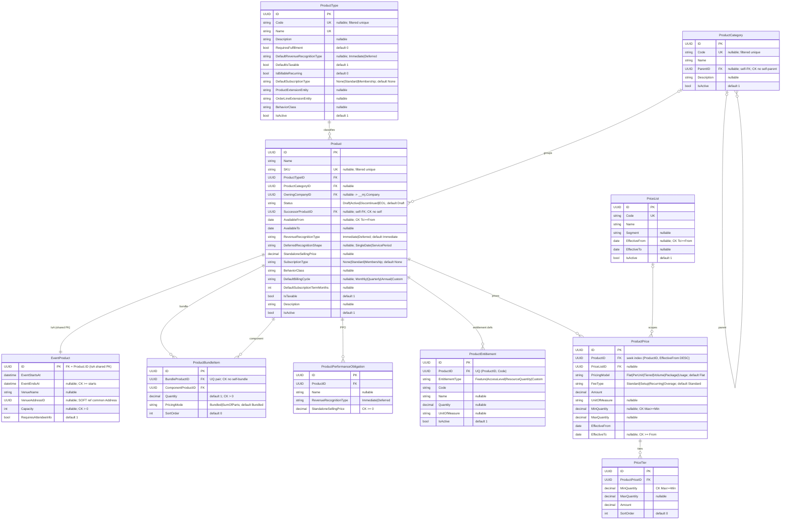
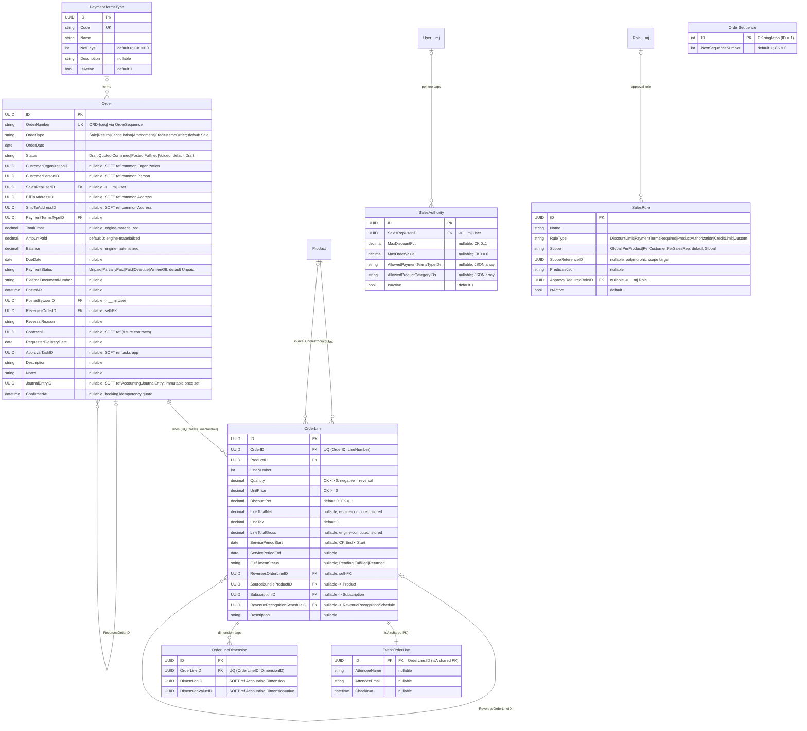
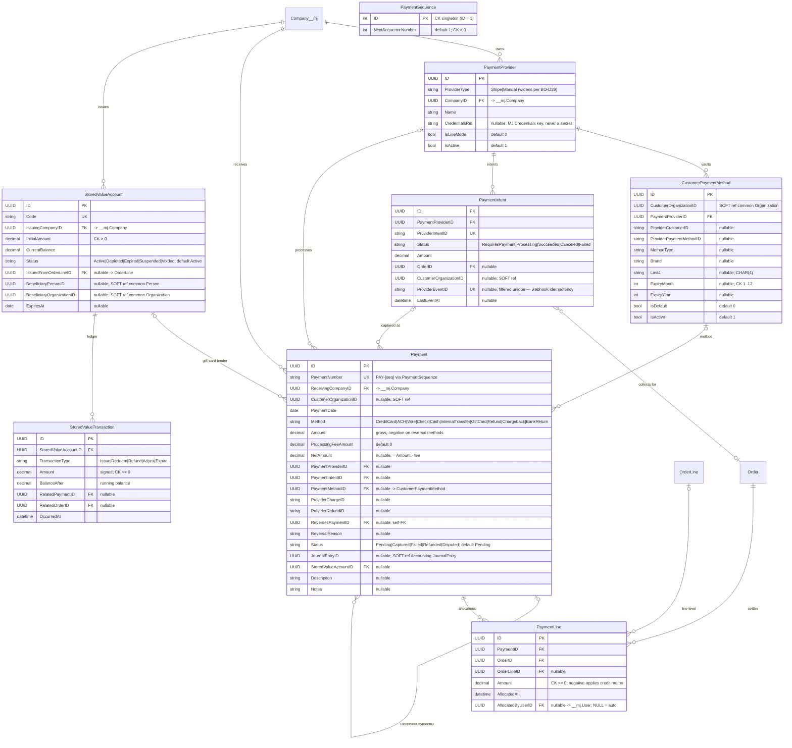
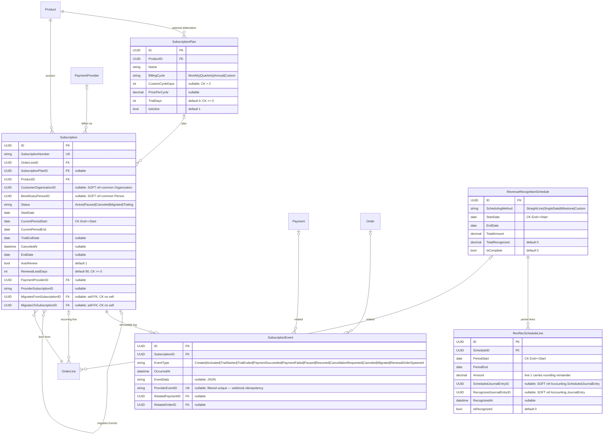
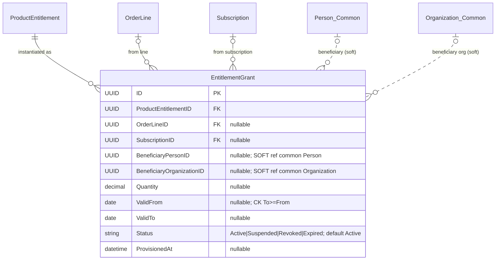
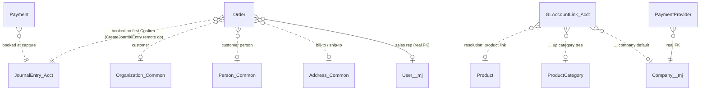

# BizApps Orders — ERD (CURRENT, as-built)

- **Date:** 2026-07-20
- **Source of truth:** `migrations/B202607061431__v0.1.x__Schema_and_Tables.sql` (the collapse-into-baseline
  file, edited in place pre-release through waves S1–S6; **no later `V*.sql` migrations exist** — the
  `migrations/codegen/CodeGen_Run_*.sql` files are CodeGen output, not schema deltas).
- **Schema:** `__mj_BizAppsOrders` — 32 tables.
- Every table additionally carries CodeGen's `__mj_CreatedAt` / `__mj_UpdatedAt` timestamp columns —
  **omitted from all diagrams** (CodeGen-owned, uniform).
- Types are simplified: `UUID`, `string`, `decimal`, `datetime` (DATETIMEOFFSET), `date`, `bool`, `int`.
- **Dashed lines = soft references** (plain UNIQUEIDENTIFIER, no FK constraint — cross-app / cross-schema
  seams). Solid lines = real FKs.

---

## 1. Overview — all entities and relationships

Interface pseudo-entities (not owned by this schema) are included: `__mj.Company`, `__mj.User`,
`__mj.Role`, `BizAppsCommon.Organization` / `Person` / `Address`, and accounting-side
`Accounting.JournalEntry` + `Accounting.GLAccountLink` (the polymorphic account-resolution seam that
points **AT** Product / ProductCategory / Company rows — Orders carries **no GL columns**).

```mermaid
erDiagram
    %% ── Catalog ──
    ProductType ||--o{ Product : "classifies"
    ProductCategory |o--o{ Product : "groups"
    ProductCategory |o--o{ ProductCategory : "parent of"
    Product |o--o{ Product : "succeeded by"
    Product ||--o{ ProductBundleItem : "bundle"
    Product ||--o{ ProductBundleItem : "component"
    Product ||--o{ ProductPerformanceObligation : "obligations"
    Product ||--o{ ProductEntitlement : "grants defined"
    Product ||--|| EventProduct : "IsA extension"
    PriceList |o--o{ ProductPrice : "scopes"
    Product ||--o{ ProductPrice : "priced by"
    ProductPrice ||--o{ PriceTier : "tiers"

    %% ── Orders ──
    Order ||--o{ OrderLine : "lines"
    Product ||--o{ OrderLine : "sells"
    Product |o--o{ OrderLine : "source bundle"
    PaymentTermsType |o--o{ Order : "terms"
    Order |o--o{ Order : "reverses"
    OrderLine |o--o{ OrderLine : "reverses"
    OrderLine ||--|| EventOrderLine : "IsA extension"
    OrderLine ||--o{ OrderLineDimension : "tagged"
    SalesAuthority }o--|| User__mj : "rep limits"
    SalesRule }o--o| Role__mj : "approval role"

    %% ── Payments ──
    PaymentProvider ||--o{ CustomerPaymentMethod : "vaults"
    PaymentProvider ||--o{ PaymentIntent : "intents"
    PaymentIntent }o--o| Order : "collects for"
    PaymentProvider |o--o{ Payment : "processes"
    PaymentIntent |o--o{ Payment : "captures"
    CustomerPaymentMethod |o--o{ Payment : "pays with"
    Payment |o--o{ Payment : "reverses"
    Payment ||--o{ PaymentLine : "applies"
    Order ||--o{ PaymentLine : "settled by"
    OrderLine |o--o{ PaymentLine : "line-applied"
    StoredValueAccount |o--o{ Payment : "gift-card tender"
    StoredValueAccount ||--o{ StoredValueTransaction : "ledger"
    Payment |o--o{ StoredValueTransaction : "related"
    Order |o--o{ StoredValueTransaction : "related"
    OrderLine |o--o{ StoredValueAccount : "issued from"

    %% ── Subscriptions & rev-rec ──
    Product ||--o{ SubscriptionPlan : "plans"
    OrderLine ||--o{ Subscription : "born from"
    SubscriptionPlan |o--o{ Subscription : "elaborates"
    Product ||--o{ Subscription : "of product"
    PaymentProvider |o--o{ Subscription : "billed via"
    Subscription |o--o{ Subscription : "migrates"
    Subscription ||--o{ SubscriptionEvent : "lifecycle log"
    Payment |o--o{ SubscriptionEvent : "related"
    Order |o--o{ SubscriptionEvent : "related"
    RevenueRecognitionSchedule ||--o{ RevRecScheduleLine : "periods"
    Subscription |o--o{ OrderLine : "recurring lines"
    RevenueRecognitionSchedule |o--o{ OrderLine : "schedule of line"

    %% ── Entitlements ──
    ProductEntitlement ||--o{ EntitlementGrant : "instantiated"
    OrderLine |o--o{ EntitlementGrant : "from line"
    Subscription |o--o{ EntitlementGrant : "from subscription"

    %% ── __mj core (real FKs) ──
    User__mj |o--o{ Order : "sales rep / posted by"
    User__mj |o--o{ PaymentLine : "allocated by"
    Company__mj ||--o{ PaymentProvider : "owns"
    Company__mj ||--o{ Payment : "receiving company"
    Company__mj ||--o{ StoredValueAccount : "issuing company"
    Company__mj |o--o{ Product : "owning company (nullable)"

    %% ── Cross-app SOFT references (no FK) ──
    Organization_Common |o..o{ Order : "CustomerOrganizationID (soft)"
    Person_Common |o..o{ Order : "CustomerPersonID (soft)"
    Address_Common |o..o{ Order : "bill-to / ship-to (soft)"
    Organization_Common |o..o{ CustomerPaymentMethod : "customer (soft)"
    Organization_Common |o..o{ PaymentIntent : "customer (soft)"
    Organization_Common |o..o{ Payment : "customer (soft)"
    Organization_Common |o..o{ Subscription : "customer (soft)"
    Person_Common |o..o{ Subscription : "beneficiary (soft)"
    Person_Common |o..o{ EntitlementGrant : "beneficiary (soft)"
    Organization_Common |o..o{ EntitlementGrant : "beneficiary org (soft)"
    Person_Common |o..o{ StoredValueAccount : "beneficiary (soft)"
    Address_Common |o..o{ EventProduct : "venue (soft)"

    %% ── Accounting-side seams (soft) ──
    JournalEntry_Acct |o..o{ Order : "JournalEntryID (soft lineage)"
    JournalEntry_Acct |o..o{ Payment : "JournalEntryID (soft)"
    JournalEntry_Acct |o..o{ RevRecScheduleLine : "scheduled / recognized JE (soft)"
    Dimension_Acct |o..o{ OrderLineDimension : "DimensionID + ValueID (soft)"
    GLAccountLink_Acct }o..o| Product : "accounting-owned link points AT"
    GLAccountLink_Acct }o..o| ProductCategory : "accounting-owned link points AT"
    GLAccountLink_Acct }o..o| Company__mj : "accounting-owned link points AT"
```

> Naming in diagrams: `User__mj` = `__mj.User`, `Company__mj` = `__mj.Company`, `Role__mj` = `__mj.Role`,
> `*_Common` = `__mj_BizAppsCommon.*`, `*_Acct` = `__mj_BizAppsAccounting.*`. Mermaid entity names can't
> carry dots/brackets, so aliases are used; `Order` is the bracketed `[Order]` table.

---

## 2. Catalog piece

ProductType is the behavior lookup (extension-entity + behavior-class seams); ProductCategory is the
hierarchy the account resolver walks upward; Product carries **RevenueRecognitionType but NO GL columns**
(S3 — accounting's polymorphic `GLAccountLink` points at Product/ProductCategory/Company rows) and **no
currency** (MOD-4). `EventProduct` is an IsA-Disjoint child: its PK **is** the parent Product's UUID —
it is the only seeded type-extension pair as-built (others land as their features do). Pricing tables
(S5) exist as structure; the resolution engine is feature F9 (UnitPrice direct entry is the precedence
base).

---

## 3. Orders piece

`Order` is the header **and the A/R primitive** (order = invoice, CA-2): totals / paid / balance / due /
PaymentStatus are engine-materialized, never user-entered. The JE is booked **exactly once, on the first
flip to `Confirmed`** (`trg_Order_JournalEntryIDImmutable` makes the booked `JournalEntryID` permanent;
corrections are reversal orders, never re-pointing). **No CompanyID as-built** (S5 — company via each
line's resolved account) and **no currency** (MOD-4). `trg_OrderLine_ImmutableAfterConfirm` freezes
financial line fields after Confirm; negative `Quantity` is the reversal mechanism (BO-D10 —
cross-field rule lives in the entity server, not a CHECK). `EventOrderLine` is the IsA child of
OrderLine (shared PK).

---

## 4. Payments piece

Receipts, reversals, and cash application (S2, master §4.5). `Payment.Amount` is gross customer-side
truth (`NetAmount = Amount − ProcessingFeeAmount`); negative amounts are reversal methods.
`PaymentLine` is the cash-application junction (which orders a payment settles). `PaymentIntent` is
Stripe-shaped provider collection state (the Manual provider skips it); `ProviderEventID` filtered
uniques carry webhook idempotency. `trg_Payment_ImmutableAfterCapture` freezes captured payments.
**No currency columns** (MOD-4). `CustomerPaymentMethod` stores provider tokens only — never PANs.

---

## 5. Subscriptions & revenue recognition piece

A Subscription is born from an **order line** (BO-D39/D40); renewal cycles spawn new Orders under it,
and **each renewal order line carries its own rev-rec schedule** — deliberately no schedule FK on
Subscription (design deviation from master §4.4, flagged in the schema plan §3.2). No
`OwningCompanyID` as-built. Rev-rec schedules are a lightweight computation envelope + MRR/ARR display
(BO-D11); `RevRecScheduleLine` line 1 carries the rounding remainder and soft-refs accounting's
ScheduledJournalEntry / JournalEntry.

---

## 6. Entitlements piece

`ProductEntitlement` (in the Catalog piece, §2) is the **definition**; `EntitlementGrant` is the
**instance** created at Post / subscription activation, carrying the beneficiary (defaults to the
buyer; a line may designate an attendee / gift recipient / honoree — BO-D39).

---

## 7. Interfaces with other apps

All cross-app references are **soft** (plain UNIQUEIDENTIFIER, no FK) so Orders never couples to
another app's schema; FKs to `__mj` core ARE real (precedent: common's `FK_Person_LinkedUser`).

- **Accounting (`__mj_BizAppsAccounting`)** — the defining integration. On the first flip to
  `Confirmed`, `OrderEntityServer` books a balanced JE via the **`Accounting.CreateJournalEntry`
  remote operation** (MOD-5) and stamps `Order.JournalEntryID` + `ConfirmedAt` (failure blocks the
  Confirm). Account resolution uses accounting's **polymorphic `GLAccountLink`** pointing AT
  Product / ProductCategory / Company rows (product link → up the category tree → company default) —
  the reason Orders carries no GL columns. Soft back-refs: `Order.JournalEntryID`,
  `Payment.JournalEntryID`, `RevRecScheduleLine.ScheduledJournalEntryID` / `RecognizedJournalEntryID`,
  `OrderLineDimension.DimensionID` / `DimensionValueID`.
- **BizApps Common (`__mj_BizAppsCommon`)** — customers and people: `CustomerOrganizationID`
  (Order, CustomerPaymentMethod, PaymentIntent, Payment, Subscription, EntitlementGrant beneficiary,
  StoredValueAccount beneficiary), `CustomerPersonID` / `BeneficiaryPersonID`, and Address soft refs
  (`Order.BillToAddressID` / `ShipToAddressID`, `EventProduct.VenueAddressID`).
- **MJ core (`__mj`)** — real FKs: `__mj.User` (Order.SalesRep/PostedBy, PaymentLine.AllocatedBy,
  SalesAuthority.SalesRepUser), `__mj.Company` (PaymentProvider, Payment.ReceivingCompany,
  StoredValueAccount.IssuingCompany, Product.OwningCompany), `__mj.Role`
  (SalesRule.ApprovalRequiredRole).
- **Tasks app** — `Order.ApprovalTaskID` (soft; sales-rule violations raise an approval task, F8).

### Financial-invariant triggers (DB-level, hold even against raw SQL)

1. `trg_Order_JournalEntryIDImmutable` — a booked `JournalEntryID` may never be cleared/replaced.
2. `trg_OrderLine_ImmutableAfterConfirm` — financial line fields freeze once the order is Confirmed.
3. `trg_Payment_ImmutableAfterCapture` — captured payments freeze.

Workflow rules (transition matrix, totals, cross-field validation) live in the entity server, not
triggers.
