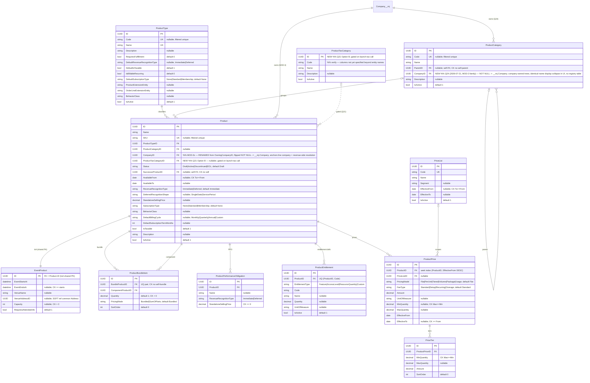
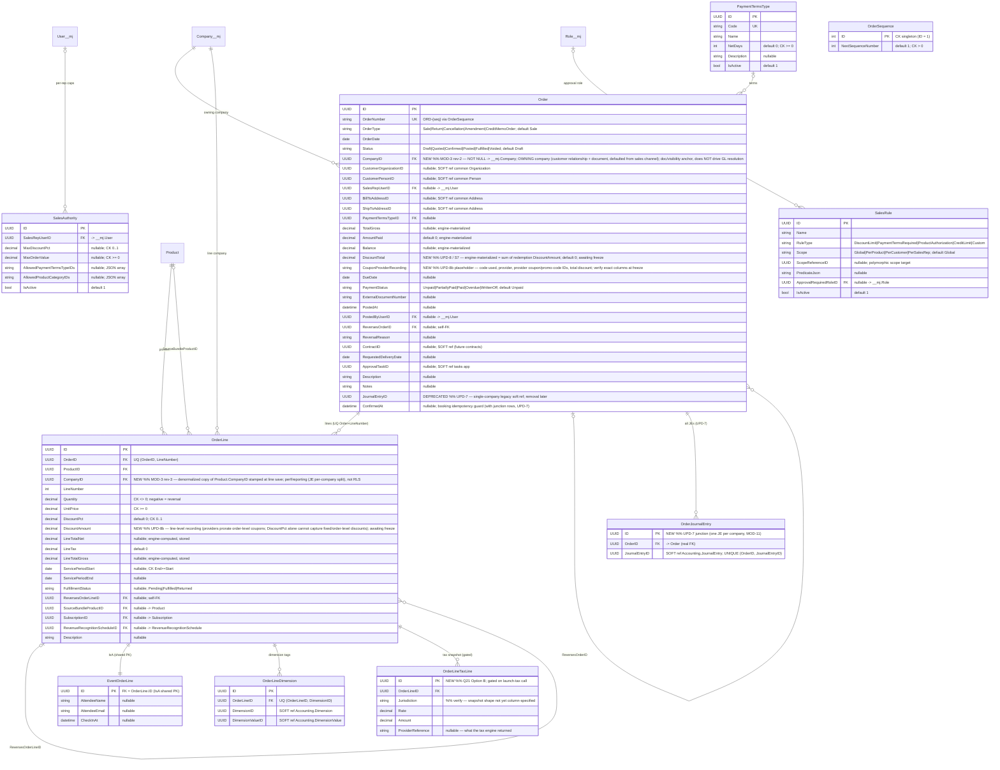
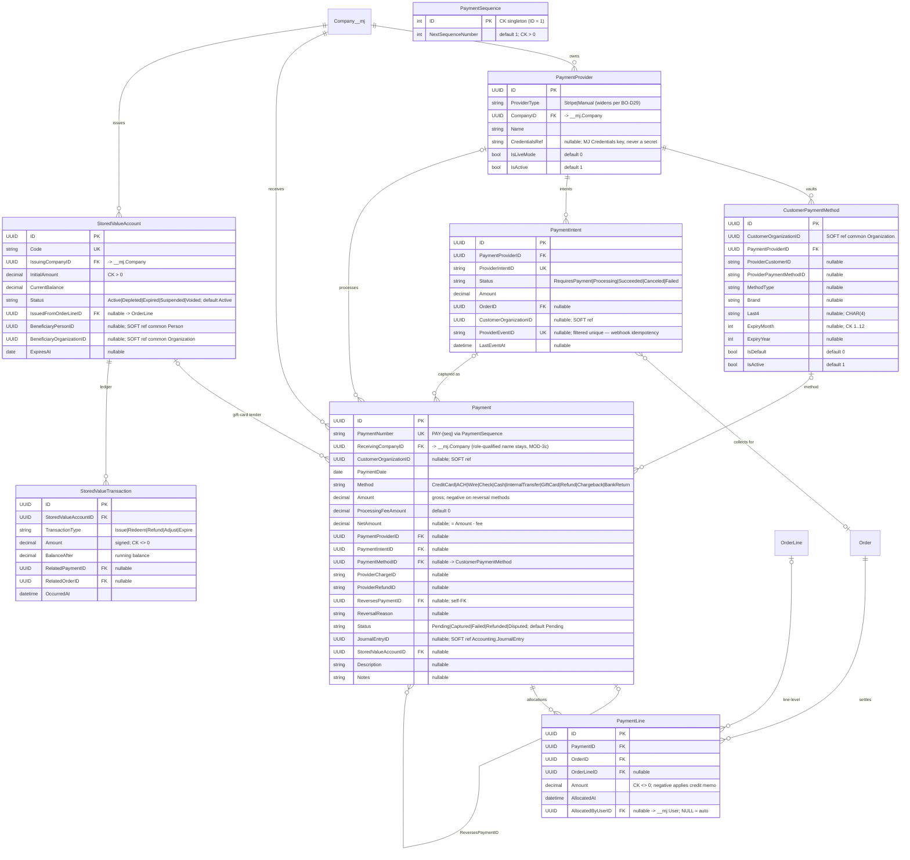
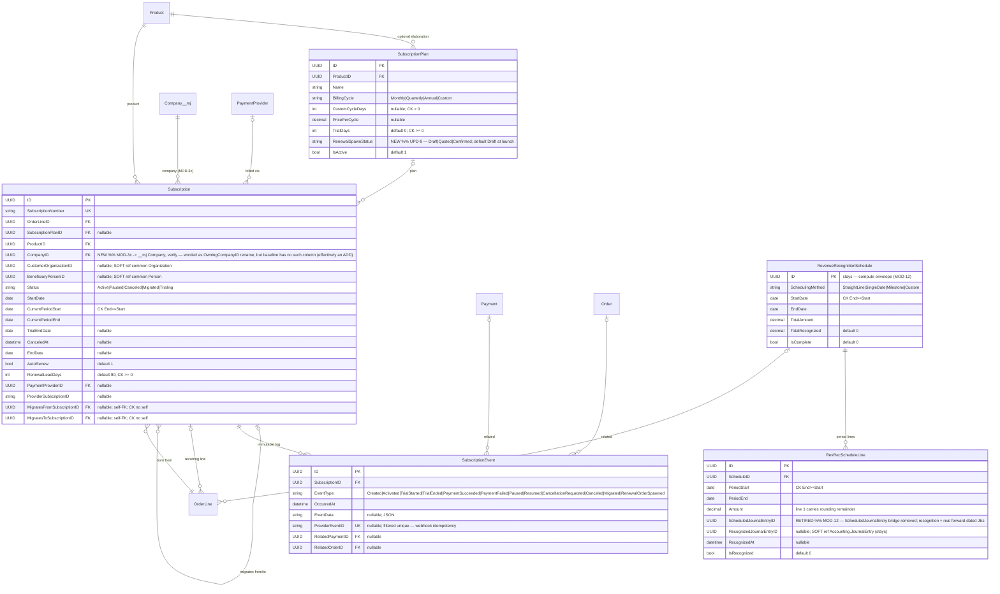
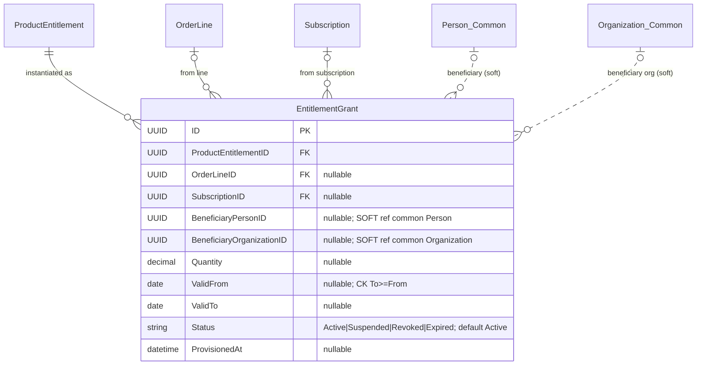
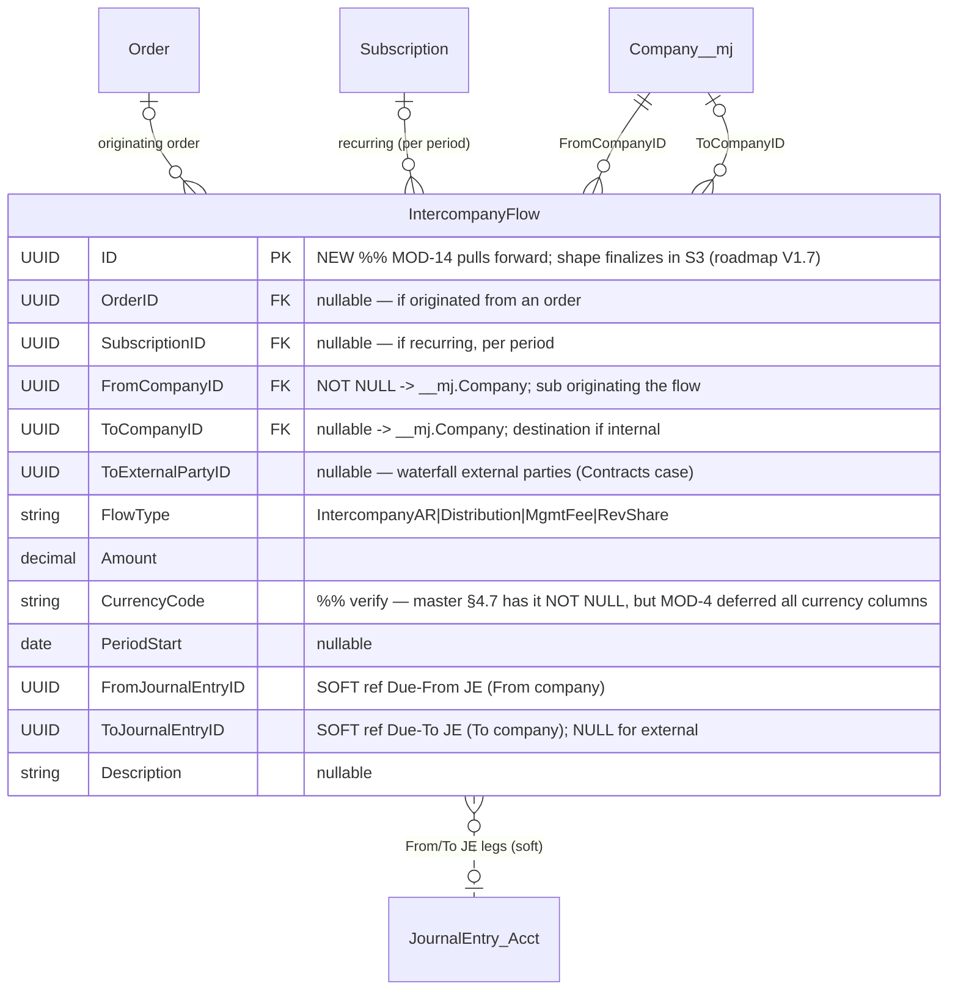
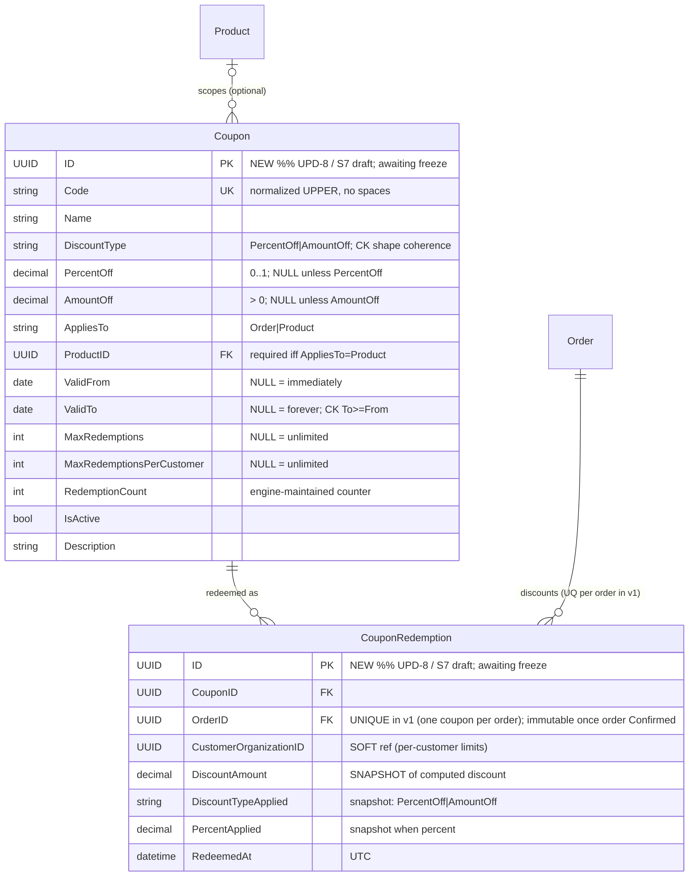

# BizApps Orders — ERD (PLANNED)

- **Date:** 2026-07-21
- **PLANNED = plan chain through MOD-14/UPD-13 as of 2026-07-20; ⏸/gated items marked.** One ruling
  landed 2026-07-21 and is folded in: the ProductCategory company model is **DECIDED** (Marcelo,
  orders Q24 — company-owned rows; see §2).
- **This document is fully self-contained:** every planned table (all **38**) appears below with its
  complete column set. Changed / new / gated elements are marked inline with `%% MOD-x` / `%% UPD-x`
  comments; unmarked columns are as-built (source:
  `migrations/B202607061431__v0.1.x__Schema_and_Tables.sql`; the pure as-built view is
  `ERD-current.md`).
- Authorities: `plans/MASTER-PLAN.md` (+§4.7/§5), `plans/MASTER-PLAN-MODIFICATIONS.md` (through
  MOD-14), `plans/MASTER-PLAN-UPDATES.md` (through UPD-13), `plans/QUESTIONS.md` Q21 + Q24 ruling,
  `plans/action-plans/ActionPlan - Coupons (schema to UI).md` (S7 draft).
- Conventions: schema `__mj_BizAppsOrders`; simplified types (`UUID`, `string`, `decimal`,
  `datetime`, `date`, `bool`, `int`); CodeGen's `__mj_CreatedAt`/`__mj_UpdatedAt` on every table are
  omitted from diagrams; **dashed lines = soft references** (plain UNIQUEIDENTIFIER, no FK). Cross-app
  entities (`__mj.*`, `BizAppsCommon.*`, `Accounting.*`) appear as **linked pseudo-entities only** —
  we do not document other apps' internals.

## Delta summary (vs as-built)

| # | Delta | Authority | Status |
|---|-------|-----------|--------|
| 1 | `Order.CompanyID` + `OrderLine.CompanyID` + `Product.OwningCompanyID`→`CompanyID` (NOT NULL) + `Subscription.CompanyID` | MOD-3 rev-2/rev-3 | Accepted — V1.1 amendment |
| 2 | `ProductCategory.CompanyID` (FK `__mj.Company`, NOT NULL — company-owned rows; identical-name display-collapse handled in UI, no registry table) | **Q24 ruling (Marcelo 2026-07-21)**, MOD-3 family | **Decided — committed** |
| 3 | `OrderJournalEntry` junction; `Order.JournalEntryID` deprecated | UPD-7 (with MOD-11) | Accepted |
| 4 | `RevRecScheduleLine.ScheduledJournalEntryID` retired | MOD-12 | Accepted |
| 5 | `IntercompanyFlow` pulled forward to launch + 2 new accounting GLAccountRoles | MOD-14 (+ master §4.7/§5, BO-D6) | Accepted — V1.7/S3, shape finalizes in S3 |
| 6 | Coupons: `Coupon` + `CouponRedemption` + order/line discount recording | UPD-8 (MOD-6 S7 draft) | Accepted — **schema freeze pending** |
| 7 | Tax Option B: `ProductTaxCategory` + `Product.ProductTaxCategoryID` + `OrderLineTaxLine` | Q21 answer (V2.7) | **Gated on launch-tax finance call** |
| 8 | `SubscriptionPlan.RenewalSpawnStatus` | UPD-9 | Accepted |
| 9 | `DunningGracePeriodDays` Orders configuration setting | UPD-6.3 | Accepted — entity TBD (no table drawn) |

Table count: 32 as-built + 6 new (`OrderJournalEntry`, `IntercompanyFlow`, `Coupon`,
`CouponRedemption`, `ProductTaxCategory`, `OrderLineTaxLine`) = **38**.

---

## 1. Overview — planned entity set (no attributes)

```mermaid
erDiagram
    %% ── Catalog ──
    ProductType ||--o{ Product : "classifies"
    ProductCategory |o--o{ Product : "groups"
    ProductCategory |o--o{ ProductCategory : "parent of"
    Company__mj ||--o{ ProductCategory : "CompanyID (Q24 — company-owned rows)"
    Company__mj ||--o{ Product : "CompanyID (MOD-3, NOT NULL)"
    Product |o--o{ Product : "succeeded by"
    Product ||--o{ ProductBundleItem : "bundle"
    Product ||--o{ ProductBundleItem : "component"
    Product ||--o{ ProductPerformanceObligation : "obligations"
    Product ||--o{ ProductEntitlement : "grants defined"
    Product ||--|| EventProduct : "IsA extension"
    PriceList |o--o{ ProductPrice : "scopes"
    Product ||--o{ ProductPrice : "priced by"
    ProductPrice ||--o{ PriceTier : "tiers"
    ProductTaxCategory |o..o{ Product : "tax category (Q21 — gated)"

    %% ── Orders ──
    Order ||--o{ OrderLine : "lines"
    Product ||--o{ OrderLine : "sells"
    Product |o--o{ OrderLine : "source bundle"
    PaymentTermsType |o--o{ Order : "terms"
    Order |o--o{ Order : "reverses"
    OrderLine |o--o{ OrderLine : "reverses"
    OrderLine ||--|| EventOrderLine : "IsA extension"
    OrderLine ||--o{ OrderLineDimension : "tagged"
    Company__mj ||--o{ Order : "CompanyID owning company (MOD-3 rev-2)"
    Company__mj ||--o{ OrderLine : "CompanyID denormalized (MOD-3 rev-3)"
    OrderLine ||--o{ OrderLineTaxLine : "per-jurisdiction tax (Q21 — gated)"
    SalesAuthority }o--|| User__mj : "rep limits"
    SalesRule }o--o| Role__mj : "approval role"

    %% ── Order ↔ JE junction (UPD-7) ──
    Order ||--o{ OrderJournalEntry : "booked as (1 JE per company, MOD-11)"
    OrderJournalEntry }o..|| JournalEntry_Acct : "JournalEntryID (soft)"

    %% ── Intercompany (MOD-14) ──
    Order |o--o{ IntercompanyFlow : "originates"
    Subscription |o--o{ IntercompanyFlow : "recurring flows"
    Company__mj ||--o{ IntercompanyFlow : "from company"
    Company__mj |o--o{ IntercompanyFlow : "to company"
    IntercompanyFlow }o..o| JournalEntry_Acct : "from/to JE legs (soft)"

    %% ── Coupons (UPD-8, freeze pending) ──
    Coupon ||--o{ CouponRedemption : "redeemed as"
    Order ||--o{ CouponRedemption : "discounts"
    Product |o--o{ Coupon : "scopes (optional)"

    %% ── Payments ──
    PaymentProvider ||--o{ CustomerPaymentMethod : "vaults"
    PaymentProvider ||--o{ PaymentIntent : "intents"
    PaymentIntent }o--o| Order : "collects for"
    PaymentProvider |o--o{ Payment : "processes"
    PaymentIntent |o--o{ Payment : "captures"
    CustomerPaymentMethod |o--o{ Payment : "pays with"
    Payment |o--o{ Payment : "reverses"
    Payment ||--o{ PaymentLine : "applies"
    Order ||--o{ PaymentLine : "settled by"
    OrderLine |o--o{ PaymentLine : "line-applied"
    StoredValueAccount |o--o{ Payment : "gift-card tender"
    StoredValueAccount ||--o{ StoredValueTransaction : "ledger"
    Payment |o--o{ StoredValueTransaction : "related"
    Order |o--o{ StoredValueTransaction : "related"
    OrderLine |o--o{ StoredValueAccount : "issued from"
    Company__mj ||--o{ PaymentProvider : "owns"
    Company__mj ||--o{ Payment : "receiving"
    Company__mj ||--o{ StoredValueAccount : "issuing"

    %% ── Subscriptions & rev-rec ──
    Product ||--o{ SubscriptionPlan : "plans"
    OrderLine ||--o{ Subscription : "born from"
    SubscriptionPlan |o--o{ Subscription : "elaborates"
    Product ||--o{ Subscription : "of product"
    Company__mj ||--o{ Subscription : "CompanyID (MOD-3c)"
    PaymentProvider |o--o{ Subscription : "billed via"
    Subscription |o--o{ Subscription : "migrates"
    Subscription ||--o{ SubscriptionEvent : "lifecycle log"
    Payment |o--o{ SubscriptionEvent : "related"
    Order |o--o{ SubscriptionEvent : "related"
    RevenueRecognitionSchedule ||--o{ RevRecScheduleLine : "periods"
    Subscription |o--o{ OrderLine : "recurring lines"
    RevenueRecognitionSchedule |o--o{ OrderLine : "schedule of line"

    %% ── Entitlements ──
    ProductEntitlement ||--o{ EntitlementGrant : "instantiated"
    OrderLine |o--o{ EntitlementGrant : "from line"
    Subscription |o--o{ EntitlementGrant : "from subscription"

    %% ── __mj core (real FKs) ──
    User__mj |o--o{ Order : "sales rep / posted by"
    User__mj |o--o{ PaymentLine : "allocated by"

    %% ── Cross-app SOFT references (no FK) ──
    Organization_Common |o..o{ Order : "customer (soft)"
    Person_Common |o..o{ Order : "customer person (soft)"
    Address_Common |o..o{ Order : "bill-to / ship-to (soft)"
    Organization_Common |o..o{ CustomerPaymentMethod : "customer (soft)"
    Organization_Common |o..o{ PaymentIntent : "customer (soft)"
    Organization_Common |o..o{ Payment : "customer (soft)"
    Organization_Common |o..o{ Subscription : "customer (soft)"
    Person_Common |o..o{ Subscription : "beneficiary (soft)"
    Person_Common |o..o{ EntitlementGrant : "beneficiary (soft)"
    Organization_Common |o..o{ EntitlementGrant : "beneficiary org (soft)"
    Person_Common |o..o{ StoredValueAccount : "beneficiary (soft)"
    Address_Common |o..o{ EventProduct : "venue (soft)"

    %% ── Accounting seams (soft) ──
    JournalEntry_Acct |o..o{ Order : "JournalEntryID (soft) — DEPRECATED by UPD-7"
    JournalEntry_Acct |o..o{ Payment : "JournalEntryID (soft)"
    JournalEntry_Acct |o..o{ RevRecScheduleLine : "recognized JE (soft)"
    Dimension_Acct |o..o{ OrderLineDimension : "DimensionID + ValueID (soft)"
    GLAccountLink_Acct }o..o| Product : "accounting-owned link points AT"
    GLAccountLink_Acct }o..o| ProductCategory : "accounting-owned link points AT"
    GLAccountLink_Acct }o..o| Company__mj : "accounting-owned link points AT"
```

> Naming: `User__mj` = `__mj.User`, `Company__mj` = `__mj.Company`, `Role__mj` = `__mj.Role`,
> `*_Common` = `__mj_BizAppsCommon.*`, `*_Acct` = `__mj_BizAppsAccounting.*` — linked pseudo-entities
> only. `Order` = the bracketed `[Order]` table.

---

## 2. Catalog piece (11 tables)

MOD-3 lands the company columns: `Product.CompanyID` is the rename of `OwningCompanyID`, flipped NOT
NULL — the line's company (and revenue-side account resolution) anchors to the **product's** company.
**ProductCategory is company-owned (Q24 ruling, Marcelo 2026-07-21):** `ProductCategory.CompanyID`
FK `__mj.Company` NOT NULL; identical-name categories across companies are display-collapsed **in the
UI** — no registry table. Still **no GL columns** anywhere (accounting's polymorphic `GLAccountLink`
points AT Product / ProductCategory / Company rows); resolution walks product link → the
product-company's category tree → the product-company's default, failing loudly (MOD-3d).
`EventProduct` is an IsA-Disjoint child (PK = the parent Product's UUID). Pricing tables are
structure; the resolution engine is F9 (UnitPrice direct entry stays the precedence base, MOD-6).

---

## 3. Orders piece (11 tables)

`Order` stays the A/R primitive (order = invoice; totals engine-materialized; JE booked exactly once
on first Confirm; the three financial-invariant triggers stand — `trg_Order_JournalEntryIDImmutable`,
`trg_OrderLine_ImmutableAfterConfirm`, `trg_Payment_ImmutableAfterCapture`). MOD-3 rev-2 adds
`Order.CompanyID` (owning company — document/visibility anchor, NOT a GL-resolution driver); rev-3
adds `OrderLine.CompanyID` (denormalized copy of `Product.CompanyID` stamped at line save —
performance/reporting; JE per-company splitting reads it hot). UPD-7 replaces the single
`Order.JournalEntryID` with the `OrderJournalEntry` junction (one JE per company, MOD-11). UPD-8
lands the discount-recording columns now regardless of the coupon provider model.

%% verify — UPD-7 says "real FK constraints", but a hard FK to
`__mj_BizAppsAccounting.JournalEntry` would violate the baseline's soft-cross-app-ref rule; drawn as
OrderID = real FK, JournalEntryID = soft + unique pair. Confirm at implementation.

%% verify — the order-level provider-recording columns (`CouponProviderRecording` is a placeholder)
are required by UPD-8(b) (code used / provider / provider coupon + promotion-code IDs / total
discount) but not yet column-specified; `Order.DiscountTotal` is the only order-level column the S7
draft defines.

---

## 4. Payments piece (8 tables — unchanged from as-built)

No plan-chain deltas land here. Gross `Amount` / `NetAmount` split (BO-D47), negative amounts on
reversal methods, `PaymentLine` cash application, webhook idempotency via filtered-unique
`ProviderEventID`, no currency columns (MOD-4). Payment-side ownership under MOD-14 is unchanged:
Payments clears the owner's AR to cash and clears the Due-To/Due-From pair on the cash transfer.

---

## 5. Subscriptions & revenue recognition piece (5 tables)

MOD-3(c) adds `Subscription.CompanyID`; UPD-9 adds `SubscriptionPlan.RenewalSpawnStatus` (renewals
spawn as Draft at launch — a human confirms; Confirm books the JE). **MOD-12 rewrites the rev-rec
mechanism:** at booking-lock, Orders writes the recognition waterfall as **real forward-dated JEs**
into accounting (12-month sub → 12 real JEs, own `EffectiveDate` each) via the singular transactional
call (MOD-5) — no materializer, no daily job; change/cancel = a correcting Order whose entries NET
against the staged ones. The schedule tables **stay as the compute envelope** (waterfall math +
MRR/ARR display); the `ScheduledJournalEntryID` bridge column is **retired**.

%% verify — UPD-9 says the setting lives "on SubscriptionType/SubscriptionPlan"; no SubscriptionType
table exists (subscription typing rides `Product.SubscriptionType`), so it is drawn on
SubscriptionPlan per this document's scope instruction.

---

## 6. Entitlements piece (1 table — unchanged from as-built)

`ProductEntitlement` (§2) is the definition; `EntitlementGrant` is the instance created at Post /
subscription activation, carrying the beneficiary (defaults to the buyer; a line may designate an
attendee / gift recipient / honoree — BO-D39).

---

## 7. Intercompany piece (1 table, NEW — MOD-14; master §4.7/§5, BO-D6)

Pulled **forward from deferred to the launch model** by MOD-14. When a line's company differs from
the order's owning company, booking emits mirrored legs (owner: Dr AR full amount / Cr own revenue /
Cr Due-To per sibling; sibling: Dr Due-From / Cr own revenue-or-DefRev against ITS OWN accounts) and
an `IntercompanyFlow` record per non-owning line — feeding consolidation analytics + recon. Shape
below = master plan §4.7.

Accounting-side companions (not Orders schema, noted for the seam): **two NEW GLAccountRoles** —
**Intercompany AR (Due-From)** on each sister and **Intercompany AP (Due-To)** on the owner, per
counterparty (affiliate CONTROL accounts, separate from trade AR/AP; + Sales Tax Payable if tax
launches). The **per-affiliate resolution key (entity × counterparty)** is richer than
ResolveAccount's (product × role × company) — **routing-shape decision pending; decide BEFORE
building legs**.

---

## 8. Coupons piece (2 tables, NEW — UPD-8 / S7 draft) — %% awaiting freeze

Launch path is **Option A** (provider-owned coupons, Stripe first; Orders records the outcome); the
Orders-native `Coupon` entity is the fast-follow provider. The **recording columns land now either
way** (§3: `Order.DiscountTotal` + provider-recording fields, `OrderLine.DiscountAmount`). Freeze is
blocked on the two UPD-8(c) investigations (Stripe coupon-vs-promotion-code mapping; a second
provider) + Robert's OS7 review + Sidecar answers. Shapes = the S7 draft in
`ActionPlan - Coupons (schema to UI).md`. Redemption rows are immutable once their order is
Confirmed (joins the `trg_OrderLine_ImmutableAfterConfirm` family).

---

## 9. Tax piece (Q21 answer, Option B) — %% gated on launch-tax call

The two tax tables carry full attributes where they live: **`ProductTaxCategory` in §2 (Catalog)**
and **`OrderLineTaxLine` in §3 (Orders)**, plus `Product.ProductTaxCategoryID` (§2). Ruled durable
shape (skip Option A entirely): per-jurisdiction snapshot rows + the accounting-side
`TaxCalculationProvider` seam (accounting MOD-18). Orders does **NOT** calculate tax — a third-party
engine (Stripe Tax / Avalara class) does; these tables record what it returned. Whether any tax is
launch-required is explicitly a Jeremy/John finance decision; builds at roadmap V2.7.

%% verify — Q21's answer fixes the entity names + per-jurisdiction-snapshot intent only; the column
lists in §2/§3 are the minimal implied shape, to be specified when the slice schedules.

---

## 10. Configuration (no table drawn) — `DunningGracePeriodDays` (UPD-6.3)

An **Orders configuration setting** (default **7** days): how long after a failed renewal payment
access-relevant state holds before cut-off; dunning notifies CS rather than auto-cancelling. Ruled
config-not-hardcoded; explicitly NOT on `AccountingCompanyProfile` (wrong side). **Entity TBD** — a
single setting suffices for launch, per-owning-company when multi-company needs it; consumed by F3.6.
No table is drawn until the configuration entity is decided.

---

## Non-schema notes carried by the same plan chain

- **MOD-14 booking shape** (engine, not schema): seller-of-record AR — the owner's JE carries the
  FULL order AR + Due-To legs per sibling; each sibling's JE carries Due-From + its own
  revenue/DefRev, resolved against ITS OWN accounts. Revenue is never recognized in the owner for a
  sibling's product. Anchor split: revenue-side resolution → product's company; AR/cash/due-to-from →
  order-owning company. Tax remit: selling company.
- **UPD-6.2 `IsOverdue`** is an explicit computed/virtual surface (`Balance > 0 AND DueDate < now`) —
  never a stored column, so it does not appear in the ERD.
- **UPD-13** (Matt UI-review rulings) — UI-only; no schema impact. The Q24 identical-name
  display-collapse for company-owned ProductCategory rows is likewise a UI concern (no registry
  table).
