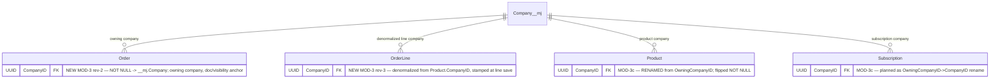
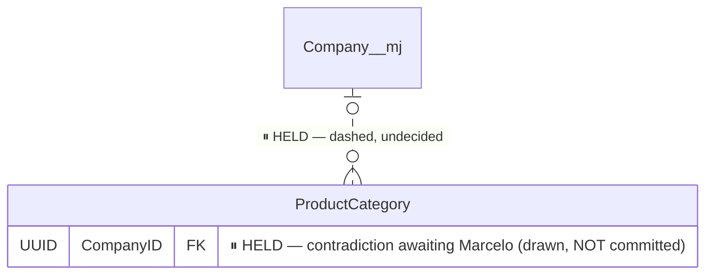
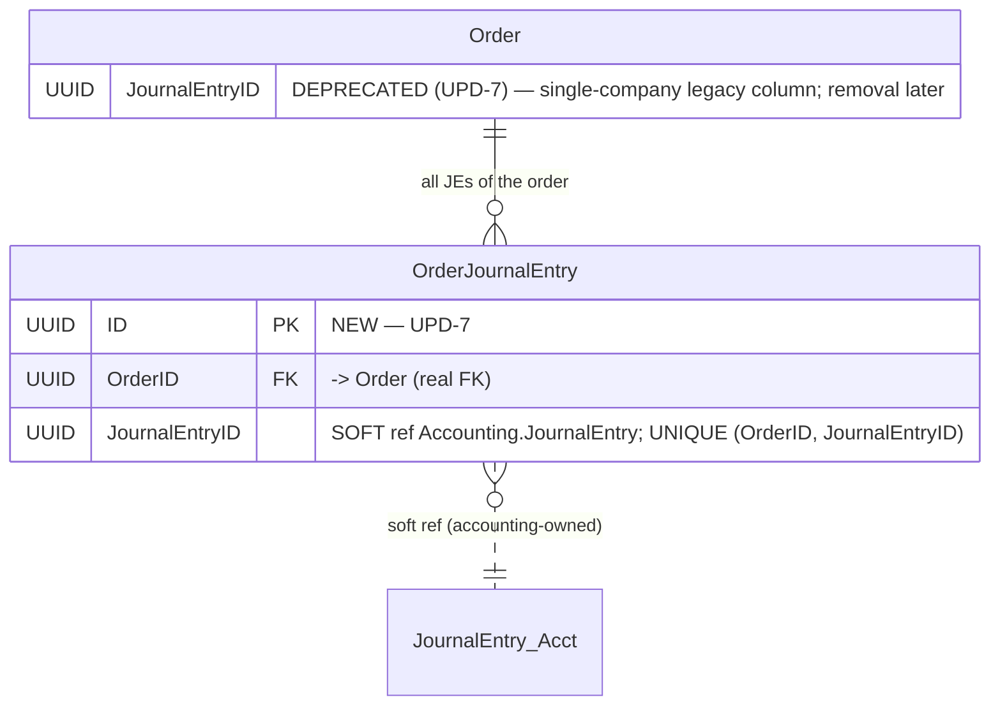
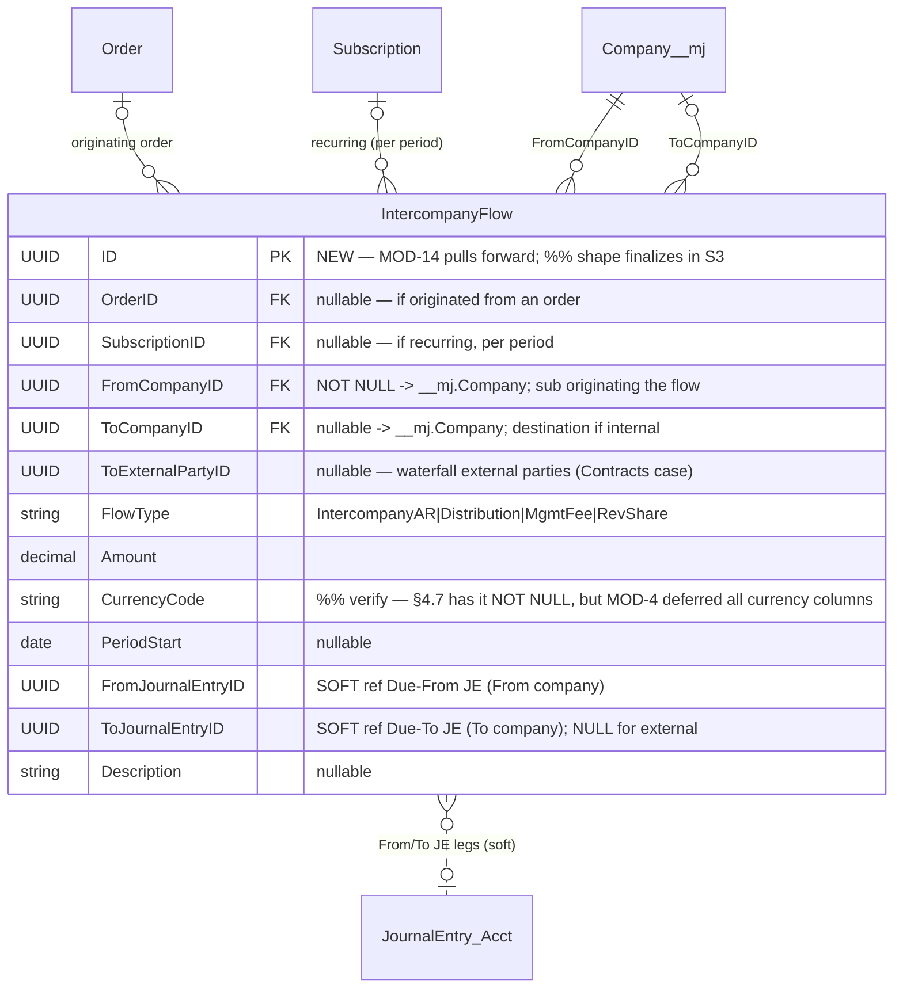
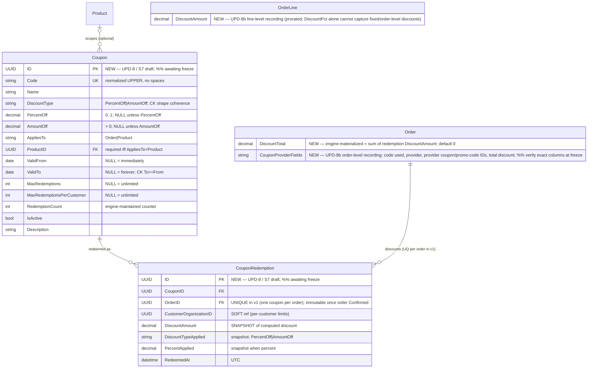
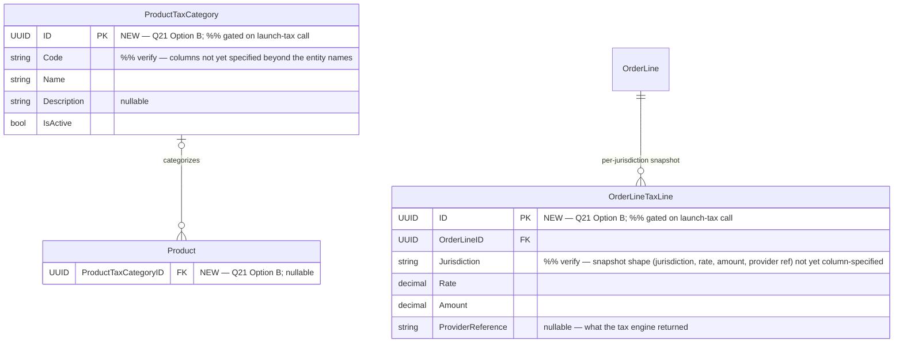
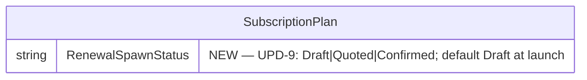

# BizApps Orders — ERD (PLANNED)

- **Date:** 2026-07-20
- **PLANNED = plan chain through MOD-14 / UPD-13 as of 2026-07-20; ⏸ held and gated items are marked.**
- Baseline = `ERD-current.md` (as-built schema from
  `migrations/B202607061431__v0.1.x__Schema_and_Tables.sql`, 32 tables). This document shows the
  as-built schema **plus every committed plan-chain delta**, each cited to its MOD/UPD in `%%` comments.
- Authorities: `plans/MASTER-PLAN.md` (+§4.7/§5), `plans/MASTER-PLAN-MODIFICATIONS.md` (through MOD-14),
  `plans/MASTER-PLAN-UPDATES.md` (through UPD-13), `plans/QUESTIONS.md` Q21,
  `plans/action-plans/ActionPlan - Coupons (schema to UI).md` (S7 draft).
- Same conventions as ERD-current: simplified types, `__mj_*` timestamp columns omitted, dashed = soft ref.

## Delta summary

| # | Delta | Authority | Status |
|---|-------|-----------|--------|
| 1 | `Order.CompanyID` + `OrderLine.CompanyID` + `Product.OwningCompanyID`→`CompanyID` (NOT NULL) + `Subscription.CompanyID` | MOD-3 rev-2/rev-3 | Accepted — V1.1 amendment |
| 2 | `ProductCategory.CompanyID` | contradiction | ⏸ **HELD — awaiting Marcelo** |
| 3 | `OrderJournalEntry` junction; `Order.JournalEntryID` deprecated | UPD-7 (with MOD-11) | Accepted |
| 4 | `RevRecScheduleLine.ScheduledJournalEntryID` retired | MOD-12 | Accepted |
| 5 | `IntercompanyFlow` pulled forward to launch + 2 new accounting GLAccountRoles | MOD-14 (+ master §4.7/§5, BO-D6) | Accepted — V1.7/S3, shape finalizes in S3 |
| 6 | Coupons: `Coupon` + `CouponRedemption` + order/line discount recording | UPD-8 (MOD-6 S7 draft) | Accepted — **schema freeze pending** |
| 7 | Tax Option B: `ProductTaxCategory` + `Product.ProductTaxCategoryID` + `OrderLineTaxLine` | Q21 answer (V2.7) | **Gated on launch-tax finance call** |
| 8 | `SubscriptionPlan.RenewalSpawnStatus` | UPD-9 | Accepted |
| 9 | `DunningGracePeriodDays` Orders configuration setting | UPD-6.3 | Accepted — entity TBD |

---

## 1. Overview — planned entity set

New entities vs current are **OrderJournalEntry**, **IntercompanyFlow**, **Coupon**,
**CouponRedemption**, **ProductTaxCategory**, **OrderLineTaxLine** (32 → 38 tables; the last three are
freeze-pending/gated). Unchanged relationship fabric from ERD-current is retained; only additions and
changes are annotated here.

```mermaid
erDiagram
    %% ── Catalog (MOD-3: Product.CompanyID now NOT NULL, renamed from OwningCompanyID) ──
    ProductType ||--o{ Product : "classifies"
    ProductCategory |o--o{ Product : "groups"
    ProductCategory |o--o{ ProductCategory : "parent of"
    Company__mj ||--o{ Product : "CompanyID (MOD-3, NOT NULL)"
    Product ||--o{ ProductBundleItem : "bundle"
    Product ||--o{ ProductBundleItem : "component"
    Product ||--o{ ProductPerformanceObligation : "obligations"
    Product ||--o{ ProductEntitlement : "grants defined"
    Product ||--|| EventProduct : "IsA extension"
    PriceList |o--o{ ProductPrice : "scopes"
    Product ||--o{ ProductPrice : "priced by"
    ProductPrice ||--o{ PriceTier : "tiers"
    %% ⏸ HELD — ProductCategory.CompanyID contradiction awaiting Marcelo (see §3)
    ProductTaxCategory |o..o{ Product : "tax category (Q21 Option B — gated)"

    %% ── Orders ──
    Order ||--o{ OrderLine : "lines"
    Product ||--o{ OrderLine : "sells"
    Product |o--o{ OrderLine : "source bundle"
    PaymentTermsType |o--o{ Order : "terms"
    Order |o--o{ Order : "reverses"
    OrderLine |o--o{ OrderLine : "reverses"
    OrderLine ||--|| EventOrderLine : "IsA extension"
    OrderLine ||--o{ OrderLineDimension : "tagged"
    Company__mj ||--o{ Order : "CompanyID owning company (MOD-3 rev-2)"
    Company__mj ||--o{ OrderLine : "CompanyID denormalized from Product (MOD-3 rev-3)"
    OrderLine ||--o{ OrderLineTaxLine : "per-jurisdiction tax (Q21 — gated)"
    SalesAuthority }o--|| User__mj : "rep limits"
    SalesRule }o--o| Role__mj : "approval role"

    %% ── Order ↔ JE junction (UPD-7) ──
    Order ||--o{ OrderJournalEntry : "booked as (1 JE per company, MOD-11)"
    OrderJournalEntry }o..|| JournalEntry_Acct : "JournalEntryID (soft, accounting-side)"

    %% ── Intercompany (MOD-14, pulled forward) ──
    Order |o--o{ IntercompanyFlow : "originates"
    Subscription |o--o{ IntercompanyFlow : "recurring flows"
    Company__mj ||--o{ IntercompanyFlow : "from company"
    Company__mj |o--o{ IntercompanyFlow : "to company"
    IntercompanyFlow }o..o| JournalEntry_Acct : "from/to JE legs (soft)"

    %% ── Coupons (UPD-8, freeze pending) ──
    Coupon ||--o{ CouponRedemption : "redeemed as"
    Order ||--o{ CouponRedemption : "discounts"
    Product |o--o{ Coupon : "scopes (optional)"

    %% ── Payments (unchanged shape) ──
    PaymentProvider ||--o{ CustomerPaymentMethod : "vaults"
    PaymentProvider ||--o{ PaymentIntent : "intents"
    PaymentIntent }o--o| Order : "collects for"
    PaymentProvider |o--o{ Payment : "processes"
    PaymentIntent |o--o{ Payment : "captures"
    CustomerPaymentMethod |o--o{ Payment : "pays with"
    Payment |o--o{ Payment : "reverses"
    Payment ||--o{ PaymentLine : "applies"
    Order ||--o{ PaymentLine : "settled by"
    OrderLine |o--o{ PaymentLine : "line-applied"
    StoredValueAccount |o--o{ Payment : "gift-card tender"
    StoredValueAccount ||--o{ StoredValueTransaction : "ledger"
    Payment |o--o{ StoredValueTransaction : "related"
    Order |o--o{ StoredValueTransaction : "related"
    OrderLine |o--o{ StoredValueAccount : "issued from"
    Company__mj ||--o{ PaymentProvider : "owns"
    Company__mj ||--o{ Payment : "receiving"
    Company__mj ||--o{ StoredValueAccount : "issuing"

    %% ── Subscriptions & rev-rec (MOD-12: schedules stay as compute envelope only) ──
    Product ||--o{ SubscriptionPlan : "plans"
    OrderLine ||--o{ Subscription : "born from"
    SubscriptionPlan |o--o{ Subscription : "elaborates"
    Product ||--o{ Subscription : "of product"
    Company__mj ||--o{ Subscription : "CompanyID (MOD-3c)"
    PaymentProvider |o--o{ Subscription : "billed via"
    Subscription |o--o{ Subscription : "migrates"
    Subscription ||--o{ SubscriptionEvent : "lifecycle log"
    Payment |o--o{ SubscriptionEvent : "related"
    Order |o--o{ SubscriptionEvent : "related"
    RevenueRecognitionSchedule ||--o{ RevRecScheduleLine : "periods"
    Subscription |o--o{ OrderLine : "recurring lines"
    RevenueRecognitionSchedule |o--o{ OrderLine : "schedule of line"

    %% ── Entitlements ──
    ProductEntitlement ||--o{ EntitlementGrant : "instantiated"
    OrderLine |o--o{ EntitlementGrant : "from line"
    Subscription |o--o{ EntitlementGrant : "from subscription"

    %% ── Cross-app soft seams (unchanged; see ERD-current §7 for the full list) ──
    Organization_Common |o..o{ Order : "customer (soft)"
    Person_Common |o..o{ Order : "customer person (soft)"
    JournalEntry_Acct |o..o{ Order : "JournalEntryID (soft) — DEPRECATED by UPD-7"
    JournalEntry_Acct |o..o{ Payment : "JournalEntryID (soft)"
    GLAccountLink_Acct }o..o| Product : "accounting-owned link points AT"
    GLAccountLink_Acct }o..o| ProductCategory : "accounting-owned link points AT"
    GLAccountLink_Acct }o..o| Company__mj : "accounting-owned link points AT"
```



---

## 2. Delta 1 — Company columns (MOD-3 rev-2 / rev-3)

`Order.CompanyID` is the **owning company** (customer relationship + document, defaulted from the sales
channel) — the document/ownership/**visibility** anchor; it does NOT drive GL resolution. The **line's
company derives from the PRODUCT**: `Product.CompanyID` (rename of `OwningCompanyID`, flipped NOT NULL)
with `OrderLine.CompanyID` a **denormalized copy stamped at line save** (performance/reporting: JE
per-company splitting reads line company hot). Account resolution walks against the **product's**
company (product link → category tree → product-company default; fail loudly). Naming ruled
schema-wide: plain `CompanyID` unless the role is the point (`Payment.ReceivingCompanyID` stays).



%% verify — MOD-3(c) words the Subscription change as a *rename* of `Subscription.OwningCompanyID`,
but the as-built baseline table has **no** OwningCompanyID column (deliberately omitted, per the
baseline's own 3.15 comment). In practice this delta is an **ADD** of `Subscription.CompanyID`.

## 3. Delta 2 — `ProductCategory.CompanyID` — ⏸ HELD



%% ⏸ HELD — contradiction awaiting Marcelo: Robert's **meeting ruling** says `ProductCategory.CompanyID`
(company-owned category trees); his **written doc** says a shared label + per-company routes (no
column). The column is drawn dashed/commented above and is **not** part of the committed plan until
the contradiction resolves.

## 4. Delta 3 — `OrderJournalEntry` junction (UPD-7)

One JE **per company** at booking (MOD-11) makes the single `Order.JournalEntryID` insufficient; the
junction gives orders-side FK-integrity navigation to ALL of a multi-company order's JEs. Idempotency
guard becomes "order already booked" (`ConfirmedAt` / any-junction-row). `Order.JournalEntryID` is
**DEPRECATED** (kept through the transition, removal later).



%% verify — UPD-7 says "real FK constraints", but a hard FK to `__mj_BizAppsAccounting.JournalEntry`
would violate the soft-cross-app-ref rule the baseline states; drawn here as OrderID = real FK,
JournalEntryID = soft + unique pair. Confirm at implementation.

## 5. Delta 4 — Rev-rec bridge column retired (MOD-12)

Recognition is staged as **real forward-dated JEs** written into accounting at booking-lock (12-month
sub → 12 real JEs, own `EffectiveDate` each) via the singular transactional call (MOD-5). No
materializer, no daily job; change/cancel = a correcting Order whose entries NET against the staged
ones. The schedule tables **stay as the compute envelope** (waterfall math + MRR/ARR display).

```mermaid
erDiagram
    RevenueRecognitionSchedule ||--o{ RevRecScheduleLine : "compute envelope (stays)"
    RevRecScheduleLine {
        UUID ScheduledJournalEntryID "~~RETIRED~~ MOD-12 — ScheduledJournalEntry bridge removed"
        UUID RecognizedJournalEntryID "SOFT ref Accounting.JournalEntry (stays)"
    }
```

## 6. Delta 5 — `IntercompanyFlow` (MOD-14; master §4.7 / §5 / BO-D6)

Pulled **forward from deferred to the launch model** by MOD-14. When a line's company differs from the
order's owning company, booking emits mirrored legs (owner: Dr AR full amount / Cr own revenue / Cr
Due-To per sibling; sibling: Dr Due-From / Cr own revenue-or-DefRev against ITS OWN accounts) and an
`IntercompanyFlow` record per non-owning line — feeding consolidation analytics + recon. Shape below
is the master plan §4.7 definition.



Accounting-side companions (not Orders schema, noted for the seam): **two NEW GLAccountRoles** —
**Intercompany AR (Due-From)** on each sister and **Intercompany AP (Due-To)** on the owner, per
counterparty (affiliate CONTROL accounts, separate from trade AR/AP; + Sales Tax Payable if tax
launches). The **per-affiliate resolution key (entity × counterparty)** is richer than
ResolveAccount's (product × role × company) — **routing-shape decision pending; decide BEFORE
building legs**. %% shape finalizes in S3 (roadmap V1.7).

## 7. Delta 6 — Coupons (UPD-8; S7 draft) — %% awaiting freeze

Launch path is **Option A** (provider-owned coupons, Stripe first; Orders records the outcome); the
Orders-native `Coupon` entity is the fast-follow provider. The **recording schema lands now either
way**: order-level discount structure AND line-level `DiscountAmount` (providers prorate order-level
coupons across lines; tax + GL operate on line amounts). %% awaiting freeze — schema freeze is blocked
on the two UPD-8(c) investigations (Stripe coupon-vs-promotion-code mapping; a second provider) +
Robert's OS7 review + Sidecar answers. Shapes below = the S7 draft in
`ActionPlan - Coupons (schema to UI).md`.



%% verify — the order-level provider-recording columns (code used / provider / provider coupon +
promotion-code IDs / total discount) are named by UPD-8(b) as a requirement but not yet
column-specified anywhere; `Order.DiscountTotal` is the only order-level column the S7 draft defines.

## 8. Delta 7 — Tax Option B (Q21 answer) — %% gated on launch-tax call

Ruled durable shape (skip Option A entirely): `ProductTaxCategory` + per-jurisdiction
`OrderLineTaxLine` snapshot rows + the accounting-side `TaxCalculationProvider` seam (accounting
MOD-18). Orders does **NOT** calculate tax — a third-party engine (Stripe Tax / Avalara class) does;
these tables record what it returned. %% gated on launch-tax call — whether any tax is
launch-required is explicitly a Jeremy/John finance decision; builds at roadmap V2.7.



%% verify — Q21's answer fixes the entity names + per-jurisdiction-snapshot intent only; the column
lists above are the minimal implied shape, to be specified when the slice schedules.

## 9. Delta 8 — `SubscriptionPlan.RenewalSpawnStatus` (UPD-9)

Renewal orders spawn as **Draft** at launch (a human confirms; Confirm books the JE). The fuller
shape is a per-type/plan setting.



%% verify — UPD-9 says the setting lives "on SubscriptionType/SubscriptionPlan"; no SubscriptionType
table exists (subscription typing rides Product.SubscriptionType), so it is drawn on
SubscriptionPlan per this document's scope instruction.

## 10. Delta 9 — `DunningGracePeriodDays` (UPD-6.3)

An **Orders configuration setting** (default **7** days): how long after a failed renewal payment
access-relevant state holds before cut-off; dunning notifies CS rather than auto-cancelling. Ruled
config-not-hardcoded; explicitly NOT on `AccountingCompanyProfile` (wrong side). **Entity TBD** — a
single setting suffices for launch, per-owning-company when multi-company needs it; consumed by F3.6.
No table is drawn until the configuration entity is decided.

---

## Non-schema notes carried by the same plan chain

- **MOD-14 booking shape** (engine, not schema): seller-of-record AR — owner's JE carries the FULL
  order AR + Due-To legs per sibling; each sibling's JE carries Due-From + its own revenue/DefRev.
  Revenue is never recognized in the owner for a sibling's product.
- **UPD-6.2 `IsOverdue`** is an explicit computed/virtual surface (`Balance > 0 AND DueDate < now`)
  — never a stored column, so it does not appear in the ERD.
- **UPD-13** (Matt UI-review rulings) — UI-only; no schema impact.
