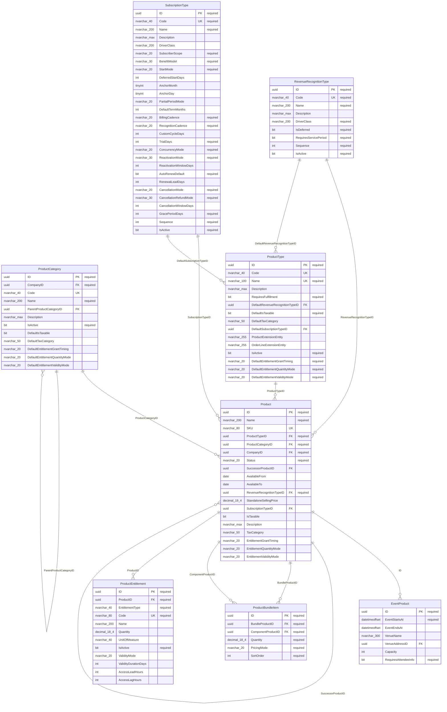
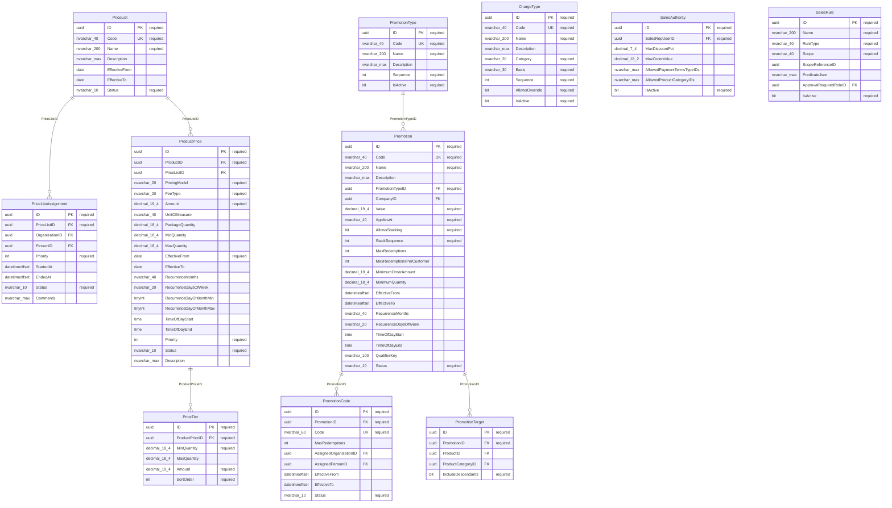
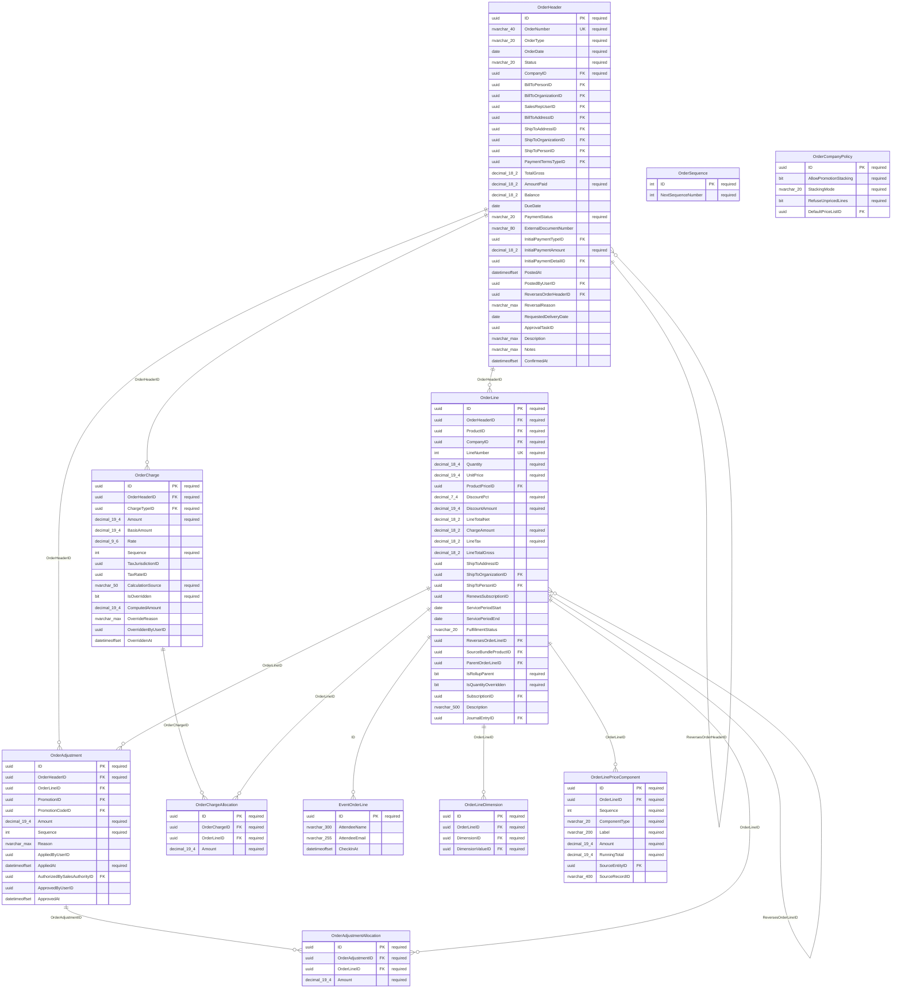
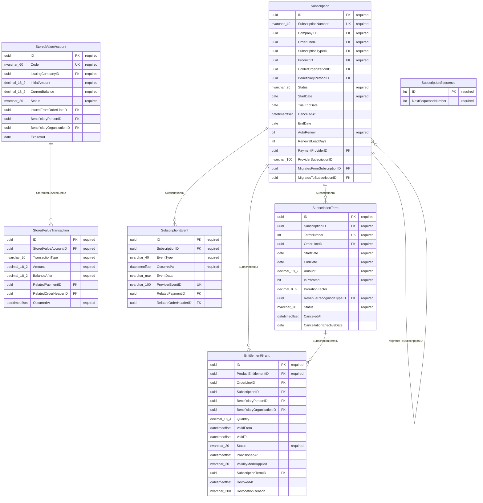
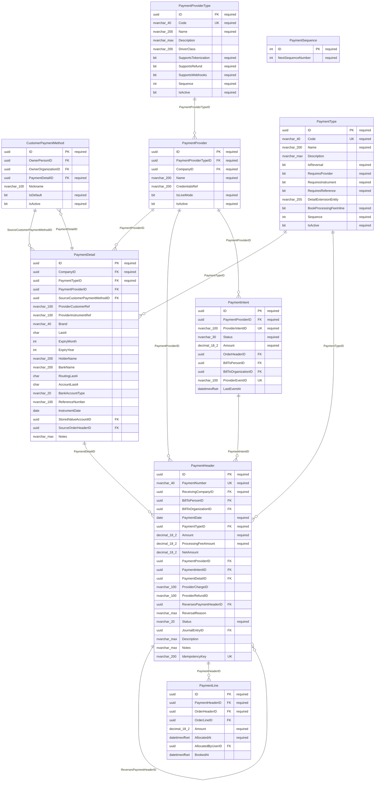
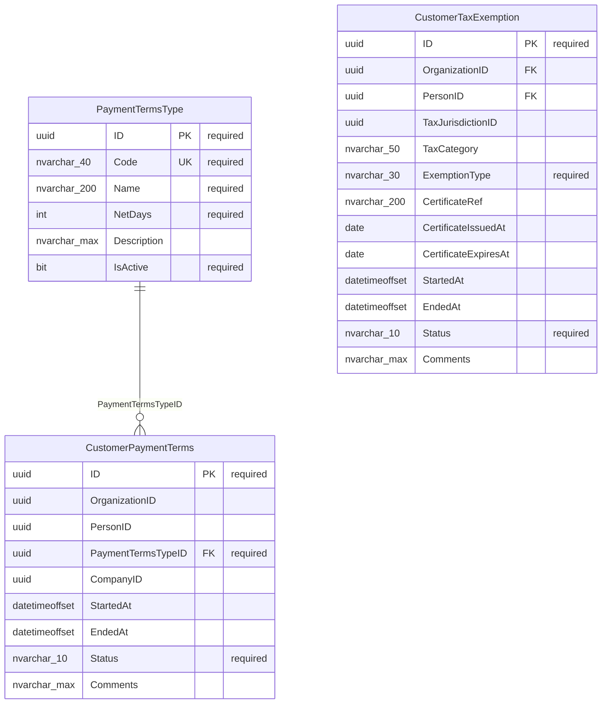

# `bizapps-orders` — ERD

> **This is the AS-BUILT ERD — a reflection of the implementation, not a plan.** Intended-but-unbuilt
> schema belongs in `plans/`, never here; this file must always describe what the database actually
> contains.
>
> **GENERATED FROM THE LIVE SCHEMA.** Every table, column, nullability, foreign key, unique index and
> trigger below was read out of `sys.tables` / `sys.columns` / `sys.foreign_keys` / `sys.indexes` /
> `sys.triggers` on a database built by the committed migrations. Do not hand-edit the diagrams —
> regenerate:
>
> ```sh
> node test-harnesses/dump-schema.mjs /tmp/orders-schema.json
> node test-harnesses/gen-erd.mjs   /tmp/orders-schema.json docs/ERD.md /tmp/checkdefs.json
> ```
>
> **Verified against the live database:** 2026-08-06 · latest migration `V202607061432__v0.1.x__Tables_and_Objects.sql`
>
> **Schema:** `__mj_BizAppsOrders` · **Entity prefix:** `MJ_BizApps_Orders: ` · **Keys:** UUID throughout
> **49 tables · 85 internal relationships · 48 cross-app foreign keys ·
> 120 CHECK constraints · 32 unique indexes** beyond the primary keys ·
> **7 business triggers** · 49 generated views.
>
> (49 is the app's own tables. `sys.tables` reports 50 because Flyway keeps its
> `flyway_schema_history` in this schema; that table belongs to the migration tool, not to the model.)
>
> **One provenance caveat.** The app's DB login lacks `VIEW DEFINITION`, so CHECK constraint *bodies*
> in §4 come from the committed migration rather than from `sys.check_constraints`. The constraint
> *names* are read live, and the generator asserts that every live name was found in the migration
> — currently **120/120** — so the two sources agree on what exists even though only one
> can say what it means. Everything else on this page is read from the database directly.
>
> **How to read this.** §1 is the master map: every table, every connection, no columns — an
> orientation tool, too wide to work from. §2 is the six area maps WITH full column lists, small
> enough to actually read, and they are what you want open while writing code. §3 is the cross-app
> register. §4 is the value lists. §5 and §6 are the parts no diagram can carry — the rules that live
> in triggers and in server code rather than in the schema. §7 is what is deliberately absent.

---

## 0. Three rules that explain most of this schema

**1 — The LINE is the unit of money, not the order.** `OrderLine` carries its own `CompanyID`, its own
journal entry, its own tax and its own revenue-recognition treatment; `OrderHeader` is a container
whose totals are rolled up from its lines by trigger. This is what lets a single order sell products
belonging to several different companies and still emit journal entries that are each single-company
and balanced — the alternative, a company on the header, makes multi-company orders unrepresentable.

**2 — References point UP the dependency graph, and they are real foreign keys.** Orders depends on
`common`, `accounting` and MJ core, so it may hold hard FKs into them (48 of them, §3) — installs
run in dependency order, so the targets always exist. Orders holds NO reference to anything that
depends on orders; `bizapps-contracts` points down at us instead. Accounting's link back to an order
line is a polymorphic `LinkedEntityID`/`LinkedRecordID` pair on the journal entry, which is a typed
polymorphic link and not a soft key.

**3 — Derived money is materialised and then frozen.** Line totals are computed server-side, rolled
up to the header by trigger, and made immutable once the order is confirmed (§5). A client cannot
supply a total that disagrees with what was booked, and a booked figure cannot drift afterwards.

---

## 1. Master map — every table, every connection inside the app

No columns; this is the shape only. **Cross-app foreign keys are deliberately NOT drawn here** — all
48 of them would triple the edge count and hide the app's own structure, which is the one thing this
diagram exists to show. They get their own map and full register in §3.

```mermaid
erDiagram
    ChargeType ||--o{ OrderCharge : "ChargeTypeID"
    CustomerPaymentMethod ||--o{ PaymentDetail : "SourceCustomerPaymentMethodID"
    OrderAdjustment ||--o{ OrderAdjustmentAllocation : "OrderAdjustmentID"
    OrderCharge ||--o{ OrderChargeAllocation : "OrderChargeID"
    OrderHeader ||--o{ OrderAdjustment : "OrderHeaderID"
    OrderHeader ||--o{ OrderCharge : "OrderHeaderID"
    OrderHeader ||--o{ OrderHeader : "ReversesOrderHeaderID"
    OrderHeader ||--o{ OrderLine : "OrderHeaderID"
    OrderHeader ||--o{ PaymentDetail : "SourceOrderHeaderID"
    OrderHeader ||--o{ PaymentIntent : "OrderHeaderID"
    OrderHeader ||--o{ PaymentLine : "OrderHeaderID"
    OrderHeader ||--o{ StoredValueTransaction : "RelatedOrderHeaderID"
    OrderHeader ||--o{ SubscriptionEvent : "RelatedOrderHeaderID"
    OrderLine ||--o{ EntitlementGrant : "OrderLineID"
    OrderLine ||--o{ EventOrderLine : "ID"
    OrderLine ||--o{ OrderAdjustment : "OrderLineID"
    OrderLine ||--o{ OrderAdjustmentAllocation : "OrderLineID"
    OrderLine ||--o{ OrderChargeAllocation : "OrderLineID"
    OrderLine ||--o{ OrderLine : "ParentOrderLineID"
    OrderLine ||--o{ OrderLine : "ReversesOrderLineID"
    OrderLine ||--o{ OrderLineDimension : "OrderLineID"
    OrderLine ||--o{ OrderLinePriceComponent : "OrderLineID"
    OrderLine ||--o{ PaymentLine : "OrderLineID"
    OrderLine ||--o{ StoredValueAccount : "IssuedFromOrderLineID"
    OrderLine ||--o{ Subscription : "OrderLineID"
    OrderLine ||--o{ SubscriptionTerm : "OrderLineID"
    PaymentDetail ||--o{ CustomerPaymentMethod : "PaymentDetailID"
    PaymentDetail ||--o{ OrderHeader : "InitialPaymentDetailID"
    PaymentDetail ||--o{ PaymentHeader : "PaymentDetailID"
    PaymentHeader ||--o{ PaymentHeader : "ReversesPaymentHeaderID"
    PaymentHeader ||--o{ PaymentLine : "PaymentHeaderID"
    PaymentHeader ||--o{ StoredValueTransaction : "RelatedPaymentID"
    PaymentHeader ||--o{ SubscriptionEvent : "RelatedPaymentID"
    PaymentIntent ||--o{ PaymentHeader : "PaymentIntentID"
    PaymentProvider ||--o{ PaymentDetail : "PaymentProviderID"
    PaymentProvider ||--o{ PaymentHeader : "PaymentProviderID"
    PaymentProvider ||--o{ PaymentIntent : "PaymentProviderID"
    PaymentProvider ||--o{ Subscription : "PaymentProviderID"
    PaymentProviderType ||--o{ PaymentProvider : "PaymentProviderTypeID"
    PaymentTermsType ||--o{ CustomerPaymentTerms : "PaymentTermsTypeID"
    PaymentTermsType ||--o{ OrderHeader : "PaymentTermsTypeID"
    PaymentType ||--o{ OrderHeader : "InitialPaymentTypeID"
    PaymentType ||--o{ PaymentDetail : "PaymentTypeID"
    PaymentType ||--o{ PaymentHeader : "PaymentTypeID"
    PriceList ||--o{ OrderCompanyPolicy : "DefaultPriceListID"
    PriceList ||--o{ PriceListAssignment : "PriceListID"
    PriceList ||--o{ ProductPrice : "PriceListID"
    Product ||--o{ EventProduct : "ID"
    Product ||--o{ OrderLine : "ProductID"
    Product ||--o{ OrderLine : "SourceBundleProductID"
    Product ||--o{ Product : "SuccessorProductID"
    Product ||--o{ ProductBundleItem : "BundleProductID"
    Product ||--o{ ProductBundleItem : "ComponentProductID"
    Product ||--o{ ProductEntitlement : "ProductID"
    Product ||--o{ ProductPrice : "ProductID"
    Product ||--o{ PromotionTarget : "ProductID"
    Product ||--o{ Subscription : "ProductID"
    ProductCategory ||--o{ Product : "ProductCategoryID"
    ProductCategory ||--o{ ProductCategory : "ParentProductCategoryID"
    ProductCategory ||--o{ PromotionTarget : "ProductCategoryID"
    ProductEntitlement ||--o{ EntitlementGrant : "ProductEntitlementID"
    ProductPrice ||--o{ OrderLine : "ProductPriceID"
    ProductPrice ||--o{ PriceTier : "ProductPriceID"
    ProductType ||--o{ Product : "ProductTypeID"
    Promotion ||--o{ OrderAdjustment : "PromotionID"
    Promotion ||--o{ PromotionCode : "PromotionID"
    Promotion ||--o{ PromotionTarget : "PromotionID"
    PromotionCode ||--o{ OrderAdjustment : "PromotionCodeID"
    PromotionType ||--o{ Promotion : "PromotionTypeID"
    RevenueRecognitionType ||--o{ Product : "RevenueRecognitionTypeID"
    RevenueRecognitionType ||--o{ ProductType : "DefaultRevenueRecognitionTypeID"
    RevenueRecognitionType ||--o{ SubscriptionTerm : "RevenueRecognitionTypeID"
    SalesAuthority ||--o{ OrderAdjustment : "AuthorizedBySalesAuthorityID"
    StoredValueAccount ||--o{ PaymentDetail : "StoredValueAccountID"
    StoredValueAccount ||--o{ StoredValueTransaction : "StoredValueAccountID"
    Subscription ||--o{ EntitlementGrant : "SubscriptionID"
    Subscription ||--o{ OrderLine : "SubscriptionID"
    Subscription ||--o{ Subscription : "MigratesFromSubscriptionID"
    Subscription ||--o{ Subscription : "MigratesToSubscriptionID"
    Subscription ||--o{ SubscriptionEvent : "SubscriptionID"
    Subscription ||--o{ SubscriptionTerm : "SubscriptionID"
    SubscriptionTerm ||--o{ EntitlementGrant : "SubscriptionTermID"
    SubscriptionType ||--o{ Product : "SubscriptionTypeID"
    SubscriptionType ||--o{ ProductType : "DefaultSubscriptionTypeID"
    SubscriptionType ||--o{ Subscription : "SubscriptionTypeID"
```



**Reading the shape.** Three tables carry the graph: `Product` (10 inbound) is what can be
sold, `OrderLine` (13 inbound) is what was sold, and `OrderHeader` (9 inbound) groups it. Read the
app as catalogue → order → the two things an order can leave behind (a subscription, a payment).

**Not in the diagram above (5 tables), because they have no foreign key to another orders table:**

- `OrderSequence`, `PaymentSequence`, `SubscriptionSequence` — singleton counters and rule tables, read by code rather than joined to.
- `CustomerTaxExemption`, `SalesRule` — connected only OUTSIDE the app (see §3); it hangs off `common`, not off us.

---

## 2. Area maps — full columns, small enough to read

Audit columns CodeGen owns (`__mj_CreatedAt`, `__mj_UpdatedAt`) are omitted from every block; they
are on every table. `PK`/`FK`/`UK` mark the key role; `required` means `NOT NULL`.

### 2.1 What can be sold — the catalogue

**`Product` is the hub of the whole app** — ten tables reference it. Everything a customer can
buy is a Product row, and what KIND of thing it is comes from `ProductType` plus the presence of a
satellite row: an `EventProduct` row makes it an event with a capacity and a date, a
`SubscriptionTypeID` makes it recurring, `ProductBundleItem` rows make it a bundle that expands into
children at order time. That is deliberate — a new product kind adds a satellite table, not a column
to `Product` and not a new sibling of it.

`RevenueRecognitionType` is the join to accounting's world: it decides whether a line's money is
earned immediately or deferred across a service window, which is what makes one order line produce
one booking entry and `N` future release entries.



**Reaches outside the app:** `EventProduct.VenueAddressID` → `__mj_BizAppsCommon.Address`, `Product.CompanyID` → `__mj.Company`, `ProductCategory.CompanyID` → `__mj.Company`.

### 2.2 What it costs — price, promotion and who may discount

**Price is resolved, not stored on the product.** A `Product` has no price column. `ProductPrice`
rows carry the money, scoped by `PriceList`, currency, quantity break and date window, and
`PriceListAssignment` decides which list a given customer sees. `PriceTier` carries the bands for
tiered and volume models. The resolution walk that reads all this is the second of the app's three
resolution walks (GL account and payment terms are the others) — see §6.

**`Promotion` is separated from `PromotionCode` on purpose**: one promotion can have many codes
(per-campaign, per-partner, single-use), and `PromotionTarget` scopes what a promotion may apply to.
`SalesAuthority` and `SalesRule` are the guardrails — who is allowed to discount, and by how much.



**Leaves this area:** `ProductPrice.ProductID` → `Product`, `PromotionTarget.ProductID` → `Product`, `PromotionTarget.ProductCategoryID` → `ProductCategory`.

**Reaches outside the app:** `PriceListAssignment.OrganizationID` → `__mj_BizAppsCommon.Organization`, `PriceListAssignment.PersonID` → `__mj_BizAppsCommon.Person`, `Promotion.CompanyID` → `__mj.Company`, `PromotionCode.AssignedOrganizationID` → `__mj_BizAppsCommon.Organization`, `PromotionCode.AssignedPersonID` → `__mj_BizAppsCommon.Person`, `SalesAuthority.SalesRepUserID` → `__mj.User`, `SalesRule.ApprovalRequiredRoleID` → `__mj.Role`.

### 2.3 The order itself

**`OrderLine` is the most-referenced table in the schema** (13 inbound foreign keys), not
`OrderHeader` — because the LINE is the unit of money. It carries its own `CompanyID` (a denormalised
copy of the product's company, captured at save time), its own journal entry, its own tax and its own
recognition treatment. That is what lets one order sell products belonging to several companies and
still produce correct, single-company journal entries.

**Charges and adjustments are allocated, not summed.** `OrderCharge` and `OrderAdjustment` sit at the
header, and their `*Allocation` children push the money down onto specific lines — so a shipping
charge or an order-level discount still lands on a line, which still lands on one company's ledger.

`OrderLinePriceComponent` is the audit trail of the pricing walk: how the number was arrived at, kept
beside the number itself. `OrderSequence` is a singleton counter for `ORD-{seq}`, not part of the graph.



**Leaves this area:** `OrderAdjustment.PromotionID` → `Promotion`, `OrderAdjustment.PromotionCodeID` → `PromotionCode`, `OrderAdjustment.AuthorizedBySalesAuthorityID` → `SalesAuthority`, `OrderCharge.ChargeTypeID` → `ChargeType`, `OrderCompanyPolicy.DefaultPriceListID` → `PriceList`, `OrderHeader.InitialPaymentDetailID` → `PaymentDetail`, `OrderHeader.InitialPaymentTypeID` → `PaymentType`, `OrderHeader.PaymentTermsTypeID` → `PaymentTermsType`, `OrderLine.ProductID` → `Product`, `OrderLine.ProductPriceID` → `ProductPrice`, `OrderLine.SourceBundleProductID` → `Product`, `OrderLine.SubscriptionID` → `Subscription`.

**Reaches outside the app:** `OrderCompanyPolicy.ID` → `__mj.Company`, `OrderHeader.BillToAddressID` → `__mj_BizAppsCommon.Address`, `OrderHeader.BillToOrganizationID` → `__mj_BizAppsCommon.Organization`, `OrderHeader.BillToPersonID` → `__mj_BizAppsCommon.Person`, `OrderHeader.CompanyID` → `__mj.Company`, `OrderHeader.PostedByUserID` → `__mj.User`, `OrderHeader.SalesRepUserID` → `__mj.User`, `OrderHeader.ShipToAddressID` → `__mj_BizAppsCommon.Address`, `OrderHeader.ShipToOrganizationID` → `__mj_BizAppsCommon.Organization`, `OrderHeader.ShipToPersonID` → `__mj_BizAppsCommon.Person`, `OrderLine.CompanyID` → `__mj.Company`, `OrderLine.JournalEntryID` → `__mj_BizAppsAccounting.JournalEntry`, `OrderLine.ShipToOrganizationID` → `__mj_BizAppsCommon.Organization`, `OrderLine.ShipToPersonID` → `__mj_BizAppsCommon.Person`, `OrderLineDimension.DimensionID` → `__mj_BizAppsAccounting.Dimension`, `OrderLineDimension.DimensionValueID` → `__mj_BizAppsAccounting.DimensionValue`, `OrderLinePriceComponent.SourceEntityID` → `__mj.Entity`.

### 2.4 What the customer keeps getting — subscriptions and entitlements

**`Subscription` is the durable thing; `SubscriptionTerm` is the billable slice.** A subscription
persists across renewals and its terms are the periods that get billed and recognised — the same
split contracts makes between `Contract` and `ContractTerm`, and for the same reason: the engine
operates on the term.

`SubscriptionEvent` is the history (started, renewed, upgraded, cancelled). `EntitlementGrant` is
what the subscription actually gives you, and `StoredValueAccount` / `StoredValueTransaction` cover
the balance kinds — gift cards, credits — where the customer holds value rather than a right.

A subscription's `CompanyID` comes from the ORDER LINE that created it, not from the order header;
getting that wrong put subscriptions on the wrong company's books and is fixed in this branch.



**Leaves this area:** `EntitlementGrant.OrderLineID` → `OrderLine`, `EntitlementGrant.ProductEntitlementID` → `ProductEntitlement`, `StoredValueAccount.IssuedFromOrderLineID` → `OrderLine`, `StoredValueTransaction.RelatedOrderHeaderID` → `OrderHeader`, `StoredValueTransaction.RelatedPaymentID` → `PaymentHeader`, `Subscription.OrderLineID` → `OrderLine`, `Subscription.PaymentProviderID` → `PaymentProvider`, `Subscription.ProductID` → `Product`, `Subscription.SubscriptionTypeID` → `SubscriptionType`, `SubscriptionEvent.RelatedOrderHeaderID` → `OrderHeader`, `SubscriptionEvent.RelatedPaymentID` → `PaymentHeader`, `SubscriptionTerm.OrderLineID` → `OrderLine`, `SubscriptionTerm.RevenueRecognitionTypeID` → `RevenueRecognitionType`.

**Reaches outside the app:** `EntitlementGrant.BeneficiaryOrganizationID` → `__mj_BizAppsCommon.Organization`, `EntitlementGrant.BeneficiaryPersonID` → `__mj_BizAppsCommon.Person`, `StoredValueAccount.BeneficiaryOrganizationID` → `__mj_BizAppsCommon.Organization`, `StoredValueAccount.BeneficiaryPersonID` → `__mj_BizAppsCommon.Person`, `StoredValueAccount.IssuingCompanyID` → `__mj.Company`, `Subscription.BeneficiaryPersonID` → `__mj_BizAppsCommon.Person`, `Subscription.CompanyID` → `__mj.Company`, `Subscription.HolderOrganizationID` → `__mj_BizAppsCommon.Organization`.

### 2.5 Getting paid

**The money that arrived and the money's application are separate tables, because a payment is
not an allocation.** `PaymentHeader` is the receipt; `PaymentLine` hangs off it and records how that
money was applied, against an order and optionally a specific line. One cheque paying three invoices
is one header and three lines — which is what lets the ledger and the receivable agree.

**`PaymentDetail` is NOT a third level below them.** The header *points at* it
(`PaymentHeader.PaymentDetailID`), because it is the instrument — brand, last four, expiry, bank
routing tail, or a stored-value account — and one instrument is reused across many payments. Reading
the arrow the other way is the easy mistake here.

`PaymentHeader.ReversesPaymentHeaderID` is the self-reference that makes a refund a first-class
payment rather than a negative amount, and `IdempotencyKey` is what stops a retried provider callback
from taking the money twice.

`PaymentIntent` is the provider handshake (Stripe and friends) held separately from the payment
itself, so an abandoned intent leaves no payment behind. `PaymentProviderType` / `PaymentProvider`
keep the app provider-agnostic, and `CustomerPaymentMethod` stores the customer's saved instrument —
a token, never a card number.

Immutability here is enforced by TRIGGERS, not by the application: see §5.



**Leaves this area:** `PaymentDetail.SourceOrderHeaderID` → `OrderHeader`, `PaymentDetail.StoredValueAccountID` → `StoredValueAccount`, `PaymentIntent.OrderHeaderID` → `OrderHeader`, `PaymentLine.OrderHeaderID` → `OrderHeader`, `PaymentLine.OrderLineID` → `OrderLine`.

**Reaches outside the app:** `CustomerPaymentMethod.OwnerOrganizationID` → `__mj_BizAppsCommon.Organization`, `CustomerPaymentMethod.OwnerPersonID` → `__mj_BizAppsCommon.Person`, `PaymentDetail.CompanyID` → `__mj.Company`, `PaymentHeader.BillToOrganizationID` → `__mj_BizAppsCommon.Organization`, `PaymentHeader.BillToPersonID` → `__mj_BizAppsCommon.Person`, `PaymentHeader.JournalEntryID` → `__mj_BizAppsAccounting.JournalEntry`, `PaymentHeader.ReceivingCompanyID` → `__mj.Company`, `PaymentIntent.BillToOrganizationID` → `__mj_BizAppsCommon.Organization`, `PaymentIntent.BillToPersonID` → `__mj_BizAppsCommon.Person`, `PaymentLine.AllocatedByUserID` → `__mj.User`, `PaymentProvider.CompanyID` → `__mj.Company`.

### 2.6 What this customer specifically gets

Three small tables carrying per-customer deviations from the default. `CustomerPaymentTerms` is
date-effective and optionally scoped to one selling company, keyed on an organization OR a person the
same way `CustomerTaxExemption` is — the `CK_*_Party` constraints spell out the exclusive-or because
SQL Server has no boolean value type.

**This is where the payment-terms walk currently breaks.** Its fourth rung reads a selling company's
default from accounting, which accounting deleted (issue #34); `CustomerPaymentTerms` cannot hold it
because by construction every row names a customer. See §7.



**Reaches outside the app:** `CustomerTaxExemption.OrganizationID` → `__mj_BizAppsCommon.Organization`, `CustomerTaxExemption.PersonID` → `__mj_BizAppsCommon.Person`.

---

## 3. Cross-app reference register

48 foreign keys leave this schema. All point UP the dependency graph (rule 2). Nothing here is
optional trivia: **these are the references that break silently when an upstream app re-bakes its
baseline**, because our generated metadata pins upstream entity IDs by GUID.

```mermaid
erDiagram
    common_Organization ||--o{ CustomerPaymentMethod : "OwnerOrganizationID"
    common_Organization ||--o{ CustomerTaxExemption : "OrganizationID"
    common_Organization ||--o{ EntitlementGrant : "BeneficiaryOrganizationID"
    common_Organization ||--o{ OrderHeader : "BillToOrganizationID, ShipToOrganizationID"
    common_Organization ||--o{ OrderLine : "ShipToOrganizationID"
    common_Organization ||--o{ PaymentHeader : "BillToOrganizationID"
    common_Organization ||--o{ PaymentIntent : "BillToOrganizationID"
    common_Organization ||--o{ PriceListAssignment : "OrganizationID"
    common_Organization ||--o{ PromotionCode : "AssignedOrganizationID"
    common_Organization ||--o{ StoredValueAccount : "BeneficiaryOrganizationID"
    common_Organization ||--o{ Subscription : "HolderOrganizationID"
    common_Person ||--o{ CustomerPaymentMethod : "OwnerPersonID"
    common_Person ||--o{ CustomerTaxExemption : "PersonID"
    common_Person ||--o{ EntitlementGrant : "BeneficiaryPersonID"
    common_Person ||--o{ OrderHeader : "BillToPersonID, ShipToPersonID"
    common_Person ||--o{ OrderLine : "ShipToPersonID"
    common_Person ||--o{ PaymentHeader : "BillToPersonID"
    common_Person ||--o{ PaymentIntent : "BillToPersonID"
    common_Person ||--o{ PriceListAssignment : "PersonID"
    common_Person ||--o{ PromotionCode : "AssignedPersonID"
    common_Person ||--o{ StoredValueAccount : "BeneficiaryPersonID"
    common_Person ||--o{ Subscription : "BeneficiaryPersonID"
    MJ_Company ||--o{ OrderCompanyPolicy : "ID"
    MJ_Company ||--o{ OrderHeader : "CompanyID"
    MJ_Company ||--o{ OrderLine : "CompanyID"
    MJ_Company ||--o{ PaymentDetail : "CompanyID"
    MJ_Company ||--o{ PaymentHeader : "ReceivingCompanyID"
    MJ_Company ||--o{ PaymentProvider : "CompanyID"
    MJ_Company ||--o{ Product : "CompanyID"
    MJ_Company ||--o{ ProductCategory : "CompanyID"
    MJ_Company ||--o{ Promotion : "CompanyID"
    MJ_Company ||--o{ StoredValueAccount : "IssuingCompanyID"
    MJ_Company ||--o{ Subscription : "CompanyID"
    MJ_User ||--o{ OrderHeader : "PostedByUserID, SalesRepUserID"
    MJ_User ||--o{ PaymentLine : "AllocatedByUserID"
    MJ_User ||--o{ SalesAuthority : "SalesRepUserID"
    common_Address ||--o{ EventProduct : "VenueAddressID"
    common_Address ||--o{ OrderHeader : "BillToAddressID, ShipToAddressID"
    acct_JournalEntry ||--o{ OrderLine : "JournalEntryID"
    acct_JournalEntry ||--o{ PaymentHeader : "JournalEntryID"
    acct_Dimension ||--o{ OrderLineDimension : "DimensionID"
    acct_DimensionValue ||--o{ OrderLineDimension : "DimensionValueID"
    MJ_Entity ||--o{ OrderLinePriceComponent : "SourceEntityID"
    MJ_Role ||--o{ SalesRule : "ApprovalRequiredRoleID"
```



| → target | count | from |
|---|---|---|
| `__mj_BizAppsCommon.Organization` | 12 | `CustomerPaymentMethod.OwnerOrganizationID`, `CustomerTaxExemption.OrganizationID`, `EntitlementGrant.BeneficiaryOrganizationID`, `OrderHeader.BillToOrganizationID`, `OrderHeader.ShipToOrganizationID`, `OrderLine.ShipToOrganizationID`, `PaymentHeader.BillToOrganizationID`, `PaymentIntent.BillToOrganizationID`, `PriceListAssignment.OrganizationID`, `PromotionCode.AssignedOrganizationID`, `StoredValueAccount.BeneficiaryOrganizationID`, `Subscription.HolderOrganizationID` |
| `__mj_BizAppsCommon.Person` | 12 | `CustomerPaymentMethod.OwnerPersonID`, `CustomerTaxExemption.PersonID`, `EntitlementGrant.BeneficiaryPersonID`, `OrderHeader.BillToPersonID`, `OrderHeader.ShipToPersonID`, `OrderLine.ShipToPersonID`, `PaymentHeader.BillToPersonID`, `PaymentIntent.BillToPersonID`, `PriceListAssignment.PersonID`, `PromotionCode.AssignedPersonID`, `StoredValueAccount.BeneficiaryPersonID`, `Subscription.BeneficiaryPersonID` |
| `__mj.Company` | 11 | `OrderCompanyPolicy.ID`, `OrderHeader.CompanyID`, `OrderLine.CompanyID`, `PaymentDetail.CompanyID`, `PaymentHeader.ReceivingCompanyID`, `PaymentProvider.CompanyID`, `Product.CompanyID`, `ProductCategory.CompanyID`, `Promotion.CompanyID`, `StoredValueAccount.IssuingCompanyID`, `Subscription.CompanyID` |
| `__mj.User` | 4 | `OrderHeader.PostedByUserID`, `OrderHeader.SalesRepUserID`, `PaymentLine.AllocatedByUserID`, `SalesAuthority.SalesRepUserID` |
| `__mj_BizAppsCommon.Address` | 3 | `EventProduct.VenueAddressID`, `OrderHeader.BillToAddressID`, `OrderHeader.ShipToAddressID` |
| `__mj_BizAppsAccounting.JournalEntry` | 2 | `OrderLine.JournalEntryID`, `PaymentHeader.JournalEntryID` |
| `__mj_BizAppsAccounting.Dimension` | 1 | `OrderLineDimension.DimensionID` |
| `__mj_BizAppsAccounting.DimensionValue` | 1 | `OrderLineDimension.DimensionValueID` |
| `__mj.Entity` | 1 | `OrderLinePriceComponent.SourceEntityID` |
| `__mj.Role` | 1 | `SalesRule.ApprovalRequiredRoleID` |

**`__mj.Company` is the multi-company spine.** 11 tables carry a `CompanyID`, including
`OrderLine` — that column is what makes a mixed-company order bookable (rule 1).

---

## 4. Value lists (CHECK-constrained)

44 columns are constrained to a closed set at the database. These are the ones worth knowing
before writing a query — a value not on this list cannot be in the column.

| table.column | allowed values |
|---|---|
| `ChargeType.Basis` | `LineNet` · `LineNetPlusCharges` · `OrderNet` · `Flat` |
| `ChargeType.Category` | `Shipping` · `Handling` · `Tax` · `Surcharge` · `Fee` |
| `CustomerPaymentTerms.Status` | `Active` · `Inactive` |
| `CustomerTaxExemption.ExemptionType` | `Resale` · `NonProfit` · `Government` · `Educational` · `Other` |
| `CustomerTaxExemption.Status` | `Active` · `Inactive` |
| `EntitlementGrant.Status` | `Active` · `Suspended` · `Revoked` · `Expired` |
| `OrderCompanyPolicy.StackingMode` | `Sequential` · `Additive` |
| `OrderHeader.OrderType` | `Sale` · `Return` · `Cancellation` · `Amendment` · `AccountCredit` |
| `OrderHeader.PaymentStatus` | `Unpaid` · `PartiallyPaid` · `Paid` · `Overdue` · `WrittenOff` |
| `OrderHeader.Status` | `Draft` · `Quoted` · `Confirmed` · `Posted` · `Fulfilled` · `Voided` |
| `OrderLine.FulfillmentStatus` | `Pending` · `Fulfilled` · `Returned` |
| `OrderLinePriceComponent.ComponentType` | `Base` · `Rule` · `Adjustment` · `Charge` · `Tax` |
| `PaymentHeader.Status` | `Pending` · `Captured` · `Failed` · `Refunded` · `Disputed` |
| `PaymentIntent.Status` | `RequiresPayment` · `Processing` · `Succeeded` · `Canceled` · `Failed` |
| `PriceListAssignment.Status` | `Active` · `Inactive` |
| `PriceList.Status` | `Active` · `Inactive` |
| `ProductBundleItem.PricingMode` | `Bundled` · `SumOfParts` |
| `ProductEntitlement.EntitlementType` | `Feature` · `AccessLevel` · `ResourceQuantity` · `Custom` |
| `ProductPrice.FeeType` | `Standard` · `Setup` · `Recurring` · `Overage` |
| `ProductPrice.PricingModel` | `Flat` · `PerUnit` · `Tiered` · `Volume` · `Package` · `Usage` |
| `ProductPrice.Status` | `Active` · `Inactive` |
| `Product.Status` | `Draft` · `Active` · `Discontinued` · `EOL` |
| `ProductType.DefaultEntitlementGrantTiming` | `OnConfirm` · `OnPaidInFull` · `OnActivation` |
| `ProductType.DefaultEntitlementQuantityMode` | `PerUnit` · `Flat` |
| `ProductType.DefaultEntitlementValidityMode` | `Perpetual` · `EventWindow` · `FixedDuration` · `SubscriptionTerm` |
| `Promotion.AppliesAt` | `Line` · `Order` · `Either` |
| `PromotionCode.Status` | `Active` · `Inactive` · `Expired` |
| `Promotion.Status` | `Draft` · `Active` · `Paused` · `Expired` |
| `SalesRule.RuleType` | `DiscountLimit` · `PaymentTermsRequired` · `ProductAuthorization` · `CreditLimit` · `Custom` |
| `SalesRule.Scope` | `Global` · `PerProduct` · `PerCustomer` · `PerSalesRep` |
| `StoredValueAccount.Status` | `Active` · `Depleted` · `Expired` · `Suspended` · `Voided` |
| `StoredValueTransaction.TransactionType` | `Issue` · `Redeem` · `Refund` · `Adjust` · `Expire` |
| `SubscriptionEvent.EventType` | `Created` · `Activated` · `TrialStarted` · `TrialEnded` · `PaymentSucceeded` · `PaymentFailed` · `Paused` · `Resumed` · `CancellationRequested` · `Canceled` · `Migrated` · `Extended` · `RenewalOrderSpawned` |
| `Subscription.Status` | `Active` · `Paused` · `Canceled` · `Migrated` · `Trialing` |
| `SubscriptionTerm.Status` | `Scheduled` · `Active` · `Completed` · `Canceled` · `Lapsed` |
| `SubscriptionType.BenefitModel` | `Holder` · `Individual` · `Organization` |
| `SubscriptionType.BillingCadence` | `Monthly` · `Quarterly` · `Annual` · `Custom` |
| `SubscriptionType.CancellationMode` | `Immediate` · `EndOfTerm` · `EndOfBillingPeriod` |
| `SubscriptionType.CancellationRefundMode` | `NoRefund` · `ProrateUnused` · `FullRefundWithinWindow` |
| `SubscriptionType.ConcurrencyMode` | `AllowMultiple` · `ExtendExisting` · `RejectDuplicate` |
| `SubscriptionType.ReactivationMode` | `ReactivateExisting` · `AlwaysCreateNew` · `ReactivateWithinWindow` |
| `SubscriptionType.RecognitionCadence` | `Monthly` · `Quarterly` · `Annual` · `MatchBilling` |
| `SubscriptionType.StartMode` | `Immediate` · `Deferred` · `CalendarAnchored` |
| `SubscriptionType.SubscriberScope` | `Organization` · `Person` · `Either` |

The remaining 76 CHECK constraints are not value lists — they are cross-field rules
(exclusive-or of two party columns, a window whose end must follow its start, a non-negative amount).
Those are listed with their tables in §2 only as `required`/nullability; their bodies live in the
migration.

---

## 5. The rules that live in TRIGGERS, not in the tables

7 business triggers, and they carry two of the app's load-bearing guarantees. A diagram cannot
show either, and code that ignores them will fail at runtime rather than at compile time.

| table | trigger | what it guarantees |
|---|---|---|
| `OrderLine` | `trg_OrderLine_ImmutableAfterConfirm` | A confirmed line's money is history. Error 51003. This is why the server short-circuits its own total recomputation once `JournalEntryID` is stamped — a figure it cannot reproduce from stored state alone would be rejected here and roll back the whole confirm. |
| `OrderLine` | `trg_OrderLine_RollupTotals` | Header totals are derived from lines by the database, so a client cannot supply a total that disagrees with what was booked. |
| `PaymentDetail` | `trg_PaymentDetail_Immutable` | A recorded payment instrument cannot be edited after the fact. |
| `PaymentHeader` | `trg_PaymentHeader_ImmutableAfterCapture` | Captured money is frozen. |
| `PaymentHeader` | `trg_PaymentHeader_RollupTotals` | Payment header totals are derived from its lines. |
| `PaymentLine` | `trg_PaymentLine_ImmutableAfterCapture` | An applied payment line cannot be re-pointed after capture. |
| `PaymentLine` | `trg_PaymentLine_RollupTotals` | Applied-amount rollup. |

The other 49 triggers are CodeGen's `trgUpdate*` `__mj_UpdatedAt` maintainers, one per table.
They are not business logic and are omitted above.

---

## 6. The rules that are not in the schema at all

Three **resolution walks** decide values the tables only store the result of. Each tries progressively
more general sources and stops at the first hit. They are the reason a column can be non-null and
still tell you nothing about where its value came from.

| walk | order tried | on exhaustion |
|---|---|---|
| **GL account** | product → its category tree → the company default | **Refuses the confirm.** Booked money with nowhere to go is worse than no order. |
| **Price** | stated unit price → price-list entry for the customer's list → tier/volume band → product default | Line cannot be priced; confirm refuses. |
| **Payment terms** | stated `DueDate` → stated `PaymentTermsTypeID` → `CustomerPaymentTerms` → *the selling company's default* → due on receipt | Falls through to due on receipt. **Rung 4 is currently broken — see §7.** |

Two more behaviours are server-side only:

- **`OrderLine.CompanyID` is derived, never authored.** It is stamped from the product's company at
  save time, so the line records who owned the product at transaction time even if ownership later
  moves. Whatever a caller passes is overwritten.
- **A bundle's parent line contributes zero.** An expanded bundle keeps its parent line for the
  invoice to print, but the money lives on the children; the parent's totals are forced to zero so
  the header rollup does not double the order.

---

## 7. Known gaps in this schema (filed, not fixed)

Recorded here because each is a place where the tables and the code disagree, and a reader who trusts
the diagram alone will be misled.

- **Payment terms rung 4 is dead — [#34](https://github.com/MemberJunction/bizapps-orders/issues/34).**
  Accounting dropped `AccountingCompanyProfile.DefaultPaymentTermsTypeID` in its issue-#22 realignment
  ("per-company default terms move to the orders side"); orders never did that modelling.
  `CustomerPaymentTerms` cannot hold it — `CK_CustomerPaymentTerms_Party` requires every row to name
  an organization or a person — and orders has no per-company configuration table at all. Proposed:
  a small `OrdersCompanyProfile`, mirroring accounting's own profile pattern.
- **Event capacity is not enforced — [#33](https://github.com/MemberJunction/bizapps-orders/issues/33).**
  `EventProduct` has a capacity column and nothing counts against it; an event with capacity 1 sold
  five seats. The obvious fix was written and reverted — `vwOrderLines` does not expose the order's
  status, so every variant either counts abandoned drafts as sold or misses free tickets.
- **A subscription records no quantity.** A ten-seat subscription bills ten times correctly but
  stores no seat count, so nothing downstream can tell it from a single seat.
- **Cross-app entity IDs are pinned by GUID.** Our generated metadata references upstream entities by
  ID, so an upstream re-bake silently breaks a from-zero install while every existing instance keeps
  working. The durable fix is resolving cross-app entities by schema + table name.

---

## 8. Deliberately absent

| Not a column here | Where it lives instead | Why |
|---|---|---|
| A price on `Product` | `ProductPrice` rows | Price is per list, per currency, per quantity break and per date window. A column could only hold one of those and would decay into "whichever we set last". |
| A company on `OrderHeader` alone | `OrderLine.CompanyID` | A single order legitimately sells products from several companies; a header-only company makes that unrepresentable and puts the wrong company on the ledger. |
| An order reference on accounting's journal entry | `LinkedEntityID`/`LinkedRecordID` | Accounting must not reference its dependents. The polymorphic pair lets a journal entry name its origin without accounting knowing orders exists. |
| A contract link on `OrderHeader` | `bizapps-contracts` points down at us | Contracts depends on orders, not the reverse. |

<!-- generated by test-harnesses/gen-erd.mjs — do not hand-edit -->
