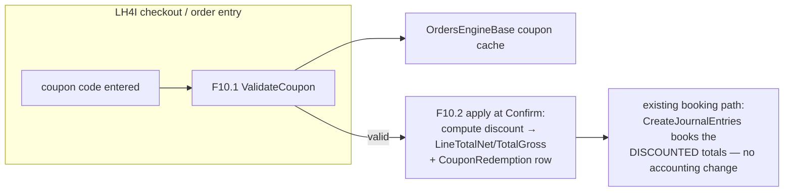
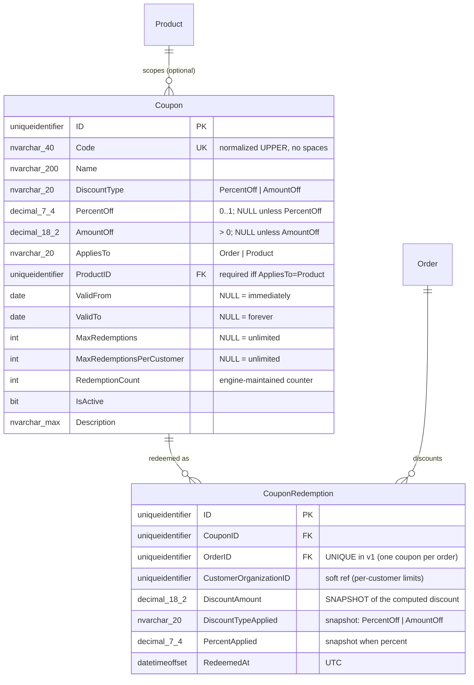

# Plan — Coupons & promo codes (schema → engine → UI)

> **AUDIT 2026-07-18 (orchestrator): NOT EXECUTED — stays here as DRAFT.** Zero stages built (no
> Coupon/CouponRedemption tables, entities, or engine code — verified). Pending: re-sequencing
> against UPD-8 (Option-A provider model first; BACKLOG row) + Robert's OS7 schema review (his
> checklist is recorded; artifacts shared in the 2026-07-17 file-share package). Rework this plan
> before executing anything from it.

> **Status:** DRAFT — awaiting **Robert's schema-structure review** (LXP A2: "Robert to spec"; this plan
> is the proposed spec). On his approval/edits it flips ACTIVE and executes as written.
> **Created:** 2026-07-14 · **Owner:** orchestrator (accounting-engine-dev)
> **Implements:** LXP decision **D10** ("Coupons/promo codes = BizApps Orders v1 … not hard") via
> MOD-6's 2026-07-14 extension. **Sources:** `meetings/2026-07-14 - LXP Requirements.md` (D8/D10/D11,
> §7), MASTER-PLAN §4.1 (pricing shapes), the built S5 pricing trio, F9 (resolution engine).
> **Consumer driving v1:** the LXP's LH4I checkout (3 tiers + coupons + track/bundle + Stripe card).

## Executive summary

Sidecar's LXP launches its individual checkout (~30 days) on BizApps Orders and needs **discount codes
at checkout**. The master plan has per-line `DiscountPct` but no *code* machinery — no way to define
"LAUNCH20 = 20% off, valid through August, 500 uses." This plan adds it as **two tables + one engine
hook + two UI surfaces**, deliberately shaped like Stripe's model (a **Coupon** defines the discount;
a **Redemption** records each use) because that's the shape integrators already understand and it
extends cleanly to everything we can foresee (stacking rules, per-customer limits, product scoping,
first-order-only) without carrying that complexity in v1.

**Design stance (simple but extensible — Amith's framing):**
- A coupon is **percent-off or fixed-amount-off**, order-scoped or product-scoped, time-windowed,
  usage-limited (global + per-customer). That covers LAUNCH20, EARLYBIRD, and a partner's 100%-off code.
- Discount **application is order-time state**: the order stores which coupon(s) applied and the computed
  discount amount per line/order — so the financial record is self-contained even if the coupon is later
  edited (the redemption snapshot, not the live coupon, is the truth for booked orders).
- **v1 excludes** (extensible-to, not built): stacking multiple coupons (v1 = one per order), buy-X-get-Y,
  referral/affiliate attribution, auto-apply campaigns. Each has an obvious home (see §5).
- **Accounting is untouched**: a discount reduces `LineTotalNet`/`TotalGross` before booking — JEs simply
  book the discounted amounts (same as a manual `DiscountPct` today). No new GL behavior. (If Finance
  later wants contra-revenue "Discounts Given" accounting, that's a GLAccountLink role + booking option —
  noted in §5, not v1.)

**What Robert is being asked to review:** the two table shapes in §2 (columns, CHECKs, the
snapshot-on-redemption stance) and the two open calls in §6 (code normalization; whether
`AppliesTo='Product'` scoping ships in v1 or lands with the first product-scoped campaign).

## 1. How it plugs into what's built

The discount runs **before** totals materialize, so F1.3 (totals), F1.2 (booking), and all accounting
invariants are untouched. The F9 pricing-resolution engine and coupons compose but don't depend on each
other: resolution proposes a price; a coupon then discounts it — precedence stays `UnitPrice` direct
entry ≻ resolution, with coupon discount applied to whatever the line price is (MOD-6 unchanged).

## 2. Schema — stage S7 (collapse-into-baseline, same ground rules as S1–S6)

Constraints (the review surface):
- `CK_Coupon_DiscountType IN ('PercentOff','AmountOff')` + **shape coherence**:
  `CK_Coupon_DiscountShape` — `(DiscountType='PercentOff' AND PercentOff IS NOT NULL AND PercentOff > 0
  AND PercentOff <= 1 AND AmountOff IS NULL) OR (DiscountType='AmountOff' AND AmountOff IS NOT NULL AND
  AmountOff > 0 AND PercentOff IS NULL)`.
- `CK_Coupon_AppliesTo IN ('Order','Product')` + `CK_Coupon_ProductScope` (`ProductID NOT NULL` iff
  `AppliesTo='Product'`).
- `CK_Coupon_Validity (ValidFrom IS NULL OR ValidTo IS NULL OR ValidTo >= ValidFrom)`.
- `UQ_Coupon_Code` on the **normalized** code (see §6 Q1).
- `UQ_CouponRedemption_Order` — **one redemption per order in v1** (stacking = drop this to a composite
  unique later; deliberate one-line upgrade path).
- Redemption rows are **immutable once their order is Confirmed** (join-to-order trigger clause added to
  the existing `trg_OrderLine_ImmutableAfterConfirm` family — a booked discount may never change; the
  correction path is the reversal order, same as every other financial field).
- **Order additions:** `Order.DiscountTotal DECIMAL(18,2) NOT NULL DEFAULT 0` (engine-materialized =
  Σ redemption DiscountAmount; keeps `TotalGross` reconcilable: gross = Σ line gross − DiscountTotal).
  No coupon FK on Order — CouponRedemption is the join (supports stacking later without a schema change).

Loop: baseline edit → drop-schema → migrate → codegen → build → harness → commit (S1–S6 ground rules).

## 3. Engine — F10 (rides F9's precedence hooks)

1. **F10.1 `ValidateCoupon(code, order)`** (OrdersEngineBase — client-safe): active? window? global +
   per-customer limits? scope matches an order line? Returns a typed result
   (`Valid | Expired | NotYetValid | ExhaustedGlobal | ExhaustedForCustomer | InactiveOrUnknown |
   NoEligibleLines`) — the checkout renders the reason, never a bare failure.
2. **F10.2 apply at Confirm** (entity server, before totals/booking): compute the discount —
   `PercentOff` → against eligible line net total (order-scoped = all lines; product-scoped = matching
   lines); `AmountOff` → capped at the eligible total (never negative totals) — write the
   `CouponRedemption` snapshot, set `Order.DiscountTotal`, recompute `TotalGross`, increment
   `RedemptionCount` (atomic guard against the global limit — the same singleton-update pattern as the
   number sequences). All inside the Confirm path, so F1.2's atomic booking sees final totals.
3. **F10.3 un-apply on pre-Confirm edits**: while Draft/Quoted, removing the code or failing
   re-validation deletes the redemption + recomputes. After Confirm: immutable (reversal path).
4. Coupon cache joins `OrdersEngineBase` Configs (small table; standard BaseEngine reactivity).

## 4. UI — two surfaces (house idioms per the UI plan §0)

1. **Coupon manager** (admin, Orders app): AG-grid list (code/type/value/window/redemptions/active) +
   slide-in form; a redemptions tab per coupon. Standard generated-form base + thin custom list.
2. **Checkout/order-entry hook**: a code field on the order form's Details tab (and the LXP's own
   checkout calls `ValidateCoupon` over GraphQL — same op surface); applied-coupon chip with the
   computed discount + remove affordance (pre-Confirm only); the money strip shows `Discount −$X`.

## 5. Explicitly extensible-to (NOT v1 — each has a designed home)

| Future need | Home (no rework required) |
|---|---|
| Stacking multiple coupons | drop `UQ_CouponRedemption_Order` → composite; add a stacking-rule field on Coupon |
| Buy-X-get-Y / bundle promos | new `PromotionRule` sibling table feeding the same F10.2 hook |
| Referral/affiliate attribution | `CouponRedemption.ReferrerID` soft ref + reporting view |
| Auto-apply campaigns | `Coupon.AutoApply BIT` + an F10.1 sweep at order entry |
| Contra-revenue (“Discounts Given”) accounting | GLAccountLink role + a booking option in the draft builder |
| Per-tier eligibility (LXP tiers) | `AppliesTo='Product'` already covers it (tiers are Products) |

## 6. Open questions FOR ROBERT (the review asks)

1. **Code normalization:** store + match codes as `UPPER(TRIM(code))` with dashes/spaces stripped
   (`LAUNCH-20` ≡ `launch20`)? My lean: yes — checkout users mistype; the normalized form is the unique
   key and the display form is `Name`. Confirm or simplify to exact-match.
2. **Product-scoped coupons in v1?** The column set costs nothing (built into the shape above); the
   QUESTION is whether F10.2's eligible-line math ships now or `AppliesTo='Order'` only at launch
   (LXP's LAUNCH-style codes are order-scoped). My lean: ship the schema, gate the Product path behind
   the first real product-scoped campaign.
3. **Blessing on the snapshot stance** (§2): booked orders keep their redemption snapshot even if the
   coupon is edited/deactivated later. (Standard practice; flagging because it's load-bearing.)

## 7. Sequencing + estimate

S7 schema (½ day incl. loop + preflight extension) → F10.1/F10.2 engine + tier-1/2 tests (1–1.5 days)
→ UI surfaces (1 day) → LXP GraphQL validation pass (½ day). **~3–4 agent-days** after Robert's
approval, parallelizable with F3-Stripe work.

---
## ⓘ Status annotation — 2026-07-17 (pre-testing filing)
UNTOUCHED this session — the 2026-07-16/17 work was the UI wave + the naming/memo feature only. This plan's
status stands as its header states; feature/schema execution resumes after test-harness validation. Any
design decisions from this session live in the app BACKLOG "UI TASKS" section + the Q-stock (Q27–Q40); the
UI-design-decision doc gap was filed to `~/MJDev/MJDEV-REQUESTS.md`.
