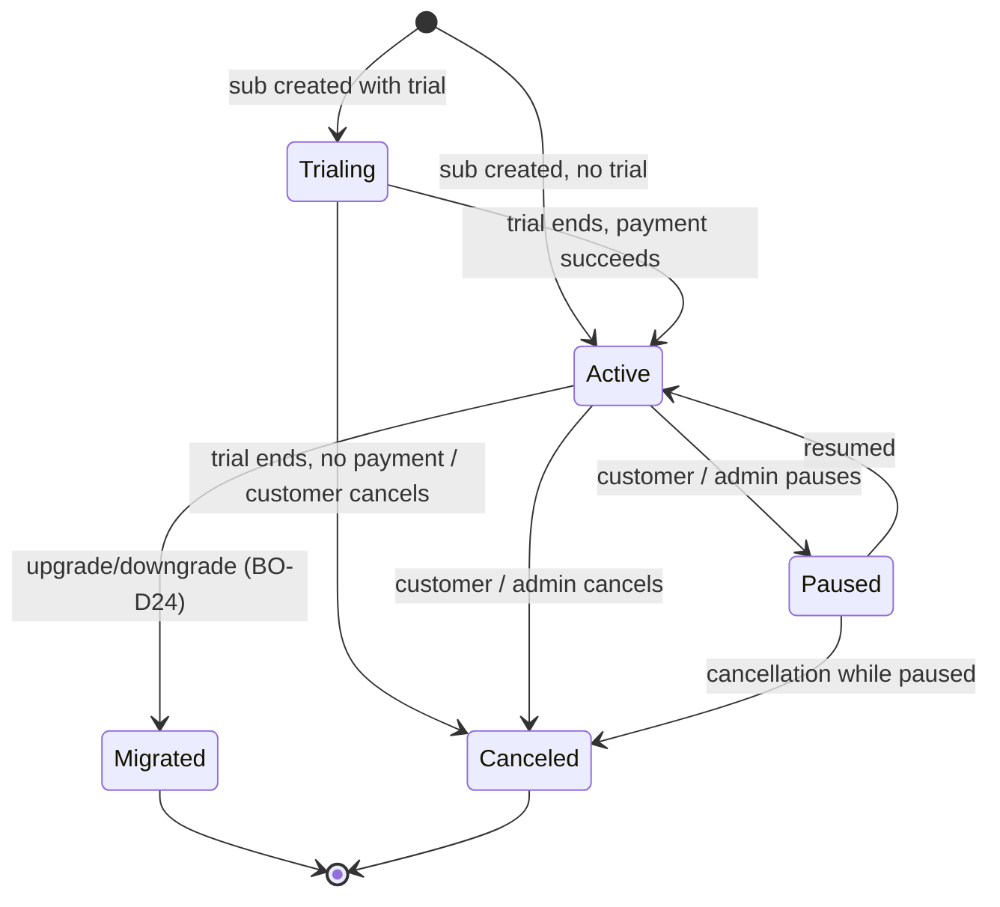

# BizAppsOrders Master Plan

> **Status**: Plan / pre-implementation
> **Target repo**: `MemberJunction/bizapps-orders` (new OSS repo, not yet scaffolded — will follow BizAppsAccounting pattern)
> **Depends on**: `plans/bizapps-accounting-master.md`, `plans/mj-core-changes.md`
> **Sibling plans**: `plans/bizapps-contracts-master.md`, `plans/aidp-master-plan.md`
> **Positioning**: **Unified order management — products, orders, payments, subscriptions, invoices, intercompany flows. Order is the substrate; payments and subscriptions are aspects.**

---

## 0. Table of contents

1. [Context and positioning](#1-context-and-positioning)
2. [Decisions (BO-D1 through BO-D26)](#2-decisions-bo-d1-through-bo-d26)
3. [Architecture and scope boundaries](#3-architecture-and-scope-boundaries)
4. [Entity model](#4-entity-model)
   - 4.1 Product, ProductCategory, ProductPrice, ProductTaxCategory
   - 4.2 Order + OrderLine (with multi-company)
   - 4.3 Invoice + CreditMemo
   - 4.4 Subscription + SubscriptionPlan + SubscriptionEvent
   - 4.5 Payment + PaymentProvider + PaymentIntent + PaymentAllocation
   - 4.6 RevenueRecognitionSchedule + RevRecScheduleLine
   - 4.7 IntercompanyFlow
   - 4.8 SalesRule + SalesAuthority
5. [Multi-company order mechanics](#5-multi-company-order-mechanics)
6. [Reversal patterns at every layer](#6-reversal-patterns-at-every-layer)
7. [JE emission to BizAppsAccounting](#7-je-emission-to-bizappsaccounting)
8. [Subscription lifecycle](#8-subscription-lifecycle)
9. [Payment providers (pluggable)](#9-payment-providers-pluggable)
10. [Sales rules enforcement](#10-sales-rules-enforcement)
11. [Tax integration with BizAppsAccounting](#11-tax-integration-with-bizappsaccounting)
12. [Integration with BizAppsContracts (upstream) and aidp (downstream)](#12-integration-with-bizappscontracts-upstream-and-aidp-downstream)
13. [Migration of CDP data](#13-migration-of-cdp-data)
14. [Phasing and delivery](#14-phasing-and-delivery)
15. [Open questions](#15-open-questions)
16. [Out of scope](#16-out-of-scope)

---

## 1. Context and positioning

BizAppsOrders provides the **unified order management substrate** for the MJ ecosystem. It subsumes the previously-planned `BizAppsPayments` and `BizAppsSubscriptions` (per MJ PR #2214) into a single app, on the principle that orders, payments, and subscriptions are **aspects of the same business event** — a customer commits to pay, the system tracks both what they're getting and how they're paying.

### What we ARE

- **The substrate for customer-facing transactions**: products, orders, invoicing, payments, subscriptions, refunds, returns, credit memos.
- **Multi-company native**: a single order can span multiple subsidiaries; intercompany Due-From/Due-To JEs are generated automatically at order book time (M19 from master).
- **Payment-provider agnostic**: Stripe is the first provider; PayPal/Square/Authorize/Adyen/Manual all pluggable via `RegisterClass` pattern.
- **Subscription-aware**: full lifecycle (active/paused/cancel/migrate) with revenue recognition schedules native to the Subscription entity.
- **Reversal-disciplined**: every business event supports reversal at its own layer (Order returns, Payment refunds, Invoice credit memos, Subscription cancellations), each emitting reversal JEs through BizAppsAccounting (M10).

### What we are NOT

- **Not the ledger**: JE generation calls into `BizAppsAccounting.AccountingService`. We don't maintain GL balances ourselves.
- **Not the contract layer**: Contracts (with formal terms, escalators, renewal cycles) live in `BizAppsContracts` on top of Orders.
- **Not an e-commerce storefront**: we provide the transactional substrate; commerce UI/UX is downstream consumer territory.
- **Not the tax engine**: tax calculation logic lives in BizAppsAccounting's pluggable `TaxCalculationProvider`. We invoke it at order line time and store the result.
- **Not a CRM**: customer master (Person/Organization) lives in BizAppsCommon.

### Why one unified app instead of two (Payments + Subscriptions)

PR #2214 originally separated Payments and Subscriptions. We're combining them because:

- A subscription IS a recurring order; the entities overlap heavily (both reference Product, Customer, payment provider, revrec schedule).
- Payment provider primitives (subscription endpoint, recurring billing API) live with Payment; making subscriptions a separate package would require Subscriptions to depend on Payments anyway.
- B2C orgs adopting Orders without contracts get sub-handling out of the box.
- The MJ adopter benefits from one package install vs. two — same scope, less coordination.

This is a refinement, not a contradiction, of PR #2214's design intent.

---

## 2. Decisions (BO-D1 through BO-D26)

References to `M*` are master-plan decisions (`plans/aidp-master-plan.md`). References to `BA-D*` are BizAppsAccounting decisions (`plans/bizapps-accounting-master.md`).

| # | Decision | Rationale |
|---|----------|-----------|
| **BO-D1** | **Unified app**: orders + payments + subscriptions + invoices in one repo. Subsumes MJ PR #2214 Payments + Subscriptions plans. | Tight entity overlap; single dependency install; same MJ adopter regardless of whether they care about subs or one-time orders or both. |
| **BO-D2** | **PostgreSQL native day 1** via `@memberjunction/sql-converter`; T-SQL is source of truth, PG migrations auto-converted. CI enforces parity. | Same approach as BizAppsAccounting (M26). |
| **BO-D3** | **UUID primary keys throughout.** No INT IDENTITY. | M5. |
| **BO-D4** | **Order is the top-level entity**; OrderLine is line-level granularity. Subscriptions are born from OrderLines; Payments allocate to Invoices; Invoices generate from Orders. | The order is the customer's commitment; everything else is mechanical fallout. |
| **BO-D5** | **Multi-company orders via `OrderLine.CompanyID`**: each line owns its revenue/recognition Company. Order has no single CompanyID. The "receiving company" (where cash hits) is on Payment. | M19. Models the "unified company with products" pattern from the 2026-05-26 meeting. Allows a customer to buy a Sidecar product + a Cimatri product + a BCHQ product in one transaction. |
| **BO-D6** | **IntercompanyFlow generation at order-book time.** When an OrderLine's CompanyID differs from the order's primary receiving Company, BizAppsOrders auto-generates `IntercompanyFlow` records and emits the Due-From / Due-To JEs into BizAppsAccounting. | M19 / BA-D17. Eliminates Power BI consolidation hack from CDP. Replaces missing BC intercompany functionality. |
| **BO-D7** | **JE emission via `AccountingService.postJournalEntry()`** (the API in BizAppsAccounting). BizAppsOrders is the orchestrator; Accounting is the primitive. | BA-D4 / BA-D17. Clean separation of concerns. |
| **BO-D8** | **Order status lifecycle: `Draft → Quoted → Confirmed → Posted → Fulfilled` (or `Voided`)**. `Posted` is the business-event commit; from then on, changes are via amendment/reversal Orders. | M9 / M10. Pencil → pen at Order level. |
| **BO-D9** | **Reversals at every layer**: Order (return/cancel/amendment) → Payment (refund/chargeback/bank-return) → Invoice (CreditMemo) → Subscription (cancellation with proration refund). Each emits its own reversal JEs through Accounting. | M10. Standard subledger pattern. |
| **BO-D10** | **OrderLine.Quantity supports negative values** for reversal slices. A partial return is a new Order with `Qty=-1, ReversesOrderLineID=line1`. | M10. Handles "return 1 of 2" naturally; partial reversals stack. |
| **BO-D11** | **Subscription is the primitive for ratable revenue recognition;** RevenueRecognitionSchedule lives on Subscription (and Order for deferred-service one-time orders). Contract-level overrides come from BizAppsContracts. | M20. A standalone Stripe sub without a contract still needs revrec ratably over the period. Contract is an envelope, not the owner. |
| **BO-D12** | **PaymentProvider abstraction via `RegisterClass`/`ClassFactory`**. Ship Stripe (primary), PayPal, Square, Authorize, Adyen, Manual. New providers added without schema change. | Per MJ PR #2214 + master M14. Cleaner than per-provider entity proliferation. |
| **BO-D13** | **Webhook receipt as MJ Actions.** Each provider has a `*WebhookReceiver` action; idempotency handled via `PaymentIntent.ProviderEventID` uniqueness. | MJ Integration framework pattern. Cryptographic signature verification at the receiver. |
| **BO-D14** | **Payment Method enum includes reversal types**: `CreditCard`, `ACH`, `Wire`, `Check`, `Cash`, `InternalTransfer`, `Refund`, `Chargeback`, `BankReturn`. Reversal-method Payments have negative `Amount` and `ReversesPaymentID` set. | Lets us model the full payment graph (forward + reverse) in one entity with one query path. |
| **BO-D15** | **Invoice has `InvoiceType` (`Standard` / `CreditMemo`).** CreditMemo invoices have `ReversesInvoiceID` set. Can apply to future invoice OR trigger refund Payment OR write-off. | Standard AR pattern. Refines what was previously a separate "CreditMemo" entity sketched in the earlier reversal-pattern discussion. |
| **BO-D16** | **PaymentAllocation as a junction** between Payment and Invoice. One Payment can clear multiple Invoices; one Invoice can be partially cleared by multiple Payments. | Standard pattern; supports complex AR workflows (lump sum payment with itemized application). |
| **BO-D17** | **Sales rules enforced at Order Confirm** via `SalesRule` + `SalesAuthority` metadata: discount limits, payment terms, product authorization, customer credit limits. Off-path → routes to `ApprovalRequest`. Golden path → instant Confirm. | M21. Johanna's existing BC rules become first-class system constraints. |
| **BO-D18** | **Sales rule definitions are metadata-driven**, not code. `SalesRule.RuleType` enum + JSON expression for predicate; admin-editable. | New rules without code change. Customer-facing UI for the rule editor in MJ Explorer. |
| **BO-D19** | **Product.RevenueRecognitionType + default GL accounts** drive JE pattern selection at order-book time. Values: `Immediate` (Sales account), `Ratable` (Deferred Revenue then ratable recognition), `Milestone` (Deferred Revenue then milestone-triggered), `Custom` (caller specifies schedule). | M11 / BA-D24. Metadata-driven JE generation. |
| **BO-D20** | **Tax calculation at OrderLine time via BizAppsAccounting's `TaxCalculationProvider`**. We pass shipping address + product tax category + customer tax profile; we get back per-jurisdiction tax breakdowns; we store on OrderLine. | BA-D19. Engine pluggable; we're a consumer. |
| **BO-D21** | **Contract reference is optional** on Order (`Order.ContractID NULL`). Most orders won't have contracts (e.g., one-time e-commerce purchases). Contracts entity in BizAppsContracts is the envelope when one applies. | M20. Decouples Orders from formal contract requirements. |
| **BO-D22** | **CurrencyExchangeRate consumed from BizAppsCommon** at order/payment time. Rate captured per-transaction; stored on `OrderLine.ExchangeRateUsed` and `Payment.ExchangeRateUsed`. | BA-D11. Single source of truth for rates; per-transaction snapshot for reproducibility. |
| **BO-D23** | **Stripe is the day-1 payment provider**; PayPal/Square/Adyen as MJ-ecosystem contributions in v1.5 / v2. Manual provider always available. | Stripe is most common; gets the highest investment. Others added based on demand. |
| **BO-D24** | **Subscription downgrade is modeled as cancel-existing + new-sub** (with appropriate proration refund + new Subscription record). Not a single "downgrade" event. | Cleaner audit trail (each sub has clean lifecycle). Matches how Stripe models it. |
| **BO-D25** | **Order amendments use a separate Order record** with `OrderType = 'Amendment'` and `ReversesOrderID` (partial slice via OrderLine.ReversesOrderLineID). Not in-place mutation of the original. | M10. Audit trail by construction. |
| **BO-D26** | **PaymentIntent is provider-side state**; Payment is internal state. Webhooks update PaymentIntent; PaymentIntent transitions update Payment.Status. | Maps to Stripe's PaymentIntent concept. Decouples our state from provider state. |

---

## 3. Architecture and scope boundaries

### Dependency stack (zoom-in on Orders)

```
BizAppsCommon                    (Person, Organization, Address, ContactMethod,
                                  Currency, CurrencyExchangeRate)
   ↑
BizAppsAccounting                (GLAccount, JournalEntry primitives, AccountingPeriod,
                                  Dimension, Tax* entities, AccountingService API)
   ↑
BizAppsOrders   ◄── this plan    (Product, Order, OrderLine, Invoice, Subscription,
                                  Payment, PaymentProvider, PaymentIntent,
                                  PaymentAllocation, RevRecSchedule, IntercompanyFlow,
                                  SalesRule, SalesAuthority)
   ↑
BizAppsContracts                 (Contract envelope — consumes Orders)
   ↑
aidp                             (Analytics consumer)
```

### What Orders provides to upstream apps

- **Order API**: create/quote/confirm/post/void Orders, with multi-line, multi-company, multi-currency support
- **Subscription API**: create/pause/cancel/migrate, lifecycle event emission
- **Payment API**: capture/refund/chargeback handling, allocation to Invoices
- **Webhook receivers**: Stripe (and other providers) → idempotent state updates
- **JE emission**: every business event that requires accounting (Order Post, Payment Capture, Sub revrec rollover, Refund, etc.) emits balanced JEs into Accounting via `AccountingService.postJournalEntry()`

### What Orders does NOT do

- Maintain GL balances (Accounting's job)
- Calculate tax (delegates to Accounting's `TaxCalculationProvider`)
- Manage contract terms / escalators / renewals (Contracts' job)
- Generate financial statements (ERP's job)
- Handle payroll / vendor bills / expenses (future BizApps* siblings)
- Customer master (BizAppsCommon's job)

---

## 4. Entity model

Schema: `__mj_BizAppsOrders`. All entities use `UUID PK`.

### 4.1 Product, ProductCategory, ProductPrice, ProductTaxCategory

```sql
__mj_BizAppsOrders.ProductCategory
  ID UUID PK,
  Name NVARCHAR(200) NOT NULL,
  ParentProductCategoryID UUID FK → ProductCategory NULL,   -- hierarchical
  Code NVARCHAR(40),
  Description NVARCHAR(MAX),
  IsActive BIT NOT NULL DEFAULT 1

__mj_BizAppsOrders.Product
  ID UUID PK,
  OwningCompanyID UUID FK → __mj.Company NOT NULL,    -- which subsidiary "owns" this product (revenue accrues)
  ProductCategoryID UUID FK NOT NULL,
  ProductTaxCategoryID UUID FK NULL,
  SKU NVARCHAR(80) UNIQUE,
  Name NVARCHAR(400) NOT NULL,
  Description NVARCHAR(MAX),
  -- Revenue recognition
  RevenueRecognitionType NVARCHAR(20) NOT NULL,       -- 'Immediate' | 'Ratable' | 'Milestone' | 'Custom'
  RevenueGLAccountID UUID FK → Accounting.GLAccount,
  DeferredRevenueGLAccountID UUID FK → Accounting.GLAccount NULL,
  COGSGLAccountID UUID FK → Accounting.GLAccount NULL, -- for products with COGS (rare for SaaS)
  -- Subscription support
  IsSubscription BIT NOT NULL DEFAULT 0,
  DefaultBillingCycle NVARCHAR(20),                    -- 'Monthly' | 'Quarterly' | 'Annual' | 'Custom'
  DefaultSubscriptionTermMonths INT NULL,
  -- Tax
  IsTaxable BIT NOT NULL DEFAULT 1,
  -- Pricing handled in ProductPrice
  IsActive BIT NOT NULL DEFAULT 1

__mj_BizAppsOrders.ProductPrice
  ID UUID PK,
  ProductID UUID FK,
  CurrencyCode CHAR(3) FK → BizAppsCommon.Currency,
  Amount DECIMAL(18,4) NOT NULL,                       -- 4 decimal places for per-unit pricing
  UnitOfMeasure NVARCHAR(40),                          -- 'each', 'month', 'hour', 'GB', etc.
  EffectiveFrom DATE NOT NULL,
  EffectiveTo DATE NULL,
  PriceListID UUID FK NULL,                            -- optional price list grouping
  INDEX (ProductID, CurrencyCode, EffectiveFrom DESC)

__mj_BizAppsOrders.ProductTaxCategory
  ID UUID PK,
  Code NVARCHAR(40) UNIQUE,                            -- 'Standard', 'Reduced', 'Exempt', 'Digital'
  Name NVARCHAR(200),
  Description NVARCHAR(MAX),
  -- maps to TaxRate.TaxCategory in Accounting
```

### 4.2 Order + OrderLine (with multi-company)

```sql
__mj_BizAppsOrders.Order
  ID UUID PK,
  OrderNumber NVARCHAR(40) UNIQUE NOT NULL,            -- 'ORD-{seq}' or custom format
  OrderType NVARCHAR(20) NOT NULL DEFAULT 'Sale',      -- 'Sale' | 'Return' | 'Cancellation' | 'Amendment' | 'CreditMemoOrder'
  CustomerOrganizationID UUID FK → BizAppsCommon.Organization NOT NULL,
  CustomerPersonID UUID FK → BizAppsCommon.Person NULL,    -- the buyer/contact
  SalesRepUserID UUID FK → __mj.User NULL,
  BillToAddressID UUID FK → BizAppsCommon.Address NULL,
  ShipToAddressID UUID FK → BizAppsCommon.Address NULL,
  Status NVARCHAR(20) NOT NULL,                         -- 'Draft' | 'Quoted' | 'Confirmed' | 'Posted' | 'Fulfilled' | 'Voided'
  PaymentTermsTypeID UUID FK NULL,
  OrderDate DATE NOT NULL,
  RequestedDeliveryDate DATE NULL,
  Description NVARCHAR(MAX),
  Notes NVARCHAR(MAX),
  -- Reversal references (per BO-D9, BO-D10)
  ReversesOrderID UUID FK → Order NULL,
  ReversalReason NVARCHAR(MAX) NULL,
  -- Pencil → pen lifecycle
  PostedAt DATETIMEOFFSET NULL,
  PostedByUserID UUID FK → __mj.User NULL,
  -- Optional contract envelope (per BO-D21)
  ContractID UUID NULL,                                 -- references Contracts.Contract, soft FK across apps
  -- Approval gating (sales rules)
  ApprovalRequestID UUID FK → __mj.ApprovalRequest NULL,
  -- Note: Order has NO single CompanyID — multi-company support is via OrderLine.CompanyID

__mj_BizAppsOrders.OrderLine
  ID UUID PK,
  OrderID UUID FK NOT NULL,
  LineNumber INT NOT NULL,
  ProductID UUID FK NOT NULL,
  CompanyID UUID FK → __mj.Company NOT NULL,            -- which sub OWNS this line (revenue accrues here)
  Quantity DECIMAL(18,4) NOT NULL,                      -- supports negative for reversal slices (BO-D10)
  UnitPrice DECIMAL(18,4) NOT NULL,
  DiscountPct DECIMAL(7,4) NOT NULL DEFAULT 0,
  CurrencyCode CHAR(3) FK NOT NULL,
  -- Computed (validated on save)
  LineTotalNet DECIMAL(18,2) NOT NULL,                  -- = Quantity × UnitPrice × (1 - DiscountPct)
  LineTax DECIMAL(18,2) NOT NULL DEFAULT 0,             -- populated by tax engine
  LineTotalGross DECIMAL(18,2) NOT NULL,                -- = LineTotalNet + LineTax
  -- FX (when CurrencyCode != owning Company's functional currency)
  OriginalCurrencyCode CHAR(3) NULL,
  ExchangeRateUsed DECIMAL(18,8) NULL,
  FunctionalCurrencyAmount DECIMAL(18,2),
  -- Subscription / ratable
  RevenueRecognitionScheduleID UUID FK NULL,
  SubscriptionID UUID FK → Subscription NULL,           -- if this line births a subscription
  -- Reversal (per BO-D10)
  ReversesOrderLineID UUID FK → OrderLine NULL,
  UNIQUE (OrderID, LineNumber)

__mj_BizAppsOrders.OrderLineTaxLine                     -- per-jurisdiction tax breakdown from engine
  ID UUID PK,
  OrderLineID UUID FK NOT NULL,
  TaxJurisdictionID UUID FK → Accounting.TaxJurisdiction NOT NULL,
  TaxRateID UUID FK → Accounting.TaxRate NOT NULL,
  TaxableAmount DECIMAL(18,2) NOT NULL,
  TaxAmount DECIMAL(18,2) NOT NULL
```

### 4.3 Invoice + CreditMemo

```sql
__mj_BizAppsOrders.Invoice
  ID UUID PK,
  InvoiceNumber NVARCHAR(40) UNIQUE NOT NULL,
  InvoiceType NVARCHAR(20) NOT NULL DEFAULT 'Standard', -- 'Standard' | 'CreditMemo'
  OrderID UUID FK → Order NOT NULL,                     -- the originating Order
  IssuingCompanyID UUID FK → __mj.Company NOT NULL,     -- which Company's books this invoices from
  CustomerOrganizationID UUID FK → BizAppsCommon.Organization NOT NULL,
  IssuedDate DATE NOT NULL,
  DueDate DATE NOT NULL,
  PaymentTermsTypeID UUID FK,
  Status NVARCHAR(20) NOT NULL,                          -- 'Open' | 'PartiallyPaid' | 'Paid' | 'Overdue' | 'WrittenOff' | 'Voided'
  TotalGross DECIMAL(18,2) NOT NULL,
  TotalTax DECIMAL(18,2) NOT NULL,
  TotalPaid DECIMAL(18,2) NOT NULL DEFAULT 0,
  TotalOpen DECIMAL(18,2) NOT NULL,                      -- = TotalGross - TotalPaid
  CurrencyCode CHAR(3) FK NOT NULL,
  -- For CreditMemo
  ReversesInvoiceID UUID FK → Invoice NULL,
  ReversalReason NVARCHAR(MAX) NULL,
  -- JE linkage
  PostedJournalEntryID UUID FK → Accounting.JournalEntry NULL
```

### 4.4 Subscription + SubscriptionPlan + SubscriptionEvent

```sql
__mj_BizAppsOrders.SubscriptionPlan
  ID UUID PK,
  ProductID UUID FK → Product NOT NULL,                 -- the underlying product
  Name NVARCHAR(200),
  BillingCycle NVARCHAR(20) NOT NULL,                   -- 'Monthly' | 'Quarterly' | 'Annual' | 'Custom'
  CustomCycleDays INT NULL,                             -- if BillingCycle = 'Custom'
  PricePerCycle DECIMAL(18,4),
  TrialDays INT NOT NULL DEFAULT 0,
  IsActive BIT NOT NULL DEFAULT 1

__mj_BizAppsOrders.Subscription
  ID UUID PK,
  SubscriptionNumber NVARCHAR(40) UNIQUE,
  OrderLineID UUID FK → OrderLine NOT NULL,             -- the order line that birthed this sub
  SubscriptionPlanID UUID FK → SubscriptionPlan NOT NULL,
  CustomerOrganizationID UUID FK → BizAppsCommon.Organization NOT NULL,
  OwningCompanyID UUID FK → __mj.Company NOT NULL,      -- which sub the revenue belongs to
  Status NVARCHAR(20) NOT NULL,                         -- 'Active' | 'Paused' | 'Canceled' | 'Migrated' | 'Trialing'
  StartDate DATE NOT NULL,
  CurrentPeriodStart DATE NOT NULL,
  CurrentPeriodEnd DATE NOT NULL,
  TrialEndDate DATE NULL,
  CanceledAt DATETIMEOFFSET NULL,
  EndDate DATE NULL,                                     -- if terminated
  -- Provider linkage (for Stripe-driven subs)
  PaymentProviderID UUID FK → PaymentProvider NULL,
  ProviderSubscriptionID NVARCHAR(100) NULL,
  -- RevRec
  RevenueRecognitionScheduleID UUID FK → RevenueRecognitionSchedule NOT NULL,
  -- Migration trail (downgrade/upgrade per BO-D24)
  MigratesFromSubscriptionID UUID FK → Subscription NULL,
  MigratesToSubscriptionID UUID FK → Subscription NULL

__mj_BizAppsOrders.SubscriptionEvent                    -- immutable log
  ID UUID PK,
  SubscriptionID UUID FK NOT NULL,
  EventType NVARCHAR(40) NOT NULL,                      -- 'Created' | 'Activated' | 'TrialStarted' | 'TrialEnded'
                                                         -- | 'PaymentSucceeded' | 'PaymentFailed' | 'Paused' | 'Resumed'
                                                         -- | 'Cancellation Requested' | 'Canceled' | 'Migrated'
  OccurredAt DATETIMEOFFSET NOT NULL,
  EventData JSONB,                                       -- provider payload + our derived state
  ProviderEventID NVARCHAR(100) NULL,                    -- for idempotency
  RelatedPaymentID UUID FK → Payment NULL,
  RelatedJournalEntryID UUID FK → Accounting.JournalEntry NULL,
  UNIQUE (ProviderEventID) WHERE ProviderEventID IS NOT NULL  -- prevent duplicate webhook processing
```

### 4.5 Payment + PaymentProvider + PaymentIntent + PaymentAllocation

```sql
__mj_BizAppsOrders.PaymentProvider
  ID UUID PK,
  ProviderType NVARCHAR(40) NOT NULL,                   -- 'Stripe' | 'PayPal' | 'Square' | 'Authorize' | 'Adyen' | 'Manual'
  CompanyID UUID FK → __mj.Company NOT NULL,             -- which sub uses this provider account
  Name NVARCHAR(200),
  CredentialsRef NVARCHAR(200),                          -- reference into MJ Credentials engine
  IsLiveMode BIT NOT NULL DEFAULT 0,
  IsActive BIT NOT NULL DEFAULT 1

__mj_BizAppsOrders.PaymentIntent
  ID UUID PK,
  PaymentProviderID UUID FK NOT NULL,
  ProviderIntentID NVARCHAR(100) NOT NULL UNIQUE,        -- provider-side ID (e.g., Stripe pi_xxx)
  Status NVARCHAR(30) NOT NULL,                          -- provider-state-mapped: 'RequiresPayment' | 'Processing' | 'Succeeded' | 'Canceled' | 'Failed'
  Amount DECIMAL(18,2) NOT NULL,
  CurrencyCode CHAR(3) FK NOT NULL,
  OrderID UUID FK → Order NULL,                          -- what triggered this intent
  CustomerOrganizationID UUID FK NOT NULL,
  CreatedAt DATETIMEOFFSET NOT NULL,
  LastEventAt DATETIMEOFFSET

__mj_BizAppsOrders.Payment
  ID UUID PK,
  PaymentNumber NVARCHAR(40) UNIQUE,
  ReceivingCompanyID UUID FK → __mj.Company NOT NULL,     -- where cash hits (often BCHQ)
  PaymentDate DATE NOT NULL,
  Method NVARCHAR(20) NOT NULL,                           -- 'CreditCard' | 'ACH' | 'Wire' | 'Check' | 'Cash' | 'InternalTransfer'
                                                           -- | 'Refund' | 'Chargeback' | 'BankReturn'
  Amount DECIMAL(18,2) NOT NULL,                          -- negative for refund/chargeback/return
  CurrencyCode CHAR(3) FK NOT NULL,
  ExchangeRateUsed DECIMAL(18,8) NULL,                    -- when foreign currency
  FunctionalCurrencyAmount DECIMAL(18,2),
  -- Provider linkage
  PaymentProviderID UUID FK NULL,
  PaymentIntentID UUID FK → PaymentIntent NULL,
  ProviderChargeID NVARCHAR(100) NULL,                    -- provider-side charge ID
  -- Reversal (per BO-D9, BO-D14)
  ReversesPaymentID UUID FK → Payment NULL,
  ProviderRefundID NVARCHAR(100) NULL,
  ReversalReason NVARCHAR(MAX) NULL,
  -- Status
  Status NVARCHAR(20) NOT NULL,                           -- 'Pending' | 'Captured' | 'Failed' | 'Refunded' | 'Disputed'
  -- JE linkage
  PostedJournalEntryID UUID FK → Accounting.JournalEntry NULL,
  Description NVARCHAR(MAX),
  Notes NVARCHAR(MAX)

__mj_BizAppsOrders.PaymentAllocation                      -- per BO-D16
  ID UUID PK,
  PaymentID UUID FK NOT NULL,
  InvoiceID UUID FK → Invoice NOT NULL,
  Amount DECIMAL(18,2) NOT NULL,                          -- how much of this Payment clears this Invoice
  AllocatedAt DATETIMEOFFSET NOT NULL,
  AllocatedByUserID UUID FK NULL                          -- NULL = auto-allocated
```

### 4.6 RevenueRecognitionSchedule + RevRecScheduleLine

```sql
__mj_BizAppsOrders.RevenueRecognitionSchedule
  ID UUID PK,
  SchedulingMethod NVARCHAR(20) NOT NULL,                -- 'StraightLine' | 'Milestone' | 'PctOfCompletion' | 'Custom'
  StartDate DATE NOT NULL,
  EndDate DATE NOT NULL,
  TotalAmount DECIMAL(18,2) NOT NULL,
  TotalRecognized DECIMAL(18,2) NOT NULL DEFAULT 0,
  CurrencyCode CHAR(3) FK NOT NULL,
  -- Detail in RevRecScheduleLine
  IsComplete BIT NOT NULL DEFAULT 0

__mj_BizAppsOrders.RevRecScheduleLine
  ID UUID PK,
  ScheduleID UUID FK NOT NULL,
  PeriodStart DATE NOT NULL,
  PeriodEnd DATE NOT NULL,
  Amount DECIMAL(18,2) NOT NULL,
  RecognizedAt DATETIMEOFFSET NULL,                       -- when JE emitted
  RecognizedJournalEntryID UUID FK → Accounting.JournalEntry NULL,
  IsRecognized BIT NOT NULL DEFAULT 0
```

### 4.7 IntercompanyFlow

```sql
__mj_BizAppsOrders.IntercompanyFlow
  ID UUID PK,
  OrderID UUID FK → Order NULL,                           -- if originated from an order
  SubscriptionID UUID FK → Subscription NULL,             -- if recurring (per period)
  FromCompanyID UUID FK → __mj.Company NOT NULL,           -- sub originating the flow
  ToCompanyID UUID FK → __mj.Company NULL,                 -- destination if internal
  ToExternalPartyID UUID FK NULL,                          -- for waterfall external parties (Contracts use case)
  FlowType NVARCHAR(30) NOT NULL,                          -- 'IntercompanyAR' | 'Distribution' | 'MgmtFee' | 'RevShare'
  Amount DECIMAL(18,2) NOT NULL,
  CurrencyCode CHAR(3) FK NOT NULL,
  PeriodStart DATE,
  -- JE linkages — both legs of the intercompany pair
  FromJournalEntryID UUID FK → Accounting.JournalEntry,    -- Due-From JE in From company
  ToJournalEntryID UUID FK → Accounting.JournalEntry,      -- Due-To JE in To company (NULL for external)
  Description NVARCHAR(MAX)
```

### 4.8 SalesRule + SalesAuthority

```sql
__mj_BizAppsOrders.SalesRule
  ID UUID PK,
  Name NVARCHAR(200),
  RuleType NVARCHAR(40) NOT NULL,                          -- 'DiscountLimit' | 'PaymentTermsRequired' | 'ProductAuthorization' | 'CreditLimit' | 'Custom'
  Scope NVARCHAR(40),                                       -- 'Global' | 'PerProduct' | 'PerCustomer' | 'PerSalesRep'
  ScopeReferenceID UUID NULL,                               -- specific Product/Customer/Rep if scoped
  PredicateJson JSONB,                                      -- rule expression
  ApprovalRequiredRoleID UUID FK → __mj.Role NULL,          -- if violated, who must approve
  IsActive BIT NOT NULL DEFAULT 1

__mj_BizAppsOrders.SalesAuthority                          -- per-rep limits (e.g., max discount Johanna allows)
  ID UUID PK,
  SalesRepUserID UUID FK → __mj.User NOT NULL,
  MaxDiscountPct DECIMAL(7,4),
  MaxOrderValue DECIMAL(18,2),
  AllowedPaymentTermsTypeIDs JSONB,                         -- array of FKs
  AllowedProductCategoryIDs JSONB,
  IsActive BIT NOT NULL DEFAULT 1
```

---

## 5. Multi-company order mechanics

Per BO-D5/D6 and M19 of master plan. The canonical scenario: a customer purchases items from three different BC subsidiaries on one order.

### Example

Customer "Acme Corp" places an order:
- Line 1: Sidecar Pro subscription, $99/mo (CompanyID = Sidecar)
- Line 2: Cimatri analytics, $5,000 one-time (CompanyID = Cimatri)
- Line 3: BCHQ consulting, $10,000 one-time (CompanyID = BCHQ)

Total: $15,099 + tax. Payment goes to BCHQ (the receiving company).

### At Order Post time, BizAppsOrders generates:

**Per-line revenue/AR JEs (calling AccountingService.postJournalEntry)**:

```
JE A (in Sidecar, EntryType='OrderBooking'):
  Dr Intercompany AR (BCHQ)    $99 + tax
  Cr Deferred Revenue          $99 (it's a subscription)
  Cr Sales Tax Payable         tax portion

JE B (in Cimatri, EntryType='OrderBooking'):
  Dr Intercompany AR (BCHQ)    $5,000 + tax
  Cr Sales Revenue             $5,000
  Cr Sales Tax Payable         tax portion

JE C (in BCHQ, EntryType='OrderBooking'):
  Dr Accounts Receivable (Acme)  $15,099 + tax
  Cr Sales Revenue               $10,000 (BCHQ's own portion)
  Cr Intercompany AP (Sidecar)   $99 + tax
  Cr Intercompany AP (Cimatri)   $5,000 + tax
  Cr Sales Tax Payable           BCHQ's tax portion
```

(All amounts in functional currency per BA-D10. If Acme is AUD-billing, OriginalCurrency/Amount/ExchangeRate populated on each line.)

### IntercompanyFlow records

For each non-receiving line, BizAppsOrders emits an `IntercompanyFlow` record linking the From and To Companies. These feed:
- `aidp` analytics (intercompany visibility in consolidated views)
- Recon (verifying actual cash movement matches expected flows)

### On Payment Receipt

```
JE D (in BCHQ, EntryType='PaymentReceipt'):
  Dr Cash                         $15,099 + tax
  Cr Accounts Receivable (Acme)   $15,099 + tax
```

The intercompany balances between BCHQ and Sidecar/Cimatri remain on the books until cash is actually wired between subsidiaries (handled by Treasury, separate from order processing per M22).

### Sub-period revenue recognition (for the subscription line)

Monthly, BizAppsOrders triggers `RevRecScheduleLine` recognition. For the Sidecar Pro subscription:

```
JE E (in Sidecar, EntryType='RevenueRecognition'):
  Dr Deferred Revenue      $99
  Cr Subscription Revenue  $99
```

This continues each month for the duration of the subscription.

---

## 6. Reversal patterns at every layer

Per BO-D9. Every business event has a corresponding reversal pattern.

### Order reversal (return / cancellation / amendment)

A new Order with `OrderType = 'Return'` (or `'Cancellation'`, `'Amendment'`) and `ReversesOrderID` set. Lines have negative quantities for the slice being reversed. Posts a JE that backs out the appropriate slice via Accounting reversal mechanism.

**Example: customer returns 1 of 2 product A**:
- Original Order #100, Line 1: `Qty=2, Product A, $200`
- Return Order #100-R1, Line 1: `Qty=-1, Product A, $-100, ReversesOrderLineID=Line1Of100`
- On Post of #100-R1, JE auto-generated:
  - `Dr Sales Revenue $100, Dr Sales Tax Payable, Cr A/R $108` (or Cr Cash if refund-on-return)

### Payment reversal (refund / chargeback / bank-return)

A new Payment with `Method ∈ {'Refund', 'Chargeback', 'BankReturn'}` and `ReversesPaymentID` set. `Amount` is negative.

**Example: chargeback of a $108 payment**:
- Original Payment #500: `Amount=108, Method='CreditCard', Status='Captured'`
- Chargeback Payment #500-C1: `Amount=-108, Method='Chargeback', ReversesPaymentID=#500, Status='Captured'`
- On Capture, JE: `Dr A/R / Cr Cash` (re-establishing the receivable)

### Invoice reversal (CreditMemo)

A new Invoice with `InvoiceType='CreditMemo'` and `ReversesInvoiceID` set. Application options:
- **Apply to future invoice**: credit memo balance reduces the next outgoing invoice's amount due. Allocation via `PaymentAllocation` (treating the credit memo as a virtual "payment").
- **Refund**: emit a Refund Payment against the credit memo balance.
- **Write off**: post a write-off JE referencing the credit memo.

### Subscription reversal (cancellation with proration)

Subscription `Status='Active' → 'Canceled'` mid-period with proration:
- `SubscriptionEvent` records the Cancellation
- If proration refund applies, emit a Refund Payment (per Payment reversal pattern)
- The JE for the refund reverses the unearned portion of recognized revenue

Cancellation without refund (paid through end of period): status change only; revrec continues through original end date.

### What ties it all together

Every reversal at the business-entity level emits its own JE through Accounting. Each JE has `ReversesJournalEntryID` set on the reversal JE. The chain is:

```
Business event reversal (Order #100-R1) → emits → JE in Accounting (in Pending) → batched → Batched
Original business event (Order #100) → emitted → JE in Accounting (Batched earlier)
```

Both JEs persist forever. Net is zero. Audit story: walk from any reversal JE → reversal business entity → original business entity → original JE.

---

## 7. JE emission to BizAppsAccounting

BizAppsOrders calls `AccountingService.postJournalEntry(JournalEntryDraft)` for every business event that requires accounting.

### When JEs are emitted

| Business event | EntryType in Accounting | Pattern |
|---|---|---|
| Order Post | `'OrderBooking'` | Dr A/R / Cr Sales (or DefRev for subs) / Cr Tax Payable; plus intercompany legs if multi-company |
| Payment Capture | `'PaymentReceipt'` | Dr Cash / Cr A/R; plus realized FX line if rate mismatch |
| Subscription period rollover | `'RevenueRecognition'` | Dr DefRev / Cr Sales |
| Refund Payment Capture | `'Refund'` (reversal) | Reverses the original Payment Receipt slice |
| Return Order Post | `'OrderBooking'` (reversal) | Reverses the original OrderBooking slice |
| CreditMemo Invoice issue | `'OrderBooking'` (reversal) | Reverses the original Invoice's posted JE |
| Subscription cancellation (with refund) | `'Refund'` + reverses prior `'RevenueRecognition'` lines as appropriate | Multiple JEs to back out unearned revenue + emit refund Payment + refund JE |
| Commission accrual (on Order Post) | `'CommissionAccrual'` | Dr Commission Expense / Cr Commission Payable |
| Partner rev share accrual (on Order Post) | `'PartnerRevShare'` | Dr Partner Cost / Cr Partner Payable |
| Intercompany flow (multi-company order) | `'IntercompanyFlow'` | Dr IC A/R / Cr Sales (one leg); Dr Sales / Cr IC A/P (other leg) |

### How JE generation is selected

`Product.RevenueRecognitionType` + `Product.IsTaxable` + `Order.OrderType` + `OrderLine.ReversesOrderLineID` + customer's tax profile determine the JE pattern at order-book time. The JE generator reads these (all metadata) and assembles the balanced JE drafts.

For multi-company orders, the generator emits **multiple JEs** (one per Company involved) all referencing the same Order via `OriginOrderID`. Auditability preserved by the shared origin link.

---

## 8. Subscription lifecycle

### Status transitions



### Per-event JE emission

- `Created` → no JE (subscription is intent, not transaction)
- `TrialStarted` → no JE
- `TrialEnded` (with payment) → `OrderBooking` JE for first period
- `PaymentSucceeded` (each billing cycle) → `PaymentReceipt` JE
- `Period rolling forward` → `RevenueRecognition` JE for the period
- `PaymentFailed` → SubscriptionEvent only; retry per dunning policy
- `Paused` → SubscriptionEvent only; no revrec during pause
- `Canceled` → if proration applies, Refund Payment + reversal JEs

### Provider-driven vs. internal

For Stripe-driven subs, Stripe is the source of truth for lifecycle events. Our subscription mirrors Stripe state via webhooks. For Manual / non-provider subs, our system drives the events (cron job emits PaymentSucceeded equivalent based on PaymentTerms).

---

## 9. Payment providers (pluggable)

### Abstract interface

```typescript
export abstract class PaymentProvider {
  static readonly ProviderType: string;  // 'Stripe' | 'PayPal' | ...

  // Customer-facing operations
  abstract createPaymentIntent(request: CreatePaymentIntentRequest): Promise<PaymentIntent>;
  abstract capturePayment(paymentIntentId: string): Promise<Payment>;
  abstract refundPayment(paymentId: string, amount?: number): Promise<Payment>;
  abstract cancelPaymentIntent(paymentIntentId: string): Promise<void>;

  // Subscription operations
  abstract createSubscription(request: CreateSubscriptionRequest): Promise<Subscription>;
  abstract pauseSubscription(subscriptionId: string): Promise<void>;
  abstract resumeSubscription(subscriptionId: string): Promise<void>;
  abstract cancelSubscription(subscriptionId: string, prorate: boolean): Promise<Subscription>;
  abstract updateSubscription(subscriptionId: string, changes: SubscriptionUpdate): Promise<Subscription>;

  // Webhook receiver
  abstract verifyWebhookSignature(payload: string, signature: string): boolean;
  abstract handleWebhookEvent(event: WebhookEvent): Promise<void>;
}
```

### Shipped implementations

- **`StripePaymentProvider`** (v1): full implementation including PaymentIntents, Subscriptions, Refunds, webhooks. Per MJ PR #2214 design.
- **`ManualPaymentProvider`** (v1): supports Wire/ACH/Check/Cash payments manually recorded by finance.
- **`PayPalPaymentProvider`** (v1.5): basic operations.
- **`SquarePaymentProvider`** (v2): basic operations.
- **`AuthorizeNetPaymentProvider`** (v2): legacy support.
- **`AdyenPaymentProvider`** (v2): enterprise European/international.

### Webhook idempotency

Each webhook event has a `ProviderEventID`. We store it on `SubscriptionEvent.ProviderEventID` (and `PaymentIntent.ProviderEventID` for non-subscription events). Unique constraint prevents duplicate processing. Signature verification via provider's library.

---

## 10. Sales rules enforcement

Per BO-D17, BO-D18. Johanna's existing BC rules become first-class system constraints.

### Rule types (initial set)

| Type | Predicate |
|---|---|
| `DiscountLimit` | `OrderLine.DiscountPct <= SalesAuthority.MaxDiscountPct` |
| `PaymentTermsRequired` | `Order.PaymentTermsTypeID IN SalesAuthority.AllowedPaymentTermsTypeIDs` |
| `ProductAuthorization` | `OrderLine.Product.ProductCategoryID IN SalesAuthority.AllowedProductCategoryIDs` |
| `CreditLimit` | `Customer.TotalOpenAR + Order.TotalGross <= Customer.CreditLimit` |
| `MaxOrderValue` | `Order.TotalGross <= SalesAuthority.MaxOrderValue` |
| `Custom` | metadata-defined predicate via JSONB expression |

### Evaluation flow

1. At Order Confirm, all applicable `SalesRule` records evaluated against the Order
2. If all pass → Order proceeds to Posted on user action
3. If any violation → `ApprovalRequest` auto-created routed to the relevant approver role
4. Approval workflow per MJ's approval framework
5. On approval → Order proceeds to Posted; on rejection → Order returns to Draft with annotation

---

## 11. Tax integration with BizAppsAccounting

Per BO-D20 / BA-D19.

### At Order Confirm time

```
For each OrderLine:
  1. Determine TaxJurisdictions applicable to (Customer.ShipToAddress, Product.ProductTaxCategory, OrderDate)
  2. Call AccountingService.TaxCalculationProvider.calculateTax(...)
  3. Get back: per-jurisdiction TaxableAmount + TaxAmount + TaxRateID
  4. Store as OrderLineTaxLine records
  5. Update OrderLine.LineTax = SUM(OrderLineTaxLine.TaxAmount)
  6. Update OrderLine.LineTotalGross = LineTotalNet + LineTax
```

### Customer tax profile

`Accounting.CustomerTaxProfile` (in BizAppsAccounting) has resale certs, VAT registration, exempt status keyed to `BizAppsCommon.Organization`. We look this up at calc time and pass to the provider.

### Provider choice

Per BA-D19: deployments configure their TaxCalculationProvider. We're a consumer, not a provider implementer. Local fallback supports manual rate entry for simple cases.

---

## 12. Integration with BizAppsContracts (upstream) and aidp (downstream)

### Upstream from Contracts

When BizAppsContracts creates a Contract:
- It can pre-populate Order records (e.g., the annual renewal cycle's first order)
- It can override revrec on Subscription via `ContractRevRecOverride` (per BizAppsContracts plan)
- It references our Orders / Subscriptions via `ContractOrderLink` / `ContractSubscriptionLink`

We expose hooks:
- `Order.ContractID` soft FK
- `OrderEvent` raised on Post/Voided so Contracts can react

### Downstream to aidp

aidp consumes our data via cross-schema queries (no Integration framework, same DB):
- `RunView` against `OrderLine` for forecast-from-pipeline analysis
- `RunView` against `Subscription` for MRR/ARR calculations
- `RunView` against `IntercompanyFlow` for consolidation visibility
- Reads `Invoice` and `Payment` for AR aging

We don't push to aidp. They pull.

---

## 13. Migration of CDP data

CDP today has order/customer/payment data in:
- `crm.Account` → migrate to `BizAppsCommon.Organization` (handled by BizAppsCommon migration)
- `crm.Contact` → migrate to `BizAppsCommon.Person`
- `crm.Invoice` → migrate to `BizAppsOrders.Invoice` (with `OrderID` synthetically generated from invoice data if no Order exists)
- `crm.Payment` → migrate to `BizAppsOrders.Payment` + `PaymentAllocation`
- `sdr.Subscription`, `sdr.SubscriptionPlan`, `sdr.SubscriptionEvent` → migrate to `BizAppsOrders.Subscription` (plus generating synthetic Order/OrderLine records for the originating purchase)
- `finance.Product`, `finance.ProductCategory` → migrate to `BizAppsOrders.Product` / `ProductCategory`
- `finance.PaymentTermsType` → migrate to `BizAppsOrders.PaymentTermsType` (currently in crm in CDP; consolidated here)

Migration scripts under `migration/bizapps-orders/` in new aidp repo (when Stage 4 starts). Each existing CDP entity gets ID-mapping (INT → UUID), schema restructuring, validation. Per master plan §12.

---

## 14. Phasing and delivery

Modular delivery per M23. ~18 weeks of focused dev across 8 phases.

### Phase A: Product catalog + basic Order (Weeks 1–3)

- [ ] Product / ProductCategory / ProductPrice / ProductTaxCategory entities
- [ ] Seeded sample products for demo
- [ ] Order / OrderLine entities, single-company first
- [ ] Order Draft → Confirmed → Posted lifecycle (no JE yet)
- [ ] OrderLine validation (totals match, currency consistency)

**Demo**: create a product, set a price, create an order with multiple lines, confirm and post in MJ Explorer.

### Phase B: Multi-company + IntercompanyFlow + JE emission (Weeks 3–6)

- [ ] OrderLine.CompanyID multi-company support
- [ ] IntercompanyFlow generation at Post time
- [ ] AccountingService.postJournalEntry() integration
- [ ] Order JE generation per BO-D19 (Product.RevenueRecognitionType drives pattern)
- [ ] Invoice generation from Posted Order
- [ ] Reversal Order pattern (Return/Cancellation/Amendment)

**Demo**: post a multi-company order, see all JEs in BizAppsAccounting (revenue + IC due-from/due-to + tax accrual), generate Invoice, return part of the order, see reversal JEs.

### Phase C: Payment + PaymentProvider abstraction + Stripe (Weeks 6–10)

- [ ] PaymentProvider abstract class + Stripe implementation
- [ ] PaymentIntent entity + Stripe PaymentIntent lifecycle mapping
- [ ] Payment entity (capture + refund + chargeback methods)
- [ ] PaymentAllocation junction
- [ ] Payment Capture JE generation (Dr Cash / Cr AR + realized FX line)
- [ ] Stripe webhook receiver with signature verification + idempotency
- [ ] Refund Payment pattern (reverses prior Payment)

**Demo**: customer pays an invoice via Stripe Checkout; see PaymentIntent → Payment → PaymentAllocation → JE; refund part of the payment; see reversal JE.

### Phase D: Subscription + lifecycle (Weeks 10–13)

- [ ] SubscriptionPlan + Subscription + SubscriptionEvent entities
- [ ] Stripe Subscription integration (create / pause / resume / cancel / migrate)
- [ ] Webhook handling for subscription events
- [ ] RevenueRecognitionSchedule + RevRecScheduleLine
- [ ] Auto-emit RevenueRecognition JE on each period rollover (cron / scheduled action)
- [ ] Mid-period cancellation with proration refund pattern

**Demo**: create a $99/mo Stripe subscription; see monthly RevRec JEs auto-emit; cancel mid-month; see proration Refund + reversal JE.

### Phase E: ManualPaymentProvider + non-Stripe lifecycle (Weeks 13–15)

- [ ] ManualPaymentProvider implementation (for Wire/ACH/Check/Cash)
- [ ] Manual Payment entry UI in MJ Explorer
- [ ] Manual subscription billing cron (for orgs not using Stripe for subs)
- [ ] Dunning workflow for failed payments

**Demo**: enter a manual ACH payment; allocate to an Invoice; see JE; same for a manual subscription cycle.

### Phase F: Sales rules enforcement (Weeks 15–16)

- [ ] SalesRule + SalesAuthority entities
- [ ] Seeded rule types (DiscountLimit, PaymentTermsRequired, etc.)
- [ ] Evaluation engine at Order Confirm
- [ ] ApprovalRequest routing on violation
- [ ] Rule editor UI in MJ Explorer

**Demo**: salesperson confirms an order with discount > authority; see ApprovalRequest; approver approves; order proceeds to Post.

### Phase G: Tax integration + advanced multi-currency (Weeks 16–17)

- [ ] Call AccountingService.TaxCalculationProvider at OrderLine time
- [ ] OrderLineTaxLine records populated
- [ ] CustomerTaxProfile lookup
- [ ] Multi-currency Order with FX rate captured at Confirm time
- [ ] Realized FX gain/loss auto-emission on cross-currency Payment

**Demo**: AUD-billed customer order; see OrderLine.OriginalCurrency populated; see tax accrued by jurisdiction; later, payment in AUD at different rate; see realized FX line.

### Phase H: Provider expansion + webhooks + reconciliation (Weeks 17–18)

- [ ] PayPalPaymentProvider (basic ops)
- [ ] Webhook event log entity (for forensics + replay)
- [ ] Recon between Stripe charges and our Payment records
- [ ] Idempotency stress test (replay 1000 duplicate webhooks; verify zero double-processing)

**Demo**: PayPal flow end-to-end; replay attack defense; missing-payment detection.

---

## 15. Open questions

1. **Order numbering format**: `ORD-{seq}` global or `ORD-{CompanyCode}-{seq}` per-Company? Multi-company orders complicate the latter. **Lean**: global `ORD-{seq}` with the receiving Company embedded in metadata.
2. **Quote-to-Order workflow**: should `Quoted` status be its own entity (with expiration date, version history) or just a stage of Order? **Lean**: stage of Order for v1, can split later.
3. **Coupon / promo code support**: in v1 or punt? Many SaaS orgs need this. **Lean**: punt to v2; deployments can model as a negative-discount line via Custom rule.
4. **Recurring billing failures and dunning**: how aggressive is the retry policy? Provider-default (Stripe Smart Retries) or our own?
5. **Order line dimension tagging**: should OrderLine support BizAppsAccounting Dimensions directly (e.g., tag a line with `CostCenter=Marketing`) so JE generation can propagate them? **Lean**: yes; add `OrderLineDimension` junction.
6. **Currency at Order vs Line**: do all lines in an order share a CurrencyCode, or can each line have its own? **Lean**: same currency per Order; mixed-currency orders are a v2+ scope.
7. **Invoice numbering format**: similar question to order numbering. Likely `INV-{IssuingCompanyCode}-{seq}` since invoices are per-Company.
8. **Bulk invoice send**: emailing invoices to customers — is that an Orders responsibility or a separate `BizAppsBilling` app? **Lean**: thin built-in send-via-email functionality; extensibility via Action plugin.
9. **Customer portal**: customer-facing payment-page / subscription-management UI? Almost certainly a v2 / separate app. Out of v1.
10. **Cross-app FK enforcement**: `Order.ContractID` references `BizAppsContracts.Contract` — is that enforced or soft? **Lean**: soft (no DB FK across app schemas), with validator in BaseEntity.
11. **PaymentTermsType** location: currently in `crm` in CDP. Move to BizAppsOrders (we're the consumer). Confirm.
12. **What happens to a Pending JE if its source Order is voided before Batch?** Per BizAppsAccounting open question — flag-and-emit-zero vs hard-delete. **Lean**: flag-and-emit-zero (audit purity).

---

## 16. Out of scope

- General Ledger functionality (BizAppsAccounting's domain)
- Contract envelope (BizAppsContracts' domain)
- E-commerce storefront / customer portal (future app)
- CRM (deal management, lead nurturing) (HubSpot / future app)
- Inventory / fulfillment / shipping (future BizAppsInventory)
- Customer service / support tickets (future)
- Advanced subscription patterns: usage-based billing, metered consumption, tiered pricing (v2 maybe)
- Marketplace / multi-vendor (significant scope expansion; not in plan)
- Quote-to-cash workflow tooling (workflow engine could be separate app)
- Pricing optimization / dynamic pricing
- Returns logistics (RMA tracking, restocking) — out for v1
- Audit packages / SOC2 evidence collection (future BizAppsAudit)

---

*v1 ships a comprehensive order management substrate that handles BC's day-to-day customer transactions: multi-company orders with intercompany generation, Stripe + manual payments, subscriptions with revrec, returns/refunds/chargebacks at every layer, sales rules enforcement, multi-currency, tax integration. Each MJ adopter can install this and have working order management in days. BC layers Contracts on top in Stage 3; the AIDP analytics layer consumes from this substrate in Stage 4.*
