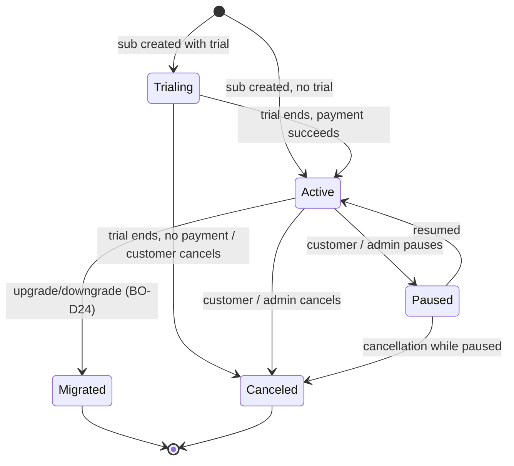

# BizAppsOrders Master Plan

> **Status**: Plan — v2 (revised 2026-06-22 to reconcile with the as-built BizAppsAccounting design)
> **Target repo**: `MemberJunction/bizapps-orders` (repo scaffolded; schema/build work begins once the BizAppsAccounting schema locks — imminent, expected this week or next)
> **Depends on**: `bizapps-accounting` (GLAccount, JournalEntry primitives + `AccountingService` façade, AccountingPeriod, Dimension, Tax\*, **Currency + CurrencySpotRate**), `bizapps-common` (Person, Organization, Address, ContactMethod), `bizapps-tasks` (workflow/approval substrate), `__mj` core (Company, User, Roles, Credentials, Scheduled Actions)
> **Sibling plans**: `plans/bizapps-accounting-master.md`, `plans/bizapps-contracts-master.md`, `plans/aidp-master-plan.md`
> **Positioning**: **Unified order management — products, orders, payments, subscriptions, invoices, intercompany flows. Order is the substrate; payments and subscriptions are aspects.**

> **⚠️ Revision v2 (2026-06-22)** — this plan was originally authored in the CDP repo against the *planned* BizAppsAccounting design. It has been reconciled with the *as-built* accounting app and verified MJ framework primitives. Material changes from v1:
> - **JE emission**: Orders generates balanced JEs from domain logic and persists them as accounting entity records via a thin `AccountingService` façade (a helper on the accounting engine over the BaseEntity subclasses — accounting issue [#9](https://github.com/MemberJunction/bizapps-accounting/issues/9)). JEs land `Pending`; **Accounting batches them** to the ERP. "Post" means *create a Pending JE*, not GL-post.
> - **Revenue recognition**: Orders computes the waterfall and generates one **`ScheduledJournalEntry`** (+ line items) per accounting period; **Accounting materializes** each into a Pending JE at period close (BA-D25). The v1 Orders-side rev-rec cron is removed.
> - **Currency/FX**: owned by **BizAppsAccounting** (`Currency` + `CurrencySpotRate`), not BizAppsCommon (BA-D11; common never shipped them).
> - **Workflow/approvals**: run on **BizAppsTasks** via an "Approval Request" Task Type, replacing the non-existent `__mj.ApprovalRequest` (tasks issue [#8](https://github.com/MemberJunction/bizapps-tasks/issues/8); accounting adopts the same substrate, issue [#10](https://github.com/MemberJunction/bizapps-accounting/issues/10)).
> - **Lineage**: JE → Order/Payment/Sub linkage is via soft-ref columns + the polymorphic `JournalEntryLink` — **never hard FKs into Orders** (accounting takes no dependency on us). FKs from Orders *into* accounting (e.g. `Invoice.PostedJournalEntryID`) are fine.
> - **Entity naming**: cross-app entities use the underscore prefix — `MJ_BizApps_Accounting: …`, `MJ_BizApps_Common: …`, `MJ_BizApps_Tasks: …` (the `Accounting.X` / `BizAppsCommon.X` shorthand below is conceptual).
>
> See [§17 Cross-repo coordination](#17-cross-repo-coordination) for the dependency tracking.

---

## 0. Table of contents

1. [Context and positioning](#1-context-and-positioning)
2. [Decisions (BO-D1 through BO-D47)](#2-decisions-bo-d1-through-bo-d47)
3. [Architecture and scope boundaries](#3-architecture-and-scope-boundaries)
4. [Entity model](#4-entity-model)
   - 4.1 Product Management — Product, ProductType, Bundles, Pricing, Entitlements
   - 4.2 Order + OrderLine (with multi-company)
   - 4.3 Invoice + CreditMemo
   - 4.4 Subscription + SubscriptionPlan + SubscriptionEvent
   - 4.5 Payment + PaymentProvider + PaymentIntent + PaymentLine (+ CustomerPaymentMethod, StoredValue)
   - 4.6 RevenueRecognitionSchedule + RevRecScheduleLine
   - 4.7 IntercompanyFlow
   - 4.8 SalesRule + SalesAuthority
5. [Multi-company order mechanics](#5-multi-company-order-mechanics)
6. [Reversal patterns at every layer](#6-reversal-patterns-at-every-layer)
7. [JE emission to BizAppsAccounting](#7-je-emission-to-bizappsaccounting)
8. [Subscription lifecycle](#8-subscription-lifecycle)
9. [Payment providers (pluggable)](#9-payment-providers-pluggable)
10. [Sales rules enforcement](#10-sales-rules-enforcement)
11. [Tax integration with BizAppsAccounting](#11-tax-integration-with-bizappsaccounting)
12. [Integration with BizAppsContracts (upstream) and aidp (downstream)](#12-integration-with-bizappscontracts-upstream-and-aidp-downstream)
13. [Migration of CDP data](#13-migration-of-cdp-data)
14. [Phasing and delivery](#14-phasing-and-delivery)
15. [Open questions](#15-open-questions)
16. [Out of scope](#16-out-of-scope)
17. [Cross-repo coordination](#17-cross-repo-coordination)
- [Appendix A — BizAppsContracts boundary](#appendix-a--bizappscontracts-boundary)
- [Appendix B — BizAppsInventory boundary](#appendix-b--bizappsinventory-boundary)

---

## 1. Context and positioning

BizAppsOrders provides the **unified order management substrate** for the MJ ecosystem. It subsumes the previously-planned `BizAppsPayments` and `BizAppsSubscriptions` (per MJ PR #2214) into a single app, on the principle that orders, payments, and subscriptions are **aspects of the same business event** — a customer commits to pay, the system tracks both what they're getting and how they're paying.

### What we ARE

- **The substrate for customer-facing transactions**: products, orders, invoicing, payments, subscriptions, refunds, returns, credit memos.
- **Multi-company native**: a single order can span multiple subsidiaries; intercompany Due-From/Due-To JEs are generated automatically at order book time (M19 from master).
- **Payment-provider agnostic**: Stripe is the first provider; PayPal/Square/Authorize/Adyen/Manual all pluggable via `RegisterClass` pattern.
- **Subscription-aware**: full lifecycle (active/paused/cancel/migrate) with revenue recognition schedules native to the Subscription entity.
- **Reversal-disciplined**: every business event supports reversal at its own layer (Order returns, Payment refunds, Invoice credit memos, Subscription cancellations), each emitting reversal JEs through BizAppsAccounting (M10).

### What we are NOT

- **Not the ledger**: JE generation calls into `BizAppsAccounting.AccountingService`. We don't maintain GL balances ourselves.
- **Not the contract layer**: Contracts (with formal terms, escalators, renewal cycles) live in `BizAppsContracts` on top of Orders.
- **Not an e-commerce storefront**: we provide the transactional substrate; commerce UI/UX is downstream consumer territory.
- **Not the tax engine**: tax calculation logic lives in BizAppsAccounting's pluggable `TaxCalculationProvider`. We invoke it at order line time and store the result.
- **Not a CRM**: customer master (Person/Organization) lives in BizAppsCommon.

### Why one unified app instead of two (Payments + Subscriptions)

PR #2214 originally separated Payments and Subscriptions. We're combining them because:

- A subscription IS a recurring order; the entities overlap heavily (both reference Product, Customer, payment provider, revrec schedule).
- Payment provider primitives (subscription endpoint, recurring billing API) live with Payment; making subscriptions a separate package would require Subscriptions to depend on Payments anyway.
- B2C orgs adopting Orders without contracts get sub-handling out of the box.
- The MJ adopter benefits from one package install vs. two — same scope, less coordination.

This is a refinement, not a contradiction, of PR #2214's design intent.

---

## 2. Decisions (BO-D1 through BO-D47)

References to `M*` are master-plan decisions (`plans/aidp-master-plan.md`). References to `BA-D*` are BizAppsAccounting decisions (`plans/bizapps-accounting-master.md`).

| # | Decision | Rationale |
|---|----------|-----------|
| **BO-D1** | **Unified app**: orders + payments + subscriptions + invoices in one repo. Subsumes MJ PR #2214 Payments + Subscriptions plans. | Tight entity overlap; single dependency install; same MJ adopter regardless of whether they care about subs or one-time orders or both. |
| **BO-D2** | **PostgreSQL native day 1** via `@memberjunction/sql-converter`; T-SQL is source of truth, PG migrations auto-converted. CI enforces parity. | Same approach as BizAppsAccounting (M26). |
| **BO-D3** | **UUID primary keys throughout.** No INT IDENTITY. | M5. |
| **BO-D4** | **Order is the top-level entity**; OrderLine is line-level granularity. Subscriptions are born from OrderLines; Payments allocate to Invoices; Invoices generate from Orders. | The order is the customer's commitment; everything else is mechanical fallout. |
| **BO-D5** | **Multi-company orders via `OrderLine.CompanyID`**: each line owns its revenue/recognition Company. Order has no single CompanyID. The "receiving company" (where cash hits) is on Payment. | M19. Models the "unified company with products" pattern from the 2026-05-26 meeting. Allows a customer to buy a Sidecar product + a Cimatri product + a BCHQ product in one transaction. |
| **BO-D6** | **IntercompanyFlow generation at order-book time.** When an OrderLine's CompanyID differs from the order's primary receiving Company, BizAppsOrders auto-generates `IntercompanyFlow` records and emits the Due-From / Due-To JEs into BizAppsAccounting. | M19 / BA-D17. Eliminates Power BI consolidation hack from CDP. Replaces missing BC intercompany functionality. |
| **BO-D7** | **JE emission by creating accounting entity records via a thin `AccountingService` façade** (a helper on the accounting engine that wraps the `JournalEntry` / `JournalEntryLine` BaseEntity subclasses — accounting issue [#9](https://github.com/MemberJunction/bizapps-accounting/issues/9)). Orders generates balanced JEs from domain logic; they land in `Pending`; **Accounting batches them** to the ERP. Orders orchestrates; Accounting is the primitive. | BA-D4 / BA-D17. "Post" = create a Pending JE, **not** GL-post (the batch run does GL). Falls back to direct entity CRUD if the façade isn't ready. |
| **BO-D8** | **Order status lifecycle: `Draft → Quoted → Confirmed → Posted → Fulfilled` (or `Voided`)**. `Posted` is the business-event commit; from then on, changes are via amendment/reversal Orders. | M9 / M10. Pencil → pen at Order level. |
| **BO-D9** | **Reversals at every layer**: Order (return/cancel/amendment) → Payment (refund/chargeback/bank-return) → Invoice (CreditMemo) → Subscription (cancellation with proration refund). Each emits its own reversal JEs through Accounting. | M10. Standard subledger pattern. |
| **BO-D10** | **OrderLine.Quantity supports negative values** for reversal slices. A partial return is a new Order with `Qty=-1, ReversesOrderLineID=line1`. | M10. Handles "return 1 of 2" naturally; partial reversals stack. |
| **BO-D11** | **Subscription is the primitive for ratable revenue recognition.** Orders computes the recognition waterfall (count, per-period amounts, front-loaded rounding remainder in entry 1, uneven-start / no-lapse-gap handling) and generates one **`ScheduledJournalEntry`** (+ line items, one Dr Deferred Revenue / Cr Revenue pair) **per accounting period** via `AccountingService.createScheduledJournalEntries(...)`. **Accounting materializes** each into a Pending JE at its target period close (BA-D25) and freezes it. Orders keeps a lightweight `RevenueRecognitionSchedule` for MRR/ARR display + as the source of the computation — it does **not** run its own rev-rec cron. Contract-level overrides come from BizAppsContracts. | M20 / BA-D25. A standalone Stripe sub without a contract still needs revrec ratably. Contract is an envelope, not the owner. |
| **BO-D12** | **PaymentProvider abstraction via `RegisterClass`/`ClassFactory`**. Ship Stripe (primary), PayPal, Square, Authorize, Adyen, Manual. New providers added without schema change. | Per MJ PR #2214 + master M14. Cleaner than per-provider entity proliferation. |
| **BO-D13** | **Webhook receipt as an unauthenticated Express route** following MJ's `SignatureWebhookHandler` precedent: raw-body capture + provider HMAC signature verification in a driver, mounted before the auth middleware, then hand off to a processing engine (a `BaseAction` is appropriate for the *processing* step, not HTTP receipt). Idempotency via `PaymentIntent.ProviderEventID` / `SubscriptionEvent.ProviderEventID` uniqueness. | Matches MJ's actual inbound-webhook pattern (the eSignature handler), not the generic Action pattern. |
| **BO-D14** | **Payment Method enum includes reversal types**: `CreditCard`, `ACH`, `Wire`, `Check`, `Cash`, `InternalTransfer`, `Refund`, `Chargeback`, `BankReturn`. Reversal-method Payments have negative `Amount` and `ReversesPaymentID` set. | Lets us model the full payment graph (forward + reverse) in one entity with one query path. |
| **BO-D15** | **Invoice has `InvoiceType` (`Standard` / `CreditMemo`).** CreditMemo invoices have `ReversesInvoiceID` set. Can apply to future invoice OR trigger refund Payment OR write-off. | Standard AR pattern. Refines what was previously a separate "CreditMemo" entity sketched in the earlier reversal-pattern discussion. |
| **BO-D16** | **PaymentAllocation as a junction** between Payment and Invoice. One Payment can clear multiple Invoices; one Invoice can be partially cleared by multiple Payments. | Standard pattern; supports complex AR workflows (lump sum payment with itemized application). |
| **BO-D17** | **Sales rules enforced at Order Confirm** via `SalesRule` + `SalesAuthority` metadata: discount limits, payment terms, product authorization, customer credit limits. Off-path → raises an **"Approval Request" Task in BizAppsTasks** (BO-D27), linked to the Order and routed to the approver role; on approve → Confirm proceeds, on reject → Order returns to Draft with annotation. Golden path → instant Confirm. | M21. Johanna's existing BC rules become first-class system constraints; routing runs on the shared Tasks substrate. |
| **BO-D18** | **Sales rule definitions are metadata-driven**, not code. `SalesRule.RuleType` enum + JSON expression for predicate; admin-editable. | New rules without code change. Customer-facing UI for the rule editor in MJ Explorer. |
| **BO-D19** | **Product.RevenueRecognitionType + default GL accounts** drive JE pattern selection at order-book time. Values: `Immediate` (Sales account), `Ratable` (Deferred Revenue then ratable recognition), `Milestone` (Deferred Revenue then milestone-triggered), `Custom` (caller specifies schedule). | M11 / BA-D24. Metadata-driven JE generation. |
| **BO-D20** | **Tax calculation at OrderLine time via BizAppsAccounting's `TaxCalculationProvider`**. We pass shipping address + product tax category + customer tax profile; we get back per-jurisdiction tax breakdowns; we store on OrderLine. | BA-D19. Engine pluggable; we're a consumer. |
| **BO-D21** | **Contract reference is optional** on Order (`Order.ContractID NULL`). Most orders won't have contracts (e.g., one-time e-commerce purchases). Contracts entity in BizAppsContracts is the envelope when one applies. | M20. Decouples Orders from formal contract requirements. |
| **BO-D22** | **Currency + FX consumed from BizAppsAccounting** (`Currency` + `CurrencySpotRate`, owned there per BA-D11 — BizAppsCommon never shipped them). Rate captured per-transaction; stored on `OrderLine.ExchangeRateUsed` and `Payment.ExchangeRateUsed`. | BA-D11. Single source of truth for rates; per-transaction snapshot for reproducibility. |
| **BO-D23** | **Stripe is the day-1 payment provider**; PayPal/Square/Adyen as MJ-ecosystem contributions in v1.5 / v2. Manual provider always available. | Stripe is most common; gets the highest investment. Others added based on demand. |
| **BO-D24** | **Subscription downgrade is modeled as cancel-existing + new-sub** (with appropriate proration refund + new Subscription record). Not a single "downgrade" event. | Cleaner audit trail (each sub has clean lifecycle). Matches how Stripe models it. |
| **BO-D25** | **Order amendments use a separate Order record** with `OrderType = 'Amendment'` and `ReversesOrderID` (partial slice via OrderLine.ReversesOrderLineID). Not in-place mutation of the original. | M10. Audit trail by construction. |
| **BO-D26** | **PaymentIntent is provider-side state**; Payment is internal state. Webhooks update PaymentIntent; PaymentIntent transitions update Payment.Status. | Maps to Stripe's PaymentIntent concept. Decouples our state from provider state. |
| **BO-D27** | **Workflow & approvals run on BizAppsTasks** — the shared workflow/state-management substrate across Orders and Accounting. Any human gate (sales-rule violation, customer-requested credit-limit override, discount exception, subscription cancellation override, refund authorization, …) is raised as an **"Approval Request" Task** (a Task Type) linked to the subject record via the polymorphic `Task Links`, routed to an approver role, with the decision driving a Task Type action hook. | Replaces the non-existent `__mj.ApprovalRequest`. Requires generic approval features in tasks (outcome/decision model, reject hook, role routing, orchestration API) — tasks issue [#8](https://github.com/MemberJunction/bizapps-tasks/issues/8). Tasks is a new dependency. |
| **BO-D28** | **The `AccountingService` façade is the integration contract.** Orders is its first consumer and **drives the `JournalEntryDraft` / `ScheduledJournalEntryDraft` shapes** (undefined in the accounting plan today). Orders codes against the façade; accounting builds it (issue #9). | Single stable contract that survives accounting's internal schema churn; atomic balanced-set creation + period-open validation in one call. |
| **BO-D29** | **v1 ships Stripe + Manual payment providers only.** PayPal/Square/Authorize/Adyen deferred to v1.5/v2. Orders co-evolves with accounting (which is ~Phase 1, wrapping shortly); phases that depend on unbuilt accounting surface (Tax provider, intercompany, scheduled-JE materialization) are sequenced behind their accounting counterparts. | Avoids building against an incomplete dependency; gets a usable substrate out fastest. |
| **BO-D30** | **Engine architecture: `OrdersEngine` (this app) + `AccountingEngine` (accounting).** Both extend MJ `BaseEngine` — caching slow-changing metadata and exposing domain helper methods (`Config()` + `ObserveProperty` + lazy-load singleton). `OrdersEngine` caches catalog/config and exposes `ResolvePrice`, `ComputeOrderTotals`, `BuildBookingJEs`, `BuildRevRecWaterfall`, `EvaluateSalesRules`, `InvokeTax`; JE emission delegates to `AccountingEngine` (accounting issue [#9](https://github.com/MemberJunction/bizapps-accounting/issues/9)). | MJ canonical engine pattern: cached reads + reactivity, lazy singleton. PascalCase public members. See [§3 Engine architecture](#engine-architecture-bo-d30). |
| **BO-D31** | **`ProductType` is a first-class entity** carrying behavior defaults (rev-rec type, taxability, fulfillment-required, billing cadence): Physical Good / Digital Good / Service / Subscription / Usage / Bundle / Add-on / Fee / Donation / Gift Card. Replaces the v1 `IsSubscription` boolean. | New products inherit correct behavior instead of per-flag hand-setting. |
| **BO-D32** | **Bundles/kits in v1** via `ProductBundleItem` (parent → component products, qty, priced-as-bundle vs sum-of-parts). **Product variants (SKU matrix) deferred to v2.** | Bundles unlock package selling + ASC-606 revenue allocation; variants are heavier and rarer for SaaS. |
| **BO-D33** | **Pricing depth in v1**: `PriceList` (segment/region/channel/tier, currency-scoped) + `PriceTier` (volume/quantity breaks) + a `PricingModel` on `ProductPrice` (flat / per-unit / tiered / volume / package / usage-rate) + fee types (setup / recurring / overage). Effective-dated, currency-specific. | Pricing structure is hard to retrofit; build it once. |
| **BO-D34** | **`ProductEntitlement` modeled in v1** — what a purchase grants (feature / access level / quantity-of-resource). Provisioning/enforcement is later, but the entity + order/subscription linkage ship in v1. | Entitlements are the machine-readable contract of what the customer can use — the enabler for downstream apps. |
| **BO-D35** | **ASC 606 fields in v1; allocation engine in v2.** Product carries performance obligation(s) + standalone selling price (SSP) so bundle revenue can be allocated across components by SSP into the `ScheduledJournalEntry` waterfall. The allocation *engine* is v2; the fields ship in v1. | Correct bundle rev-rec roots in product metadata; model now to avoid a breaking change. |
| **BO-D36** | **Usage/metered modeled on the product/pricing side in v1; metered billing engine in v2.** `PricingModel='Usage'` + UnitOfMeasure + overage rates exist in v1; consumption aggregation + metered invoicing is v2. | Lets metered billing land later without a breaking schema change. |
| **BO-D37** | **Type-driven IsA extensions at both Product and OrderLine level.** `ProductType` names a product-level and an order-line-level extension entity, each an **IsA Disjoint child** (shared UUID PK) of `Product` / `OrderLine` (same pattern as accounting's `AccountingCompanyProfile` IsA `__mj.Company`). Type-specific attributes (e.g. event date at product level, attendee at line level) live in the extension, keeping base tables thin. | MJ IsA is rich; generic forms render the right extension by type. Adopters add their own subtypes without touching base tables. |
| **BO-D38** | **`ProductBehavior` plugin** (`@RegisterClass`/`ClassFactory`), resolved most-specific-wins: `Product.BehaviorClass` → `ProductType.BehaviorClass` → default. Full **Before/After hook surface** (pricing, order-entry, lifecycle, provisioning, subscription, rev-rec, tax) plumbed now. Default implements the deterministic pricing precedence (BO-D33) + standard post; plugins augment. | Pluggable per-type/per-product behavior without forking the engine; predictable defaults with an escape hatch. |
| **BO-D39** | **Entitlements split into definition + grant.** `ProductEntitlement` is the template (on Product/Plan); `EntitlementGrant` is the instance created at Post/activation, carrying a **beneficiary** (Person/Org — defaults to the buyer; an order line may designate another, e.g. the event attendee). Downstream apps read grants to provision access. | Entitlement grants are the machine-readable spine carrying value out to downstream apps; provisioning/enforcement engine is later. |
| **BO-D40** | **`SubscriptionType` on Product drives recurring behavior.** The first sale **creates** a `Subscription` (continuity record) for (Product, Customer, Beneficiary); each **billing cycle the Subscription spawns a renewal `Order`** (→ its own 1:1 Invoice, BO-D45), and a later same-sub purchase extends it. `SubscriptionPlan` is optional elaboration for multi-tier/multi-cycle products; simple memberships need none. Behavior is pluggable (BO-D38). | Recurring cadence = many per-cycle Orders under one Subscription — consistent with Order-as-substrate + 1:1 Invoice. |
| **BO-D41** | **`ProductBundleItem` is one grouping structure serving two order modes.** (1) **Bundle line** — a single OrderLine for the bundle product (components visible, one line; revenue allocated across components by SSP). (2) **Fast-path expansion** — the bundle is a "fast code" whose components explode into individual normal OrderLines at entry; `OrderLine.SourceBundleProductID` records provenance. Same DB structure powers both. SSP allocation math is v2 (BO-D35). | Bundling and order-entry fast-grouping are the same data shape; lets order entry stay fast without a separate construct. |
| **BO-D42** | **Seeded out-of-the-box product types** (extensible by adopters): Event, Membership, PhysicalGood, DigitalGood, Service, Donation, GiftCard, plus structural Bundle and attribute-only AddOn/Fee and generic Subscription/Usage. Each ships its `ProductType` + (where useful) IsA extension entities and a default `ProductBehavior`. | A useful catalog out of the box; anyone can register additional types/extensions/behaviors later. |
| **BO-D43** | **PhysicalGood products are inventory-aware via seams; inventory, costing (FIFO/LIFO/Average), COGS, and asset valuation live in a future bolt-on `BizAppsInventory` app.** Orders ships the seams now — `PhysicalGoodProduct.IsStockTracked` + `InventoryAssetGLAccountID` (Product already has `COGSGLAccountID`), `OrderLine.FulfillmentStatus`, and an `OrderEvent` on fulfillment — but builds **no** cost-layer/valuation machinery. BizAppsInventory computes COGS per the costing method and emits Inventory-asset/COGS JEs into Accounting (generate-then-batch, BO-D7), like any upstream emitter. | Inventory + cost accounting is a large domain of its own; keep Orders focused and let Inventory bolt on. See [Appendix B](#appendix-b--bizappsinventory-boundary). |
| **BO-D44** | **Gift cards / stored value are two-sided.** Selling a GiftCard product issues a `StoredValueAccount` (+ `StoredValueTransaction` ledger) and books a **liability** (Dr Cash / Cr Gift Card Liability — *not* revenue). Redeeming is an internal `StoredValuePaymentProvider`: a `Payment` with `Method='GiftCard'` referencing the account, posting **liability relief** (Dr Gift Card Liability / Cr A/R). Cross-company redemption (v1.5) and breakage (v2) deferred. | The instrument bridges product-issuance and payment-redemption; reuses the pluggable-provider + reversal models. |
| **BO-D45** | **Order↔Invoice is 1:1; Invoice is a generated document; rename `PaymentAllocation` → `PaymentLine`.** Invoice is **system-generated at Order Post** and mirrors its immutable Order — **no `InvoiceLine`** (the invoice renders the OrderLines directly). Recurring/milestone cadence is modeled as **many Orders under a `Subscription`/`Contract` envelope** (the sub spawns a renewal Order each cycle; the contract issues an Order per milestone), **not** many invoices under one order. `PaymentLine` applies cash at invoice grain. | Matches "Order is the substrate" and keeps Invoice trivial; AR identity (number, tax point, due date, status) lives on the per-order Invoice. Consolidated multi-order statements are out of v1 (§15). |
| **BO-D46** | **`CustomerPaymentMethod` — saved instrument / token vault.** Stores the provider token (e.g. Stripe `cus_` / `pm_`) + display metadata (brand / last4 / expiry / default) per customer; **never the PAN**. Required for subscriptions and repeat charges (charge-on-file without re-collecting). `Payment.PaymentMethodID` references it. | Recurring billing needs a reusable instrument; PCI-safe (token only, no card data at rest). |
| **BO-D47** | **Payment captures settlement reality + minor links.** `Payment.ProcessingFeeAmount` / `NetAmount` so capture JEs and bank recon are accurate (Dr Cash *net* / Dr Processing Fee / Cr A/R *gross*); `PaymentIntent.InvoiceID` for invoice-driven collection. Full **dispute lifecycle** (evidence / won-lost) deferred to v2 — v1 models a chargeback as a reversal `Payment` + `Status='Disputed'`. | Accurate cash/settlement now; dispute case management later. |

---

## 3. Architecture and scope boundaries

### Dependency stack (zoom-in on Orders)

```
BizAppsCommon                    (Person, Organization, Address, ContactMethod)
   ↑
BizAppsAccounting                (GLAccount, JournalEntry primitives, AccountingPeriod,
                                  Dimension, Tax* entities, Currency + CurrencySpotRate,
                                  AccountingService façade)
   ↑
BizAppsOrders   ◄── this plan    (Product, Order, OrderLine, Invoice, Subscription,
                                  Payment, PaymentProvider, PaymentIntent,
                                  PaymentAllocation, RevRecSchedule, IntercompanyFlow,
                                  SalesRule, SalesAuthority)
   ↑
BizAppsContracts                 (Contract envelope — consumes Orders)
   ↑
aidp                             (Analytics consumer)

BizAppsTasks  ══╣ cross-cutting workflow/approval substrate, consumed by BOTH
                 BizAppsOrders AND BizAppsAccounting for "Approval Request" Tasks (BO-D27)
```

> **Note on Currency**: `Currency` and `CurrencySpotRate` live in `__mj_BizAppsAccounting` (BA-D11, revised 2026-06). Orders already depends on Accounting, so currency/FX is sourced there — BizAppsCommon does **not** ship currency entities.

### What Orders provides to upstream apps

- **Order API**: create/quote/confirm/post/void Orders, with multi-line, multi-company, multi-currency support
- **Subscription API**: create/pause/cancel/migrate, lifecycle event emission
- **Payment API**: capture/refund/chargeback handling, allocation to Invoices
- **Webhook receivers**: Stripe (and other providers) → idempotent state updates
- **JE emission**: every business event that requires accounting (Order Post, Payment Capture, Sub revrec rollover, Refund, etc.) emits balanced JEs into Accounting via the `AccountingService` façade (`createJournalEntry` / `createScheduledJournalEntries`); JEs land `Pending` and **Accounting batches them** to the ERP

### What Orders does NOT do

- Maintain GL balances (Accounting's job)
- Calculate tax (delegates to Accounting's `TaxCalculationProvider`)
- Manage contract terms / escalators / renewals (Contracts' job)
- Generate financial statements (ERP's job)
- Handle payroll / vendor bills / expenses (future BizApps* siblings)
- Customer master (BizAppsCommon's job)

### Engine architecture (BO-D30)

Both apps expose an MJ `BaseEngine` that caches slow-changing metadata and provides domain helper methods — the canonical `Config()` + `ObserveProperty` + lazy-load singleton pattern. Admin edits (a price change, a new GL account) propagate to subscribers via `ObserveProperty` with no manual reload; public members are PascalCase.

- **`OrdersEngine`** (this app)
  - *Caches*: `Product`, `ProductType`, `ProductCategory`, `ProductPrice` / `PriceList` / `PriceTier`, `ProductTaxCategory`, `SubscriptionPlan`, `PaymentProvider`, `SalesRule`, `SalesAuthority`, `PaymentTermsType`.
  - *Helpers*: `ResolvePrice(productId, currency, qty, date, priceList)`, `ComputeOrderTotals(order)`, `BuildBookingJEs(order)` (→ `AccountingEngine`), `BuildRevRecWaterfall(subscription)` (→ `ScheduledJournalEntry` drafts), `EvaluateSalesRules(order)`, `InvokeTax(...)`.
- **`AccountingEngine`** (BizApps Accounting; accounting issue [#9](https://github.com/MemberJunction/bizapps-accounting/issues/9))
  - *Caches*: `GLAccount`, `AccountingPeriod`, `AccountingCompanyProfile`, `Currency`, `Dimension` / `DimensionValue`, `Tax*`.
  - *Helpers*: `CreateJournalEntry`, `CreateScheduledJournalEntries`, `ReverseJournalEntry`, `GetAccountBalance`, `GetPeriodStatus`, `ResolveGLAccount`.

---

## 4. Entity model

Schema: `__mj_BizAppsOrders`. All entities use `UUID PK`.

### 4.1 Product Management — the catalog root

Product is the root of the whole app: it defines **how an item is billed** (one-time / subscription / usage), **how revenue is recognized and allocated**, **how it is taxed**, **what the purchase grants** (entitlements), and **how it is priced**. Nail the catalog and orders / invoicing / subscriptions / rev-rec / tax / intercompany all inherit correct behavior. (Variants and the metered-billing engine are v2 — BO-D32 / BO-D36.)

```sql
__mj_BizAppsOrders.ProductType                           -- BO-D31: behavior defaults per kind
  ID UUID PK,
  Code NVARCHAR(40) UNIQUE,                               -- 'PhysicalGood' | 'DigitalGood' | 'Service' | 'Subscription'
                                                           -- | 'Usage' | 'Bundle' | 'AddOn' | 'Fee' | 'Donation' | 'GiftCard'
  Name NVARCHAR(200),
  DefaultRevenueRecognitionType NVARCHAR(20),             -- seeds Product.RevenueRecognitionType
  DefaultIsTaxable BIT NOT NULL DEFAULT 1,
  RequiresFulfillment BIT NOT NULL DEFAULT 0,
  IsBillableRecurring BIT NOT NULL DEFAULT 0,             -- subscription / usage kinds
  DefaultSubscriptionType NVARCHAR(20) NOT NULL DEFAULT 'None', -- seeds Product.SubscriptionType (BO-D40)
  -- Type-driven IsA extensions (BO-D37) — names the subtype entities for this type
  ProductExtensionEntity NVARCHAR(200) NULL,             -- e.g. 'MJ_BizApps_Orders: Event Products'  (IsA Product)
  OrderLineExtensionEntity NVARCHAR(200) NULL,           -- e.g. 'MJ_BizApps_Orders: Event Order Lines' (IsA OrderLine)
  -- Default behavior plugin (BO-D38) — ClassFactory key
  BehaviorClass NVARCHAR(100) NULL,
  IsActive BIT NOT NULL DEFAULT 1

__mj_BizAppsOrders.ProductCategory
  ID UUID PK,
  Name NVARCHAR(200) NOT NULL,
  ParentProductCategoryID UUID FK → ProductCategory NULL, -- hierarchical
  Code NVARCHAR(40),
  Description NVARCHAR(MAX),
  IsActive BIT NOT NULL DEFAULT 1

__mj_BizAppsOrders.Product
  ID UUID PK,
  OwningCompanyID UUID FK → __mj.Company NOT NULL,        -- subsidiary whose revenue accrues (multi-company)
  ProductTypeID UUID FK → ProductType NOT NULL,           -- BO-D31: drives default behavior
  ProductCategoryID UUID FK NOT NULL,
  ProductTaxCategoryID UUID FK NULL,
  SKU NVARCHAR(80) UNIQUE,
  Name NVARCHAR(400) NOT NULL,
  Description NVARCHAR(MAX),
  -- Lifecycle
  Status NVARCHAR(20) NOT NULL DEFAULT 'Draft',           -- 'Draft' | 'Active' | 'Discontinued' | 'EOL'
  SuccessorProductID UUID FK → Product NULL,              -- replacement on discontinuation
  AvailableFrom DATE NULL, AvailableTo DATE NULL,
  -- Revenue recognition + GL routing
  RevenueRecognitionType NVARCHAR(20) NOT NULL,           -- 'Immediate' | 'Ratable' | 'Milestone' | 'Custom'
  RevenueGLAccountID UUID FK → Accounting.GLAccount,
  DeferredRevenueGLAccountID UUID FK → Accounting.GLAccount NULL,
  COGSGLAccountID UUID FK → Accounting.GLAccount NULL,    -- for products with COGS (rare for SaaS)
  -- ASC 606 (BO-D35: fields in v1; allocation engine v2)
  StandaloneSellingPrice DECIMAL(18,4) NULL,             -- SSP for bundle revenue allocation
  -- Subscription semantics (BO-D40): selling this on a posted order creates/extends a sub
  SubscriptionType NVARCHAR(20) NOT NULL DEFAULT 'None',  -- 'None' | 'Standard' | 'Membership' | 'Custom' (seeded from ProductType)
  -- Behavior override (BO-D38): ClassFactory key; falls back to ProductType.BehaviorClass then the default
  BehaviorClass NVARCHAR(100) NULL,
  -- Subscription defaults (detailed plan in SubscriptionPlan §4.4)
  DefaultBillingCycle NVARCHAR(20),                       -- 'Monthly' | 'Quarterly' | 'Annual' | 'Custom'
  DefaultSubscriptionTermMonths INT NULL,
  -- Tax
  IsTaxable BIT NOT NULL DEFAULT 1,
  IsActive BIT NOT NULL DEFAULT 1
  -- NOTE: the v1 `IsSubscription` boolean is replaced by ProductTypeID (BO-D31)

__mj_BizAppsOrders.ProductBundleItem                      -- BO-D32: composite products
  ID UUID PK,
  BundleProductID UUID FK → Product NOT NULL,             -- parent bundle (ProductType='Bundle')
  ComponentProductID UUID FK → Product NOT NULL,
  Quantity DECIMAL(18,4) NOT NULL DEFAULT 1,
  PricingMode NVARCHAR(20) NOT NULL DEFAULT 'Bundled',    -- 'Bundled' (fixed bundle price) | 'SumOfParts'
  SortOrder INT NOT NULL DEFAULT 0,
  UNIQUE (BundleProductID, ComponentProductID)

__mj_BizAppsOrders.ProductPerformanceObligation          -- BO-D35: ASC 606; one+ per product (esp. bundles)
  ID UUID PK,
  ProductID UUID FK → Product NOT NULL,
  Name NVARCHAR(200),
  RevenueRecognitionType NVARCHAR(20) NOT NULL,           -- per-obligation pattern
  StandaloneSellingPrice DECIMAL(18,4) NOT NULL,         -- SSP used for allocation across obligations
  RevenueGLAccountID UUID FK → Accounting.GLAccount NULL,
  DeferredRevenueGLAccountID UUID FK → Accounting.GLAccount NULL

__mj_BizAppsOrders.ProductEntitlement                     -- BO-D34: what a purchase grants
  ID UUID PK,
  ProductID UUID FK → Product NOT NULL,
  EntitlementType NVARCHAR(40) NOT NULL,                  -- 'Feature' | 'AccessLevel' | 'ResourceQuantity' | 'Custom'
  Code NVARCHAR(80) NOT NULL,                             -- machine key consumed by downstream apps
  Name NVARCHAR(200),
  Quantity DECIMAL(18,4) NULL,                            -- for ResourceQuantity (e.g. 100 GB, 5 seats)
  UnitOfMeasure NVARCHAR(40) NULL,
  IsActive BIT NOT NULL DEFAULT 1
  -- Provisioned on Order Post / Subscription activation (provisioning/enforcement engine is later)

__mj_BizAppsOrders.PriceList                              -- BO-D33: pricing segmentation
  ID UUID PK,
  Code NVARCHAR(40) UNIQUE,
  Name NVARCHAR(200),
  CurrencyCode CHAR(3) FK → BizAppsAccounting.Currency NULL, -- null = multi-currency list
  Segment NVARCHAR(40) NULL,                              -- region / channel / customer-tier scope
  EffectiveFrom DATE NULL, EffectiveTo DATE NULL,
  IsActive BIT NOT NULL DEFAULT 1

__mj_BizAppsOrders.ProductPrice
  ID UUID PK,
  ProductID UUID FK NOT NULL,
  PriceListID UUID FK → PriceList NULL,                   -- optional grouping / segmentation
  CurrencyCode CHAR(3) FK → BizAppsAccounting.Currency,   -- Currency owned by Accounting (BA-D11)
  PricingModel NVARCHAR(20) NOT NULL DEFAULT 'Flat',      -- 'Flat' | 'PerUnit' | 'Tiered' | 'Volume' | 'Package' | 'Usage'
  FeeType NVARCHAR(20) NOT NULL DEFAULT 'Standard',       -- 'Standard' | 'Setup' | 'Recurring' | 'Overage'
  Amount DECIMAL(18,4) NOT NULL,                          -- base/flat amount; tier detail in PriceTier
  UnitOfMeasure NVARCHAR(40),                             -- 'each', 'month', 'hour', 'GB', 'seat'
  MinQuantity DECIMAL(18,4) NULL, MaxQuantity DECIMAL(18,4) NULL,
  EffectiveFrom DATE NOT NULL,
  EffectiveTo DATE NULL,
  INDEX (ProductID, CurrencyCode, EffectiveFrom DESC)

__mj_BizAppsOrders.PriceTier                              -- BO-D33: volume / quantity breaks
  ID UUID PK,
  ProductPriceID UUID FK → ProductPrice NOT NULL,
  MinQuantity DECIMAL(18,4) NOT NULL,                     -- tier lower bound (inclusive)
  MaxQuantity DECIMAL(18,4) NULL,                         -- null = unbounded top tier
  Amount DECIMAL(18,4) NOT NULL,                          -- per-unit (or flat) price for this tier
  SortOrder INT NOT NULL DEFAULT 0

__mj_BizAppsOrders.ProductTaxCategory
  ID UUID PK,
  Code NVARCHAR(40) UNIQUE,                               -- 'Standard' | 'Reduced' | 'Exempt' | 'Digital'
  Name NVARCHAR(200),
  Description NVARCHAR(MAX)
  -- maps to TaxRate.TaxCategory in Accounting
```

> **Governance**: new-product and price-change approvals route through BizAppsTasks ("Approval Request" Task, BO-D27). **Variants** (size/color/tier SKU matrix) and the **metered-billing engine** (consumption aggregation + overage invoicing) are v2 (BO-D32 / BO-D36); the catalog + pricing structure modeled here is forward-compatible with both. The `OrdersEngine` (BO-D30) caches this catalog and resolves prices/tiers without per-line DB round-trips.

#### Type-driven IsA extensions (BO-D37)

`ProductType` names two extension entities — one at the **Product** level, one at the **OrderLine** level — each an **IsA Disjoint child** that shares the parent's UUID PK (the same mechanism accounting uses for `AccountingCompanyProfile` IsA `__mj.Company`). A product is at most one subtype, so MJ's generic forms can render the right extension by type, and base tables stay thin. Example — Events:

```sql
__mj_BizAppsOrders.EventProduct              -- IsA Product (PK = Product.ID, same UUID)
  ID UUID PK FK → Product,
  EventStartsAt DATETIMEOFFSET NOT NULL,
  EventEndsAt DATETIMEOFFSET NULL,
  VenueName NVARCHAR(300),
  VenueAddressID UUID FK → BizAppsCommon.Address NULL,
  Capacity INT NULL,
  RequiresAttendeeInfo BIT NOT NULL DEFAULT 1

__mj_BizAppsOrders.EventOrderLine            -- IsA OrderLine (PK = OrderLine.ID, same UUID)
  ID UUID PK FK → OrderLine,
  AttendeeName NVARCHAR(300),
  AttendeeEmail NVARCHAR(255),
  CheckInAt DATETIMEOFFSET NULL
  -- the attendee is typically the EntitlementGrant beneficiary (BO-D39)
```

#### Out-of-the-box product types (BO-D42)

Seeded by the app; adopters register their own types, extensions, and behaviors later. (`ProductType.ProductExtensionEntity` / `OrderLineExtensionEntity` / `BehaviorClass` wire each one up.)

| Type (Code) | Product extension | OrderLine extension | Subscription | Notes |
|---|---|---|---|---|
| `Event` | `EventProduct` | `EventOrderLine` | No | attendee = beneficiary per line |
| `Membership` | `MembershipProduct` | — | Membership | renews/extends a sub on purchase |
| `PhysicalGood` | `PhysicalGoodProduct` (weight/dims/ship class, `IsStockTracked`, `InventoryAssetGLAccountID`) | `PhysicalGoodOrderLine` (fulfillment) | No | requires fulfillment; inventory/COGS via future BizAppsInventory (BO-D43) |
| `DigitalGood` | `DigitalGoodProduct` (license/download model) | `DigitalGoodOrderLine` (key issued) | No | grants a download/license entitlement |
| `Service` | `ServiceProduct` (delivery model/hours) | `ServiceOrderLine` (scheduling) | optional | project or retainer |
| `Donation` | `DonationProduct` (fund/campaign, tax-deductible) | `DonationOrderLine` (designation, honoree, anonymous) | optional (recurring giving) | beneficiary may be an honoree |
| `GiftCard` | `GiftCardProduct` (denomination rules) | `GiftCardOrderLine` (recipient, code, balance) | No | recipient = beneficiary |
| `Bundle` | — (uses `ProductBundleItem`) | — | — | composite; see Bundles below |
| `AddOn` / `Fee` | — | — | — | attribute/pricing only, no extension |
| `Subscription` (generic) | — | — | Standard | plain recurring; `SubscriptionType` drives it |
| `Usage` (generic) | — | — | Standard | metered; pricing side only in v1 (BO-D36) |

#### Product behavior plugins — `ProductBehavior` (BO-D38)

A `ProductBehavior` base resolved via `ClassFactory` most-specific-wins: **`Product.BehaviorClass` → `ProductType.BehaviorClass` → default**. The default implements the deterministic pricing precedence (BO-D33) and the standard post path; plugins **augment** (they don't silently replace). The full hook surface is plumbed now (some hooks are no-ops in v1) so behaviors have real power:

| Phase | Before / After pair |
|---|---|
| Pricing | `BeforeResolvePrice` / `AfterResolvePrice`, `BeforeComputeTotals` / `AfterComputeTotals` |
| Order entry | `BeforeOrderLineAdded` / `AfterOrderLineAdded`, `BeforeOrderLineValidate` / `AfterOrderLineValidate` |
| Lifecycle | `BeforePost` / `AfterPost`, `BeforeVoid` / `AfterVoid`, `BeforeReverse` / `AfterReverse` |
| Provisioning | `BeforeProvisionEntitlements` / `AfterProvisionEntitlements` |
| Subscription | `BeforeSubscriptionCreateOrExtend` / `AfterSubscriptionCreateOrExtend` |
| Revenue | `BeforeBuildRevRec` / `AfterBuildRevRec` |
| Tax | `BeforeInvokeTax` / `AfterInvokeTax` |

The `OrdersEngine` (BO-D30) resolves and invokes the behavior at each phase. MJ casing applies (PascalCase public hooks).

#### Entitlements & grants (BO-D39)

`ProductEntitlement` (above) is the **definition**. At Post / subscription activation, an `EntitlementGrant` **instance** is created — carrying the **beneficiary**, who defaults to the buyer but can be designated per order line (the event attendee, the gift-card recipient, a donation honoree):

```sql
__mj_BizAppsOrders.EntitlementGrant
  ID UUID PK,
  ProductEntitlementID UUID FK → ProductEntitlement NOT NULL,
  -- source of the grant
  OrderLineID UUID FK → OrderLine NULL,
  SubscriptionID UUID FK → Subscription NULL,
  -- beneficiary (defaults to the buyer; an order line may name another)
  BeneficiaryPersonID UUID FK → BizAppsCommon.Person NULL,
  BeneficiaryOrganizationID UUID FK → BizAppsCommon.Organization NULL,
  Quantity DECIMAL(18,4) NULL,
  ValidFrom DATE NULL, ValidTo DATE NULL,
  Status NVARCHAR(20) NOT NULL DEFAULT 'Active',         -- 'Active' | 'Suspended' | 'Revoked' | 'Expired'
  ProvisionedAt DATETIMEOFFSET NULL
  -- downstream apps read EntitlementGrants to provision access; the provisioning/
  -- enforcement engine is later — v1 ships the grant record + beneficiary linkage
```

#### Subscriptions from products (BO-D40)

`Product.SubscriptionType` (seeded from `ProductType.DefaultSubscriptionType`) declares that selling the product creates recurring value. On Post, the subscription behavior does **find-or-extend-or-create** for `(Product, Customer, Beneficiary)`: a renewal purchase **extends** the existing `Subscription`; a first purchase **creates** one. `SubscriptionPlan` (§4.4) is **optional elaboration** — only needed when one subscription product offers multiple commercial variants (tiers / cycles / add-ons); a simple membership needs none. Proration / extension / beneficiary specifics ride the `ProductBehavior` plugin.

#### Bundles & product grouping (BO-D41)

`ProductBundleItem` is a single grouping structure that powers **two order modes**:

1. **Bundle line** — one `OrderLine` for the bundle product; components are visible but it stays a single line. Revenue is allocated across the components' performance obligations by relative SSP (`component_revenue = T × component_SSP / Σ component_SSP`), each slice then following its own rev-rec policy into the `ScheduledJournalEntry` waterfall. The **allocation engine is v2** (BO-D35); v1 carries the SSP fields + bundle structure.
2. **Fast-path expansion** — the bundle acts as a "fast code": at entry its components **explode into individual normal `OrderLine`s**, each a standard product line, with `OrderLine.SourceBundleProductID` recording the provenance. This is order-entry convenience, not a true bundle (no allocation — each line prices and recognizes on its own).

Same DB structure, two behaviors; order entry chooses per add.

### 4.2 Order + OrderLine (with multi-company)

```sql
__mj_BizAppsOrders.Order
  ID UUID PK,
  OrderNumber NVARCHAR(40) UNIQUE NOT NULL,            -- 'ORD-{seq}' or custom format
  OrderType NVARCHAR(20) NOT NULL DEFAULT 'Sale',      -- 'Sale' | 'Return' | 'Cancellation' | 'Amendment' | 'CreditMemoOrder'
  CustomerOrganizationID UUID FK → BizAppsCommon.Organization NOT NULL,
  CustomerPersonID UUID FK → BizAppsCommon.Person NULL,    -- the buyer/contact
  SalesRepUserID UUID FK → __mj.User NULL,
  BillToAddressID UUID FK → BizAppsCommon.Address NULL,
  ShipToAddressID UUID FK → BizAppsCommon.Address NULL,
  Status NVARCHAR(20) NOT NULL,                         -- 'Draft' | 'Quoted' | 'Confirmed' | 'Posted' | 'Fulfilled' | 'Voided'
  PaymentTermsTypeID UUID FK NULL,
  OrderDate DATE NOT NULL,
  RequestedDeliveryDate DATE NULL,
  Description NVARCHAR(MAX),
  Notes NVARCHAR(MAX),
  -- Reversal references (per BO-D9, BO-D10)
  ReversesOrderID UUID FK → Order NULL,
  ReversalReason NVARCHAR(MAX) NULL,
  -- Pencil → pen lifecycle
  PostedAt DATETIMEOFFSET NULL,
  PostedByUserID UUID FK → __mj.User NULL,
  -- Optional contract envelope (per BO-D21)
  ContractID UUID NULL,                                 -- references Contracts.Contract, soft FK across apps
  -- Approval gating (sales rules) — via BizAppsTasks (BO-D27), NOT __mj.ApprovalRequest (which does not exist).
  -- The approval is a Task ("Approval Request" type) that links to this Order via the polymorphic Task Links
  -- table; no FK column is required here. ApprovalTaskID is an optional denormalized convenience pointer.
  ApprovalTaskID UUID NULL,                             -- soft ref → MJ_BizApps_Tasks: Tasks (optional convenience)
  -- Note: Order has NO single CompanyID — multi-company support is via OrderLine.CompanyID

__mj_BizAppsOrders.OrderLine
  ID UUID PK,
  OrderID UUID FK NOT NULL,
  LineNumber INT NOT NULL,
  ProductID UUID FK NOT NULL,
  SourceBundleProductID UUID FK → Product NULL,         -- fast-path provenance when a bundle was exploded into lines (BO-D41)
  CompanyID UUID FK → __mj.Company NOT NULL,            -- which sub OWNS this line (revenue accrues here)
  Quantity DECIMAL(18,4) NOT NULL,                      -- supports negative for reversal slices (BO-D10)
  UnitPrice DECIMAL(18,4) NOT NULL,
  DiscountPct DECIMAL(7,4) NOT NULL DEFAULT 0,
  CurrencyCode CHAR(3) FK NOT NULL,
  -- Computed (validated on save)
  LineTotalNet DECIMAL(18,2) NOT NULL,                  -- = Quantity × UnitPrice × (1 - DiscountPct)
  LineTax DECIMAL(18,2) NOT NULL DEFAULT 0,             -- populated by tax engine
  LineTotalGross DECIMAL(18,2) NOT NULL,                -- = LineTotalNet + LineTax
  -- FX (when CurrencyCode != owning Company's functional currency)
  OriginalCurrencyCode CHAR(3) NULL,
  ExchangeRateUsed DECIMAL(18,8) NULL,
  FunctionalCurrencyAmount DECIMAL(18,2),
  -- Subscription / ratable
  RevenueRecognitionScheduleID UUID FK NULL,
  SubscriptionID UUID FK → Subscription NULL,           -- if this line births a subscription
  -- Fulfillment seam (BO-D43) — future BizAppsInventory hooks here for COGS/inventory
  FulfillmentStatus NVARCHAR(20) NULL,                  -- 'Pending' | 'Fulfilled' | 'Returned'
  -- Reversal (per BO-D10)
  ReversesOrderLineID UUID FK → OrderLine NULL,
  UNIQUE (OrderID, LineNumber)

__mj_BizAppsOrders.OrderLineTaxLine                     -- per-jurisdiction tax breakdown from engine
  ID UUID PK,
  OrderLineID UUID FK NOT NULL,
  TaxJurisdictionID UUID FK → Accounting.TaxJurisdiction NOT NULL,
  TaxRateID UUID FK → Accounting.TaxRate NOT NULL,
  TaxableAmount DECIMAL(18,2) NOT NULL,
  TaxAmount DECIMAL(18,2) NOT NULL
```

### 4.3 Invoice + CreditMemo

> **Invoice is a generated 1:1 document for a posted Order (BO-D45)** — always **system-generated** at Order Post, never hand-authored. Recurring and milestone **cadence lives upstream**: a `Subscription` spawns a new renewal `Order` each billing cycle, and a `Contract` (BizAppsContracts) issues a new `Order` per milestone — **each Order is exactly one Invoice**. So Invoice stays trivial (it mirrors its posted, immutable Order); the "many bills over time" complexity is modeled as **many Orders under a Subscription/Contract envelope**, not many invoices under one order. Cash application (`PaymentLine`, §4.5) is invoice-grain. (Consolidated multi-order statements are out of v1 — see §15.)

```sql
__mj_BizAppsOrders.Invoice
  ID UUID PK,
  InvoiceNumber NVARCHAR(40) UNIQUE NOT NULL,
  InvoiceType NVARCHAR(20) NOT NULL DEFAULT 'Standard', -- 'Standard' | 'CreditMemo'
  OrderID UUID FK → Order NOT NULL,                     -- the originating Order (1:1)
  IssuingCompanyID UUID FK → __mj.Company NOT NULL,     -- which Company's books this invoices from
  CustomerOrganizationID UUID FK → BizAppsCommon.Organization NOT NULL,
  IssuedDate DATE NOT NULL,
  DueDate DATE NOT NULL,
  PaymentTermsTypeID UUID FK,
  Status NVARCHAR(20) NOT NULL,                          -- 'Open' | 'PartiallyPaid' | 'Paid' | 'Overdue' | 'WrittenOff' | 'Voided'
  TotalGross DECIMAL(18,2) NOT NULL,
  TotalTax DECIMAL(18,2) NOT NULL,
  TotalPaid DECIMAL(18,2) NOT NULL DEFAULT 0,
  TotalOpen DECIMAL(18,2) NOT NULL,                      -- = TotalGross - TotalPaid
  CurrencyCode CHAR(3) FK NOT NULL,
  -- For CreditMemo
  ReversesInvoiceID UUID FK → Invoice NULL,
  ReversalReason NVARCHAR(MAX) NULL,
  -- JE linkage
  PostedJournalEntryID UUID FK → Accounting.JournalEntry NULL
  -- NOTE: no InvoiceLine — Invoice is 1:1 with a posted (immutable) Order, so the
  -- invoice's lines ARE the OrderLines; the document renders them directly (BO-D45).
```

### 4.4 Subscription + SubscriptionPlan + SubscriptionEvent

```sql
__mj_BizAppsOrders.SubscriptionPlan
  ID UUID PK,
  ProductID UUID FK → Product NOT NULL,                 -- the underlying product
  Name NVARCHAR(200),
  BillingCycle NVARCHAR(20) NOT NULL,                   -- 'Monthly' | 'Quarterly' | 'Annual' | 'Custom'
  CustomCycleDays INT NULL,                             -- if BillingCycle = 'Custom'
  PricePerCycle DECIMAL(18,4),
  TrialDays INT NOT NULL DEFAULT 0,
  IsActive BIT NOT NULL DEFAULT 1

__mj_BizAppsOrders.Subscription
  ID UUID PK,
  SubscriptionNumber NVARCHAR(40) UNIQUE,
  OrderLineID UUID FK → OrderLine NOT NULL,             -- the order line that birthed this sub
  SubscriptionPlanID UUID FK → SubscriptionPlan NOT NULL,
  CustomerOrganizationID UUID FK → BizAppsCommon.Organization NOT NULL,
  OwningCompanyID UUID FK → __mj.Company NOT NULL,      -- which sub the revenue belongs to
  Status NVARCHAR(20) NOT NULL,                         -- 'Active' | 'Paused' | 'Canceled' | 'Migrated' | 'Trialing'
  StartDate DATE NOT NULL,
  CurrentPeriodStart DATE NOT NULL,
  CurrentPeriodEnd DATE NOT NULL,
  TrialEndDate DATE NULL,
  CanceledAt DATETIMEOFFSET NULL,
  EndDate DATE NULL,                                     -- if terminated
  -- Provider linkage (for Stripe-driven subs)
  PaymentProviderID UUID FK → PaymentProvider NULL,
  ProviderSubscriptionID NVARCHAR(100) NULL,
  -- RevRec
  RevenueRecognitionScheduleID UUID FK → RevenueRecognitionSchedule NOT NULL,
  -- Migration trail (downgrade/upgrade per BO-D24)
  MigratesFromSubscriptionID UUID FK → Subscription NULL,
  MigratesToSubscriptionID UUID FK → Subscription NULL

__mj_BizAppsOrders.SubscriptionEvent                    -- immutable log
  ID UUID PK,
  SubscriptionID UUID FK NOT NULL,
  EventType NVARCHAR(40) NOT NULL,                      -- 'Created' | 'Activated' | 'TrialStarted' | 'TrialEnded'
                                                         -- | 'PaymentSucceeded' | 'PaymentFailed' | 'Paused' | 'Resumed'
                                                         -- | 'Cancellation Requested' | 'Canceled' | 'Migrated'
  OccurredAt DATETIMEOFFSET NOT NULL,
  EventData JSONB,                                       -- provider payload + our derived state
  ProviderEventID NVARCHAR(100) NULL,                    -- for idempotency
  RelatedPaymentID UUID FK → Payment NULL,
  RelatedJournalEntryID UUID FK → Accounting.JournalEntry NULL,
  UNIQUE (ProviderEventID) WHERE ProviderEventID IS NOT NULL  -- prevent duplicate webhook processing
```

### 4.5 Payment + PaymentProvider + PaymentIntent + PaymentAllocation

```sql
__mj_BizAppsOrders.PaymentProvider
  ID UUID PK,
  ProviderType NVARCHAR(40) NOT NULL,                   -- 'Stripe' | 'PayPal' | 'Square' | 'Authorize' | 'Adyen' | 'Manual'
  CompanyID UUID FK → __mj.Company NOT NULL,             -- which sub uses this provider account
  Name NVARCHAR(200),
  CredentialsRef NVARCHAR(200),                          -- reference into MJ Credentials engine
  IsLiveMode BIT NOT NULL DEFAULT 0,
  IsActive BIT NOT NULL DEFAULT 1

__mj_BizAppsOrders.PaymentIntent
  ID UUID PK,
  PaymentProviderID UUID FK NOT NULL,
  ProviderIntentID NVARCHAR(100) NOT NULL UNIQUE,        -- provider-side ID (e.g., Stripe pi_xxx)
  Status NVARCHAR(30) NOT NULL,                          -- provider-state-mapped: 'RequiresPayment' | 'Processing' | 'Succeeded' | 'Canceled' | 'Failed'
  Amount DECIMAL(18,2) NOT NULL,
  CurrencyCode CHAR(3) FK NOT NULL,
  OrderID UUID FK → Order NULL,                          -- what triggered this intent
  InvoiceID UUID FK → Invoice NULL,                      -- for invoice-driven collection (BO-D47)
  CustomerOrganizationID UUID FK NOT NULL,
  CreatedAt DATETIMEOFFSET NOT NULL,
  LastEventAt DATETIMEOFFSET

__mj_BizAppsOrders.Payment
  ID UUID PK,
  PaymentNumber NVARCHAR(40) UNIQUE,
  ReceivingCompanyID UUID FK → __mj.Company NOT NULL,     -- where cash hits (often BCHQ)
  PaymentDate DATE NOT NULL,
  Method NVARCHAR(20) NOT NULL,                           -- 'CreditCard' | 'ACH' | 'Wire' | 'Check' | 'Cash' | 'InternalTransfer'
                                                           -- | 'GiftCard' | 'Refund' | 'Chargeback' | 'BankReturn'
  Amount DECIMAL(18,2) NOT NULL,                          -- gross; negative for refund/chargeback/return
  ProcessingFeeAmount DECIMAL(18,2) NOT NULL DEFAULT 0,   -- provider fee withheld (BO-D47)
  NetAmount DECIMAL(18,2),                                -- = Amount - ProcessingFeeAmount (cash actually settled)
  CurrencyCode CHAR(3) FK NOT NULL,
  ExchangeRateUsed DECIMAL(18,8) NULL,                    -- when foreign currency
  FunctionalCurrencyAmount DECIMAL(18,2),
  -- Provider linkage
  PaymentProviderID UUID FK NULL,
  PaymentIntentID UUID FK → PaymentIntent NULL,
  PaymentMethodID UUID FK → CustomerPaymentMethod NULL,   -- saved instrument used (BO-D46)
  StoredValueAccountID UUID FK → StoredValueAccount NULL, -- when Method='GiftCard' (BO-D44)
  ProviderChargeID NVARCHAR(100) NULL,                    -- provider-side charge ID
  -- Reversal (per BO-D9, BO-D14)
  ReversesPaymentID UUID FK → Payment NULL,
  ProviderRefundID NVARCHAR(100) NULL,
  ReversalReason NVARCHAR(MAX) NULL,
  -- Status
  Status NVARCHAR(20) NOT NULL,                           -- 'Pending' | 'Captured' | 'Failed' | 'Refunded' | 'Disputed'
  -- JE linkage
  PostedJournalEntryID UUID FK → Accounting.JournalEntry NULL,
  Description NVARCHAR(MAX),
  Notes NVARCHAR(MAX)

__mj_BizAppsOrders.PaymentLine                            -- cash application (renamed from PaymentAllocation; BO-D16 / BO-D45)
  ID UUID PK,
  PaymentID UUID FK NOT NULL,
  InvoiceID UUID FK → Invoice NOT NULL,                   -- cash application is invoice-grain (1:1 with Order)
  Amount DECIMAL(18,2) NOT NULL,                          -- how much of this Payment clears this Invoice
  AllocatedAt DATETIMEOFFSET NOT NULL,
  AllocatedByUserID UUID FK NULL                          -- NULL = auto-allocated

__mj_BizAppsOrders.CustomerPaymentMethod                  -- saved instrument / token vault (BO-D46)
  ID UUID PK,
  CustomerOrganizationID UUID FK → BizAppsCommon.Organization NOT NULL,
  PaymentProviderID UUID FK → PaymentProvider NOT NULL,
  ProviderCustomerID NVARCHAR(100),                       -- e.g. Stripe cus_xxx
  ProviderPaymentMethodID NVARCHAR(100),                  -- e.g. Stripe pm_xxx (token only; no PAN stored)
  MethodType NVARCHAR(20),                                -- 'CreditCard' | 'ACH' | ...
  Brand NVARCHAR(40), Last4 CHAR(4), ExpiryMonth INT, ExpiryYear INT,
  IsDefault BIT NOT NULL DEFAULT 0,
  IsActive BIT NOT NULL DEFAULT 1

__mj_BizAppsOrders.StoredValueAccount                     -- gift card / stored-value instrument (BO-D44)
  ID UUID PK,
  Code NVARCHAR(60) UNIQUE,                               -- the gift-card number
  IssuingCompanyID UUID FK → __mj.Company NOT NULL,       -- whose books carry the liability
  CurrencyCode CHAR(3) FK → BizAppsAccounting.Currency NOT NULL,
  InitialAmount DECIMAL(18,2) NOT NULL,
  CurrentBalance DECIMAL(18,2) NOT NULL,
  Status NVARCHAR(20) NOT NULL,                           -- 'Active' | 'Depleted' | 'Expired' | 'Suspended' | 'Voided'
  IssuedFromOrderLineID UUID FK → OrderLine NULL,         -- the sale that created it
  BeneficiaryPersonID UUID FK → BizAppsCommon.Person NULL,
  BeneficiaryOrganizationID UUID FK → BizAppsCommon.Organization NULL,
  ExpiresAt DATE NULL

__mj_BizAppsOrders.StoredValueTransaction                 -- stored-value balance ledger (BO-D44)
  ID UUID PK,
  StoredValueAccountID UUID FK NOT NULL,
  TransactionType NVARCHAR(20) NOT NULL,                  -- 'Issue' | 'Redeem' | 'Refund' | 'Adjust' | 'Expire'
  Amount DECIMAL(18,2) NOT NULL,                          -- signed
  BalanceAfter DECIMAL(18,2) NOT NULL,
  RelatedPaymentID UUID FK → Payment NULL,
  RelatedOrderID UUID FK → Order NULL,
  OccurredAt DATETIMEOFFSET NOT NULL
```

### 4.6 RevenueRecognitionSchedule + RevRecScheduleLine

**Division of labor (revised v2, per BA-D25):** Orders **computes** the recognition waterfall and keeps this lightweight schedule for MRR/ARR display and as the computation source. The actual ledger entries are **not** emitted by Orders — for each schedule line, Orders generates a corresponding **`ScheduledJournalEntry`** (+ line items) in BizAppsAccounting via `AccountingService.createScheduledJournalEntries(...)`. Accounting's **period-close engine materializes** each `ScheduledJournalEntry` into a Pending `JournalEntry` (Dr Deferred Revenue / Cr Revenue) on its target period, then freezes it. There is **no Orders-side rev-rec cron**.

```sql
__mj_BizAppsOrders.RevenueRecognitionSchedule
  ID UUID PK,
  SchedulingMethod NVARCHAR(20) NOT NULL,                -- 'StraightLine' | 'Milestone' | 'PctOfCompletion' | 'Custom'
  StartDate DATE NOT NULL,
  EndDate DATE NOT NULL,
  TotalAmount DECIMAL(18,2) NOT NULL,
  TotalRecognized DECIMAL(18,2) NOT NULL DEFAULT 0,      -- updated as accounting materializes scheduled JEs
  CurrencyCode CHAR(3) FK NOT NULL,                      -- → BizAppsAccounting.Currency (BA-D11)
  -- Detail in RevRecScheduleLine
  IsComplete BIT NOT NULL DEFAULT 0

__mj_BizAppsOrders.RevRecScheduleLine                     -- one per accounting period in the waterfall
  ID UUID PK,
  ScheduleID UUID FK NOT NULL,
  PeriodStart DATE NOT NULL,
  PeriodEnd DATE NOT NULL,
  Amount DECIMAL(18,2) NOT NULL,                          -- entry 1 carries the front-loaded rounding remainder
  -- Linkage to the accounting-side scheduled entry Orders created for this period (soft refs; no FK)
  ScheduledJournalEntryID UUID NULL,                      -- → Accounting.ScheduledJournalEntry (the future JE)
  RecognizedJournalEntryID UUID NULL,                     -- → Accounting.JournalEntry once materialized (read-back)
  RecognizedAt DATETIMEOFFSET NULL,                       -- when accounting materialized it
  IsRecognized BIT NOT NULL DEFAULT 0
```

> Renewals/amendments that recompute a future schedule cause Orders to supersede the affected `ScheduledJournalEntry` rows in accounting (accounting sets `Status='Superseded'` with `SupersededByScheduledJournalEntryID`); already-materialized periods are corrected via reversal JEs, never mutation.

### 4.7 IntercompanyFlow

```sql
__mj_BizAppsOrders.IntercompanyFlow
  ID UUID PK,
  OrderID UUID FK → Order NULL,                           -- if originated from an order
  SubscriptionID UUID FK → Subscription NULL,             -- if recurring (per period)
  FromCompanyID UUID FK → __mj.Company NOT NULL,           -- sub originating the flow
  ToCompanyID UUID FK → __mj.Company NULL,                 -- destination if internal
  ToExternalPartyID UUID FK NULL,                          -- for waterfall external parties (Contracts use case)
  FlowType NVARCHAR(30) NOT NULL,                          -- 'IntercompanyAR' | 'Distribution' | 'MgmtFee' | 'RevShare'
  Amount DECIMAL(18,2) NOT NULL,
  CurrencyCode CHAR(3) FK NOT NULL,
  PeriodStart DATE,
  -- JE linkages — both legs of the intercompany pair
  FromJournalEntryID UUID FK → Accounting.JournalEntry,    -- Due-From JE in From company
  ToJournalEntryID UUID FK → Accounting.JournalEntry,      -- Due-To JE in To company (NULL for external)
  Description NVARCHAR(MAX)
```

### 4.8 SalesRule + SalesAuthority

```sql
__mj_BizAppsOrders.SalesRule
  ID UUID PK,
  Name NVARCHAR(200),
  RuleType NVARCHAR(40) NOT NULL,                          -- 'DiscountLimit' | 'PaymentTermsRequired' | 'ProductAuthorization' | 'CreditLimit' | 'Custom'
  Scope NVARCHAR(40),                                       -- 'Global' | 'PerProduct' | 'PerCustomer' | 'PerSalesRep'
  ScopeReferenceID UUID NULL,                               -- specific Product/Customer/Rep if scoped
  PredicateJson JSONB,                                      -- rule expression
  ApprovalRequiredRoleID UUID FK → __mj.Role NULL,          -- if violated, who must approve
  IsActive BIT NOT NULL DEFAULT 1

__mj_BizAppsOrders.SalesAuthority                          -- per-rep limits (e.g., max discount Johanna allows)
  ID UUID PK,
  SalesRepUserID UUID FK → __mj.User NOT NULL,
  MaxDiscountPct DECIMAL(7,4),
  MaxOrderValue DECIMAL(18,2),
  AllowedPaymentTermsTypeIDs JSONB,                         -- array of FKs
  AllowedProductCategoryIDs JSONB,
  IsActive BIT NOT NULL DEFAULT 1
```

---

## 5. Multi-company order mechanics

Per BO-D5/D6 and M19 of master plan. The canonical scenario: a customer purchases items from three different BC subsidiaries on one order.

### Example

Customer "Acme Corp" places an order:
- Line 1: Sidecar Pro subscription, $99/mo (CompanyID = Sidecar)
- Line 2: Cimatri analytics, $5,000 one-time (CompanyID = Cimatri)
- Line 3: BCHQ consulting, $10,000 one-time (CompanyID = BCHQ)

Total: $15,099 + tax. Payment goes to BCHQ (the receiving company).

### At Order Post time, BizAppsOrders generates:

**Per-line revenue/AR JEs (via `AccountingService.createJournalEntry`, each landing `Pending`)**:

```
JE A (in Sidecar, EntryType='OrderBooking'):
  Dr Intercompany AR (BCHQ)    $99 + tax
  Cr Deferred Revenue          $99 (it's a subscription)
  Cr Sales Tax Payable         tax portion

JE B (in Cimatri, EntryType='OrderBooking'):
  Dr Intercompany AR (BCHQ)    $5,000 + tax
  Cr Sales Revenue             $5,000
  Cr Sales Tax Payable         tax portion

JE C (in BCHQ, EntryType='OrderBooking'):
  Dr Accounts Receivable (Acme)  $15,099 + tax
  Cr Sales Revenue               $10,000 (BCHQ's own portion)
  Cr Intercompany AP (Sidecar)   $99 + tax
  Cr Intercompany AP (Cimatri)   $5,000 + tax
  Cr Sales Tax Payable           BCHQ's tax portion
```

(All amounts in functional currency per BA-D10. If Acme is AUD-billing, OriginalCurrency/Amount/ExchangeRate populated on each line.)

### IntercompanyFlow records

For each non-receiving line, BizAppsOrders emits an `IntercompanyFlow` record linking the From and To Companies. These feed:
- `aidp` analytics (intercompany visibility in consolidated views)
- Recon (verifying actual cash movement matches expected flows)

### On Payment Receipt

```
JE D (in BCHQ, EntryType='PaymentReceipt'):
  Dr Cash                         $15,099 + tax
  Cr Accounts Receivable (Acme)   $15,099 + tax
```

The intercompany balances between BCHQ and Sidecar/Cimatri remain on the books until cash is actually wired between subsidiaries (handled by Treasury, separate from order processing per M22).

### Sub-period revenue recognition (for the subscription line)

Monthly, BizAppsOrders triggers `RevRecScheduleLine` recognition. For the Sidecar Pro subscription:

```
JE E (in Sidecar, EntryType='RevenueRecognition'):
  Dr Deferred Revenue      $99
  Cr Subscription Revenue  $99
```

This continues each month for the duration of the subscription.

---

## 6. Reversal patterns at every layer

Per BO-D9. Every business event has a corresponding reversal pattern.

### Order reversal (return / cancellation / amendment)

A new Order with `OrderType = 'Return'` (or `'Cancellation'`, `'Amendment'`) and `ReversesOrderID` set. Lines have negative quantities for the slice being reversed. Posts a JE that backs out the appropriate slice via Accounting reversal mechanism.

**Example: customer returns 1 of 2 product A**:
- Original Order #100, Line 1: `Qty=2, Product A, $200`
- Return Order #100-R1, Line 1: `Qty=-1, Product A, $-100, ReversesOrderLineID=Line1Of100`
- On Post of #100-R1, JE auto-generated:
  - `Dr Sales Revenue $100, Dr Sales Tax Payable, Cr A/R $108` (or Cr Cash if refund-on-return)

### Payment reversal (refund / chargeback / bank-return)

A new Payment with `Method ∈ {'Refund', 'Chargeback', 'BankReturn'}` and `ReversesPaymentID` set. `Amount` is negative.

**Example: chargeback of a $108 payment**:
- Original Payment #500: `Amount=108, Method='CreditCard', Status='Captured'`
- Chargeback Payment #500-C1: `Amount=-108, Method='Chargeback', ReversesPaymentID=#500, Status='Captured'`
- On Capture, JE: `Dr A/R / Cr Cash` (re-establishing the receivable)

### Invoice reversal (CreditMemo)

A new Invoice with `InvoiceType='CreditMemo'` and `ReversesInvoiceID` set. Application options:
- **Apply to future invoice**: credit memo balance reduces the next outgoing invoice's amount due. Allocation via `PaymentAllocation` (treating the credit memo as a virtual "payment").
- **Refund**: emit a Refund Payment against the credit memo balance.
- **Write off**: post a write-off JE referencing the credit memo.

### Subscription reversal (cancellation with proration)

Subscription `Status='Active' → 'Canceled'` mid-period with proration:
- `SubscriptionEvent` records the Cancellation
- If proration refund applies, emit a Refund Payment (per Payment reversal pattern)
- The JE for the refund reverses the unearned portion of recognized revenue

Cancellation without refund (paid through end of period): status change only; revrec continues through original end date.

### What ties it all together

Every reversal at the business-entity level emits its own JE through Accounting. Each JE has `ReversesJournalEntryID` set on the reversal JE. The chain is:

```
Business event reversal (Order #100-R1) → emits → JE in Accounting (in Pending) → batched → Batched
Original business event (Order #100) → emitted → JE in Accounting (Batched earlier)
```

Both JEs persist forever. Net is zero. Audit story: walk from any reversal JE → reversal business entity → original business entity → original JE.

---

## 7. JE emission to BizAppsAccounting

BizAppsOrders generates balanced JEs from domain logic and persists them into BizAppsAccounting via the thin `AccountingService` façade — `createJournalEntry(JournalEntryDraft)` for immediate entries and `createScheduledJournalEntries(ScheduledJournalEntryDraft[])` for the rev-rec waterfall (BO-D7, BO-D11, BO-D28). Each created JE lands in `Pending`; **Accounting's batch run** later flips it to `Batched` and ships it to the ERP (accounting plan §8.4 / BA-D16). **"Emit"/"post" here means create a Pending JE — not post to the GL.** Where the façade isn't yet built, Orders writes `JournalEntry` + `JournalEntryLine` records directly through the MJ entity layer (the accounting server subclass auto-numbers; DB triggers enforce balance/immutability).

**Lineage (no hard FKs).** Accounting takes no dependency on Orders. Each JE records its origin via accounting's soft-ref columns (`JournalEntry.OrderID / OrderLineID / SubscriptionID / PaymentID / ContractID / RevRecScheduleID` — no FK) **and** a row in the polymorphic `JournalEntryLink (EntityID + RecordID)` table pointing back at the Order/Payment/etc. Orders owns referential integrity for those links. FKs from Orders *into* accounting (e.g. `Invoice.PostedJournalEntryID`, `Payment.PostedJournalEntryID`) are normal and fine.

### When JEs are emitted

| Business event | EntryType in Accounting | Pattern |
|---|---|---|
| Order Post | `'OrderBooking'` | Dr A/R / Cr Sales (or DefRev for subs) / Cr Tax Payable; plus intercompany legs if multi-company |
| Payment Capture | `'PaymentReceipt'` | Dr Cash (net) / Dr Processing Fee / Cr A/R (gross); plus realized FX line if rate mismatch (BO-D47) |
| Subscription period rollover | `'RevenueRecognition'` | **Materialized by Accounting** from the `ScheduledJournalEntry` rows Orders pre-generated (Dr DefRev / Cr Sales). Orders does **not** emit these at rollover (BO-D11). |
| Refund Payment Capture | `'Refund'` (reversal) | Reverses the original Payment Receipt slice |
| Gift card sold | `'OrderBooking'` | Dr Cash / Cr Gift Card Liability (deferred — not revenue) (BO-D44) |
| Gift card redeemed (as payment) | `'PaymentReceipt'` | Dr Gift Card Liability / Cr A/R (liability relief, no cash) (BO-D44) |
| Return Order Post | `'OrderBooking'` (reversal) | Reverses the original OrderBooking slice |
| CreditMemo Invoice issue | `'OrderBooking'` (reversal) | Reverses the original Invoice's posted JE |
| Subscription cancellation (with refund) | `'Refund'` + reverses prior `'RevenueRecognition'` lines as appropriate | Multiple JEs to back out unearned revenue + emit refund Payment + refund JE |
| Commission accrual (on Order Post) | `'CommissionAccrual'` | Dr Commission Expense / Cr Commission Payable |
| Partner rev share accrual (on Order Post) | `'PartnerRevShare'` | Dr Partner Cost / Cr Partner Payable |
| Intercompany flow (multi-company order) | `'IntercompanyFlow'` | Dr IC A/R / Cr Sales (one leg); Dr Sales / Cr IC A/P (other leg) |

### How JE generation is selected

`Product.RevenueRecognitionType` + `Product.IsTaxable` + `Order.OrderType` + `OrderLine.ReversesOrderLineID` + customer's tax profile determine the JE pattern at order-book time. The JE generator reads these (all metadata) and assembles the balanced JE drafts.

For multi-company orders, the generator emits **multiple JEs** (one per Company involved) all referencing the same Order via `OriginOrderID`. Auditability preserved by the shared origin link.

---

## 8. Subscription lifecycle

### Status transitions



### Per-event JE emission

- `Created` → no JE (subscription is intent, not transaction)
- `TrialStarted` → no JE
- `TrialEnded` (with payment) → `OrderBooking` JE for first period
- `PaymentSucceeded` (each billing cycle) → `PaymentReceipt` JE
- `Period rolling forward` → no Orders action; **Accounting materializes** the pre-generated `ScheduledJournalEntry` for that period (Dr DefRev / Cr Sales) at period close
- `PaymentFailed` → SubscriptionEvent only; retry per dunning policy
- `Paused` → SubscriptionEvent only; no revrec during pause
- `Canceled` → if proration applies, Refund Payment + reversal JEs

### Provider-driven vs. internal

For Stripe-driven subs, Stripe is the source of truth for lifecycle events. Our subscription mirrors Stripe state via webhooks. For Manual / non-provider subs, our system drives the events (cron job emits PaymentSucceeded equivalent based on PaymentTerms).

---

## 9. Payment providers (pluggable)

### Abstract interface

```typescript
export abstract class PaymentProvider {
  static readonly ProviderType: string;  // 'Stripe' | 'PayPal' | ...

  // Customer-facing operations
  abstract createPaymentIntent(request: CreatePaymentIntentRequest): Promise<PaymentIntent>;
  abstract capturePayment(paymentIntentId: string): Promise<Payment>;
  abstract refundPayment(paymentId: string, amount?: number): Promise<Payment>;
  abstract cancelPaymentIntent(paymentIntentId: string): Promise<void>;

  // Subscription operations
  abstract createSubscription(request: CreateSubscriptionRequest): Promise<Subscription>;
  abstract pauseSubscription(subscriptionId: string): Promise<void>;
  abstract resumeSubscription(subscriptionId: string): Promise<void>;
  abstract cancelSubscription(subscriptionId: string, prorate: boolean): Promise<Subscription>;
  abstract updateSubscription(subscriptionId: string, changes: SubscriptionUpdate): Promise<Subscription>;

  // Webhook receiver
  abstract verifyWebhookSignature(payload: string, signature: string): boolean;
  abstract handleWebhookEvent(event: WebhookEvent): Promise<void>;
}
```

### Shipped implementations

- **`StripePaymentProvider`** (v1): full implementation including PaymentIntents, Subscriptions, Refunds, webhooks. Per MJ PR #2214 design.
- **`ManualPaymentProvider`** (v1): supports Wire/ACH/Check/Cash payments manually recorded by finance.
- **`StoredValuePaymentProvider`** (v1): internal provider for gift-card / stored-value redemption — validates the code, debits the `StoredValueAccount`, posts liability relief (BO-D44).
- **`PayPalPaymentProvider`** (v1.5): basic operations.
- **`SquarePaymentProvider`** (v2): basic operations.
- **`AuthorizeNetPaymentProvider`** (v2): legacy support.
- **`AdyenPaymentProvider`** (v2): enterprise European/international.

### Webhook receipt & idempotency

Inbound webhooks are received by an **unauthenticated Express route** mounted before the auth middleware, mirroring MJ's `SignatureWebhookHandler` (the eSignature precedent): it captures the **raw request body**, verifies the provider HMAC signature inside the provider driver's `verifyWebhookSignature`, resolves a context user, then dispatches to `handleWebhookEvent` (a processing engine; a `BaseAction` may wrap the *processing* step for agent/workflow reuse). The HTTP boundary is **not** an MJ Action (BO-D13).

Each webhook event has a `ProviderEventID`. We store it on `SubscriptionEvent.ProviderEventID` (and `PaymentIntent.ProviderEventID` for non-subscription events). A unique constraint prevents duplicate processing.

---

## 10. Sales rules enforcement

Per BO-D17, BO-D18. Johanna's existing BC rules become first-class system constraints.

### Rule types (initial set)

| Type | Predicate |
|---|---|
| `DiscountLimit` | `OrderLine.DiscountPct <= SalesAuthority.MaxDiscountPct` |
| `PaymentTermsRequired` | `Order.PaymentTermsTypeID IN SalesAuthority.AllowedPaymentTermsTypeIDs` |
| `ProductAuthorization` | `OrderLine.Product.ProductCategoryID IN SalesAuthority.AllowedProductCategoryIDs` |
| `CreditLimit` | `Customer.TotalOpenAR + Order.TotalGross <= Customer.CreditLimit` |
| `MaxOrderValue` | `Order.TotalGross <= SalesAuthority.MaxOrderValue` |
| `Custom` | metadata-defined predicate via JSONB expression |

### Evaluation flow

1. At Order Confirm, all applicable `SalesRule` records evaluated against the Order
2. If all pass → Order proceeds to Posted on user action
3. If any violation → an **"Approval Request" Task** is created in **BizAppsTasks**, linked to the Order via `Task Links` and routed to the approver role named by `SalesRule.ApprovalRequiredRoleID` (BO-D27)
4. Approver acts in the Tasks approval inbox; the Task Type's decision hook fires the appropriate Action
5. On **approve** → Order proceeds to Posted; on **reject** → Order returns to Draft with the decision notes annotated

### Other workflow gates on the same Tasks substrate

Sales-rule approval is one consumer of a shared mechanism. The same "Approval Request" Task pattern handles the broader set of order/subscription workflow gates that product management and finance need, e.g.:

- **Customer-requested credit-limit override** routed to finance for approval
- **Discount / pricing exception** beyond a rep's `SalesAuthority`
- **Refund / chargeback authorization** above a threshold
- **Subscription cancellation / mid-term change** requiring manager sign-off
- **Manual payment write-off** approval

Each is a Task linked to its subject record (Order, Payment, Subscription, Invoice) with an approver role; the recorded decision drives the downstream state transition. BizAppsAccounting uses the same substrate (manual JE approval, period reopen, CoA-mapping approval) — see [§17](#17-cross-repo-coordination).

---

## 11. Tax integration with BizAppsAccounting

Per BO-D20 / BA-D19.

### At Order Confirm time

```
For each OrderLine:
  1. Determine TaxJurisdictions applicable to (Customer.ShipToAddress, Product.ProductTaxCategory, OrderDate)
  2. Call AccountingService.TaxCalculationProvider.calculateTax(...)
  3. Get back: per-jurisdiction TaxableAmount + TaxAmount + TaxRateID
  4. Store as OrderLineTaxLine records
  5. Update OrderLine.LineTax = SUM(OrderLineTaxLine.TaxAmount)
  6. Update OrderLine.LineTotalGross = LineTotalNet + LineTax
```

### Customer tax profile

`Accounting.CustomerTaxProfile` (in BizAppsAccounting) has resale certs, VAT registration, exempt status keyed to `BizAppsCommon.Organization`. We look this up at calc time and pass to the provider.

### Provider choice

Per BA-D19: the `TaxCalculationProvider` **interface, the tax entities, and the adapters (Avalara/TaxJar/Local) all live in BizAppsAccounting**; the **order-time invocation lives here in Orders**. Deployments select a provider via `RegisterClass`. Local fallback supports manual rate entry for simple cases. **Note (v2):** the provider abstraction is **not yet built** in accounting (only the tax *data* tables exist) — Orders' tax phase (Phase G) sequences behind accounting's tax phase. Cross-app references use the `MJ_BizApps_Accounting:` entity prefix.

---

## 12. Integration with BizAppsContracts (upstream) and aidp (downstream)

### Upstream from Contracts

When BizAppsContracts creates a Contract:
- It can pre-populate Order records (e.g., the annual renewal cycle's first order)
- It can override revrec on Subscription via `ContractRevRecOverride` (per BizAppsContracts plan)
- It references our Orders / Subscriptions via `ContractOrderLink` / `ContractSubscriptionLink`

We expose hooks:
- `Order.ContractID` soft FK
- `OrderEvent` raised on Post/Voided so Contracts can react

### Downstream to aidp

aidp consumes our data via cross-schema queries (no Integration framework, same DB):
- `RunView` against `OrderLine` for forecast-from-pipeline analysis
- `RunView` against `Subscription` for MRR/ARR calculations
- `RunView` against `IntercompanyFlow` for consolidation visibility
- Reads `Invoice` and `Payment` for AR aging

We don't push to aidp. They pull.

---

## 13. Migration of CDP data

CDP today has order/customer/payment data in:
- `crm.Account` → migrate to `BizAppsCommon.Organization` (handled by BizAppsCommon migration)
- `crm.Contact` → migrate to `BizAppsCommon.Person`
- `crm.Invoice` → migrate to `BizAppsOrders.Invoice` (with `OrderID` synthetically generated from invoice data if no Order exists)
- `crm.Payment` → migrate to `BizAppsOrders.Payment` + `PaymentAllocation`
- `sdr.Subscription`, `sdr.SubscriptionPlan`, `sdr.SubscriptionEvent` → migrate to `BizAppsOrders.Subscription` (plus generating synthetic Order/OrderLine records for the originating purchase)
- `finance.Product`, `finance.ProductCategory` → migrate to `BizAppsOrders.Product` / `ProductCategory`
- `finance.PaymentTermsType` → migrate to `BizAppsOrders.PaymentTermsType` (currently in crm in CDP; consolidated here)

Migration scripts under `migration/bizapps-orders/` in new aidp repo (when Stage 4 starts). Each existing CDP entity gets ID-mapping (INT → UUID), schema restructuring, validation. Per master plan §12.

---

## 14. Phasing and delivery

Modular delivery per M23. ~18 weeks of focused dev across 8 phases.

> **v2 sequencing note.** **v1 ships Stripe + Manual providers only** (BO-D29); other providers move to v1.5/v2 (Phase H). Schema migrations land once the BizAppsAccounting schema locks (imminent). Phases that consume not-yet-built accounting surface are gated on their accounting counterparts: Phase B's JE emission ⇠ accounting `AccountingService` façade (issue #9); Phase D's rev-rec materialization ⇠ accounting `ScheduledJournalEntry` close engine; Phase G's tax ⇠ accounting `TaxCalculationProvider`. Phase F's approvals ⇠ BizAppsTasks workflow features (issue #8). Until a dependency lands, Orders uses the documented interim (direct entity CRUD for JEs).

### Phase A: Product catalog + basic Order (Weeks 1–3)

- [ ] Catalog entities: ProductType, Product, ProductCategory, ProductPrice (+ PriceList, PriceTier), ProductTaxCategory, ProductBundleItem, ProductEntitlement, ProductPerformanceObligation, EntitlementGrant (variants + metered-billing engine deferred to v2)
- [ ] Out-of-the-box product types + IsA extension entities (Event first; Membership/PhysicalGood/DigitalGood/Service/Donation/GiftCard) (BO-D37, BO-D42)
- [ ] `ProductBehavior` base + ClassFactory resolution + full Before/After hook surface plumbed (default behavior implements pricing precedence + standard post) (BO-D38)
- [ ] `OrdersEngine` (BaseEngine) caching catalog/config metadata + price-resolution helper (BO-D30)
- [ ] Seeded sample products (incl. a bundle + a subscription + an event) for demo
- [ ] Order / OrderLine entities, single-company first
- [ ] Order Draft → Confirmed → Posted lifecycle (no JE yet)
- [ ] OrderLine validation (totals match, currency consistency)

**Demo**: create a product, set a price, create an order with multiple lines, confirm and post in MJ Explorer.

### Phase B: Multi-company + IntercompanyFlow + JE emission (Weeks 3–6)

- [ ] OrderLine.CompanyID multi-company support
- [ ] IntercompanyFlow generation at Post time
- [ ] AccountingService façade integration (`createJournalEntry`) — interim fallback: direct `JournalEntry`/`JournalEntryLine` entity CRUD
- [ ] Order JE generation per BO-D19 (Product.RevenueRecognitionType drives pattern)
- [ ] Invoice generation from posted Order (1:1, generated; renders OrderLines) (BO-D45)
- [ ] Reversal Order pattern (Return/Cancellation/Amendment)

**Demo**: post a multi-company order, see all JEs in BizAppsAccounting (revenue + IC due-from/due-to + tax accrual), generate Invoice, return part of the order, see reversal JEs.

### Phase C: Payment + PaymentProvider abstraction + Stripe (Weeks 6–10)

- [ ] PaymentProvider abstract class + Stripe implementation
- [ ] PaymentIntent entity + Stripe PaymentIntent lifecycle mapping
- [ ] Payment entity (capture + refund + chargeback) with ProcessingFee/Net settlement fields (BO-D47)
- [ ] PaymentLine cash application (renamed from PaymentAllocation; invoice-grain) (BO-D45)
- [ ] CustomerPaymentMethod token vault (charge-on-file for subscriptions/repeat) (BO-D46)
- [ ] Payment Capture JE generation (Dr Cash net / Dr Processing Fee / Cr AR gross + realized FX) (BO-D47)
- [ ] Gift card: StoredValueAccount + StoredValueTransaction + StoredValuePaymentProvider (issuance liability + redemption relief) (BO-D44)
- [ ] Stripe webhook receiver as an unauthenticated Express route (raw-body capture + HMAC signature verification) + idempotency (BO-D13)
- [ ] Refund Payment pattern (reverses prior Payment)

**Demo**: customer pays an invoice via Stripe Checkout; see PaymentIntent → Payment → PaymentAllocation → JE; refund part of the payment; see reversal JE.

### Phase D: Subscription + lifecycle (Weeks 10–13)

- [ ] SubscriptionPlan + Subscription + SubscriptionEvent entities
- [ ] Stripe Subscription integration (create / pause / resume / cancel / migrate)
- [ ] Webhook handling for subscription events
- [ ] RevenueRecognitionSchedule + RevRecScheduleLine
- [ ] Generate one `ScheduledJournalEntry` (+ line items) per accounting period via `AccountingService.createScheduledJournalEntries(...)`; **Accounting materializes** them at period close (no Orders-side cron) (BO-D11)
- [ ] Mid-period cancellation with proration refund pattern

**Demo**: create a $99/mo Stripe subscription; see monthly RevRec JEs auto-emit; cancel mid-month; see proration Refund + reversal JE.

### Phase E: ManualPaymentProvider + non-Stripe lifecycle (Weeks 13–15)

- [ ] ManualPaymentProvider implementation (for Wire/ACH/Check/Cash)
- [ ] Manual Payment entry UI in MJ Explorer
- [ ] Manual subscription billing cron (for orgs not using Stripe for subs)
- [ ] Dunning workflow for failed payments

**Demo**: enter a manual ACH payment; allocate to an Invoice; see JE; same for a manual subscription cycle.

### Phase F: Sales rules enforcement + Tasks-based approvals (Weeks 15–16)

> **Prerequisite**: the generic approval features in BizAppsTasks (outcome/decision model, reject hook, role-based routing, orchestration API — tasks issue [#8](https://github.com/MemberJunction/bizapps-tasks/issues/8)) must land first. Orders depends on `@mj-biz-apps/tasks-entities` + `tasks-core` + `tasks-server` (`LoadBizAppsTasksServer()` at startup) and the `__mj_BizAppsTasks` schema.

- [ ] SalesRule + SalesAuthority entities
- [ ] Seeded rule types (DiscountLimit, PaymentTermsRequired, etc.)
- [ ] Evaluation engine at Order Confirm
- [ ] "Approval Request" Task Type + `Task Links` from Order; route to approver role (BO-D27)
- [ ] Raise Approval Request Task on violation; decision hook drives Post / return-to-Draft
- [ ] Rule editor UI in MJ Explorer

**Demo**: salesperson confirms an order with discount > authority; see ApprovalRequest; approver approves; order proceeds to Post.

### Phase G: Tax integration + advanced multi-currency (Weeks 16–17)

- [ ] Call AccountingService.TaxCalculationProvider at OrderLine time
- [ ] OrderLineTaxLine records populated
- [ ] CustomerTaxProfile lookup
- [ ] Multi-currency Order with FX rate captured at Confirm time
- [ ] Realized FX gain/loss auto-emission on cross-currency Payment

**Demo**: AUD-billed customer order; see OrderLine.OriginalCurrency populated; see tax accrued by jurisdiction; later, payment in AUD at different rate; see realized FX line.

### Phase H: Provider expansion (v1.5/v2) + reconciliation (Weeks 17–18)

> v1 ships **Stripe + Manual only** (BO-D29). The providers below are v1.5/v2 ecosystem contributions.


- [ ] PayPalPaymentProvider (basic ops)
- [ ] Webhook event log entity (for forensics + replay)
- [ ] Recon between Stripe charges and our Payment records
- [ ] Idempotency stress test (replay 1000 duplicate webhooks; verify zero double-processing)

**Demo**: PayPal flow end-to-end; replay attack defense; missing-payment detection.

---

## 15. Open questions

1. **Order numbering format**: `ORD-{seq}` global or `ORD-{CompanyCode}-{seq}` per-Company? Multi-company orders complicate the latter. **Lean**: global `ORD-{seq}` with the receiving Company embedded in metadata.
2. **Quote-to-Order workflow**: should `Quoted` status be its own entity (with expiration date, version history) or just a stage of Order? **Lean**: stage of Order for v1, can split later.
3. **Coupon / promo code support**: in v1 or punt? Many SaaS orgs need this. **Lean**: punt to v2; deployments can model as a negative-discount line via Custom rule.
4. **Recurring billing failures and dunning**: how aggressive is the retry policy? Provider-default (Stripe Smart Retries) or our own?
5. **Order line dimension tagging**: should OrderLine support BizAppsAccounting Dimensions directly (e.g., tag a line with `CostCenter=Marketing`) so JE generation can propagate them? **Lean**: yes; add `OrderLineDimension` junction.
6. **Currency at Order vs Line**: do all lines in an order share a CurrencyCode, or can each line have its own? **Lean**: same currency per Order; mixed-currency orders are a v2+ scope.
7. **Invoice numbering format**: similar question to order numbering. Likely `INV-{IssuingCompanyCode}-{seq}` since invoices are per-Company.
8. **Bulk invoice send**: emailing invoices to customers — is that an Orders responsibility or a separate `BizAppsBilling` app? **Lean**: thin built-in send-via-email functionality; extensibility via Action plugin.
9. **Customer portal**: customer-facing payment-page / subscription-management UI? Almost certainly a v2 / separate app. Out of v1.
10. **Cross-app FK enforcement**: `Order.ContractID` references `BizAppsContracts.Contract` — is that enforced or soft? **Lean**: soft (no DB FK across app schemas), with validator in BaseEntity.
11. **PaymentTermsType** location: **RESOLVED — owned by BizAppsOrders.** Accounting's `AccountingCompanyProfile.DefaultPaymentTermsTypeID` already delegates to `BizAppsOrders.PaymentTermsType`. Add a `PaymentTermsType` entity to the Orders schema (migrated from CDP `crm`).
12. **What happens to a Pending JE if its source Order is voided before Batch?** Per BizAppsAccounting open question — flag-and-emit-zero vs hard-delete. **Lean**: flag-and-emit-zero (audit purity).
13. **Consolidated invoicing / customer statements** (one bill covering multiple Orders). Order↔Invoice is 1:1 (BO-D45), so a "single monthly statement across many orders" is a *grouping/presentation* concern, not an Invoice. **Lean**: out of v1; add a `Statement` entity that groups per-order Invoices later if B2B demand warrants — keeps the 1:1 primitive intact.
14. **Keep `Invoice` as a thin 1:1 entity vs. collapse onto `Order`.** Since it's 1:1 and generated, invoice attributes (number, due date, AR status) could live on `Order`. **Lean**: keep `Invoice` separate — distinct AR lifecycle (Open/Paid/Overdue), legal/tax-point identity, separate numbering sequence, and it's the natural home for CreditMemo. Reversible either way.

---

## 16. Out of scope

- General Ledger functionality (BizAppsAccounting's domain)
- Contract envelope (BizAppsContracts' domain)
- E-commerce storefront / customer portal (future app)
- CRM (deal management, lead nurturing) (HubSpot / future app)
- Inventory, costing (FIFO/LIFO/Average), COGS recognition, and inventory-asset valuation — a future bolt-on **BizAppsInventory** app; Orders ships only the seams (BO-D43, [Appendix B](#appendix-b--bizappsinventory-boundary))
- Payment **dispute case management** (evidence / won-lost lifecycle) — v1 models a chargeback as a reversal Payment + `Status='Disputed'` (BO-D47)
- Gift-card **cross-company redemption** (v1.5) and **breakage** revenue recognition (v2) (BO-D44)
- Customer service / support tickets (future)
- Metered/usage **billing engine** + consumption aggregation — the product/pricing side is modeled in v1 (BO-D36), the billing engine is v2
- Product **variants** (size/color/tier SKU matrix) — v2 (BO-D32)
- Bundle **revenue-allocation engine** (SSP-based ASC 606 allocation) — fields modeled in v1, allocation engine v2 (BO-D35)
- Marketplace / multi-vendor (significant scope expansion; not in plan)
- Quote-to-cash workflow tooling (workflow engine could be separate app)
- Pricing optimization / dynamic pricing
- Returns logistics (RMA tracking, restocking) — out for v1
- Audit packages / SOC2 evidence collection (future BizAppsAudit)

---

## 17. Cross-repo coordination

This plan depends on work in sibling repos, tracked as GitHub issues:

| Dependency | Repo / Issue | Owner | What Orders needs |
|---|---|---|---|
| `AccountingEngine` (BaseEngine) — cached ledger metadata + `CreateJournalEntry` / `CreateScheduledJournalEntries` helpers over the JE BaseEntity subclasses; defined `JournalEntryDraft` / `ScheduledJournalEntryDraft` contracts | bizapps-accounting [#9](https://github.com/MemberJunction/bizapps-accounting/issues/9) | MarceloT-BC | The integration entry point for emitting JEs and scheduling rev-rec. Orders drives the draft shapes (BO-D28). Interim: direct entity CRUD. |
| Accounting adopts the **BizAppsTasks** approval substrate (replacing the phantom `__mj.ApprovalRequest`) + accounting-plan update | bizapps-accounting [#10](https://github.com/MemberJunction/bizapps-accounting/issues/10) | MarceloT-BC (with bc-izygmunt) | Keeps approvals consistent across the ecosystem. |
| Generic approval/workflow features in **BizAppsTasks**: outcome/decision model (`TaskDecision`), reject hook, role-based routing, orchestration API (MJ casing conventions), reusable approval UX widget | bizapps-tasks [#8](https://github.com/MemberJunction/bizapps-tasks/issues/8) | bc-izygmunt (Ian) | Prerequisite for Phase F (sales-rule approvals) and all other workflow gates (BO-D27). |

**Sequencing.** BizAppsAccounting is ~Phase 1 and expected to wrap this week or next; its schema lock is imminent. Orders begins **now** against this v2 design (entities, services, phasing). Orders' **schema** migrations land once the accounting schema is locked, and phases that consume unbuilt accounting surface (Tax provider, intercompany posting, scheduled-JE materialization) sequence behind their accounting counterparts (BO-D29).

**Naming reminder.** Cross-app entity references resolve as `MJ_BizApps_Accounting: …`, `MJ_BizApps_Common: …`, `MJ_BizApps_Tasks: …`; schemas are `__mj_BizAppsAccounting`, `__mj_BizAppsCommon`, `__mj_BizAppsTasks`, and this app's `__mj_BizAppsOrders`.

---

*v1 ships a comprehensive order management substrate that handles BC's day-to-day customer transactions: multi-company orders with intercompany generation, Stripe + manual payments, subscriptions with revrec, returns/refunds/chargebacks at every layer, sales rules enforcement, multi-currency, tax integration. Each MJ adopter can install this and have working order management in days. BC layers Contracts on top in Stage 3; the AIDP analytics layer consumes from this substrate in Stage 4.*

---

## Appendix A — BizAppsContracts boundary

> **Status**: forward-looking. `bizapps-contracts` is a **separate repo to be spun up after BizAppsOrders is underway**. This appendix records the agreed Orders↔Contracts split so we build Orders with the right seams (soft `Order.ContractID`, pricing-precedence slot, rev-rec override hook) and don't absorb contract concerns here.

BizAppsContracts is the **B2B agreement envelope** that layers on top of Orders + Subscriptions. It encapsulates the *negotiated terms that govern future activity*; Orders remains the *transactional substrate that records what actually happened*.

| Lives in **Orders/Subs** (this repo) | Lives in **BizAppsContracts** (future repo) |
|---|---|
| Catalog, prices, deterministic price resolution | Negotiated **price overrides / rate cards** (top of the BO-D33 precedence chain) |
| The *actual* orders, subscriptions, invoices, payments | The *agreement* that spawns/governs them |
| Subscription lifecycle + execution | **Renewal cycles, escalators, committed volume/spend, term length** |
| Rev-rec execution (ScheduledJournalEntry waterfall) | **Contract-level rev-rec overrides** (e.g. allocate to a custom schedule) |
| "What happened / what's active" | "What we agreed" — SLAs, MFN/caps, signature & legal status, amendments |

**Principles**
- An **Order can exist with no Contract** (one-off purchase). A Contract never *replaces* an Order — it **spawns and governs** them.
- Contracts **drive** Orders: generate the renewal Order each cycle; supply the override price; optionally override rev-rec.
- Linkage is via Contracts-owned join tables (e.g. `ContractOrderLink`, `ContractSubscriptionLink`) + the soft `Order.ContractID`; **no hard FK from Orders into Contracts** (Orders takes no dependency on Contracts — same one-way rule Orders follows toward Accounting).
- Workflow/approvals for contract negotiation reuse **BizAppsTasks** (BO-D27), consistent across the stack.

**Seams Orders ships now so Contracts can layer cleanly later**
- `Order.ContractID` soft reference (BO-D21).
- Pricing precedence reserves the top slot for a contract override (BO-D33 / §10 resolution order).
- A rev-rec override hook on the waterfall builder (`OrdersEngine.BuildRevRecWaterfall`) so a contract can supply a custom schedule.
- `OrderEvent` raised on Post/Void so Contracts can react.

---

## Appendix B — BizAppsInventory boundary

> **Status**: forward-looking. `bizapps-inventory` is a **separate bolt-on app**, not built in v1. Orders ships inventory *seams* so it can attach later without a schema break; the costing/valuation engine lives entirely there.

PhysicalGood products need real inventory + cost accounting — stock by location, cost layers, **FIFO / LIFO / Average** (later Standard / Specific-ID), receipts / transfers / adjustments / cycle counts, lower-of-cost-or-market write-downs, and the COGS + inventory-asset JEs these drive. That is a large domain of its own and belongs in **BizAppsInventory**, not Orders.

| Lives in **Orders** (this repo) | Lives in **BizAppsInventory** (future) |
|---|---|
| PhysicalGood product + `IsStockTracked` + GL account refs | Stock on hand by item × location/warehouse |
| The order + per-line `FulfillmentStatus` + fulfillment `OrderEvent` | Cost layers/lots + the costing method (FIFO/LIFO/Average) |
| Revenue side of the sale (Dr A/R / Cr Sales) | COGS + inventory-asset side (Dr COGS / Cr Inventory Asset) |
| — | Receipts, transfers, adjustments, cycle counts, revaluation |

**Flow**: Orders raises an OrderLine **Fulfilled** event → BizAppsInventory relieves the right cost layer per the costing method and **emits the COGS + Inventory-asset JEs into Accounting** (`AccountingEngine.CreateJournalEntry`, generate-then-batch, BO-D7). Accounting needs no knowledge of Inventory — it is just another upstream emitter, exactly like Orders.

**Typical entries Inventory owns:**

| Event | JE |
|---|---|
| Purchase receipt | Dr Inventory Asset / Cr AP (or GR-NI) |
| Sale fulfillment | Dr COGS / Cr Inventory Asset (cost per FIFO/LIFO/Average) |
| Revaluation / write-down | Dr COGS (or Loss) / Cr Inventory Asset |
| Adjustment / shrinkage | Dr Inventory Shrinkage / Cr Inventory Asset |

**Seams Orders ships now** (no cost-layer/valuation machinery in v1): `PhysicalGoodProduct.IsStockTracked` + `InventoryAssetGLAccountID`, `Product.COGSGLAccountID` (already present), `OrderLine.FulfillmentStatus`, the fulfillment `OrderEvent`, and the `ProductBehavior` `AfterPost` / fulfillment hooks (BO-D38) where the Inventory integration attaches.
