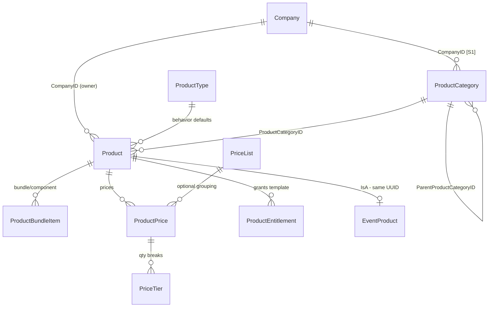
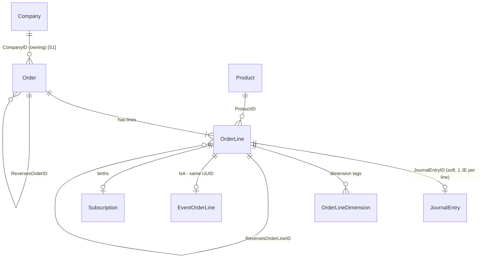
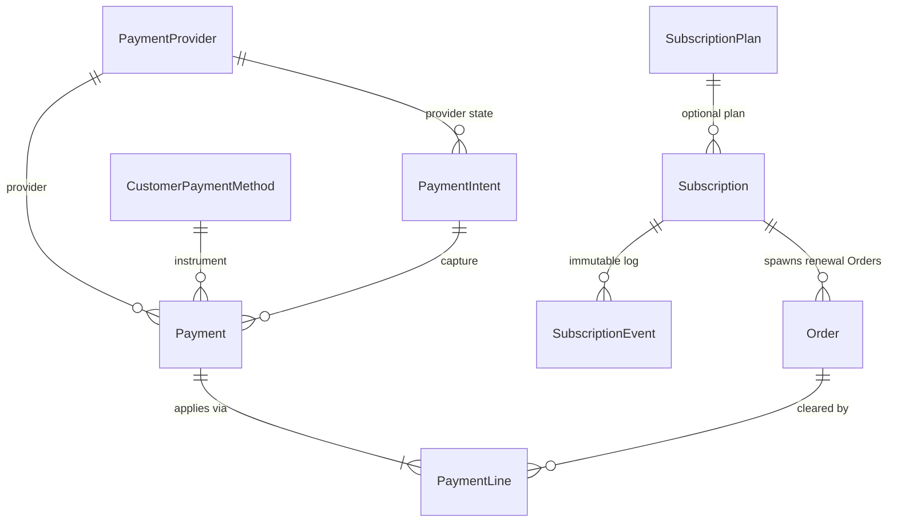

# BizApps Orders — Master Plan

> **Status:** Single source of truth for BizApps Orders (consolidated 2026-07-23).
> **Repo:** `MemberJunction/bizapps-orders` · schema `__mj_BizAppsOrders`.
> **Positioning:** **Unified order management — products, orders, payments, subscriptions. The Order
> is the transactional substrate *and the A/R primitive*; payments and subscriptions are aspects of
> the same business event.** Officially named **Orders** (higher-ups' wording choice); "invoice
> creation & tracking + payment management" is a category analog only — never reintroduce "Invoice"
> as an entity, type, or status.
>
> This document consolidates the entire prior plan chain (master plan + modification/update ledgers +
> question-stock answers + meeting rulings through 2026-07-23) into one current-state plan. It stands
> alone: there are no companion ledgers, markers, or meeting docs — **git is the history**. Where a
> decision came from a specific person's ruling, the attribution is noted inline so provenance
> survives without ledger machinery.
>
> **Sibling plan:** `bizapps-accounting/plans/bizapps-accounting-master.md` (consolidated 2026-07-22)
> — the accounting side of every boundary contract below.

---

## 0. Table of contents

1. [Context, positioning, and guiding principles](#1-context-positioning-and-guiding-principles)
2. [Architecture and scope boundaries](#2-architecture-and-scope-boundaries)
3. [Design decisions (current)](#3-design-decisions-current)
4. [Entity model](#4-entity-model)
   - 4.1 Product catalog · 4.2 Pricing · 4.3 Order + OrderLine · 4.4 Order as the A/R primitive ·
     4.5 Subscriptions · 4.6 Revenue-recognition envelope · 4.7 Payments & stored value ·
     4.8 Sales rules · 4.9 What is deliberately absent from the schema
5. [Order lifecycle and booking workflow](#5-order-lifecycle-and-booking-workflow)
6. [JE booking — the accounting integration](#6-je-booking--the-accounting-integration)
7. [Revenue recognition](#7-revenue-recognition)
8. [Payments](#8-payments)
9. [Multi-company and intercompany](#9-multi-company-and-intercompany)
10. [Pricing and coupons](#10-pricing-and-coupons)
11. [Tax](#11-tax)
12. [Sales rules and approvals](#12-sales-rules-and-approvals)
13. [Entitlements](#13-entitlements)
14. [Permissions, roles, and company scope](#14-permissions-roles-and-company-scope)
15. [UX direction](#15-ux-direction)
16. [The LXP launch (first integrating consumer)](#16-the-lxp-launch-first-integrating-consumer)
17. [Migration of legacy CDP data](#17-migration-of-legacy-cdp-data)
18. [Build sequencing (current priorities)](#18-build-sequencing-current-priorities)
19. [Open architecture questions](#19-open-architecture-questions)
20. [Open decisions parked with owners](#20-open-decisions-parked-with-owners)
21. [Out of scope and future-app boundaries](#21-out-of-scope-and-future-app-boundaries)
22. [Build inventory (state as of consolidation, 2026-07-23)](#22-build-inventory-state-as-of-consolidation-2026-07-23)

---

## 1. Context, positioning, and guiding principles

BizApps Orders provides the **unified order-management substrate** for the MJ ecosystem. It subsumes
the previously-planned Payments and Subscriptions apps (MJ PR #2214) into one app, on the principle
that orders, payments, and subscriptions are aspects of the same business event — a customer commits
to pay, the system tracks both what they're getting and how they're paying.

### What we ARE

- **The substrate for customer-facing transactions:** products, orders, billing, payments,
  subscriptions, refunds, returns, credit memos.
- **The A/R front end:** the posted/confirmed Order *is* the receivable — there is no Invoice entity.
  The customer-facing bill is the Order rendered as a document.
- **Multi-company native:** one order can carry lines owned by different subsidiaries; each line
  books its own single-company journal entry into BizApps Accounting.
- **Payment-provider agnostic:** Stripe first; others pluggable via the `RegisterClass` pattern;
  Manual always available.
- **Subscription-aware:** a subscription is a continuity record that spawns a per-cycle renewal
  Order — recurring cadence = many Orders under one Subscription.
- **Reversal-disciplined:** every business event reverses at its own layer (return/credit-memo
  Orders, refund/chargeback Payments, subscription cancellations), each emitting reversal JEs.

### What we are NOT

- **Not the ledger:** JE creation calls into BizApps Accounting; we never maintain GL balances.
- **Not the tax engine:** a third-party engine calculates; we send inputs and record results.
- **Not the contract layer:** formal terms/escalators/renewal envelopes are BizApps Contracts
  territory (future; see §21).
- **Not an e-commerce storefront or CRM:** we are the transactional substrate; customer master lives
  in BizApps Common.
- **Not inventory/COGS:** a future BizApps Inventory bolts onto the seams we ship (§21).

### Guiding principles

1. **The Order is the substrate.** Every commercial event either is an Order or hangs off one.
   Fewest primitives: Orders + Payments; everything else (credit memos, invoices, statements) is a
   view or a reversal of them.
2. **Pen, not pencil.** After an order books, corrections are reversing/credit orders and reversal
   payments — locked history is never edited (mirrors accounting's immutability ethos).
3. **Metadata-driven behavior.** Product type + roles + links determine JE patterns, fulfillment,
   recurrence, and taxability — new behavior comes from metadata and pluggable classes, not engine
   forks.
4. **Atomic units of business work are Remote Operations.** A JE plus its lines, an order confirm
   plus its bookings, a refund plus its reversal JE — each is ONE transactional server call, never
   client-side multi-save choreography (Amith: "Remotable Operations for larger encapsulated units
   of logical work"; plain BaseEntity saves are fine for one-record edits).
5. **Build first, iterate in the system** (Amith 2026-07-21, Marcelo-endorsed): get the database
   built, work through bugs against the running system; plans stay thin; Amith reviews the BUILT
   code. Nothing is "done" until its tests are green and a demo artifact exists — a claimed status
   is a claim, not a fact.
6. **Deterministic test data + tiered validation:** every change validates through the tiered
   harness (unit → server → API → component → e2e) against generated seed data.

---

## 2. Architecture and scope boundaries

### Dependency stack

```
__mj                    MJ core: Company, User, Role, File
   ↑
bizapps-common          Person, Organization, Address, ContactMethod
   ↑
bizapps-tasks           Task primitives (approval gates run through it)
   ↑
bizapps-accounting      GLAccount + roles/links, JournalEntry primitives, Currency,
   ↑                    dimensions, tax snapshot tables, batching to the ERP
bizapps-orders  ◄── this plan
   ↑
bizapps-contracts       (future) agreement envelope — consumes Orders
   ↑
aidp                    analytics consumer (pull-only, cross-schema reads)
```

- **Currency is owned by accounting** (`__mj_BizAppsAccounting.Currency`); common never shipped it.
- **SQL Server first; PostgreSQL by conversion** (T-SQL source of truth, `sql-converter` output
  validated in CI). **UUID primary keys throughout.**
- **Cross-app entity naming:** `MJ_BizApps_Accounting: …`, `MJ_BizApps_Common: …`,
  `MJ_BizApps_Tasks: …`; schemas `__mj_BizAppsOrders` etc.

### Boundary contracts

**Orders provides upstream/consumers:** order lifecycle APIs (create/confirm/reverse via remote
operations), payment capture/refund/application, subscription lifecycle, entitlement grants + a
poll-based read/notify path, product catalog + pricing resolution.

**Orders sends accounting:** one JE create request per order line (and per payment event) through
the `Accounting.CreateJournalEntry` / `CreateJournalEntries` remote operations — balanced,
single-company, landing `Pending`; accounting batches to the ERP. "Book"/"post" = create a Pending
JE, never GL-post.

**Orders does NOT:** generate intercompany legs at booking (payment-side, §9); compute FX (§21
deferred); calculate tax (§11); maintain GL balances; know about batching/dispatch.

**Cross-app reference hardness (go-forward standard, Marcelo):** references from Orders into
accounting (`OrderLine.JournalEntryID`, `PaymentHeader.JournalEntryID`) are **SOFT refs for now** —
they become **hard, nullable FKs** once the MJ CodeGen include-mode work lands (Marcelo owns that
PR; MJ's own OpenApp publish policy expects downstream→upstream cross-app FKs — dependency-order
install makes them safe; the current blocker is a CodeGen bug where a foreign FK into a schema
pollutes that app's codegen). Accounting takes no dependency on Orders: JEs reference their origin
via soft columns (`OrderID`/`OrderLineID`/`SubscriptionID`/`PaymentID`) only.

### Standing migration practice (pre-production)

While nothing is deployed, schema changes are made by **editing the ORIGINAL baseline migration in
place**, rebuilding on a clean database, and re-running CodeGen — no incremental fix-up migrations
(Amith 2026-07-21). Once published, the publish-then-no-breaking-changes policy applies.

---

## 3. Design decisions (current)

The current decision set. Each is the standing ruling — superseded ancestors live only in git.

| # | Decision | Rationale / source |
|---|----------|-----------|
| D1 | **One unified app** — orders + payments + subscriptions in one repo/schema. | Tight entity overlap; one install; subsumes MJ PR #2214's two-app split. |
| D2 | **No Invoice entity — the confirmed/posted Order IS the A/R primitive.** It carries the receivable fields (`TotalGross`/`AmountPaid`/`Balance`/`DueDate`/`PaymentStatus`); `OrderNumber` is the document number; the customer-facing bill is the Order **rendered as a report**. A **credit memo is a negative-balance Order** (`OrderType ∈ {Return, CreditMemoOrder}`, `ReversesOrderID` set). Statements/consolidated bills are reports, not primitives. | Fewest primitives. Robert confirmed the terminology flip (order ≡ invoice) 2026-07-10; Marcelo re-confirmed 2026-07-14. |
| D3 | **Vocabulary is "Orders"** — official name and entity vocabulary; "invoice/payment management" only as category analogs. | Higher-ups' wording choice; Marcelo directive 2026-07-11. |
| D4 | **Product catalog is the behavior root.** `ProductType` carries behavior defaults (rev-rec type, taxability, fulfillment-required, recurrence); **type-driven IsA extensions** at Product and OrderLine level (shared-UUID disjoint children, e.g. `EventProduct`/`EventOrderLine`); seeded out-of-the-box types (Event, Membership, PhysicalGood, DigitalGood, Service, Donation, GiftCard, Bundle, AddOn/Fee, Subscription, Usage). A pluggable `ProductBehavior` class seam (most-specific-wins: Product → ProductType → default) is the escape hatch — schema ready, seam deferred. | Nail the catalog and orders/booking/rev-rec/tax inherit correct behavior. |
| D5 | **No GL columns anywhere in the catalog** — GL routing is **role-based** via accounting's polymorphic `GLAccountLink` (roles: AR, Sales, Deferred Revenue, Sales Discounts, Returns & Allowances, …). Resolution walk: product link → up the **product-company's own** category tree → the **product-company's** company-default link → **fail loudly** (tripwire; no silent fallback). Cached in `OrdersEngineBase` as a lazy `productID → {role → account}` map. | Amith 2026-07-02 engine meeting; resolution anchor moved to the product's company by Marcelo 2026-07-17. ⚠ Resolution perf/complexity deep-dive is a named pre-volume work item (§19). |
| D6 | **Company model:** `Product.CompanyID NOT NULL` is the **source of truth for line ownership** (revenue accrues to the product's company). `Order.CompanyID` = the **OWNING company** — document/ownership/visibility anchor only, never GL resolution. `OrderLine.CompanyID` = a **denormalized stamp of the product's company at line save** — perf/reporting + temporal integrity (if product ownership later changes, lines record who owned them at transaction time). Naming is plain `CompanyID` schema-wide; role-qualified names only where the role is the point (`PaymentHeader.ReceivingCompanyID`). The resolved account must belong to the line's company (hard-block; cross-company mapping refused entirely). Read `Order.CompanyID` as the **ORIGINATING company** — the sales-attribution/document anchor (pairs with `Order.SalesRepUserID`); financially, company is fully implied per line by `Product.CompanyID` (Amith 2026-07-23). | MOD-3 lineage: Robert's Q2 answer (owning company exists) + Marcelo 2026-07-17 (product anchors the line) + Robert's written answers 2026-07-20 (line stamp; not an RLS need). Schema amendment pending (§18). |
| D7 | **Product categories are per-company rows** (`ProductCategory.CompanyID NOT NULL`) with **identical-name display-collapse** in the UI — no shared registry object; naming consistency via soft autocomplete suggestion. | Robert 2026-07-21, unambiguous: "five companies, 5 t-shirt categories… crossing them, no." Permissions decide it: company-scoped rows RLS-scope cleanly. |
| D8 | **Booking fires exactly once, on the FIRST transition to `Confirmed`;** failure **blocks** the Confirm (never silently unbooked). `Posted` = "the JEs are in the subledger" — near-instant after Confirm. **The two-step `Confirmed → Posted` status model stays as-is** (Marcelo 2026-07-22, final — Amith: "there was a reason for it"; a collapse can be revisited with Amith directly). | 07-02 engine amendment; Robert 2026-07-08. Idempotency = line-already-booked. |
| D9 | **Forward status skipping is allowed; the ORDER of stages is fixed.** Draft → Confirmed without Quoted is legal; you can't reach a later stage without its prerequisites' effects (booking on first Confirmed; can't Fulfill before Posted). `Voided` is reachable **only from Draft/Quoted** — after Confirm, corrections are reversing/credit orders. | Robert 2026-07-08/2026-07-10. |
| D10 | **ONE JE PER ORDER LINE — always** (even multiple lines of the same company). The order's journal entry is a **virtual concept** — a UI aggregation of the line JEs; batching nets them later anyway. Linkage = **`OrderLine.JournalEntryID`** (nullable, soft ref until include-mode; the Order header carries NO JE ref; no junction table). | Amith 2026-07-21 ("always separate journal entries per order line — it's just simpler"); supersedes the one-JE-per-company split and the junction idea. |
| D11 | **Line JE shape (single-company by construction):** Dr the line company's **AR (net)** · Cr its **Sales (gross)** at the resolved role accounts · **discounts via the contra-account pattern** — Dr Sales-Discounts for the discount; absent a linked discounts account, net into the sales credit. Deferred-revenue-typed products credit the **Deferred Revenue** role instead of Sales (recognition staged per D14). Returns & Allowances role exists alongside. | Amith 2026-07-21. Coupon/campaign-code dimensions acknowledged as coming — deferred. |
| D12 | **Booking encapsulation:** an **`OrderJournalEntryFactory`** (orders server package) iterates the order's lines (parallelizable) and books each line's JE via the accounting engine; the **server-only Order entity subclass overrides `Save()`** — on transition into the locked status: outer transaction → `super.Save()` → factory books per-line JEs → stamp each `OrderLine.JournalEntryID` → commit; **any failure rolls back everything** (a locked order without its JEs is invalid state). The order object carries a **`Lines` array of unsaved OrderLine entities + a `Validate()` override** (≥1 line; children validate) so the entity guards its own invariants. Provider discipline: the entity's own provider throughout — never a fresh global `Metadata` in the transaction path. The JE-side encapsulation is now BUILT: accounting ships a first-class **`JournalEntryServerExtended`** (a `Lines` getter + properly scoped transactions for the full JE + lines persistence), so the factory composes with it — direct object manipulation server-side; the remote operations remain the client-facing atomic boundary. | Amith 2026-07-21 — the build basis; built and harness-proven on the donor branch (§22). JE-entity encapsulation un-deferred: built, Amith 2026-07-23. |
| D13 | **Intercompany: orders create NO due-to/due-from at booking.** "You don't know about intercompany anything until you get cash" — each line's AR sits with the LINE's company; IC legs and settlement mechanics arise on the **payment side** when built. No `IntercompanyFlow` table exists. Each line's JE stands alone as a complete single-company story (AR, Sales, Discounts, DefRev, …); when cash received by one entity is applied to an order carrying other companies' products, the payment-application step books the IC balancing entries. Amith re-affirmed this as the right design 2026-07-23 and **personally owns the Robert + Jeremy re-closure** (§19); we build this shape meanwhile. | Amith 2026-07-21, re-affirmed 2026-07-23; accounting D18 is the mirror. |
| D14 | **Revenue recognition = REAL forward-dated JEs written at booking-lock.** A 12-month $1,200 sub → 12 × $100 Dr DefRev / Cr Revenue JEs dated on the monthly anniversaries; an event product → ONE entry dated the event date. **Two recognition shapes:** single-date (100% on the date) and period waterfall (over the line's `ServicePeriodStart/End`). No schedule-bridge tables, no materializer, no daily job. **Changes/cancellations = correcting Orders whose entries NET against what's staged** — staged entries are never edited or deleted. Batches sweep forward-dated entries only when the date filter explicitly reaches forward (default cutoff = today, accounting-side). | Robert's model ("a wake-up job is fragile — just create them"), Jeremy sign-off; Marcelo adopted 2026-07-13/14. Accounting D15 is the mirror. Engine rework to this shape pending (§18). |
| D15 | **Fulfillment ↔ revenue recognition are DISCONNECTED.** Fulfillment is a logistics fact; NO JE fires on Posted→Fulfilled. If no line's product requires fulfillment, a Posted order **auto-advances to Fulfilled**; fulfillment-requiring lines hold the order for the fulfiller role (per-line flip queue deferred). | Robert 2026-07-09/2026-07-10. |
| D16 | **Reversals at every layer, each emitting its own reversal JEs:** Order → return/cancellation/amendment/credit-memo Orders with negative-quantity lines (`ReversesOrderID`/`ReversesOrderLineID`; partial reversals stack); Payment → refund/chargeback/bank-return PaymentHeaders (negative `Amount`, `ReversesPaymentHeaderID`); Subscription → cancellation with proration refund. Credit settlement paths: refund payment · apply-to-another-order (zero-cash credit-application Payment) · write-off (deferred until a real need). | Standard subledger pattern; audit trail by construction. |
| D17 | **Refund is ONE atomic remote operation** (`Orders.RefundPayment`): reversal Payment + reversing JE commit together or not at all (TransactionGroups don't cross the GraphQL boundary — same reason `ConfirmOrder` is an op). NOT blocked on Stripe: a Manual-provider refund is fully expressible (nothing moves on our side but the JE). Same pattern owed for create-into-`Fulfilled` (a future `Orders.CreateOrderInState`-style op that runs the real Confirm path). | Marcelo 2026-07-16: "no server op that writes the reversal payment and the journal entry in one transaction — that's a problem." |
| D18 | **Payment model** (revised by D36–D39): `PaymentHeader` (internal state; gross `Amount`, `ProcessingFeeAmount`, `NetAmount`) · `PaymentIntent` (provider-side state; webhooks update it) · **`PaymentLine`** as the cash-application junction (one Payment clears many Orders; one Order cleared by many Payments; `OrderHeader.Balance = TotalGross − SUM(posted PaymentLine.Amount)`, trigger-maintained (D41)) · `CustomerPaymentMethod` as the WALLET (its instrument fields now live in `PaymentDetail`, D38). `PaymentHeader.ReceivingCompanyID` = where cash hits. Capture JE: Dr Cash (net) / Dr Processing Fee / Cr A/R (gross). | BO-D16/D46/D47 lineage, unchanged. Fee JE leg is coded but dormant until a Processing-Fee role/account is seeded. |
| D19 | **Payment providers are pluggable** (`RegisterClass`/ClassFactory). **v1 = Stripe + Manual** (+ the internal StoredValue provider when gift cards activate). **Stub-first Stripe:** the committed success-stub is the default test provider; the **LXP-checkout subset of real Stripe** (PaymentIntent lifecycle + hosted checkout + webhook→capture) is pulled forward for launch; recon/forensics/idempotency-stress remain deferred. Webhooks: an **unauthenticated Express route** (raw-body capture + provider HMAC verification, mounted before auth — the MJ `SignatureWebhookHandler` precedent), idempotent via `ProviderEventID` uniqueness; the HTTP boundary is never an MJ Action. | BO-D12/D13/D23/D29; stub-first per Marcelo 2026-07-14 (LXP D8). |
| D20 | **Subscriptions:** `Product.SubscriptionType` declares recurring value; on first sale the behavior does **find-or-extend-or-create** for (Product, Customer, Beneficiary); **each billing cycle the Subscription spawns a renewal Order** (its own bill, D2). `SubscriptionPlan` is optional elaboration (multi-tier/cycle products); simple memberships need none. **Renewals spawn as `Draft` at launch** (a human confirms; Confirm books); the fuller shape is a **`RenewalSpawnStatus`** setting per type/plan ∈ {Draft, Quoted, Confirmed}. Downgrade = cancel-existing + new sub (clean audit; matches Stripe). No per-order accounting gate by default — batch approval is accounting's control point; exceptions via SalesRule; custom logic via the behavior seam. | BO-D24/D40 + Robert OF4 (2026-07-16; Jeremy validates the Draft default). Lifecycle build deferred behind booking (§18). |
| D21 | **Pricing:** `PriceList`/`ProductPrice`/`PriceTier` (effective-dated, pricing models flat/per-unit/tiered/volume/package/usage, fee types) are **built**; `OrderLine.UnitPrice` **direct entry remains valid and is the base of the precedence chain** — the resolution engine layers suggestion/resolution on top, so pricing never blocks baseline flows. ASC-606 fields (SSP, `ProductPerformanceObligation`) ship now; the allocation engine is future. | Robert deferred → Marcelo un-deferred 2026-07-14; tables built 2026-07-14. |
| D22 | **Coupons/promo codes: provider-model Option A at launch** — a `CouponProvider` abstraction where the provider (Stripe hosted checkout + promotion codes, exactly today's CDP behavior) owns configuration/application and **Orders records the outcome**. Recording schema lands at BOTH levels regardless: order-level discount structure (code, provider, provider coupon/promo IDs, total) AND line-level `DiscountAmount` (providers prorate; tax + GL operate on line amounts; `DiscountPct` alone can't express fixed/order-level discounts). The Orders-native `Coupon` entity is the **fast-follow**, slotting in as just another provider. Schema freeze gated (§20). | Robert A2 + OS7 (2026-07-14/16); LXP D10 (Amith: "v1, not hard"). |
| D23 | **Tax: Option B durable shape, calculation DELEGATED.** `ProductTaxCategory` + `Product.ProductTaxCategoryID` + `OrderLineTaxLine` per-jurisdiction snapshot rows + accounting's `TaxCalculationProvider` seam — but Orders never calculates: a third-party engine (Stripe Tax / Avalara class) does, and our tables record what it returned. Skip the "tax as a fake catalog line" shortcut entirely. Rate package: **buy, not build.** Launch-with-tax vs tax-exempt is an explicit finance call (§20), never a default. | Robert 2026-07-16 (Q21 answer); accounting D17 is the mirror. Tax remains deferred-by-complexity until that call — no stub (a stub is complex enough to become a blocker). |
| D24 | **Currency/FX deferred from the baseline** — no currency columns on Order/OrderLine; single-currency reality today. The design stands for later: rates from accounting, per-transaction snapshot on lines, realized-FX on cross-currency payments (computed upstream — accounting never generates FX entries). | 07-02 amendment; Robert 2026-07-10: "day one? No." |
| D25 | **No periods, no closed-period guard — backdating allowed, unguarded (final).** The order carries `OrderDate`; the JE bears its date; accountants batch entries into the right periods; any future timing rule detects by DATE, never a period FK. | Marcelo 2026-07-14 (final, after a same-day manual-close detour was withdrawn); mirrors accounting D2. |
| D26 | **Sales rules are metadata-driven** (`SalesRule` rule types + JSON predicates; `SalesAuthority` per-rep limits), evaluated at Order Confirm; violations raise an **"Approval Request" Task in BizApps Tasks** routed to the approver role (approve → proceed; reject → back to Draft with notes). The same tasks substrate carries every human gate (credit-limit override, discount exception, refund authorization, cancellation sign-off). Schema built; evaluation engine + routing not yet (§18). | BO-D17/D18/D27; tasks-app prerequisites verified satisfied 2026-07-15. |
| D27 | **Entitlements split into definition + grant.** `ProductEntitlement` is the template; `EntitlementGrant` is the instance created at booking/activation, carrying a **beneficiary** (defaults to the buyer; a line may designate another — attendee, gift-card recipient, honoree). Downstream apps **poll** grants (MJ Scheduled Job + Record-Set-Processing; Amith recommends the poll) — no bespoke webhook/notification system. Provisioning/enforcement engine is later. | BO-D34/D39; LXP D14 (2026-07-14). |
| D28 | **Order visibility is ROLE-GRANT-DRIVEN, not auto-involvement:** a user sees an order only when their `UserCompanyRole` grants (accounting's table) include the order's **OWNING company**; sees a product only when granted that product's company. Sibling-company users do NOT automatically see an order off a shared line (drill-through survives — the sister's revenue is in her own JE). WRITE stays owner-company-scoped. RLS filter = one owner-scoped leg; `OrderLine.CompanyID` is a perf/reporting column, not an RLS need. Orders seeds its own roles (order entry + an order **fulfiller**). | Robert's written answers 2026-07-20 (supersedes the involvement-based proposal); MOD-9a. |
| D29 | **Naming convention: transactions get number + memo; master data gets names.** No `Order.Name` column — `Order.Description` is the searchable memo, drives workspace-tab captions, and joins name/ID search. Products/categories are already named. | Marcelo 2026-07-17 (ratified the accounting norm). |
| D30 | **Order numbering:** global `ORD-{seq}` via the `OrderSequence` table (as-built; payments likewise `PaymentSequence`). `ExternalDocumentNumber` exists as its own column (bill.com won't sync without it; may equal OrderNumber). Single vs BC-style dual sequence (draft → posted) is an open Jeremy decision (§20). | UPD-1 (Jeremy 2026-07-10). |
| D31 | **Line-level dimension tagging:** `OrderLineDimension` junction carries accounting Dimension/DimensionValue tags on order lines so JE generation propagates them into JE lines. | §15-Q5 lean, implemented in the baseline. |
| D32 | **`IsOverdue` is a computed/virtual surface** (`Balance > 0 AND DueDate < now`) — computed in the view/entity layer, **never stored state**. Dunning: overdue detection + worklist (`Orders.GetOverdueWorklist`); a **configurable `DunningGracePeriodDays`** setting (default 7, an Orders setting — per owning company when multi-company needs it) governs the post-failed-renewal hold, and dunning **notifies CS rather than auto-cancelling**. Reminder delivery channel is decision-gated (§20). | LXP D15/D16; Marcelo 2026-07-14 (configurable, not hardcoded). |
| D33 | **Forms-first UX** (Amith): first-class MJ Entity Forms for Order/Payment/Subscription/Product composed of reusable widgets dashboards embed directly; no bespoke pop-ups — modal/slide-in surfaces render the entity form through MJ's form host. Full direction §15, including the form-vs-workspace boundary and the convert-on-touch migration policy. | Amith 2026-07-17; accounting D22 is the mirror. |
| D34 | **UTC everywhere.** Every persisted timestamp is UTC; time zones are presentation-only. | Standing convention. |
| D35 | **Metadata-driven JE pattern selection:** `Product.RevenueRecognitionType` × `Order.OrderType` × reversal refs determine each line's JE pattern (immediate revenue vs DefRev + staged recognition vs reversal mirror). New rev-rec policies come from metadata, not code changes. | Original principle, unchanged. |
| D36 | **`PaymentType` is a first-class table, not a CHECK enum.** Code, Name, `IsReversal`, `RequiresProvider`/`RequiresInstrument`/`RequiresReference`, `DetailExtensionEntity` (IsA seam, mirroring `ProductType.ProductExtensionEntity`), Sequence — seeded via metadata, never SQL inserts. `PaymentHeader.PaymentTypeID` **replaces** the old `Payment.Method` enum entirely (no denormalized code column; pull the name in as an FK virtual field). Rationale: the old enum mixed forward methods with reversal types (`Refund`/`Chargeback`/`BankReturn`), so any "initial payment type" picker had to hardcode the excluded subset; `IsReversal` makes that a data question. The `RequiresX` flags drive both validation and which instrument fields the UI demands. | Amith 2026-07-25. |
| D37 | **`PaymentProviderType` is a LOOKUP, not a CHECK.** The as-built `PaymentProvider.ProviderType CHECK ('Stripe','Manual')` directly contradicted D19 ("new providers added without schema change") — adding JPM would have required a migration. Now `PaymentProvider.PaymentProviderTypeID` FKs a seeded lookup whose `Code` IS the `@RegisterClass` key, carrying `DriverClass` + capability flags (`SupportsTokenization`/`SupportsRefund`/`SupportsWebhooks`) so the UI can hide what a gateway can't do instead of failing at runtime. `PaymentProvider` stays the CONFIGURED account (per-company, credentials ref, live/test). | Amith 2026-07-25. |
| D38 | **`PaymentDetail` — one instrument shape, three hosts.** Holds every instrument field (tokenized: provider customer/instrument refs, brand, last4, expiry, holder — NEVER the PAN; bank: routing/account last4; manual: reference number for check no / wire confirmation, instrument date; gift card: `StoredValueAccountID`) plus `CompanyID` for audit, pushed down from the host. Referenced by `OrderHeader.InitialPaymentDetailID` (intent), `PaymentHeader.PaymentDetailID` (fact), and `CustomerPaymentMethod.PaymentDetailID` (wallet). This removes the duplicate card columns that previously lived on `CustomerPaymentMethod`, leaving it purely a wallet (customer scope + IsDefault + IsActive). Sparse nullable columns rather than per-type IsA subtypes for v1 — queryable and ~14 columns beats six extension tables — with `PaymentType.DetailExtensionEntity` reserving the IsA seam for adopters. | Amith 2026-07-25. |
| D39 | **Copy-on-use, never share; immutability is the guarantee.** Each host gets its OWN `PaymentDetail` row (wallet → copied onto the order; order's → copied onto the payment at confirm), so snapshots cannot drift. `SourceCustomerPaymentMethodID` records the wallet entry a copy came from — provenance without coupling, keeping "every payment made with this saved card" answerable. Enforced by a **filtered UNIQUE index on each host FK** (1:1 per host) plus an **immutability trigger** on PaymentDetail's instrument fields. Cross-host exclusivity is deliberately NOT enforced: the risk was drift, immutability removes it directly, and blocking sharing would cost three triggers each scanning the other two tables. | Amith 2026-07-25 — "we don't share, we use once and copy the values", immutability confirmed. |
| D40 | **`Order` → `OrderHeader`, `Payment` → `PaymentHeader`.** `ORDER` is reserved in BOTH T-SQL and PostgreSQL (and this app ships a PG conversion path), so the base table needed bracketing forever in raw SQL, dynamic SQL, and third-party reporting tools. `OrderHeader`/`OrderLine` and `PaymentHeader`/`PaymentLine` also read as the classic header/line pairing. MJ entity names are unaffected (`MJ_BizApps_Orders: Orders` regardless of base table), so only raw SQL changes. Renamed pre-production, when the cost is near zero. | Amith 2026-07-25. |
| D41 | **`OrderHeader` rollup fields are TRIGGER-maintained, not computed columns.** `TotalGross` (SUM of line gross) and `AmountPaid` (SUM of posted `PaymentLine.Amount`) are cross-table aggregates that a computed column cannot express; `Balance = TotalGross − AmountPaid` is computed in the SAME trigger rather than as a PERSISTED/GENERATED column so the behaviour is identical on SQL Server and PostgreSQL and depends on no `sql-converter` or CodeGen handling of computed-column DDL. `PaymentStatus` derives from the same trigger except `WrittenOff`, which stays an explicit action. `IsOverdue` remains view-computed (D32) — it changes with the clock, not with a write. | Amith 2026-07-25 (cross-platform parity over DB-guaranteed arithmetic). |
| D44 | **Cross-app references point UP the dependency graph only.** `Order.ContractID` is **REMOVED**: bizapps-contracts is downstream of orders, so a reference to it — hard OR soft — inverts the app graph and encodes a contracts concern in an orders table. When that app exists it will join to orders from its own schema. This is the same rule that removed accounting's `AccountingCompanyProfile.DefaultPaymentTermsTypeID`. `Order.ApprovalTaskID` stays soft only because **bizapps-tasks cannot currently be installed alongside our bizapps-common** — tasks' generated views select `Person.DisplayName`, which exists on common's enriched VIEW but not on the `Person` TABLE we have; it becomes a real FK the moment the two are version-aligned (see the versioning memo). | Amith 2026-07-25 (PR #10). |
| D42 | **Initial payment on the order is a CONVENIENCE capture, and it is INTENT.** `OrderHeader.InitialPaymentTypeID` + `InitialPaymentAmount` + `InitialPaymentDetailID` record what the customer said they would pay at order entry; on confirm they auto-generate a `PaymentHeader` + `PaymentLine` applied to that order. They are written at order entry and **never updated once the payment exists** — the `PaymentHeader` is the record of what happened. Keeping them is what lets a quote carry payment intent before confirm and lets a failed initial payment preserve the request for retry. | Amith 2026-07-25. |

---

## 4. Entity model

Schema `__mj_BizAppsOrders`. All UUID PKs. Shapes below are the **current design**; items tagged
**[S1 pending]** are the company-model amendment wave not yet in the baseline (see §18). Per the
standing practice (§2), amendments edit the original baseline migration.

### 4.0 ERD diagrams

#### Catalog

```mermaid
erDiagram
    Company ||--o{ Product : "CompanyID (owner)"
    Company ||--o{ ProductCategory : "CompanyID [S1]"
    ProductType ||--o{ Product : "behavior defaults"
    ProductCategory ||--o{ ProductCategory : "ParentProductCategoryID"
    ProductCategory ||--o{ Product : "ProductCategoryID"
    Product ||--o{ ProductBundleItem : "bundle/component"
    Product ||--o{ ProductPrice : "prices"
    PriceList ||--o{ ProductPrice : "optional grouping"
    ProductPrice ||--o{ PriceTier : "qty breaks"
    Product ||--o{ ProductEntitlement : "grants template"
    Product ||--o| EventProduct : "IsA - same UUID"
```

#### Order, lines, and booking

```mermaid
erDiagram
    Company ||--o{ Order : "CompanyID (owning) [S1]"
    Order ||--|{ OrderLine : "has lines"
    Product ||--o{ OrderLine : "ProductID"
    OrderLine ||--o| JournalEntry : "JournalEntryID (soft, 1 JE per line)"
    OrderLine ||--o{ OrderLineDimension : "dimension tags"
    Order ||--o{ Order : "ReversesOrderID"
    OrderLine ||--o{ OrderLine : "ReversesOrderLineID"
    OrderLine ||--o| EventOrderLine : "IsA - same UUID"
    OrderLine ||--o| Subscription : "births"
```

#### Payments & subscriptions

```mermaid
erDiagram
    Order ||--o{ PaymentLine : "cleared by"
    Payment ||--|{ PaymentLine : "applies via"
    PaymentProvider ||--o{ Payment : "provider"
    PaymentProvider ||--o{ PaymentIntent : "provider state"
    PaymentIntent ||--o{ Payment : "capture"
    CustomerPaymentMethod ||--o{ Payment : "instrument"
    Subscription ||--o{ SubscriptionEvent : "immutable log"
    SubscriptionPlan ||--o{ Subscription : "optional plan"
    Subscription ||--o{ Order : "spawns renewal Orders"
```

### 4.1 Product catalog

```sql
__mj_BizAppsOrders.ProductType                 -- behavior defaults per kind (D4)
  ID, Code UNIQUE,                             -- Event | Membership | PhysicalGood | DigitalGood | Service
                                               -- | Donation | GiftCard | Bundle | AddOn | Fee | Subscription | Usage
  Name, DefaultRevenueRecognitionType,         -- seeds Product.RevenueRecognitionType
  DefaultIsTaxable BIT, RequiresFulfillment BIT,
  IsBillableRecurring BIT, DefaultSubscriptionType,
  ProductExtensionEntity NVARCHAR NULL,        -- IsA subtype entity names (D4)
  OrderLineExtensionEntity NVARCHAR NULL,
  BehaviorClass NVARCHAR NULL,                 -- ProductBehavior ClassFactory key (seam deferred)
  IsActive BIT

__mj_BizAppsOrders.ProductCategory
  ID, CompanyID NOT NULL FK → __mj.Company,    -- [S1 pending] per-company rows (D7)
  Name, ParentProductCategoryID NULL,          -- hierarchical, within one company
  Code, Description, IsActive

__mj_BizAppsOrders.Product
  ID,
  CompanyID NOT NULL FK → __mj.Company,        -- [S1 pending: rename from OwningCompanyID + NOT NULL]
                                               -- the company whose revenue accrues (D6 source of truth)
  ProductTypeID NOT NULL, ProductCategoryID NOT NULL,
  ProductTaxCategoryID NULL,                   -- [lands with the tax build, D23]
  SKU UNIQUE, Name, Description,
  Status,                                      -- Draft | Active | Discontinued | EOL
  SuccessorProductID NULL, AvailableFrom/To,
  RevenueRecognitionType NOT NULL,             -- Immediate | Ratable | Milestone | Custom (D35)
  StandaloneSellingPrice NULL,                 -- ASC-606 SSP (fields now, engine later — D21)
  SubscriptionType NOT NULL DEFAULT 'None',    -- None | Standard | Membership | Custom (D20)
  BehaviorClass NULL,
  DefaultBillingCycle, DefaultSubscriptionTermMonths,
  IsTaxable BIT, IsActive BIT
  -- NO GL account columns (D5): routing via accounting GLAccountLink roles

__mj_BizAppsOrders.ProductBundleItem           -- one structure, two order modes (bundle line
  ID, BundleProductID, ComponentProductID,     -- vs fast-path explode w/ SourceBundleProductID)
  Quantity, PricingMode,                       -- Bundled | SumOfParts
  SortOrder, UNIQUE (Bundle, Component)

__mj_BizAppsOrders.ProductPerformanceObligation  -- ASC-606; per-obligation SSP for future allocation
__mj_BizAppsOrders.ProductEntitlement            -- template: what a purchase grants (D27)
__mj_BizAppsOrders.EntitlementGrant              -- instance at booking: beneficiary Person/Org,
                                                 -- Quantity, ValidFrom/To, Status, ProvisionedAt
__mj_BizAppsOrders.EventProduct / EventOrderLine -- the shipped IsA extension pair (Event type)
```

### 4.2 Pricing

```sql
__mj_BizAppsOrders.PriceList        -- segmentation: currency-scoped, segment, effective-dated
__mj_BizAppsOrders.ProductPrice     -- PricingModel: Flat|PerUnit|Tiered|Volume|Package|Usage;
                                    -- FeeType: Standard|Setup|Recurring|Overage; effective-dated
__mj_BizAppsOrders.PriceTier        -- quantity breaks under a ProductPrice
```

`OrderLine.UnitPrice` direct entry is the precedence base (D21); the resolution engine
(`ResolvePrice`) suggests/resolves on top. Coupon recording columns land with the D22 schema freeze
(order-level code/provider/discount structure + line-level `DiscountAmount`).

### 4.3 Order + OrderLine

```sql
__mj_BizAppsOrders.OrderHeader                  -- ★ D40 (was `[Order]` — reserved word)
  ID, OrderNumber UNIQUE NOT NULL,             -- ORD-{seq} via OrderSequence (D30)
  OrderType NOT NULL DEFAULT 'Sale',           -- Sale | Return | Cancellation | Amendment | CreditMemoOrder
  OrderDate DATE NOT NULL,                     -- backdating allowed, unguarded (D25)
  Status NOT NULL DEFAULT 'Draft',             -- Draft | Quoted | Confirmed | Posted | Fulfilled | Voided (D8/D9)
  CompanyID NOT NULL FK → __mj.Company,        -- [S1 pending] OWNING company — doc/visibility anchor (D6)
  CustomerOrganizationID, CustomerPersonID, SalesRepUserID,
  BillToAddressID, ShipToAddressID, PaymentTermsTypeID,
  -- A/R — the Order IS the receivable (D2)
  TotalGross, AmountPaid DEFAULT 0, Balance,   -- ALL trigger-maintained (D41), not computed columns
  DueDate NULL,                                -- from PaymentTerms; IsOverdue is computed, never stored (D32)
  PaymentStatus DEFAULT 'Unpaid',              -- Unpaid | PartiallyPaid | Paid | Overdue | WrittenOff
  ExternalDocumentNumber NULL,                 -- bill.com identity (D30)
  -- Initial payment — CONVENIENCE capture of INTENT (D42). Auto-generates a PaymentHeader +
  -- PaymentLine at confirm; never updated once that payment exists.
  InitialPaymentTypeID NULL FK → PaymentType,
  InitialPaymentAmount DECIMAL(18,2) NOT NULL DEFAULT 0,
  InitialPaymentDetailID NULL FK → PaymentDetail,   -- own row, copied (D39)
  -- Lifecycle stamps
  ConfirmedAt, PostedAt, PostedByUserID,
  -- Reversals (D16)
  ReversesOrderID NULL, ReversalReason NULL,
  ApprovalTaskID NULL,                         -- → Tasks (sales-rule gate, D26). Soft ONLY until
                                               -- tasks/common are version-aligned (D44)
  RequestedDeliveryDate, Description, Notes    -- Description = the searchable memo (D29)
  -- NO JournalEntryID (D10 — linkage is per-line); NO currency columns (D24)

__mj_BizAppsOrders.OrderLine
  ID, OrderID NOT NULL, LineNumber, UNIQUE (OrderID, LineNumber),
  ProductID NOT NULL,
  CompanyID NOT NULL FK → __mj.Company,        -- [S1 pending] denormalized stamp of the product's
                                               -- company at save (D6 — perf/reporting/temporal)
  SourceBundleProductID NULL,                  -- fast-path bundle provenance
  Quantity NOT NULL (≠ 0; negative = reversal slice),
  UnitPrice, DiscountPct DEFAULT 0,
  LineTotalNet, LineTax DEFAULT 0, LineTotalGross,   -- computed, validated on save
  ServicePeriodStart/End NULL,                 -- the coverage period rides the line (rev-rec, D14)
  FulfillmentStatus NULL,                      -- Pending | Fulfilled | Returned (seam, D15)
  ReversesOrderLineID NULL,
  SubscriptionID NULL,                         -- if this line births/extends a sub
  RevenueRecognitionScheduleID NULL,           -- the computed envelope (§4.6)
  JournalEntryID NULL,                         -- ★ D10: this line's booked JE (SOFT ref → hard FK
                                               --   when CodeGen include-mode lands)
  Description NULL

__mj_BizAppsOrders.OrderLineDimension          -- accounting Dimension/DimensionValue tags per line (D31)
__mj_BizAppsOrders.OrderLineTaxLine            -- [lands with the tax build, D23] per-jurisdiction snapshot
__mj_BizAppsOrders.PaymentTermsType            -- owned here (accounting delegates to it)
__mj_BizAppsOrders.OrderSequence / PaymentSequence  -- numbering state (D30)
```

**DB enforcement (as-built trigger family 51001–51005):** line financials freeze once the order is
Confirmed (with the `FulfillmentStatus` carve-out); payment financials freeze at Captured; status
CHECK constraints carry the lifecycle vocabulary. The triggers are the enforcement authority; forms
merely reflect state (§15).

### 4.4 Order as the A/R primitive

- `Balance = TotalGross − SUM(posted PaymentLine.Amount)`; AR aging, dunning, and drill-through all
  operate on Orders.
- The customer-facing "invoice" is the confirmed/posted Order rendered as a document — `OrderNumber`
  is its number, the lifecycle stamp its issue/tax-point date.
- **Credit memo** = an Order with negative lines and a negative Balance (`Return`/`CreditMemoOrder`
  + `ReversesOrderID`). Settle by refund Payment, by applying to another Order (a zero-cash
  credit-application Payment netting the two), or by write-off (`PaymentStatus='WrittenOff'`;
  the write-off op itself is deferred until a real finance need).
- **Statements / consolidated bills** = reports grouping a customer's Orders + Payments. Delivery
  lean (ruled): thin send-via-email of the rendered Order first, with an Action-plugin seam;
  bill.com becomes a delivery adapter when a channel needs it.

### 4.5 Subscriptions

```sql
__mj_BizAppsOrders.SubscriptionPlan     -- optional elaboration: billing cycle, price/cycle, trial
__mj_BizAppsOrders.Subscription         -- continuity record: OrderLineID (birth), CustomerOrganizationID,
                                        -- CompanyID [S1 rename], Status (Active|Paused|Canceled|Migrated|Trialing),
                                        -- period bounds, provider linkage (ProviderSubscriptionID),
                                        -- RevenueRecognitionScheduleID, migration trail (MigratesFrom/To)
__mj_BizAppsOrders.SubscriptionEvent    -- immutable log; ProviderEventID UNIQUE (webhook idempotency)
```

Lifecycle per D20: first sale creates; renewals spawn per-cycle Orders (Draft at launch;
`RenewalSpawnStatus` per type/plan later); downgrade = cancel + new. Stripe-driven subs mirror
Stripe state via webhooks; manual subs are driven by our scheduler. The find-or-extend-or-create
behavior and the renewal-spawn job are the deferred remainder of the subscription build (§18).

### 4.6 Revenue-recognition envelope

```sql
__mj_BizAppsOrders.RevenueRecognitionSchedule  -- the COMPUTED envelope (method, dates, totals) —
__mj_BizAppsOrders.RevRecScheduleLine          -- kept for MRR/ARR display + as the computation
                                               -- source; the LEDGER truth is the forward-dated
                                               -- JEs themselves (D14)
```

The waterfall math stands (per-period amounts, front-loaded rounding remainder in entry 1,
anniversary dating); what gets WRITTEN is real future-dated JEs at booking-lock. The as-built
ScheduledJournalEntry-bridge fields on these tables retire with the D14 rework (§18).

### 4.7 Payments & stored value

Revised 2026-07-25 (D36–D39): payment KIND and payment INSTRUMENT are now first-class tables
rather than CHECK-constrained strings scattered across the payment entities.

```sql
__mj_BizAppsOrders.PaymentType            -- ★ D36 first-class kind: Code, Name, IsReversal,
                                          -- RequiresProvider/Instrument/Reference, DetailExtensionEntity
                                          -- (IsA seam), Sequence. Seeded via metadata, not SQL.
__mj_BizAppsOrders.PaymentProviderType    -- ★ D37 gateway kind: Code (= the @RegisterClass key),
                                          -- DriverClass, SupportsTokenization/Refund/Webhooks.
                                          -- A LOOKUP, not a CHECK — new gateways need no migration (D19).
__mj_BizAppsOrders.PaymentProvider        -- a CONFIGURED gateway account: PaymentProviderTypeID,
                                          -- CompanyID, CredentialsRef into MJ Credentials, IsLiveMode
__mj_BizAppsOrders.PaymentDetail          -- ★ D38 the INSTRUMENT snapshot — one shape, three hosts.
                                          -- CompanyID (audit, pushed down from the host); PaymentTypeID;
                                          -- tokenized: ProviderCustomerRef/ProviderInstrumentRef, Brand,
                                          -- Last4, Expiry, HolderName (NEVER the PAN); bank: BankName,
                                          -- Routing/AccountLast4; manual: ReferenceNumber (check no /
                                          -- wire confirmation), InstrumentDate; StoredValueAccountID
                                          -- (gift cards); SourceCustomerPaymentMethodID = provenance.
__mj_BizAppsOrders.PaymentIntent          -- provider-side state; ProviderIntentID UNIQUE; OrderHeaderID ref
__mj_BizAppsOrders.PaymentHeader          -- (was `Payment`) PaymentNumber; ReceivingCompanyID;
                                          -- PaymentTypeID (replaces the Method enum); PaymentDetailID;
                                          -- Amount (negative = reversal); ProcessingFeeAmount; NetAmount;
                                          -- provider/intent refs; ReversesPaymentHeaderID;
                                          -- Status (Pending|Captured|Failed|Refunded|Disputed);
                                          -- JournalEntryID (booked at capture)
__mj_BizAppsOrders.PaymentLine            -- cash application: PaymentHeaderID × OrderHeaderID (+ optional
                                          -- line), Amount, AllocatedAt/By. One payment SPLITS across many
                                          -- orders; one order is cleared by many payments.
__mj_BizAppsOrders.CustomerPaymentMethod  -- the WALLET: CustomerOrganizationID, PaymentDetailID, IsDefault,
                                          -- IsActive. Instrument fields live in PaymentDetail, not here.
__mj_BizAppsOrders.StoredValueAccount     -- gift card instrument: code, issuing company, balance,
__mj_BizAppsOrders.StoredValueTransaction -- signed ledger (Issue|Redeem|Refund|Adjust|Expire)
                                          -- (schema shipped; the gift-card FLOWS are deferred — §21)
```

**PaymentDetail's three hosts** (D38). One instrument shape, referenced by whoever needs it:

| Host | Column | Meaning |
|---|---|---|
| `OrderHeader` | `InitialPaymentDetailID` | **intent** — what the customer said they'd pay with, at order entry |
| `PaymentHeader` | `PaymentDetailID` | **fact** — what actually ran |
| `CustomerPaymentMethod` | `PaymentDetailID` | the saved wallet entry's instrument |

**Copy-on-use, never share** (D39). Each host gets its OWN row; the wallet's detail is copied onto the
order, and the order's is copied onto the payment at confirm. Snapshots therefore cannot drift, so no
cross-host immutability coordination is needed. `SourceCustomerPaymentMethodID` records which wallet
entry a copy came from — provenance without coupling, so "every payment made with this saved card"
stays answerable. Enforcement: a **filtered UNIQUE index on each host's FK** (1:1 per host) plus an
**immutability trigger** on PaymentDetail's instrument fields. Cross-host exclusivity is deliberately
NOT enforced — immutability already neutralizes sharing, and blocking it would cost three triggers
each scanning the other two tables.

### 4.8 Sales rules

```sql
__mj_BizAppsOrders.SalesRule         -- RuleType (DiscountLimit | PaymentTermsRequired |
                                     -- ProductAuthorization | CreditLimit | MaxOrderValue | Custom),
                                     -- scope, PredicateJson, ApprovalRequiredRoleID
__mj_BizAppsOrders.SalesAuthority    -- per-rep limits: MaxDiscountPct, MaxOrderValue,
                                     -- allowed terms/categories
```

Schema built; the Confirm-time evaluation engine + Task routing are the pending build (D26, §18).

### 4.9 What is deliberately ABSENT from the schema

| Absent | Why |
|---|---|
| `Invoice` / `CreditMemo` entities | D2 — the Order is the receivable; credit memo = negative Order |
| `Order.JournalEntryID` / an Order↔JE junction | D10 — one JE per LINE; `OrderLine.JournalEntryID` |
| `IntercompanyFlow` + booking-time IC legs | D13 — intercompany arises on the payment side |
| Currency/FX columns | D24 — deferred until multi-currency activates |
| `AccountingPeriod` refs / closed-period guard | D25 — no periods anywhere; date-based rules if ever |
| GL account columns on Product/Category | D5 — role-based `GLAccountLink` resolution |
| `Coupon` tables | D22 — provider-model launch; native entity is the fast-follow |
| An `Order.Name` column | D29 — transactions get number + memo |
| `Payment.Method` / `PaymentProvider.ProviderType` CHECK enums | D36/D37 — replaced by the `PaymentType` and `PaymentProviderType` lookups |
| Instrument columns on `CustomerPaymentMethod` | D38 — they live in `PaymentDetail`; the wallet keeps only customer scope + IsDefault |
| PERSISTED / GENERATED computed columns | D41 — rollups are trigger-maintained for SQL Server ↔ PostgreSQL parity |
| Cross-host exclusivity on `PaymentDetail` | D39 — immutability removes the drift risk that exclusivity would guard |
| Webhook/notification tables for entitlements | D27 — consumers poll |
| `Order.ContractID` | D44 — orders must not reference a DOWNSTREAM app; contracts will join from its own schema |

---

## 5. Order lifecycle and booking workflow

```mermaid
stateDiagram-v2
    [*] --> Draft
    Draft --> Quoted : optional stage
    Draft --> Confirmed : skip allowed (D9)
    Quoted --> Confirmed
    Confirmed --> Posted : JEs in the subledger (near-instant)
    Posted --> Fulfilled : logistics fact only (no JE — D15);\nauto-advance when no line needs fulfillment
    Draft --> Voided
    Quoted --> Voided
    note right of Confirmed : FIRST transition books\none JE per line (D10);\nfailure BLOCKS Confirm
    note right of Fulfilled : after Confirm, corrections are\nreversing / credit-memo orders only
```

- **Stage order fixed, skipping forward allowed; effects always enforced** (booking on first
  Confirmed; can't Fulfill before Posted). `Voided` only from Draft/Quoted.
- **Confirm is a remote operation** (`Orders.ConfirmOrder`) — order row + per-line JEs in one
  transaction. The editor's start-status picker offers Draft/Quoted/Confirmed (routed through the
  op); Posted is pointless as a start status; Voided is out; create-into-Fulfilled awaits its own
  op (D17).
- **Booking mechanics (D12):** Save-override on the locked-status transition → factory books each
  line's JE via the accounting engine → stamps `OrderLine.JournalEntryID` → all-or-none commit.
  Idempotency = line-already-booked.
- **State-based validation matrix** in the entity server; totals validated on save; DB triggers
  freeze locked financials (§4.3).
- The **order-status vs financial-status split** (fulfillment and GL progress are independent
  concerns) was considered and deliberately kept as ONE linear status for v1 — revisit
  post-baseline (Robert flagged, Marcelo deferred 2026-07-08).

---

## 6. JE booking — the accounting integration

The orders-facing half of the contract (accounting's plan §14 is the mirror):

- **One JE per order line** (D10), single-company by construction, shaped per D11 (AR net / Sales
  gross / contra discounts / DefRev for deferred products).
- Booked via **`Accounting.CreateJournalEntry` / atomic `CreateJournalEntries`** remote operations —
  one TransactionGroup, all-or-none, typed errors. The old `AccountingService` façade concept is
  retired; the engine pair is `OrdersEngineBase`/`OrdersEngine` ↔
  `AccountingEngineBase`/`AccountingEngine`.
- **Account resolution** (D5) runs in `OrdersEngineBase` (browser-safe — the UI can show "accounts
  this product will use" at product setup); booking consumes it server-side.
- Every JE lands **`Pending`**; accounting batches and dispatches. Reversal orders book mirror JEs
  (flipped Dr/Cr, net-zero) marked at the order level; formal JE→JE reversal linkage
  (`EntryType='Reversal'` + `ReversesJournalEntryID`) is a contained deferred item.
- **Lineage:** accounting-side, each JE carries ONE polymorphic origin pair —
  `JournalEntry.LinkedEntityID`/`LinkedRecordID` → the OrderLine (accounting D25; the old
  per-entity soft-ref columns and the `JournalEntryLink` table are retired). Orders-side,
  `OrderLine.JournalEntryID` completes the round trip. Hardness upgrades per the §2 FK standard.
- **When JEs are emitted:** order lock (per-line booking JEs + forward-dated rev-rec JEs, D14) ·
  payment capture (Dr Cash net / Dr Processing Fee / Cr A/R gross) · refund/chargeback (reversal) ·
  return/credit-memo lock (mirror) · gift-card issue/redemption (liability pattern — deferred).
  Nothing fires on Posted→Fulfilled (D15).

---

## 7. Revenue recognition

Per D14 — the whole model in four sentences:

1. At booking-lock, deferred-revenue lines write their recognition waterfall as **real forward-dated
   JEs** (Dr Deferred Revenue / Cr Revenue), dated by shape: **single-date** (event → one entry on
   the event date) or **period** (sub → one per anniversary across `ServicePeriodStart/End`, rounding
   remainder front-loaded).
2. There is **no materializer, no daily job, no schedule bridge** — recognition "fires" by date;
   accounting batches sweep entries by date window (default cutoff = today).
3. **Changes and cancellations are correcting Orders** whose new entries net against the staged
   ones; staged entries are never edited or deleted.
4. `RevenueRecognitionSchedule`(+lines) remains as the **computed envelope** for MRR/ARR display and
   as the computation source — never the ledger truth.

Fulfillment never recognizes revenue (D15). Bundle SSP allocation across performance obligations is
future (fields ship now, D21).

---

## 8. Payments

- **Model per D18 as revised by D36–D39** (first-class `PaymentType`/`PaymentProviderType`, `PaymentDetail` instrument snapshots, copy-on-use); **providers per D19/D37** (Stripe + Manual v1; stub-first Stripe with the real
  LXP-checkout subset pulled forward; webhook receipt as an unauthenticated raw-body route with
  HMAC + `ProviderEventID` idempotency).
- **Capture** books the payment JE (fee leg coded, dormant until a Processing-Fee role/account is
  seeded). **Application** is manual PaymentLine allocation today; auto-apply suggestion later.
- **Refund** = the atomic `Orders.RefundPayment` op (D17): reversal Payment + reversing JE in one
  transaction, guards (≤ un-refunded remainder; only Captured payments; no double-refund). The
  provider money-movement call is a separate, deferred concern — Manual refunds are fully
  expressible now.
- **Chargeback / bank-return** = reversal Payments (`Status='Disputed'` for chargebacks); dispute
  case management is future (§21).
- **Intercompany clearing rides the payment side** (D13): when cash lands with the receiving
  company, due-to/due-from legs clear sibling companies — design lands with the payments slice
  (reserved reference shape lives in the accounting plan §9).

---

## 9. Multi-company and intercompany

- **Line ownership is the product's company** (D6): a three-company order is three lines whose JEs
  book AR + revenue in each product's own company. There are no cross-company mapping routes —
  cross-company revenue flows are intercompany TRANSACTIONS, and those arise **only at payment
  time** (D13).
- `Order.CompanyID` (owning company) anchors the document, visibility (D28), and the customer
  relationship — never GL resolution.
- **Consequence for booking:** no due-to/due-from at booking, no seller-of-record AR concentration.
  The customer-facing invoice can still present as one document (the order's JE is a virtual
  aggregation); the LEDGER holds per-line-company AR until payment allocates cash and raises the IC
  legs. ⚠ Robert/Jeremy re-closure pending (§19.1).
- **Company-scope UX semantics are deliberately unruled** — Marcelo's model (selected companies make
  the others *not exist* in the frontend, not mere query filters) awaits his dedicated scope
  planning pass; until then, no scope doctrine and no scope code. Interim: Payments scope by
  `ReceivingCompanyID`, Products by their company; Orders unscoped until `Order.CompanyID` lands.

---

## 10. Pricing and coupons

- **Pricing per D21:** tables built; deterministic precedence with `UnitPrice` direct entry as the
  base; `ResolvePrice` engine on top; contract-override slot reserved at the top of the chain for
  future Contracts.
- **Coupons per D22:** Option A (provider model) at launch — Stripe hosted checkout + promotion
  codes own configuration/application; Orders records the outcome at order level AND line level
  (`DiscountAmount`). The Orders-native `Coupon` entity is the fast-follow, as just another
  provider. **Before the recording schema freezes:** map Stripe's Coupon-vs-Promotion-Code model
  end-to-end (incl. order/line-level discount reporting) and evaluate one second provider
  (Square/Shopify class) to find where models differ; Robert's schema review checklist (provider
  traceability · definition-vs-code split · both-level recording · redemption
  constraints/stacking · never blocks the Stripe-only launch) applies; Sidecar answers on coupon
  surfaces/shapes are owed (§20).
- Coupon/campaign-code **dimensions** on JE lines are acknowledged as coming — deferred (Amith:
  "we'll unfortunately have to add it… come back to that").

---

## 11. Tax

Per D23: Option B durable shape, third-party engine calculates, our tables snapshot. Tax remains
**deferred by complexity** — no stub — until the finance call (§20): pull Stripe Tax forward for
LH4I launch, or launch explicitly tax-exempt/manual. Stripe Tax is the natural first provider (it
attaches to the checkout we already use); Avalara-class when non-Stripe channels or
exemption-certificate management matter (we sell to nonprofits — certs matter). Tax remittance:
the selling company collects/remits (Robert; Jeremy verifies nexus posture — rides Q25's sitting).
S1 already ships `LineTax`/`LineTotalGross`, so the tax build slots in without reworking totals or
booking.

---

## 12. Sales rules and approvals

Per D26. Rule types: DiscountLimit · PaymentTermsRequired · ProductAuthorization · CreditLimit ·
MaxOrderValue · Custom (JSON predicate). Flow: evaluate at Confirm → all pass → proceed; violation →
"Approval Request" Task (BizApps Tasks) linked via `Task Links`, routed to
`SalesRule.ApprovalRequiredRoleID`; approve → Confirm proceeds; reject → back to Draft, annotated.
The same substrate carries every other human gate (credit-limit override, discount exception,
refund authorization above threshold, cancellation sign-off, write-off approval) — reuse the
accounting `TasksAppApprovalGate` pattern. Schema is built (`SalesRule`/`SalesAuthority` seeded rule
types); the evaluation engine + routing + rule-editor UI are the pending build — not launch-critical
(post-launch or when discount-authority enforcement matters).

---

## 13. Entitlements

Per D27: `ProductEntitlement` (definition on the product) → `EntitlementGrant` (instance at booking,
with beneficiary defaulting to the buyer; per-line designation for attendees/recipients/honorees).
Grants are the machine-readable spine downstream apps read to provision access.

- **Read/notify path for consumers (the LXP):** a poll — MJ Scheduled Job + Record-Set-Processing
  over grants. No webhook system gets invented.
- The grant SHAPE freeze for the LXP awaits Ethan's answers to Robert's four questions (grant
  granularity · lifecycle coupling · read contract · team beneficiary semantics — Robert owns
  asking).
- Provisioning/enforcement engine: later, deliberately.

---

## 14. Permissions, roles, and company scope

- **Visibility/write per D28** — role-grant-driven via accounting's `UserCompanyRole` table;
  owner-company-scoped read AND write; BCHQ order-desk users get all companies by deployment
  config, not code.
- Orders **seeds its own roles** (order entry, Order Fulfiller) mirroring accounting's
  roles + RLS model; the A2 co-design (Marcelo + Robert) executes the mechanism. Approver-style
  enforcement matters before any non-dev use on the accounting side; orders-side RLS rides the same
  wave.
- Company-scope UX semantics: unruled, awaiting Marcelo's scope pass (§9).

---

## 15. UX direction

The binding UI-architecture rules (mirrors accounting §13; schema/engine remain this plan's core):

1. **Forms-first (Amith):** first-class MJ Entity Forms for Order / Payment / Subscription /
   Product (extend the generated forms; the MJ agents-app forms are the reference implementation),
   composed of reusable widgets dashboards embed directly. Modal/slide-in content = the entity form
   via MJ's form host (`forms.open()` / `<mj-form-dialog>` / `<mj-form-slide-in>` +
   `EntityFormConfig`) — "not custom pop-up things."
2. **Form vs workspace boundary (Marcelo):** the entity form is the home of simple one-record edits
   + detail viewing; the **workspace is the home of creation and advanced edits**; process surfaces
   are always workspaces; pop-out opens a record in its workspace. **The Order editor is the
   pilot** — its tab set (Details · Lines · Bill-To/Ship-To · Payments · Accounting) becomes the
   Order entity form's shape, reused everywhere the order opens. A forms **design pass** precedes
   the form-family build-out (base pattern + specialization, not over-standardized).
3. **Edit gating rides what MJ ships — nothing invented:** the DB triggers (51001–51005) are the
   enforcement authority; `*Extended` forms set `EditMode` from status and show the state's REAL
   verbs (Reverse / Refund / Cancel), never a disabled Save.
4. **Migration policy:** existing hand-rolled editors stay until touched — **convert-on-touch**
   (editing a surface for other work converts it to the form host in the same change); NEW
   create/edit surfaces are forms from the start; genuinely bespoke WORKFLOW surfaces
   (kanban/console/tree/worklist) are exempt. The order-editor pilot is its own slice.
5. **List idiom:** per-column filtering/sorting in AG-grid column headers (sortable/filterable
   columns indicated, index-limited); the card above each list shrinks to the time-span control +
   high-value preset chips (Orders: Overdue · Unpaid · Confirmed-not-Posted · my orders; Order
   History keeps its moving-window presets).
6. **Chrome (Matt):** container queries, not media queries; sticky interior chrome, content
   scrolls; tab content scrolls internally with tabs always visible; **required-state red-dot per
   editor tab + completeness-gated save** (the Order editor is exactly Matt's concern case);
   table-to-edge density OK with kept hierarchy.
7. **Dashboards ship as-is** (Amith: "don't put too much more work into this — improve based on
   user feedback"); correctness and forms-first work take the slots.

---

## 16. The LXP launch (first integrating consumer)

Sidecar's **LXP** (Ethan's team) is the first integrating consumer — Amith + John decided
(2026-07-14) that **BizApps Orders is the exclusive go-forward commerce engine**, on a dedicated
Sidecar instance, with BCSaaS refactored to wrap Orders as a fast-follow.

- **Launch surface:** the **LH4I individual checkout** — 3 fixed digital tiers + coupons +
  track/bundle selection + upfront Stripe card payment. LH4T (teams) is AD/manual.
- **Wiring:** **LXP → Orders DIRECT** for launch (the BCSaaS wrap moved off the critical path).
  **Contingency:** if the date slips, Teams-first launches with zero checkout dependency and LH4I
  self-serve switches on when Orders lands — never any new CDP wiring.
- **The minimal-BAO scope** (Ethan's list): products/tiers · coupons · entitlement-via-ProductType ·
  payment · DueDate/overdue · the grant read/notify path (+ tax only if the finance call says so).
- **The date owed (their A7):** Robert + Marcelo state it after the validation-first sequencing
  (§18) reaches its LH4I gate: a full dry run — buy a tier with a coupon through Stripe checkout
  (test mode) → order books → grants emitted → LXP-style poll reads them → sub + forward-dated
  rev-rec staged → payment captured → A/R correct — with committed harnesses green and a recorded
  demo. That gate passing IS "BAO ready for LH4I."
- Overdue/grace behavior per D32; entitlement notification per D27; renewals are NOT a launch need
  (annual terms).

---

## 17. Migration of legacy CDP data

At cutover (rides aidp Stage 4):

- `crm.Invoice` → posted Orders; `crm.Payment` → PaymentHeader + PaymentLine; `sdr.Subscription*` →
  Subscription (+ synthetic originating Order/OrderLines); `finance.Product`/`ProductCategory` →
  the catalog; `finance.PaymentTermsType` → PaymentTermsType. INT→UUID mapping throughout.
- **Open-AR cutover rule (ruled, Robert 2026-07-16):** transfer **open invoices only, and only
  those WITHOUT existing GL journal entries** — they enter Orders and book through the normal
  pipeline (importing an already-journalized invoice would double-book). Jeremy identifies which
  open invoices in the BC Data Platform lack GL JEs (the transfer set) + rules the treatment of
  already-journalized open invoices (stay in legacy for collection vs JE-suppressed import).
- Customer identifier stability (stable account numbers across systems) is a bizapps-common
  Organization-identity concern, not an orders migration.

---

## 18. Build sequencing (current priorities)

Ruling of record (Amith 2026-07-21, Marcelo re-prioritized 2026-07-22): **build first, iterate in
the system.** Validation discipline: cheap test tiers run before AND after structural changes; GUI
validates ONCE, after them; per-feature-vertical close-out with a demo artifact each — "built" is a
claim until its gate's tests are green.

1. **NOW — per-line booking (D10–D12), the priority.** Schema move (`OrderLine.JournalEntryID`,
   Order JE ref dropped) + `OrderJournalEntryFactory` + Save-override + `Lines`/`Validate()`
   encapsulation + contra-role seed (Sales Discounts, Returns & Allowances) + company-default
   `GLAccountLink` rows seeded for testing. **Built and harness-proven 8/8 on the donor branch**
   (§22); re-lands here deliberately.
2. **Company-model schema wave (S1):** `Order.CompanyID` + `Product.CompanyID` NOT NULL rename +
   `OrderLine.CompanyID` stamp + `ProductCategory.CompanyID` (per-company categories) + resolution
   walk re-anchored to the product's company + same-company link enforcement tiers.
3. **Rev-rec rework to D14:** retire the ScheduledJournalEntry bridge/materializer consumption in
   favor of forward-dated JEs at booking; correcting-order netting; downstream harness re-runs.
   (Pairs with accounting's batch rework: single-company batches + `PostingDate`.)
4. **LH4I feature slices (the V2 surface):** the 3 tiers + track bundles seeded/validated · Stripe
   real checkout subset (F.4/F.10) · coupon launch path (D22, after the schema-freeze
   investigations) · entitlement read/notify poll (D27) · overdue/grace config (D32) · subscription
   booking for tiers + staged rev-rec · tax IF the finance call says launch-with-tax.
5. **Full GUI validation pass** — once, after the structural waves; then feature-enabling UI only
   (forms design pass → order-editor pilot → convert-on-touch).
6. **Cross-app FK hardening** when the CodeGen include-mode PR lands (Marcelo owns).
7. **Later, triggers named:** payments-side intercompany design (with Q25's re-closure) ·
   sales-rule evaluation engine + approvals routing · subscription lifecycle/renewal spawning ·
   refund op + credit-settlement UI · fulfillment queue + order splitting · gift-card flows ·
   provider expansion · delivery/dunning channels · GL-resolution deep dive (pre-volume) ·
   CDP migration (aidp Stage 4).

---

## 19. Open architecture questions

Only genuine unresolved tensions inside the architecture. Where we have a defensible default we
proceed on it and the answer adjusts course.

1. **Seller-of-record re-closure (HIGH — Amith owns it).** Amith's per-line-company AR +
   payment-side intercompany (D13) superseded Robert's 2026-07-20 seller-of-record booking shape,
   and Jeremy's finance co-sign was given against the old shape. Amith confirmed 2026-07-23 that
   this is the right design and will handle the Robert + Jeremy conversations himself; the open
   questions for them are whether one-receivable-per-customer needs the payment engine to
   REALLOCATE at capture (vs. per-line AR standing), and Jeremy's tax-remit position under
   per-line AR. Building Amith's shape meanwhile; the payments-slice IC design and the launch-date
   costing both hang off this.
2. **GL account resolution — hierarchy rules, ownership, and volume (Amith, 2026-07-24; DO NEXT).**
   The walk (product → its category → category ancestors → company default) is stated as a
   one-liner here (D5) and in accounting (D11), but **the rules are nowhere written down**, and
   the first implementation (orders' `GLAccountResolver`, 2026-07-24) had to decide all of the
   following unaided. Spec these:
   - **Precedence within a level** — accounting's `pickActiveLinkIndex` picks Active links whose
     `StartedAt`/`EndedAt` window covers the as-of date, latest `StartedAt` winning. Confirm that
     is the intended tie-break and write it down.
   - **Blocking vs falling through** — does an *inactive* link at a specific level stop the walk
     or fall through to the next level? (Today: falls through.)
   - **Category-tree traversal** — depth limit, cycle handling (the DB CHECK blocks self-parenting
     only), and whether per-company category trees (D7) can ever be crossed.
   - **The company invariant (D6)** — the resolved account MUST belong to the line's company.
     Accounting derives a JE's company from `GLAccount.CompanyID` and accepts no CompanyID in its
     contract, so a mis-resolved account books revenue to the WRONG legal entity with nothing
     downstream to catch it. This guard currently exists ONLY in orders' resolver.

   **Ownership question (the important one):** accounting exposes only the per-record primitive
   `ResolveLinkedAccount(entityId, recordId, role, asOf)`, so orders implemented the walk itself.
   Payments, subscriptions, and a future Inventory would each reimplement it and drift. Proposal:
   promote the walk into `AccountingEngineBase` as a first-class
   `ResolveAccountFor(product, role, asOf)` so every consumer shares one semantics, with orders
   keeping only its company assertion.

   **Performance (measured, not theoretical):** `AccountingEngineBase` DOES cache the links —
   `Config()` loads GL Accounts, Roles, Links, Link Dimensions and Dimensions, with BaseEngine
   auto-refresh. But `ResolveLinkedAccount` **linearly scans the whole links array on every call**
   (plus a second scan of link dimensions and a `find` over roles); nothing is indexed. Each order
   line costs 2–3 roles × up to 4 hierarchy levels ≈ 8–12 full scans, so a 50-line order against
   10k links is ~5M comparisons. Fix is cheap since the data is already resident: build an index at
   `Config()` time keyed `entityID|recordID|roleID → candidates[]`, making each lookup O(1).
   Also still open: denormalizing `CompanyID` onto `GLAccountLink` (engine-stamped,
   trigger-verified — liked, not yet approved).
3. **Company-scope UX semantics** (shared with accounting): Marcelo's "unselected companies don't
   exist in the frontend" model awaits his dedicated scope planning pass — no scope doctrine or
   code until then.
4. **Pending-JE void semantics** (shared with accounting): a source order voided before its JEs
   batch — hard-delete the Pending JEs or flag-and-carry at zero? Audit purity leans flag; branch
   unresolved.
5. **Order-status vs financial-status split:** fulfillment and GL progress are independent
   concerns overloaded on one linear status — deliberately kept single for v1; revisit
   post-baseline.

---

## 20. Open decisions parked with owners

Not architecture tensions — rulings owed by named people, with our default noted:

| Decision | Owner | Default while open |
|---|---|---|
| LH4I BAO-ready date (their A7) | Robert + Marcelo (after the §18 gate) | Teams-first contingency degrades gracefully |
| Tax at LH4I launch: Stripe Tax pulled forward vs explicit tax-exempt launch | Jeremy + John (finance) | tax stays deferred; never a silent default |
| Coupon surfaces beyond Stripe checkout · shapes actually used · LXP-side display/validation | Sidecar (John/marketing; Robert owns asking) | Stripe-page entry as today |
| Coupon recording-schema freeze (after the two provider investigations) | Robert (review checklist) | Option A launch path proceeds |
| Entitlement grant shape (granularity · lifecycle coupling · read contract · team semantics) | Ethan (Robert owns asking) | current definition+grant shape |
| Order numbering: single vs BC-style dual sequence | Jeremy | global `ORD-{seq}` |
| Renewal-spawn default (Draft) validation | Jeremy | Draft at launch (D20) |
| Already-journalized open invoices at cutover: legacy-collect vs JE-suppressed import | Jeremy | per D17 §17 rule, transfer only un-journalized |
| BC dispatch app registration + company-config standardization (accounting-side dependency) | Jeremy/Robert | accounting plan §7.5 |

---

## 21. Out of scope and future-app boundaries

**Deferred, design standing** (each has a revisit trigger; nothing here is a contradiction):
currency/FX (D24) · product variants (SKU matrix) · metered-billing engine (pricing fields ship) ·
ASC-606 bundle allocation engine (fields ship) · gift-card flows (schema ships; issuance/redemption/
cross-company/breakage later) · payment dispute case management · provider expansion
(PayPal/Square/Authorize/Adyen) · statements & consolidated-bill report packages · bulk
bill/statement delivery + bill.com adapter · per-line fulfillment queue + fulfillment
groups/order-splitting (Robert: real-world partial fulfillment splits the order) · write-off
settlement op · ProductBehavior plugin seam activation · browser catalog lazy-loading for very
large catalogs · customer portal / storefront · CDP migration timing (aidp Stage 4).

**Explicitly out (other apps' domain):** GL functionality, financial statements, year-end close
(ERP / accounting) · contract terms/escalators/renewal envelopes (**BizApps Contracts** — future;
Orders ships the seams: soft `Order.ContractID`, the pricing-precedence top slot, a rev-rec
override hook, order events) · inventory, costing (FIFO/LIFO/Average), COGS, asset valuation
(**BizApps Inventory** — future bolt-on; Orders ships the seams: `PhysicalGoodProduct.IsStockTracked`,
`OrderLine.FulfillmentStatus`, fulfillment events; Inventory emits its own COGS/asset JEs into
accounting as just another upstream emitter) · CRM / customer master (BizApps Common) · marketplace
/ multi-vendor · returns logistics (RMA) · pricing optimization.

---

## 22. Build inventory (state as of consolidation, 2026-07-23)

For orientation only — the plan above is the authority; this notes what exists on the donor branch
(`feature/accounting-integration`, developed in the accounting-engine-dev instance) and its status
relative to this plan. ◇ = agent-claimed, not independently verified.

**Built + validated:** the full baseline schema (catalog incl. Event IsA pair, pricing tables,
Order/OrderLine + dimensions + sequences, payments + token vault + stored-value schema,
subscriptions, rev-rec envelope, sales-rule schema, PaymentTermsType) · **per-line booking on this
plan's shape** — `OrderLine.JournalEntryID` schema move + role-slot resolver + per-line JE draft
assembly + `OrderJournalEntryFactory` + Save-override — order-to-je harness **8/8 green**
(multi-line/multi-company, discount contra, DefRev, rollback, idempotency) · atomic Confirm via
remote op with E5 rollback proven · lifecycle transition matrix + skip + void gating ◇ · totals
validation ◇ · A/R fields + computed IsOverdue ◇ · manual payments + capture JE + application ◇ ·
reversal orders booking mirror JEs ◇ · pricing resolution engine (`ResolvePrice`) · entitlement
grants at booking ◇ · overdue worklist ◇ · engine split (`OrdersEngineBase` + server `OrdersEngine`)
◇ · Stripe success-stub provider ◇ · tiered test harnesses + the JE-workspace-grade golden-path
validation pattern (accounting side) to replicate.

**Built but pending rework to this plan's shape:** rev-rec emission still writes through the
retired ScheduledJournalEntry bridge → D14 forward-dated JEs · company columns absent
(`Order.CompanyID` / `OrderLine.CompanyID` stamps / `ProductCategory.CompanyID` / `Product.CompanyID`
rename+NOT NULL) → §18.2 · account-resolution anchor not yet re-based to the product's company
throughout · UI wave mid-flight on pre-rework shapes (hand-rolled editors under the convert-on-touch
guardrail; ~16 surfaces; order-editor pilot unscheduled).

**Not yet built:** payments-side intercompany machinery · Stripe real (LXP checkout subset) +
webhook receiver · coupons (any layer) · tax (any layer) · sales-rule evaluation engine + approval
routing · subscription find-or-extend + renewal spawning · `Orders.RefundPayment` +
create-into-Fulfilled ops · entitlement read/notify poll · gift-card flows · orders-side role
seeding/RLS · statements/delivery · CDP migration tooling.
