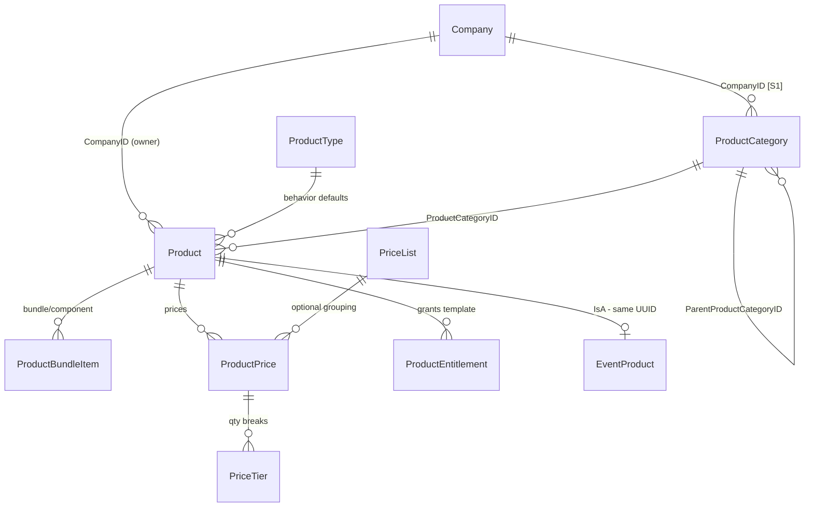
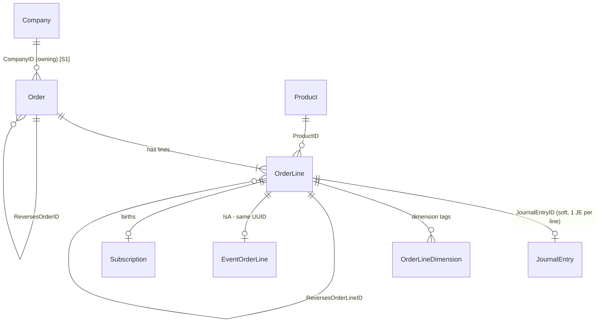
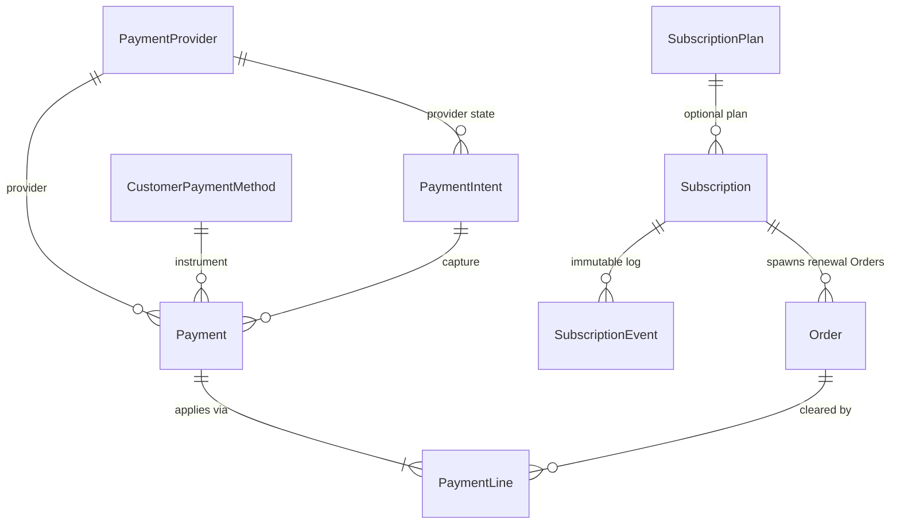

# BizApps Orders — Master Plan

> **Status:** Single source of truth for BizApps Orders (consolidated 2026-07-23).
> **Repo:** `MemberJunction/bizapps-orders` · schema `__mj_BizAppsOrders`.
> **Positioning:** **Unified order management — products, orders, payments, subscriptions. The Order
> is the transactional substrate *and the A/R primitive*; payments and subscriptions are aspects of
> the same business event.** Officially named **Orders** (higher-ups' wording choice); "invoice
> creation & tracking + payment management" is a category analog only — never reintroduce "Invoice"
> as an entity, type, or status.
>
> This document consolidates the entire prior plan chain (master plan + modification/update ledgers +
> question-stock answers + meeting rulings through 2026-07-23) into one current-state plan. It stands
> alone: there are no companion ledgers, markers, or meeting docs — **git is the history**. Where a
> decision came from a specific person's ruling, the attribution is noted inline so provenance
> survives without ledger machinery.
>
> **Sibling plan:** `bizapps-accounting/plans/bizapps-accounting-master.md` (consolidated 2026-07-22)
> — the accounting side of every boundary contract below.

---

## 0. Table of contents

1. [Context, positioning, and guiding principles](#1-context-positioning-and-guiding-principles)
2. [Architecture and scope boundaries](#2-architecture-and-scope-boundaries)
3. [Design decisions (current)](#3-design-decisions-current)
4. [Entity model](#4-entity-model)
   - 4.1 Product catalog · 4.2 Pricing · 4.3 Order + OrderLine · 4.4 Order as the A/R primitive ·
     4.5 Subscriptions · 4.6 Revenue-recognition envelope · 4.7 Payments & stored value ·
     4.8 Sales rules · 4.9 What is deliberately absent from the schema
5. [Order lifecycle and booking workflow](#5-order-lifecycle-and-booking-workflow)
6. [JE booking — the accounting integration](#6-je-booking--the-accounting-integration)
7. [Revenue recognition](#7-revenue-recognition)
8. [Payments](#8-payments)
9. [Multi-company and intercompany](#9-multi-company-and-intercompany)
10. [Pricing and coupons](#10-pricing-and-coupons)
11. [Tax](#11-tax)
12. [Sales rules and approvals](#12-sales-rules-and-approvals)
13. [Entitlements](#13-entitlements)
14. [Permissions, roles, and company scope](#14-permissions-roles-and-company-scope)
15. [UX direction](#15-ux-direction)
16. [The LXP launch (first integrating consumer)](#16-the-lxp-launch-first-integrating-consumer)
17. [Migration of legacy CDP data](#17-migration-of-legacy-cdp-data)
18. [Build sequencing (current priorities)](#18-build-sequencing-current-priorities)
19. [Open architecture questions](#19-open-architecture-questions)
20. [Open decisions parked with owners](#20-open-decisions-parked-with-owners)
21. [Out of scope and future-app boundaries](#21-out-of-scope-and-future-app-boundaries)
22. [Build inventory (state as of consolidation, 2026-07-23)](#22-build-inventory-state-as-of-consolidation-2026-07-23)

**Companion design docs** (each stands alone; linked from the section it revises):
- [`subscriptions-design.md`](./subscriptions-design.md) — subscription type rules, first-class
  terms, and where revenue-recognition entries anchor (revises §4.5 / D20)
- [`integration-testing-plan.md`](./integration-testing-plan.md) — the headless end-to-end suite
  built on MJ's testing framework: clean DB through catalog → orders → payments → subs → cancellation

---

## 1. Context, positioning, and guiding principles

BizApps Orders provides the **unified order-management substrate** for the MJ ecosystem. It subsumes
the previously-planned Payments and Subscriptions apps (MJ PR #2214) into one app, on the principle
that orders, payments, and subscriptions are aspects of the same business event — a customer commits
to pay, the system tracks both what they're getting and how they're paying.

### What we ARE

- **The substrate for customer-facing transactions:** products, orders, billing, payments,
  subscriptions, refunds, returns, credit memos.
- **The A/R front end:** the posted/confirmed Order *is* the receivable — there is no Invoice entity.
  The customer-facing bill is the Order rendered as a document.
- **Multi-company native:** one order can carry lines owned by different subsidiaries; each line
  books its own single-company journal entry into BizApps Accounting.
- **Payment-provider agnostic:** Stripe first; others pluggable via the `RegisterClass` pattern;
  Manual always available.
- **Subscription-aware:** a subscription is a continuity record that spawns a per-cycle renewal
  Order — recurring cadence = many Orders under one Subscription.
- **Reversal-disciplined:** every business event reverses at its own layer (return/credit-memo
  Orders, refund/chargeback Payments, subscription cancellations), each emitting reversal JEs.

### What we are NOT

- **Not the ledger:** JE creation calls into BizApps Accounting; we never maintain GL balances.
- **Not the tax engine:** a third-party engine calculates; we send inputs and record results.
- **Not the contract layer:** formal terms/escalators/renewal envelopes are BizApps Contracts
  territory (future; see §21).
- **Not an e-commerce storefront or CRM:** we are the transactional substrate; customer master lives
  in BizApps Common.
- **Not inventory/COGS:** a future BizApps Inventory bolts onto the seams we ship (§21).

### Guiding principles

1. **The Order is the substrate.** Every commercial event either is an Order or hangs off one.
   Fewest primitives: Orders + Payments; everything else (credit memos, invoices, statements) is a
   view or a reversal of them.
2. **Pen, not pencil.** After an order books, corrections are reversing/credit orders and reversal
   payments — locked history is never edited (mirrors accounting's immutability ethos).
3. **Metadata-driven behavior.** Product type + roles + links determine JE patterns, fulfillment,
   recurrence, and taxability — new behavior comes from metadata and pluggable classes, not engine
   forks.
4. **Atomic units of business work are Remote Operations.** A JE plus its lines, an order confirm
   plus its bookings, a refund plus its reversal JE — each is ONE transactional server call, never
   client-side multi-save choreography (Amith: "Remotable Operations for larger encapsulated units
   of logical work"; plain BaseEntity saves are fine for one-record edits).
5. **Build first, iterate in the system** (Amith 2026-07-21, Marcelo-endorsed): get the database
   built, work through bugs against the running system; plans stay thin; Amith reviews the BUILT
   code. Nothing is "done" until its tests are green and a demo artifact exists — a claimed status
   is a claim, not a fact.
6. **Deterministic test data + tiered validation:** every change validates through the tiered
   harness (unit → server → API → component → e2e) against generated seed data.

---

## 2. Architecture and scope boundaries

### Dependency stack

```
__mj                    MJ core: Company, User, Role, File
   ↑
bizapps-common          Person, Organization, Address, ContactMethod
   ↑
bizapps-tasks           Task primitives (approval gates run through it)
   ↑
bizapps-accounting      GLAccount + roles/links, JournalEntry primitives, Currency,
   ↑                    dimensions, tax snapshot tables, batching to the ERP
bizapps-orders  ◄── this plan
   ↑
bizapps-contracts       (future) agreement envelope — consumes Orders
   ↑
aidp                    analytics consumer (pull-only, cross-schema reads)
```

- **Currency is owned by accounting** (`__mj_BizAppsAccounting.Currency`); common never shipped it.
- **SQL Server first; PostgreSQL by conversion** (T-SQL source of truth, `sql-converter` output
  validated in CI). **UUID primary keys throughout.**
- **Cross-app entity naming:** `MJ_BizApps_Accounting: …`, `MJ_BizApps_Common: …`,
  `MJ_BizApps_Tasks: …`; schemas `__mj_BizAppsOrders` etc.

### Boundary contracts

**Orders provides upstream/consumers:** order lifecycle APIs (create/confirm/reverse via remote
operations), payment capture/refund/application, subscription lifecycle, entitlement grants + a
poll-based read/notify path, product catalog + pricing resolution.

**Orders sends accounting:** one JE create request per order line (and per payment event) through
the `Accounting.CreateJournalEntry` / `CreateJournalEntries` remote operations — balanced,
single-company, landing `Pending`; accounting batches to the ERP. "Book"/"post" = create a Pending
JE, never GL-post.

**Orders does NOT:** generate intercompany legs at booking (payment-side, §9); compute FX (§21
deferred); calculate tax (§11); maintain GL balances; know about batching/dispatch.

**Cross-app reference hardness (go-forward standard, Marcelo):** references from Orders into
accounting (`OrderLine.JournalEntryID`, `PaymentHeader.JournalEntryID`) are **SOFT refs for now** —
they become **hard, nullable FKs** once the MJ CodeGen include-mode work lands (Marcelo owns that
PR; MJ's own OpenApp publish policy expects downstream→upstream cross-app FKs — dependency-order
install makes them safe; the current blocker is a CodeGen bug where a foreign FK into a schema
pollutes that app's codegen). Accounting takes no dependency on Orders: JEs reference their origin
via soft columns (`OrderID`/`OrderLineID`/`SubscriptionID`/`PaymentID`) only.

### Standing migration practice (pre-production)

While nothing is deployed, schema changes are made by **editing the ORIGINAL baseline migration in
place**, rebuilding on a clean database, and re-running CodeGen — no incremental fix-up migrations
(Amith 2026-07-21). Once published, the publish-then-no-breaking-changes policy applies.

---

## 3. Design decisions (current)

The current decision set. Each is the standing ruling — superseded ancestors live only in git.

| # | Decision | Rationale / source |
|---|----------|-----------|
| D1 | **One unified app** — orders + payments + subscriptions in one repo/schema. | Tight entity overlap; one install; subsumes MJ PR #2214's two-app split. |
| D2 | **No Invoice entity — the confirmed/posted Order IS the A/R primitive.** It carries the receivable fields (`TotalGross`/`AmountPaid`/`Balance`/`DueDate`/`PaymentStatus`); `OrderNumber` is the document number; the customer-facing bill is the Order **rendered as a report**. A **credit memo is a negative-balance Order** (`OrderType ∈ {Return, CreditMemoOrder}`, `ReversesOrderID` set). Statements/consolidated bills are reports, not primitives. | Fewest primitives. Robert confirmed the terminology flip (order ≡ invoice) 2026-07-10; Marcelo re-confirmed 2026-07-14. |
| D3 | **Vocabulary is "Orders"** — official name and entity vocabulary; "invoice/payment management" only as category analogs. | Higher-ups' wording choice; Marcelo directive 2026-07-11. |
| D4 | **Product catalog is the behavior root.** `ProductType` carries behavior defaults (rev-rec type, taxability, fulfillment-required, recurrence); **type-driven IsA extensions** at Product and OrderLine level (shared-UUID disjoint children, e.g. `EventProduct`/`EventOrderLine`); seeded out-of-the-box types (Event, Membership, PhysicalGood, DigitalGood, Service, Donation, GiftCard, Bundle, AddOn/Fee, Subscription, Usage). A pluggable `ProductBehavior` class seam (most-specific-wins: Product → ProductType → default) is the escape hatch — schema ready, seam deferred. | Nail the catalog and orders/booking/rev-rec/tax inherit correct behavior. |
| D5 | **No GL columns anywhere in the catalog** — GL routing is **role-based** via accounting's polymorphic `GLAccountLink` (roles: AR, Sales, Deferred Revenue, Sales Discounts, Returns & Allowances, …). Resolution walk: product link → up the **product-company's own** category tree → the **product-company's** company-default link → **fail loudly** (tripwire; no silent fallback). Cached in `OrdersEngineBase` as a lazy `productID → {role → account}` map. | Amith 2026-07-02 engine meeting; resolution anchor moved to the product's company by Marcelo 2026-07-17. ⚠ Resolution perf/complexity deep-dive is a named pre-volume work item (§19). |
| D6 | **Company model:** `Product.CompanyID NOT NULL` is the **source of truth for line ownership** (revenue accrues to the product's company). `Order.CompanyID` = the **OWNING company** — document/ownership/visibility anchor only, never GL resolution. `OrderLine.CompanyID` = a **denormalized stamp of the product's company at line save** — perf/reporting + temporal integrity (if product ownership later changes, lines record who owned them at transaction time). Naming is plain `CompanyID` schema-wide; role-qualified names only where the role is the point (`PaymentHeader.ReceivingCompanyID`). The resolved account must belong to the line's company (hard-block; cross-company mapping refused entirely). Read `Order.CompanyID` as the **ORIGINATING company** — the sales-attribution/document anchor (pairs with `Order.SalesRepUserID`); financially, company is fully implied per line by `Product.CompanyID` (Amith 2026-07-23). | MOD-3 lineage: Robert's Q2 answer (owning company exists) + Marcelo 2026-07-17 (product anchors the line) + Robert's written answers 2026-07-20 (line stamp; not an RLS need). Schema amendment pending (§18). |
| D7 | **Product categories are per-company rows** (`ProductCategory.CompanyID NOT NULL`) with **identical-name display-collapse** in the UI — no shared registry object; naming consistency via soft autocomplete suggestion. | Robert 2026-07-21, unambiguous: "five companies, 5 t-shirt categories… crossing them, no." Permissions decide it: company-scoped rows RLS-scope cleanly. |
| D8 | **Booking fires exactly once, on the FIRST transition to `Confirmed`;** failure **blocks** the Confirm (never silently unbooked). `Posted` = "the JEs are in the subledger" — near-instant after Confirm. **The two-step `Confirmed → Posted` status model stays as-is** (Marcelo 2026-07-22, final — Amith: "there was a reason for it"; a collapse can be revisited with Amith directly). | 07-02 engine amendment; Robert 2026-07-08. Idempotency = line-already-booked. |
| D9 | **Forward status skipping is allowed; the ORDER of stages is fixed.** Draft → Confirmed without Quoted is legal; you can't reach a later stage without its prerequisites' effects (booking on first Confirmed; can't Fulfill before Posted). `Voided` is reachable **only from Draft/Quoted** — after Confirm, corrections are reversing/credit orders. | Robert 2026-07-08/2026-07-10. |
| D10 | **ONE JE PER ORDER LINE — always** (even multiple lines of the same company). The order's journal entry is a **virtual concept** — a UI aggregation of the line JEs; batching nets them later anyway. Linkage = **`OrderLine.JournalEntryID`** (nullable, soft ref until include-mode; the Order header carries NO JE ref; no junction table). | Amith 2026-07-21 ("always separate journal entries per order line — it's just simpler"); supersedes the one-JE-per-company split and the junction idea. |
| D11 | **Line JE shape (single-company by construction):** Dr the line company's **AR (net)** · Cr its **Sales (gross)** at the resolved role accounts · **discounts via the contra-account pattern** — Dr Sales-Discounts for the discount; absent a linked discounts account, net into the sales credit. Deferred-revenue-typed products credit the **Deferred Revenue** role instead of Sales (recognition staged per D14). Returns & Allowances role exists alongside. | Amith 2026-07-21. Coupon/campaign-code dimensions acknowledged as coming — deferred. |
| D12 | **Booking encapsulation:** an **`OrderJournalEntryFactory`** (orders server package) iterates the order's lines (parallelizable) and books each line's JE via the accounting engine; the **server-only Order entity subclass overrides `Save()`** — on transition into the locked status: outer transaction → `super.Save()` → factory books per-line JEs → stamp each `OrderLine.JournalEntryID` → commit; **any failure rolls back everything** (a locked order without its JEs is invalid state). The order object carries a **`Lines` array of unsaved OrderLine entities + a `Validate()` override** (≥1 line; children validate) so the entity guards its own invariants. Provider discipline: the entity's own provider throughout — never a fresh global `Metadata` in the transaction path. The JE-side encapsulation is now BUILT: accounting ships a first-class **`JournalEntryServerExtended`** (a `Lines` getter + properly scoped transactions for the full JE + lines persistence), so the factory composes with it — direct object manipulation server-side; the remote operations remain the client-facing atomic boundary. | Amith 2026-07-21 — the build basis; built and harness-proven on the donor branch (§22). JE-entity encapsulation un-deferred: built, Amith 2026-07-23. |
| D13 | **Intercompany: orders create NO due-to/due-from at booking.** "You don't know about intercompany anything until you get cash" — each line's AR sits with the LINE's company; IC legs and settlement mechanics arise on the **payment side** when built. No `IntercompanyFlow` table exists. Each line's JE stands alone as a complete single-company story (AR, Sales, Discounts, DefRev, …); when cash received by one entity is applied to an order carrying other companies' products, the payment-application step books the IC balancing entries. Amith re-affirmed this as the right design 2026-07-23 and **settled the AR grain 2026-07-26: A/R is per company, per line** — the seller-of-record alternative is withdrawn, not deferred. | Amith 2026-07-21, re-affirmed 2026-07-23, AR grain settled 2026-07-26; accounting D18 is the mirror. |
| D66 | **The intercompany legs book at ALLOCATION, not capture.** One journal entry per (payment line × company): the collector books `Dr Cash` for the whole allocation, `Cr AR` for its OWN share only, and a separate `Cr Due To <other>` per counterparty; each other company books `Dr Due From <collector>` / `Cr` its own AR. Allocation is the earliest point the owning companies are KNOWN — a capture says how much cash arrived, only an allocation says whose revenue it settles. `PaymentLine.BookedAt` is the idempotency key rather than a `JournalEntryID`, because one allocation produces N entries (found via accounting's D25 provenance pair). The PROCESSING FEE stays on the header as its own `Dr Fee / Cr Cash` entry — the processor takes its cut from the payment as a whole, and pro-rating it across allocations would invent precision the fact does not have. A missing `IntercompanyAccountMatch` is a hard refusal: a guessed account still balances, so the misposting would be invisible. | Built 2026-07-26; design in `intercompany-balancing.md`, lookup is accounting BA-D26/D27/D28. |
| D67 | **An event's own dates drive its line's service period.** When an order line's product has an `EventProduct` row and the line carries no service period, `ServicePeriodStart`/`End` are stamped from `EventStartsAt`/`EventEndsAt`; `AllBackEnd` then recognizes 100% on the event date automatically. An explicitly-set period WINS (a ticket to one day of a three-day conference is legitimate), a single-day event with no end date gets start-as-end rather than an open period, and subscription lines are untouched — their period comes from the term. Without this, the recognition date for a conference is hand-typed on every ticket sold and a typo books revenue in the wrong period with nothing downstream to disagree. | Built 2026-07-26 (`events` bundle EV1–EV10). |
| D68 | **A payment's `Amount` MUST equal the sum of its allocations, and over-paying an ORDER is legitimate.** Two separate rules that together delete "unapplied cash" as a concept. The payment-level one is an equality checked at the CAPTURE transition (not on every save, so a `Pending` payment stays a correctable draft exactly as a `Draft` order may have no lines); lines ride a `Lines` collection on `PaymentHeaderEntityServer` and save in ONE transaction, so no persisted state ever violates it. It is signed, not absolute — a refund stores `Amount` as a positive magnitude with NEGATIVE lines, so the check compares against `-Amount` when `Status='Refunded'`, the same discriminator the booking path uses to mirror. The order-level rule is the REMOVAL of a ceiling: applying more cash than an order is worth used to be refused, which made an everyday event unrecordable while the money sat in the bank. It now drives the order's `Balance` negative, and **that negative balance IS the customer's credit** — no separate instrument, because a second record holding the same balance is a second thing that can disagree with it. Spending a credit is `Orders.ApplyAccountCredit`: a payment with `Amount = 0` and two offsetting lines (minus on the credit order, plus on the target). Zero is the truth, not a degenerate case — no new cash entered the business, this only re-attributes money already received. Cross-company credits raise the D66 intercompany legs through the ordinary allocation path, which is required rather than convenient: a single `Dr A/R / Cr A/R` spanning two companies could not be booked at all (D6). **Two live bugs closed:** nothing ever compared allocations to the payment, so $5,000 could be spread across five orders from a $1,000 payment with every allocation booking cash; and `PaymentLine` had no immutability guard, so a captured payment's allocations could be rewritten underneath their journal entries (`trg_PaymentHeader_ImmutableAfterCapture` protected the header only). Schema cost: one nullable `PaymentDetail.SourceOrderHeaderID`, one renamed `OrderType` value (`CreditMemoOrder` → `AccountCredit`), one trigger. | Amith 2026-07-26: "we can't have PL <> PH amount… if the $ amount is not what order has, that's fine, that happens all the time, underpmts overpmts etc." Built as `account-credit` AC1–AC11. |
| D14 | **Revenue recognition = REAL forward-dated JEs written at booking-lock.** A 12-month $1,200 sub → 12 × $100 Dr DefRev / Cr Revenue JEs dated on the monthly anniversaries; an event product → ONE entry dated the event date. **Two recognition shapes:** single-date (100% on the date) and period waterfall (over the line's `ServicePeriodStart/End`). No schedule-bridge tables, no materializer, no daily job. **Changes/cancellations = correcting Orders whose entries NET against what's staged** — staged entries are never edited or deleted. Batches sweep forward-dated entries only when the date filter explicitly reaches forward (default cutoff = today, accounting-side). | Robert's model ("a wake-up job is fragile — just create them"), Jeremy sign-off; Marcelo adopted 2026-07-13/14. Accounting D15 is the mirror. Engine rework to this shape pending (§18). |
| D15 | **Fulfillment ↔ revenue recognition are DISCONNECTED.** Fulfillment is a logistics fact; NO JE fires on Posted→Fulfilled. If no line's product requires fulfillment, a Posted order **auto-advances to Fulfilled**; fulfillment-requiring lines hold the order for the fulfiller role (per-line flip queue deferred). | Robert 2026-07-09/2026-07-10. |
| D16 | **Reversals at every layer, each emitting its own reversal JEs:** Order → return/cancellation/amendment/credit-memo Orders with negative-quantity lines (`ReversesOrderID`/`ReversesOrderLineID`; partial reversals stack); Payment → refund/chargeback/bank-return PaymentHeaders (negative `Amount`, `ReversesPaymentHeaderID`); Subscription → cancellation with proration refund. Credit settlement paths: refund payment · apply-to-another-order (zero-cash credit-application Payment) · write-off (deferred until a real need). | Standard subledger pattern; audit trail by construction. |
| D17 | **Refund is ONE atomic remote operation** (`Orders.RefundPayment`): reversal Payment + reversing JE commit together or not at all (TransactionGroups don't cross the GraphQL boundary — same reason `ConfirmOrder` is an op). NOT blocked on Stripe: a Manual-provider refund is fully expressible (nothing moves on our side but the JE). Same pattern owed for create-into-`Fulfilled` (a future `Orders.CreateOrderInState`-style op that runs the real Confirm path). | Marcelo 2026-07-16: "no server op that writes the reversal payment and the journal entry in one transaction — that's a problem." |
| D18 | **Payment model** (revised by D36–D39): `PaymentHeader` (internal state; gross `Amount`, `ProcessingFeeAmount`, `NetAmount`) · `PaymentIntent` (provider-side state; webhooks update it) · **`PaymentLine`** as the cash-application junction (one Payment clears many Orders; one Order cleared by many Payments; `OrderHeader.Balance = TotalGross − SUM(posted PaymentLine.Amount)`, trigger-maintained (D41)) · `CustomerPaymentMethod` as the WALLET (its instrument fields now live in `PaymentDetail`, D38). `PaymentHeader.ReceivingCompanyID` = where cash hits. Capture JE: Dr Cash (net) / Dr Processing Fee / Cr A/R (gross). | BO-D16/D46/D47 lineage, unchanged. Fee JE leg is coded but dormant until a Processing-Fee role/account is seeded. |
| D19 | **Payment providers are pluggable** (`RegisterClass`/ClassFactory). **v1 = Stripe + Manual** (+ the internal StoredValue provider when gift cards activate). **Stub-first Stripe:** the committed success-stub is the default test provider; the **LXP-checkout subset of real Stripe** (PaymentIntent lifecycle + hosted checkout + webhook→capture) is pulled forward for launch; recon/forensics/idempotency-stress remain deferred. Webhooks: an **unauthenticated Express route** (raw-body capture + provider HMAC verification, mounted before auth — the MJ `SignatureWebhookHandler` precedent), idempotent via `ProviderEventID` uniqueness; the HTTP boundary is never an MJ Action. | BO-D12/D13/D23/D29; stub-first per Marcelo 2026-07-14 (LXP D8). |
| D20 | **Subscriptions:** `Product.SubscriptionType` declares recurring value; on first sale the behavior does **find-or-extend-or-create** for (Product, Customer, Beneficiary); **each billing cycle the Subscription spawns a renewal Order** (its own bill, D2). `SubscriptionPlan` is optional elaboration (multi-tier/cycle products); simple memberships need none. **Renewals spawn as `Draft` at launch** (a human confirms; Confirm books); the fuller shape is a **`RenewalSpawnStatus`** setting per type/plan ∈ {Draft, Quoted, Confirmed}. Downgrade = cancel-existing + new sub (clean audit; matches Stripe). No per-order accounting gate by default — batch approval is accounting's control point; exceptions via SalesRule; custom logic via the behavior seam. | BO-D24/D40 + Robert OF4 (2026-07-16; Jeremy validates the Draft default). Lifecycle build deferred behind booking (§18). |
| D21 | **Pricing:** `PriceList`/`ProductPrice`/`PriceTier` (effective-dated, pricing models flat/per-unit/tiered/volume/package/usage, fee types) are **built**; `OrderLine.UnitPrice` **direct entry remains valid and is the base of the precedence chain** — the resolution engine layers suggestion/resolution on top, so pricing never blocks baseline flows. ASC-606 fields (SSP, `ProductPerformanceObligation`) ship now; the allocation engine is future. | Robert deferred → Marcelo un-deferred 2026-07-14; tables built 2026-07-14. |
| D22 | **Coupons/promo codes: provider-model Option A at launch** — a `CouponProvider` abstraction where the provider (Stripe hosted checkout + promotion codes, exactly today's CDP behavior) owns configuration/application and **Orders records the outcome**. Recording schema lands at BOTH levels regardless: order-level discount structure (code, provider, provider coupon/promo IDs, total) AND line-level `DiscountAmount` (providers prorate; tax + GL operate on line amounts; `DiscountPct` alone can't express fixed/order-level discounts). The Orders-native `Coupon` entity is the **fast-follow**, slotting in as just another provider. Schema freeze gated (§20). | Robert A2 + OS7 (2026-07-14/16); LXP D10 (Amith: "v1, not hard"). |
| D23 | **Tax: Option B durable shape, calculation DELEGATED.** `ProductTaxCategory` + `Product.ProductTaxCategoryID` + `OrderLineTaxLine` per-jurisdiction snapshot rows + accounting's `TaxCalculationProvider` seam — but Orders never calculates: a third-party engine (Stripe Tax / Avalara class) does, and our tables record what it returned. Skip the "tax as a fake catalog line" shortcut entirely. Rate package: **buy, not build.** Launch-with-tax vs tax-exempt is an explicit finance call (§20), never a default. | Robert 2026-07-16 (Q21 answer); accounting D17 is the mirror. Tax remains deferred-by-complexity until that call — no stub (a stub is complex enough to become a blocker). |
| D24 | **Currency/FX deferred from the baseline** — no currency columns on Order/OrderLine; single-currency reality today. The design stands for later: rates from accounting, per-transaction snapshot on lines, realized-FX on cross-currency payments (computed upstream — accounting never generates FX entries). | 07-02 amendment; Robert 2026-07-10: "day one? No." |
| D25 | **No periods, no closed-period guard — backdating allowed, unguarded (final).** The order carries `OrderDate`; the JE bears its date; accountants batch entries into the right periods; any future timing rule detects by DATE, never a period FK. | Marcelo 2026-07-14 (final, after a same-day manual-close detour was withdrawn); mirrors accounting D2. |
| D26 | **Sales rules are metadata-driven** (`SalesRule` rule types + JSON predicates; `SalesAuthority` per-rep limits), evaluated at Order Confirm; violations raise an **"Approval Request" Task in BizApps Tasks** routed to the approver role (approve → proceed; reject → back to Draft with notes). The same tasks substrate carries every human gate (credit-limit override, discount exception, refund authorization, cancellation sign-off). Schema built; evaluation engine + routing not yet (§18). | BO-D17/D18/D27; tasks-app prerequisites verified satisfied 2026-07-15. |
| D27 | **Entitlements split into definition + grant.** `ProductEntitlement` is the template; `EntitlementGrant` is the instance created at booking/activation, carrying a **beneficiary** (defaults to the buyer; a line may designate another — attendee, gift-card recipient, honoree). Downstream apps **poll** grants (MJ Scheduled Job + Record-Set-Processing; Amith recommends the poll) — no bespoke webhook/notification system. Provisioning/enforcement engine is later. | BO-D34/D39; LXP D14 (2026-07-14). |
| D28 | **RETIRED (Amith 2026-07-31).** This decided that order visibility ran through a bespoke `UserCompanyRole` grants table in accounting, read by a hand-written orders-side RLS filter. That is an antipattern: **MemberJunction already has row-level security**, and every orders entity is a normal MJ entity subject to it. A parallel grants table would be a second answer to "may this user see this row", maintained by us and free to diverge from the one the platform enforces everywhere else — one security model plus a way around it. Company scoping is now an RLS filter configured as deployment metadata, keyed on `Order.CompanyID` (D6, unchanged). Orders seeds no roles: seeding one presumes a permission model this app does not own. `UserCompanyRole` was never built, and will not be. See §14. | Superseded by Amith 2026-07-31; originally Robert's written answers 2026-07-20 (MOD-9a). |
| D29 | **Naming convention: transactions get number + memo; master data gets names.** No `Order.Name` column — `Order.Description` is the searchable memo, drives workspace-tab captions, and joins name/ID search. Products/categories are already named. | Marcelo 2026-07-17 (ratified the accounting norm). |
| D30 | **Order numbering:** global `ORD-{seq}` via the `OrderSequence` table (as-built; payments likewise `PaymentSequence`). `ExternalDocumentNumber` exists as its own column (bill.com won't sync without it; may equal OrderNumber). Single vs BC-style dual sequence (draft → posted) is an open Jeremy decision (§20). | UPD-1 (Jeremy 2026-07-10). |
| D31 | **Line-level dimension tagging:** `OrderLineDimension` junction carries accounting Dimension/DimensionValue tags on order lines so JE generation propagates them into JE lines. | §15-Q5 lean, implemented in the baseline. |
| D32 | **`IsOverdue` is a computed/virtual surface** (`Balance > 0 AND DueDate < now`) — computed in the view/entity layer, **never stored state**. Dunning: overdue detection + worklist (`Orders.GetOverdueWorklist`); a **configurable `DunningGracePeriodDays`** setting (default 7, an Orders setting — per owning company when multi-company needs it) governs the post-failed-renewal hold, and dunning **notifies CS rather than auto-cancelling**. Reminder delivery channel is decision-gated (§20). | LXP D15/D16; Marcelo 2026-07-14 (configurable, not hardcoded). |
| D33 | **Forms-first UX** (Amith): first-class MJ Entity Forms for Order/Payment/Subscription/Product composed of reusable widgets dashboards embed directly; no bespoke pop-ups — modal/slide-in surfaces render the entity form through MJ's form host. Full direction §15, including the form-vs-workspace boundary and the convert-on-touch migration policy. | Amith 2026-07-17; accounting D22 is the mirror. |
| D34 | **UTC everywhere.** Every persisted timestamp is UTC; time zones are presentation-only. | Standing convention. |
| D35 | **Metadata-driven JE pattern selection:** `Product.RevenueRecognitionType` × `Order.OrderType` × reversal refs determine each line's JE pattern (immediate revenue vs DefRev + staged recognition vs reversal mirror). New rev-rec policies come from metadata, not code changes. | Original principle, unchanged. |
| D36 | **`PaymentType` is a first-class table, not a CHECK enum.** Code, Name, `IsReversal`, `RequiresProvider`/`RequiresInstrument`/`RequiresReference`, `DetailExtensionEntity` (IsA seam, mirroring `ProductType.ProductExtensionEntity`), Sequence — seeded via metadata, never SQL inserts. `PaymentHeader.PaymentTypeID` **replaces** the old `Payment.Method` enum entirely (no denormalized code column; pull the name in as an FK virtual field). Rationale: the old enum mixed forward methods with reversal types (`Refund`/`Chargeback`/`BankReturn`), so any "initial payment type" picker had to hardcode the excluded subset; `IsReversal` makes that a data question. The `RequiresX` flags drive both validation and which instrument fields the UI demands. | Amith 2026-07-25. |
| D37 | **`PaymentProviderType` is a LOOKUP, not a CHECK.** The as-built `PaymentProvider.ProviderType CHECK ('Stripe','Manual')` directly contradicted D19 ("new providers added without schema change") — adding JPM would have required a migration. Now `PaymentProvider.PaymentProviderTypeID` FKs a seeded lookup whose `Code` IS the `@RegisterClass` key, carrying `DriverClass` + capability flags (`SupportsTokenization`/`SupportsRefund`/`SupportsWebhooks`) so the UI can hide what a gateway can't do instead of failing at runtime. `PaymentProvider` stays the CONFIGURED account (per-company, credentials ref, live/test). | Amith 2026-07-25. |
| D38 | **`PaymentDetail` — one instrument shape, three hosts.** Holds every instrument field (tokenized: provider customer/instrument refs, brand, last4, expiry, holder — NEVER the PAN; bank: routing/account last4; manual: reference number for check no / wire confirmation, instrument date; gift card: `StoredValueAccountID`) plus `CompanyID` for audit, pushed down from the host. Referenced by `OrderHeader.InitialPaymentDetailID` (intent), `PaymentHeader.PaymentDetailID` (fact), and `CustomerPaymentMethod.PaymentDetailID` (wallet). This removes the duplicate card columns that previously lived on `CustomerPaymentMethod`, leaving it purely a wallet (customer scope + IsDefault + IsActive). Sparse nullable columns rather than per-type IsA subtypes for v1 — queryable and ~14 columns beats six extension tables — with `PaymentType.DetailExtensionEntity` reserving the IsA seam for adopters. | Amith 2026-07-25. |
| D39 | **Copy-on-use, never share; immutability is the guarantee.** Each host gets its OWN `PaymentDetail` row (wallet → copied onto the order; order's → copied onto the payment at confirm), so snapshots cannot drift. `SourceCustomerPaymentMethodID` records the wallet entry a copy came from — provenance without coupling, keeping "every payment made with this saved card" answerable. Enforced by a **filtered UNIQUE index on each host FK** (1:1 per host) plus an **immutability trigger** on PaymentDetail's instrument fields. Cross-host exclusivity is deliberately NOT enforced: the risk was drift, immutability removes it directly, and blocking sharing would cost three triggers each scanning the other two tables. | Amith 2026-07-25 — "we don't share, we use once and copy the values", immutability confirmed. |
| D40 | **`Order` → `OrderHeader`, `Payment` → `PaymentHeader`.** `ORDER` is reserved in BOTH T-SQL and PostgreSQL (and this app ships a PG conversion path), so the base table needed bracketing forever in raw SQL, dynamic SQL, and third-party reporting tools. `OrderHeader`/`OrderLine` and `PaymentHeader`/`PaymentLine` also read as the classic header/line pairing. MJ entity names are unaffected (`MJ_BizApps_Orders: Orders` regardless of base table), so only raw SQL changes. Renamed pre-production, when the cost is near zero. | Amith 2026-07-25. |
| D41 | **`OrderHeader` rollup fields are TRIGGER-maintained, not computed columns.** `TotalGross` (SUM of line gross) and `AmountPaid` (SUM of posted `PaymentLine.Amount`) are cross-table aggregates that a computed column cannot express; `Balance = TotalGross − AmountPaid` is computed in the SAME trigger rather than as a PERSISTED/GENERATED column so the behaviour is identical on SQL Server and PostgreSQL and depends on no `sql-converter` or CodeGen handling of computed-column DDL. `PaymentStatus` derives from the same trigger except `WrittenOff`, which stays an explicit action. `IsOverdue` remains view-computed (D32) — it changes with the clock, not with a write. | Amith 2026-07-25 (cross-platform parity over DB-guaranteed arithmetic). |
| D45 | **`SubscriptionType` is the rules table — DATA-first, with an OPTIONAL driver.** Deliberately a DIFFERENT pattern from `RevenueRecognitionType` (D43): RevRec is behaviour-first (the row names a driver that computes everything), whereas subscription rules ARE the columns — subscriber scope, start mode (immediate/deferred/calendar-anchored + anchor date + partial-period handling), term length, **billing cadence and recognition cadence separately**, concurrency (`AllowMultiple`/`ExtendExisting`/`RejectDuplicate`), reactivation, cancellation mode + refund policy, and grace. A base behaviour class reads those columns and implements the standard flows; `DriverClass` is **nullable** and, when supplied, **SUBCLASSES the base** so it inherits every rule it does not override. Rationale: most variation here is configuration, not code, and a driver-only model would force a class per permutation. | Amith 2026-07-25 — "some of the subs stuff is properties of Sub Type table but allow driver to plug in for any if needed, and the driver can subclass a base subs type class." |
| D46 | **`SubscriptionTerm` is first-class; `SubscriptionPlan` is REMOVED.** One row per contiguous coverage period, carrying the buying `OrderLineID`, window, amount, proration, frozen `RevenueRecognitionTypeID` and status. Renewals/extensions **append** a term rather than mutating a pointer, so `Subscription.CurrentPeriodStart/End` is dropped — "current" is the term whose window covers today, a query rather than a field that goes stale. **Recognition entries anchor to the TERM** (the release is caused by time passing over that period) while the **booking entry stays on the `OrderLine`** (caused by the sale, and what `OrderLine.JournalEntryID` already points at) — D25's polymorphic origin pair carries both. `SubscriptionPlan` dies because its content was three different concerns wearing one hat: cadence/trial are RULES (→ `SubscriptionType`), `PricePerCycle` is PRICING (→ `ProductPrice`, already effective-dated), and multi-tier is just separate Products. | Amith 2026-07-25. Full design: `subscriptions-design.md`. |
| D47 | **Product/ProductType junk removed.** `Product`: `SubscriptionType` string + `DefaultBillingCycle` + `DefaultSubscriptionTermMonths` collapse into `SubscriptionTypeID` (NULL = not a subscription); `IsActive` is dropped as **redundant with `Status`** (Draft/Active/Discontinued/EOL) — two overlapping state fields invite the "which one is authoritative" bug; `BehaviorClass` is dropped as unused speculative surface now that RevRec and Subscription each have a purpose-built driver seam. `ProductType`: `DefaultSubscriptionType` string → `DefaultSubscriptionTypeID`; `IsBillableRecurring` dropped as derivable (a product is recurring iff it has a subscription type); `BehaviorClass` dropped with Product's. | Amith 2026-07-25 — "clean up the product table to remove the junk stuff". |
| D48 | **Integration checks isolate by TRANSACTION ROLLBACK, not prefix-and-sweep.** MJ's own suite sweeps by name because its client-transport bundles have no transaction surface; every check we care about is server-transport, so each one runs inside a provider transaction that always rolls back. The booking path opens its own transaction and accounting's `CreateJournalEntries` opens another inside that — a Phase 0 spike confirmed the resulting **3-deep savepoint nesting** commits and rolls back correctly. Consequence: teardown is a plain FK-ordered sweep of the CATALOG with **no `DISABLE TRIGGER`**, because no booked history survives to fight the immutability triggers. Constraint that follows: while a check's transaction is open every query goes through the PROVIDER — a second connection blocks on its write locks until timeout. | Amith 2026-07-25 ("build ALL the code… then test with integration suite"). Detail + spike results: `integration-testing-plan.md` §0. |
| D49 | **Every document number comes from a singleton sequence table.** `OrderSequence`, `PaymentSequence` and now **`SubscriptionSequence`**, all read through one `nextSequence()` helper taking `UPDLOCK, HOLDLOCK` inside the caller's transaction. Replaces a derived `SUB-{order number}-{timestamp}` form that collided when one order bought two subscription products in the same millisecond. A subscription number is member-facing — the "membership number" read over the phone — so it earns its own counter rather than encoding whichever order happened to create it. | Surfaced by integration check SB1. |
| D50 | **A rejected confirm must say WHY on `LatestResult`.** `OrderEntityServer.Save` caught its booking errors, logged them, and returned a bare `false` — leaving `LatestResult` holding the header's SUCCESSFUL save, so callers saw "it just didn't work". The failure reason (unresolvable GL role, subscription rule rejection) is now registered as a `BaseEntityResult`. The log is not a return value; the UI, the API and the test suite all need the reason. | Surfaced by integration check SB9. |
| D51 | **All subscription date arithmetic is UTC.** `SubscriptionTerm.StartDate`/`EndDate` are calendar dates, but `OrderDate` round-trips through SQL Server as UTC midnight while `new Date(y, m, d)` builds LOCAL midnight. West of Greenwich that gap was enough for a purchase ON a calendar anchor to resolve "next anchor" to the same day and produce `EndDate < StartDate`, violating `CK_SubscriptionTerm_Dates` inside a booking transaction. `SubscriptionBehavior` normalizes the purchase date at its entry point and shifts only in UTC, with a unit regression guard that fails on the old code. | Surfaced by integration check SB6. |
| D52 | **`Orders.CancelSubscription` is the cancellation surface — policy in, reversal out.** The mechanic already worked (a negative-quantity line mirrors the JEs through the ordinary booking path, D16); what was missing was the POLICY and the affordance. Amith's case — a subscription running 1/1–12/31 cancelled on 7/1 — needed a line of quantity `-0.5`, which is correct double-entry and terrible data entry. The caller now supplies a subscription, a date and a reason; `SubscriptionBehavior.DecideCancellation` applies `CancellationMode` (Immediate / EndOfTerm / EndOfBillingPeriod), `CancellationRefundMode` (NoRefund / ProrateUnused / FullRefundWithinWindow + window) and `GracePeriodDays`, and the operation emits the reversal order, stamps the term and subscription, and logs a `SubscriptionEvent` in ONE transaction. `Preview: true` returns the decision without writing, for a confirmation screen. **Grace extends ACCESS (`Subscription.EndDate`), never revenue** — those are different dates and storing one in place of the other silently revokes access early. | Amith 2026-07-25, design §5. Before this the four cancellation columns were declared and read by nothing. |
| D53 | **Reversals MIRROR, they do not negate.** The factory built reversal drafts by passing negative amounts through, which accounting rightly refuses (`MALFORMED_DRAFT: line amount must be … > 0`) — a ledger line with a negative debit is not a thing. Reversal is now the same accounts with the debit and credit sides SWAPPED at a positive amount, computed on the absolute quantity. This means **D16's negative-quantity reversal had never actually booked**; nothing exercised it until the cancellation checks did. | Surfaced by integration check SC3/SC4. |
| D54 | **Proration reaches the ORDER LINE, not just the term** — and the subscription decision is therefore made BEFORE the lines are inserted. If only the term carried the reduced amount, a calendar-anchored membership bought mid-year would be invoiced the full price for a partial period and the booking entry would never reconcile with what the schedule recognizes. The line's QUANTITY is scaled (not `DiscountPct`: a short first period is not a concession, and routing it through the discount field would corrupt discount reporting and post the difference to the Sales Discounts contra account). Because the header is already `Confirmed` by the time lines are saved, the immutability trigger correctly refuses a later quantity change — so `Save()` now decides subscriptions first, `savePendingLines` inserts at the final quantity, and the term's `Amount` is then taken FROM the line. Those three numbers — billed, term, recognized — must agree or deferred revenue never clears to zero. | Surfaced by integration check SC4/SB5. |
| D55 | **Renewal is a SCHEDULED CONTINUATION, and `AutoRenew` is the consent switch.** `Orders.SpawnRenewals` finds subscriptions whose latest term expires inside their effective lead window and places a CONFIRMED renewal order at lead time — invoicing ahead of the period, which is how subscription billing works and which revenue handles correctly because recognition entries are dated into the new term's own window (D14). `AutoRenew = true` means the customer already consented to recurring billing, so the system places it; `AutoRenew = false` means it simply ends (reminder-and-approve is a communication flow, not a booking one). Lead days resolve `Subscription.RenewalLeadDays ?? SubscriptionType.RenewalLeadDays` — the NULL-means-inherit rule the schema documented and nothing implemented. Renewals go through `OrderEntityServer.Save` rather than a bespoke writer, so extension, term creation, GL resolution and the all-or-none guarantee are the SAME code as a customer purchase. **`IsRenewal` bypasses `ConcurrencyMode`**: that rule answers "may this subscriber hold a SECOND concurrent subscription?", and a renewal is not a second one — without the bypass a `RejectDuplicate` type would refuse to renew itself every cycle, silently. Idempotency has two independent guards because an unattended job that double-spawns double-bills: the selection only finds subscriptions whose LATEST term is expiring (so a booked renewal removes itself from the set), plus an explicit `RenewsSubscriptionID` check for the case where a prior pass booked the order but its term write failed. | Amith 2026-07-26 ("yep"). Was the last dead column pair — `AutoRenew` and `RenewalLeadDays` had no consumer. |
| D56 | **`SubscriptionEvent` distinguishes `Extended` from `RenewalOrderSpawned`.** The first is the CUSTOMER buying more coverage, the second is the SYSTEM renewing them under standing authority. Both append a term, but they are opposite answers to "why is this member still here" — collapsing them would make retention reporting read every auto-renewal as a fresh purchase. The entity server logs `Extended` and deliberately does NOT log when `RenewsSubscriptionID` is set, leaving that to the spawner. | Caught by check SR11, which found the entity server writing `RenewalOrderSpawned` for ordinary customer extensions. |
| D57 | **Payment capture books the CASH LEG; the sub-ledger and the general ledger move together.** Order confirm booked `Dr AR / Cr Revenue` while capture booked nothing — the rollup fields (D41) said paid while the GL carried the receivable forever, with nothing reconciling them. `PaymentHeader.JournalEntryID` existed and nothing set it. Capture now books `Dr Cash (net) / Dr Processing Fee (when any) / Cr AR (GROSS)` inside the caller's transaction, so a payment that fails to book does not persist as captured. **AR is credited GROSS**: the customer's debt clears for what they paid and the fee is our cost — netting the fee against AR would leave a residue on their balance no payment could ever clear. Idempotency is `JournalEntryID` NULL→value-once, not the status, so re-saving a captured payment for any reason books nothing further. Refunds MIRROR (D53). Consequence worth naming: **a linked `Cash` account is now a hard prerequisite** for using the initial-payment feature at all. | Amith 2026-07-26 ("build it all so nothing is a gap"). Fees are optional — accounting seeds no `Processing Fee` role, so a fee books separately only when one resolves, and the shortfall is logged rather than folded silently into Cash. |
| D58 | **Cash application is guarded.** `PaymentLine`'s only protection was `CHECK (Amount <> 0)`, so applying $500 against a $100 order was accepted and the triggers would compute `Balance = -400`, `PaymentStatus = 'Paid'`. Now a positive application may not take an order's applied total above its gross, and a negative one (unapply / credit memo) may not take it below zero. Over-payment is a real event but belongs in a credit memo or refund, not a data-entry slip. Deliberately NOT guarded here: whether the PAYMENT has budget left to allocate — one payment settles many orders, so that is a payment-side sum needing a lock across sibling lines, and a half-measure bolted onto the line would read as protection it does not give. | Caught the seed script hardcoding 605 against a 604.92 prorated order the same day it was written. |
| D59 | **`Orders.RefundPayment` (D17) is built, and a refund is a NEW payment, never an edit.** The original capture is history — it happened, it has an entry, and rewriting it would destroy the audit trail of money that moved. The reversal carries `Status='Refunded'` (which is what books the mirror), `ReversesPaymentHeaderID`, its own instrument snapshot (D39), and negative `PaymentLine` rows that un-apply the cash PROPORTIONALLY to how the original was applied — a payment split across three orders refunds across the same three. Guards: must be Captured, never more than remains (partial refunds accumulate), never twice. The processing fee is NOT reversed: the processor kept it. | Amith 2026-07-26. |
| D60 | **Entry types are accounting's vocabulary, not ours to extend.** Capture books `EntryType='PaymentReceipt'` and refunds `'Refund'` — two of the seventeen values accounting's CHECK constraint allows, alongside `OrderBooking` and `RevenueRecognition` which orders already uses. Inventing `PaymentCapture` was rejected at accounting's draft gate, correctly. Accounting has no payment tables at all (22 tables: GL, journal entries, batches, tax, currency); `EntryType` classifies the source EVENT so accounting can report "cash receipts this month" knowing nothing about the Orders schema. **Open tension worth raising with Marcelo:** that couples accounting's enum to upstream apps' concepts — a generic type plus a source-app dimension would decouple it. | Amith 2026-07-26 asked why accounting has payment concepts at all; this is the answer and the caveat. |
| D61 | **Ship-to moves to the ORDER LINE; bill-to stays on the header.** `OrderLine` gains `ShipToAddressID`, `ShipToOrganizationID`, `ShipToPersonID`, each falling back to the header INDEPENDENTLY (a line naming only a person keeps the header's organization). For a physical product this routes delivery; for an intangible — a subscription, an event seat — there is nothing to ship, so the same fields say WHO the line is for. That is deliberate reuse, not a parallel "beneficiary" set: it is one question whose answer happens to be an address when the thing is physical. Bill-to stays header-only — one order, one payer, one invoice. `OrderLine.RenewsSubscriptionID` (nullable, no FK) names a renewal target explicitly; naming one IS the statement of who the subscriber is, so the target's holder wins over the line's ship-to rather than requiring the caller to restate it. **The header-level `RenewsSubscriptionID` is REMOVED** — wrong grain (one order can renew several subscriptions) and it closed an FK cycle that broke teardown ordering twice. | Amith 2026-07-26. |
| D62 | **`SubscriptionType.BenefitModel` separates who HOLDS a subscription from who BENEFITS, and that sets the DEDUPE SCOPE.** `SubscriberScope` alone conflated the two. `Holder` = the benefit follows WHOEVER holds it, person or org — what a `SubscriberScope='Either'` type needs. `Individual` = a NAMED person benefits, who may differ from the holder (a corporate seat: the org pays, an employee is the member). `Organization` = the org's members benefit collectively (a trade association). **Three values, not two:** collapsing `Holder` into `Individual` was tried and reverted — it forces every flexible type to demand a named person and breaks org purchases, which 22 integration checks caught immediately. This is not classification for its own sake — it decides what counts as a duplicate: `OrganizationMembers` keys on the ORG so a second purchase extends the company's one membership, while `NamedIndividual` keys on the (org, person) PAIR so ten seats for ten staff are ten subscriptions rather than ten collisions under `RejectDuplicate`. **Before this, one order could not buy seats for more than one person.** Ship-to resolves in THREE tiers per side — the line, then the ORDER's ship-to, then its customer — so nothing is required at the line: an order shipping to one recipient states them once on the header, and a line overrides only when it differs. | Amith 2026-07-26: "sometimes a sub accrues benefits to an org… some sub types can be org level and others indiv level and some might be mixed." |
| D63 | **App-level settings use MJ's `ApplicationSettingEngine`; we add a typed façade, not a second engine.** `__mj.ApplicationSetting` (ApplicationID + Name + Value) is the sanctioned store and `@memberjunction/core-entities` already ships a cached `BaseEngine` over it — verified against our live Application row before building on it. `OrdersSettings` is a thin typed layer so callers read a real boolean with the default applied instead of parsing `"true"` and re-deciding the default at every call site. Being a BaseEngine, `AutoRefresh` propagates a settings change made through the entity API without a restart. | Amith 2026-07-26. I initially reported that MJ had no such engine — that was wrong, my grep excluded the directory it lives in. |
| D64 | **A person's organization is STAMPED at order time from their dated affiliation, governed by a setting.** `Person` has no organization column: bizapps-common models affiliation as a dated `Relationship` (FromPersonID → ToOrganizationID, with StartDate/EndDate/Status), so "which org did they belong to" is genuinely point-in-time and changes when someone moves employer. Deriving it on READ would silently rewrite the history of an order that is immutable once booked, so it is resolved once and stored. The rule: zero qualifying affiliations leaves it blank — **that IS a personal order, no flag needed**; exactly one is used; more than one takes the most recent by `StartDate`, because `Relationship` has no uniqueness constraint and holding several at once (employee here, board member there) is normal rather than exceptional. Inference only ever ADDS — a stated organization is never second-guessed. Both the master switch (`AutoPopulateOrganizationFromPerson`, default on) and the qualifying types (`OrganizationAffiliationRelationshipTypes`, default `Employee`) are settings: being a `Vendor` to an organization must not make it your bill-to, and widening that is a data change rather than a release. | Amith 2026-07-26. `RelationshipType` is a lookup table in common, not a hardcoded enum — checked, so no change is needed there. |
| D65 | **Bill-to and ship-to are PARTY pairs, and a subscriber can differ from both.** `OrderHeader` carries `BillToPersonID`/`BillToOrganizationID`/`BillToAddressID` and `ShipToPersonID`/`ShipToOrganizationID`/`ShipToAddressID`; `OrderLine` carries its own ship-to trio, defaulting from the header rather than being mandatory. The `Customer*` naming was dropped — a party is a person or an organization or both, and 'customer' hid which. `PaymentHeader`, `PaymentIntent` and `CustomerPaymentMethod` follow the same shape, the last with a CHECK that one of person/organization is present. | Amith 2026-07-26: "BillToPersonID/ShipToPersonID is better, more clear." Ship-to at line level is optional by design — naming a seat per line was rejected as too heavy. |
| D66 | **Subscriptions accrue to a HOLDER, an INDIVIDUAL, or an ORGANIZATION** (`SubscriptionType.BenefitModel`, default `Holder`). A trade association where one company enrols and every employee is a member is the Organization case; a named seat is Individual; Holder is whoever the order names. Dedupe scope follows the model, so the same product bought twice for the same beneficiary extends rather than duplicates. | Amith 2026-07-26. Built as two values first; 22 checks failed, which is what proved the third was load-bearing rather than decorative. |
| D67 | **Events are a product type with their own dates, and revenue defers to the event.** `EventProduct`/`EventOrderLine`; the line's `ServicePeriodStart`/`End` are stamped from the EVENT rather than typed per ticket, because a conference already knows when it is and a hand-typed date books revenue in the wrong period. An explicitly-set period always wins. | Amith 2026-07-26 — built inside orders rather than as a separate app. |
| D68 | **`PaymentHeader.Amount` MUST equal the sum of its lines, and over-payment is legal.** The invariant is checked at the CAPTURE transition, not on every save: a `Pending` payment is a draft. Over-applying to an order is permitted and drives its balance NEGATIVE — that negative balance IS the customer credit, spendable on another order through the `AccountCredit` tender, which writes a zero-amount payment with two offsetting lines. This deletes 'unapplied cash' as a concept rather than modelling it. Lines are frozen after capture (51010/51011). | Amith 2026-07-26: "The issue is inconsistency, not the business allowing overpayment." `CreditMemoOrder` renamed `AccountCredit`. |
| D69 | **Pricing resolves through the SAME walk as GL accounts** — product → its category → that category's ancestors → the company → a default resolver — with `BasePriceResolver` pluggable at any level. One row of `ProductPrice` IS one price rule: bands, seasons and time-of-day windows are several rows, and `Priority` disambiguates. **Ties are refused at WRITE time**, not resolved at read time. Direct `UnitPrice` entry always wins (D21). `Orders.PreviewPrice` runs the real pipeline, never a parallel one. | Amith 2026-07-27. Recurrence is delimited strings evaluated in TypeScript — never filtered in SQL, so a child table buys nothing. |
| D70 | **`Promotion` is the offer; `PromotionCode` is a redeemable string pointing at it** (Stripe's split, so D22's launch provider maps one-to-one). Stacking is configured PER COMPANY — both `Sequential` (two 10% → 19%) and `Additive` (→ 20%) are supported, defaulting to Sequential because it discounts less. Non-stacking collisions resolve by **highest value**, and the loser is recorded as offered-not-applied. Order-level promotions MUST allocate to lines. Manual discounts require a `SalesAuthority`; over the cap they **escalate** through `SalesRule.ApprovalRequiredRoleID` rather than being refused, and the approval is stamped. | Amith 2026-07-27: absence of an authority is not permission; the escalation was half-built and shipped silently applying over-cap discounts until a review caught it. |
| D71 | **Shipping, handling AND TAX are all CHARGES.** Modelling tax as a charge means multi-layer tax — state + county + city — is several charges rather than a special case, so ordering, allocation, override and GL treatment are written once. `ChargeType.Basis` decides what each computes on, which is how tax-on-shipping works and why it is configuration. Charges are computed, never hand-typed, but **overridable on the record** — an override stores who, when, why, and the value it replaced. **Tax layers never compound**: charges track a taxable base that non-tax charges enlarge and tax charges do not. | Amith 2026-07-26 ("tax is a charge") and 2026-07-29 ("we don't want to compound taxes"). Charges are per-line targetable, because taxability, nexus and exemption are all per line. |
| D72 | **Nexus is about the SELLER; exemption is about the BUYER — and they live in different apps.** `CompanyTaxNexus` (accounting) says where OUR legal entity must collect; `CustomerTaxExemption` (orders) says whether THIS buyer must pay, scoped by jurisdiction and product tax category, for a person or an organization. Both must hold to charge. Accounting's `CustomerTaxProfile` was DROPPED: it was inert, was the only customer-shaped table in a schema made of companies and entries, and could not express a person, an exemption type, or a product scope. | Amith 2026-07-28: accounting is the general JE/ERP engine; customer concerns start at orders. Confirmed independently by the ledger test — rates are read by AR *and* AP, customer exemption only by AR. |
| D73 | **Taxability inherits down the same chain as everything else**: product → category → its ancestors → product type. Nullable at product and category so 'ask my parent' is sayable; **NOT NULL at product type** so the walk always terminates with a real answer. Taxability and tax CATEGORY resolve independently through that chain. Rates resolve from the ship-to ADDRESS through accounting's hierarchical `TaxJurisdiction`, and a zero always records WHICH of the four reasons produced it — untaxable, no nexus, exempt, or no jurisdiction. | Amith 2026-07-29. Address→jurisdiction is a documented SEAM: postal/city matching is not rooftop-accurate, which is precisely where a commercial provider earns its money. |
| D74 | **A reversal is settled from the line it unwinds, not from the price table.** A line carrying `ReversesOrderLineID` inherits that line's `UnitPrice` and `DiscountPct` (a stated value still wins, as everywhere else), and the origin is the sole authority on three things: how much remains returnable — counting prior reversals across orders AND in-memory siblings on the same order — what it cost, and which product. Over-returning is REFUSED. Pricing is skipped entirely for a negative quantity: `ComputeAmount` cannot answer "which volume band does −5 land in?", and reaching it replaces a message about the return with one about quantity. | Found by the `returns` bundle, 2026-07-29. Each of the three produces a **balanced** journal entry when it goes wrong, so nothing downstream can catch it — a return priced at today's rate refunds last year's purchase at the wrong number, and over-returning refunds money never collected. |
| D75 | **A line's worth after discounts has exactly ONE definition** — `PricingBehavior.NetAfterDiscount`, shared by the stored `LineTotalNet` and the base that charges and tax compute on. The clamp in it is about **over-discounting, not about sign**: a sale cannot be discounted below zero (a negative sale reads as revenue when booked), and a credit cannot be discounted above it. | The two call sites each had their own copy and both used `Math.max(0, …)`, so every reversal line stored 0 while the ledger booked the real refund, and a return owed no tax refund. The ledger was right throughout — what disagreed was the line, which is what every report reads. |
| D44 | **Cross-app references point UP the dependency graph only.** `Order.ContractID` is **REMOVED**: bizapps-contracts is downstream of orders, so a reference to it — hard OR soft — inverts the app graph and encodes a contracts concern in an orders table. When that app exists it will join to orders from its own schema. This is the same rule that removed accounting's `AccountingCompanyProfile.DefaultPaymentTermsTypeID`. `Order.ApprovalTaskID` stays soft only because **bizapps-tasks cannot currently be installed alongside our bizapps-common** — tasks' generated views select `Person.DisplayName`, which exists on common's enriched VIEW but not on the `Person` TABLE we have; it becomes a real FK the moment the two are version-aligned (see the versioning memo). | Amith 2026-07-25 (PR #10). |
| D42 | **Initial payment on the order is a CONVENIENCE capture, and it is INTENT.** `OrderHeader.InitialPaymentTypeID` + `InitialPaymentAmount` + `InitialPaymentDetailID` record what the customer said they would pay at order entry; on confirm they auto-generate a `PaymentHeader` + `PaymentLine` applied to that order. They are written at order entry and **never updated once the payment exists** — the `PaymentHeader` is the record of what happened. Keeping them is what lets a quote carry payment intent before confirm and lets a failed initial payment preserve the request for retry. | Amith 2026-07-25. |
| D77 | **A bank debit (ACH) is a SEPARATE `PaymentProviderType` from cards, and it settles LATE.** `StripeACH` is its own row and its own driver, because the two rails differ in settlement (instant vs up to four business days), price (2.9% + 30c vs 0.8% capped at $5) and — the one that shapes the code — **a bank debit can be taken back after it has been booked**. `BasePaymentProvider.SettlesAsynchronously` is the driver's own declaration that it settles late; only a driver that opts in can have its payments promoted by a webhook, so the card path is untouched. The ACH driver's `Capture` is a **READ**: there is nothing to capture, so it asks Stripe what happened and refuses unless the intent says `succeeded`. | Amith 2026-08-02. Bill.com was evaluated first and dropped — its only real function here was ACH collection, and Stripe already had a working driver, a webhook route and a `Pending` payment status the model was built around. |
| D78 | **A returned debit REVERSES; it never edits the original.** `DecideSettlement` keys off the PAYMENT'S state rather than the event's name: a failure against a `Pending` payment fails it (nothing was booked), and a failure against a `Captured` one writes a reversing `PaymentHeader` through the same factory `Orders.RefundPayment` uses. Editing the original would erase a true fact about a past date, possibly in a closed period. A combination the table does not recognise resolves to **`Hold`** — logged loudly, nothing written — because both confident answers move real money on a reading we have already admitted we do not understand. Settlement runs BEFORE the webhook stamps `ProviderEventID`: stamping first would make a failed settlement `AlreadyApplied` on every retry, stranding a confirmed payment as `Pending` for ever. | Amith 2026-08-02. The reversal mechanics moved into `PaymentReversalFactory` so the deliberate refund and the bank return cannot drift apart — two implementations differing subtly would produce a reversal that balances, posts, and is wrong. |
| D79 | **Document delivery is a CHANNEL SEAM, and it is document-agnostic.** `BaseDeliveryChannel` takes a rendered document — subject, body, recipient — and gets it out; it knows nothing about invoices, which is what makes it reusable for statements, dunning notices, receipts and order confirmations. The shipped `Email` channel is thin over MJ's communication framework, which already owns providers, credentials, templates, preview and a persisted log per message. **Recipients have no fallback**: only the parties the ORDER names as bill-to are eligible, because "billing contacts, or the primary contact if there are none" is how an invoice reaches a general-enquiries inbox. A **draft or voided order is refused** — both render, and once rendered nothing distinguishes them from a real bill in an AP inbox. `Orders.SendDocument` is a separate action from `Orders.GenerateInvoice` rather than a flag on it: generating writes nothing, sending is irreversible. | Amith 2026-08-02, settling §4.4's "thin send-via-email first, with an Action-plugin seam". Not yet idempotent — the action returns an idempotency key per (document, channel, address) so a caller can build its own guard, because only the caller knows whether a repeat is a customer request or a retry. |
| D80 | **A payment intent is its OWN ROW, and opening one is its own step.** Every driver had implemented `CreateIntent` since the payment seam landed and NOTHING called it but unit tests — so `settleWithProvider` refused every provider-backed capture with *"there is nothing for the gateway to capture. Open an intent first"*, and there was no way to open one. `Orders.OpenPaymentIntent` is that step: it asks the gateway to stand ready, records the `PaymentIntent`, and returns the id `Orders.CapturePayment` now takes. It moves no money and writes no payment. The intent stays a ROW rather than becoming a status on `PaymentHeader` because **retries are 1:N** (a second ACH attempt is its own gateway intent), **an intent can exist with no payment** (abandoned checkout), and **`ProviderEventID` — the webhook idempotency key — lives on the intent** because events can arrive before any payment exists. The client secret is returned and never stored: it is a bearer credential, and the table deliberately has no column for it. | Amith 2026-08-02. The gateway path was complete at both ends and had no beginning; nobody noticed because no gateway payment had ever been run end to end. |
| D81 | **`bizapps-accounting` is a HARD REQUIREMENT, and the manifests do not say so yet.** Orders books revenue on confirm and cash on capture — `PaymentLineEntityServer` statically imports `AccountingEngineBase` and calls it on every allocation. There is no degraded mode and no feature flag; a genuinely absent package fails at module load. The `optional: true` peer markings are therefore WRONG, and they are known-wrong rather than intended: they exist only because accounting is unpublished, and npm 7+ auto-installs peers, so making them mandatory today fails every install and CI run with E404 (verified). They come out **the day accounting publishes** — a dated to-do with the exact five entries to delete lives in [`docs/dependency-on-accounting.md`](../docs/dependency-on-accounting.md). No workaround flag: a root `.npmrc` with `legacy-peer-deps=true` was tried and removed, because a repo-wide npm setting that silently changes resolution for every dependency is too large and too invisible a lever for one temporary problem. | Amith 2026-08-02: "accounting must definitely NOT be an optional peer dep, we must have a hard requirement for this — orders and payments both create JEs," then: document it as a to-do after accounting publishes rather than reach for the flag. |
| D82 | **The processor fee is READ per payment but ACCRUED at month end — it is not a per-payment ledger leg.** `PaymentType.BookProcessingFeeInline` decides per tender and **defaults to 0 for every one**, so nothing books a fee entry until a deployment opts a tender in. The reason is not fee-schedule complexity — the live path never CALCULATES a fee, it reads `balance_transaction.fee` from the gateway, so graduated and negotiated rates are the processor's problem. The reason is that **a per-payment fee leg cannot reconcile to a bank statement**: the processor BATCHES into payouts and deducts costs that never attach to any payment at all (a failed-debit charge, a dispute fee, a monthly platform charge), so booking one category per transaction yields a Cash figure that is right in aggregate only if every other category is captured, and never right on any given day. Accruing the whole cost once, from the statement Finance actually reconciles against, is simpler and more correct. The fee is still read and still stored on `ProcessingFeeAmount`/`NetAmount` — the flag decides only whether it becomes a journal entry, and a read that FAILS answers false loudly rather than refusing the capture. On the TENDER rather than the provider because that is the list an administrator curates; if per-provider granularity is ever needed this column becomes the default. **The proper long-term model is a clearing account** (`Dr Clearing/Cr AR` per payment; `Dr Cash + Dr Fees/Cr Clearing` per payout), which reconciles exactly because the payout total IS the fee total; that needs a `Payout` record and a statement import, is deliberately out of scope, and is compatible with this flag left at 0 everywhere. | Amith 2026-08-02: "I wonder about the wisdom of attempting to calc fees at all here versus letting that be an accrual at month end… I wonder if this will ever reconcile," then: make it a per-payment-type flag defaulting to false, as a migration + codegen rather than another rebuild. Per-payment attribution is the one thing the accrual cannot give, which is why the switch exists rather than the behaviour being deleted. |
| D83 | **An order's due date is RESOLVED at confirm and STORED, through a terms walk.** Nothing derived it: `DueDate` was only ever what a caller passed, `PaymentTermsType` had no rows, and the schema comment promising that `NetDays` derives the due date was aspirational. The consequence did not look like a missing feature — `Orders.GetOverdueWorklist` returned **zero rows as of any date**, against 67 orders carrying an unpaid balance, because aging, the worklist and the invoice all read that one null column. The walk is the third of this shape after D5 (GL accounts) and D69 (price): **stated `DueDate` → stated `PaymentTermsTypeID` → the buyer's `CustomerPaymentTerms` → the selling company's `AccountingCompanyProfile.DefaultPaymentTermsTypeID` → due on receipt.** Resolved ONCE at confirm and persisted, so three surfaces read one date instead of deriving three that can disagree. A **stated** date is recorded as stated and never recomputed — that is the entire interface a contracts app needs, and Orders grows no knowledge of contracts. Terms are deliberately **not per product**: they belong to the deal, an order carrying a Net 30 and a Net 60 product has no coherent answer, and per-line due dates would mean splitting the receivable. Unlike D5 this walk does **not** fail loudly — missing terms have a sane answer, and refusing a sale over an unconfigured lookup would be hostile. | Amith 2026-08-02: "we should have a default terms at the company level… then the ability to override that at various levels," and on products: "agree about product pushback, not a factor on a product." |
| D84 | **RETIRED: `RevenueRecognitionSchedule`, `RevRecScheduleLine` and `OrderLine.RevenueRecognitionScheduleID`.** Kept as "the computed envelope for MRR/ARR display and the computation source", and **nothing ever wrote them** — 14 lines in the review seed carry a deferred recognition type and not one had a schedule. Both stated purposes are already served by what recognition produces: the releases ARE a schedule (forward-dated, balanced, queryable in `JournalEntry`/`JournalEntryLine`), and the trail is those entries plus `OrderLinePriceComponent`. A second copy of the same facts is free to drift from the ledger, and **empty tables that look authoritative are worse than absent ones** — a report writer finds them and assumes they are the source of truth. Not redundant with Subscriptions, which was the first guess: the deferred lines in the seed carry no subscription at all. Redundant with the LEDGER. Forecasting, if it is ever wanted, belongs in an FP&A layer rather than beside the ledger. Revenue recognition itself is untouched — `RevenueRecognitionType` and the forward-dated entries stay. | Amith 2026-08-02: "I think the tables… are all redundant with what Subs does, why do we need it? I lean towards killing this," and "I don't need the forecast concept here, we'd model that later in the FP&A layer." |

---

## 4. Entity model

Schema `__mj_BizAppsOrders`. All UUID PKs. Shapes below are the **current design**; items tagged
**[S1 pending]** are the company-model amendment wave not yet in the baseline (see §18). Per the
standing practice (§2), amendments edit the original baseline migration.

### 4.0 ERD diagrams

#### Catalog

```mermaid
erDiagram
    Company ||--o{ Product : "CompanyID (owner)"
    Company ||--o{ ProductCategory : "CompanyID [S1]"
    ProductType ||--o{ Product : "behavior defaults"
    ProductCategory ||--o{ ProductCategory : "ParentProductCategoryID"
    ProductCategory ||--o{ Product : "ProductCategoryID"
    Product ||--o{ ProductBundleItem : "bundle/component"
    Product ||--o{ ProductPrice : "prices"
    PriceList ||--o{ ProductPrice : "optional grouping"
    ProductPrice ||--o{ PriceTier : "qty breaks"
    Product ||--o{ ProductEntitlement : "grants template"
    Product ||--o| EventProduct : "IsA - same UUID"
```

#### Order, lines, and booking

```mermaid
erDiagram
    Company ||--o{ Order : "CompanyID (owning) [S1]"
    Order ||--|{ OrderLine : "has lines"
    Product ||--o{ OrderLine : "ProductID"
    OrderLine ||--o| JournalEntry : "JournalEntryID (soft, 1 JE per line)"
    OrderLine ||--o{ OrderLineDimension : "dimension tags"
    Order ||--o{ Order : "ReversesOrderID"
    OrderLine ||--o{ OrderLine : "ReversesOrderLineID"
    OrderLine ||--o| EventOrderLine : "IsA - same UUID"
    OrderLine ||--o| Subscription : "births"
```

#### Payments & subscriptions

```mermaid
erDiagram
    Order ||--o{ PaymentLine : "cleared by"
    Payment ||--|{ PaymentLine : "applies via"
    PaymentProvider ||--o{ Payment : "provider"
    PaymentProvider ||--o{ PaymentIntent : "provider state"
    PaymentIntent ||--o{ Payment : "capture"
    CustomerPaymentMethod ||--o{ Payment : "instrument"
    Subscription ||--o{ SubscriptionEvent : "immutable log"
    SubscriptionPlan ||--o{ Subscription : "optional plan"
    Subscription ||--o{ Order : "spawns renewal Orders"
```

### 4.1 Product catalog

```sql
__mj_BizAppsOrders.ProductType                 -- behavior defaults per kind (D4)
  ID, Code UNIQUE,                             -- Event | Membership | PhysicalGood | DigitalGood | Service
                                               -- | Donation | GiftCard | Bundle | AddOn | Fee | Subscription | Usage
  Name, DefaultRevenueRecognitionType,         -- seeds Product.RevenueRecognitionType
  DefaultIsTaxable BIT, RequiresFulfillment BIT,
  IsBillableRecurring BIT, DefaultSubscriptionType,
  ProductExtensionEntity NVARCHAR NULL,        -- IsA subtype entity names (D4)
  OrderLineExtensionEntity NVARCHAR NULL,
  BehaviorClass NVARCHAR NULL,                 -- ProductBehavior ClassFactory key (seam deferred)
  IsActive BIT

__mj_BizAppsOrders.ProductCategory
  ID, CompanyID NOT NULL FK → __mj.Company,    -- [S1 pending] per-company rows (D7)
  Name, ParentProductCategoryID NULL,          -- hierarchical, within one company
  Code, Description, IsActive

__mj_BizAppsOrders.Product
  ID,
  CompanyID NOT NULL FK → __mj.Company,        -- [S1 pending: rename from OwningCompanyID + NOT NULL]
                                               -- the company whose revenue accrues (D6 source of truth)
  ProductTypeID NOT NULL, ProductCategoryID NOT NULL,
  ProductTaxCategoryID NULL,                   -- [lands with the tax build, D23]
  SKU UNIQUE, Name, Description,
  Status,                                      -- Draft | Active | Discontinued | EOL
  SuccessorProductID NULL, AvailableFrom/To,
  RevenueRecognitionType NOT NULL,             -- Immediate | Ratable | Milestone | Custom (D35)
  StandaloneSellingPrice NULL,                 -- ASC-606 SSP (fields now, engine later — D21)
  SubscriptionType NOT NULL DEFAULT 'None',    -- None | Standard | Membership | Custom (D20)
  BehaviorClass NULL,
  DefaultBillingCycle, DefaultSubscriptionTermMonths,
  IsTaxable BIT, IsActive BIT
  -- NO GL account columns (D5): routing via accounting GLAccountLink roles

__mj_BizAppsOrders.ProductBundleItem           -- one structure, two order modes (bundle line
  ID, BundleProductID, ComponentProductID,     -- vs fast-path explode w/ SourceBundleProductID)
  Quantity, PricingMode,                       -- Bundled | SumOfParts
  SortOrder, UNIQUE (Bundle, Component)

__mj_BizAppsOrders.ProductPerformanceObligation  -- ASC-606; per-obligation SSP for future allocation
__mj_BizAppsOrders.ProductEntitlement            -- template: what a purchase grants (D27)
__mj_BizAppsOrders.EntitlementGrant              -- instance at booking: beneficiary Person/Org,
                                                 -- Quantity, ValidFrom/To, Status, ProvisionedAt
__mj_BizAppsOrders.EventProduct / EventOrderLine -- the shipped IsA extension pair (Event type)
```

### 4.2 Pricing

```sql
__mj_BizAppsOrders.PriceList        -- segmentation: currency-scoped, segment, effective-dated
__mj_BizAppsOrders.ProductPrice     -- PricingModel: Flat|PerUnit|Tiered|Volume|Package|Usage;
                                    -- FeeType: Standard|Setup|Recurring|Overage; effective-dated
__mj_BizAppsOrders.PriceTier        -- quantity breaks under a ProductPrice
```

`OrderLine.UnitPrice` direct entry is the precedence base (D21); the resolution engine
(`ResolvePrice`) suggests/resolves on top. Coupon recording columns land with the D22 schema freeze
(order-level code/provider/discount structure + line-level `DiscountAmount`).

### 4.3 Order + OrderLine

```sql
__mj_BizAppsOrders.OrderHeader                  -- ★ D40 (was `[Order]` — reserved word)
  ID, OrderNumber UNIQUE NOT NULL,             -- ORD-{seq} via OrderSequence (D30)
  OrderType NOT NULL DEFAULT 'Sale',           -- Sale | Return | Cancellation | Amendment | CreditMemoOrder
  OrderDate DATE NOT NULL,                     -- backdating allowed, unguarded (D25)
  Status NOT NULL DEFAULT 'Draft',             -- Draft | Quoted | Confirmed | Posted | Fulfilled | Voided (D8/D9)
  CompanyID NOT NULL FK → __mj.Company,        -- [S1 pending] OWNING company — doc/visibility anchor (D6)
  CustomerOrganizationID, CustomerPersonID, SalesRepUserID,
  BillToAddressID, ShipToAddressID, PaymentTermsTypeID,
  -- A/R — the Order IS the receivable (D2)
  TotalGross, AmountPaid DEFAULT 0, Balance,   -- ALL trigger-maintained (D41), not computed columns
  DueDate NULL,                                -- from PaymentTerms; IsOverdue is computed, never stored (D32)
  PaymentStatus DEFAULT 'Unpaid',              -- Unpaid | PartiallyPaid | Paid | Overdue | WrittenOff
  ExternalDocumentNumber NULL,                 -- bill.com identity (D30)
  -- Initial payment — CONVENIENCE capture of INTENT (D42). Auto-generates a PaymentHeader +
  -- PaymentLine at confirm; never updated once that payment exists.
  InitialPaymentTypeID NULL FK → PaymentType,
  InitialPaymentAmount DECIMAL(18,2) NOT NULL DEFAULT 0,
  InitialPaymentDetailID NULL FK → PaymentDetail,   -- own row, copied (D39)
  -- Lifecycle stamps
  ConfirmedAt, PostedAt, PostedByUserID,
  -- Reversals (D16)
  ReversesOrderID NULL, ReversalReason NULL,
  ApprovalTaskID NULL,                         -- → Tasks (sales-rule gate, D26). Soft ONLY until
                                               -- tasks/common are version-aligned (D44)
  RequestedDeliveryDate, Description, Notes    -- Description = the searchable memo (D29)
  -- NO JournalEntryID (D10 — linkage is per-line); NO currency columns (D24)

__mj_BizAppsOrders.OrderLine
  ID, OrderID NOT NULL, LineNumber, UNIQUE (OrderID, LineNumber),
  ProductID NOT NULL,
  CompanyID NOT NULL FK → __mj.Company,        -- [S1 pending] denormalized stamp of the product's
                                               -- company at save (D6 — perf/reporting/temporal)
  SourceBundleProductID NULL,                  -- fast-path bundle provenance
  Quantity NOT NULL (≠ 0; negative = reversal slice),
  UnitPrice, DiscountPct DEFAULT 0,
  LineTotalNet, LineTax DEFAULT 0, LineTotalGross,   -- computed, validated on save
  ServicePeriodStart/End NULL,                 -- the coverage period rides the line (rev-rec, D14)
  FulfillmentStatus NULL,                      -- Pending | Fulfilled | Returned (seam, D15)
  ReversesOrderLineID NULL,
  SubscriptionID NULL,                         -- if this line births/extends a sub
  JournalEntryID NULL,                         -- ★ D10: this line's booked JE (SOFT ref → hard FK
                                               --   when CodeGen include-mode lands)
  Description NULL

__mj_BizAppsOrders.OrderLineDimension          -- accounting Dimension/DimensionValue tags per line (D31)
__mj_BizAppsOrders.OrderLineTaxLine            -- [lands with the tax build, D23] per-jurisdiction snapshot
__mj_BizAppsOrders.PaymentTermsType            -- owned here (accounting delegates to it)
__mj_BizAppsOrders.OrderSequence / PaymentSequence  -- numbering state (D30)
```

**DB enforcement (as-built trigger family 51001–51005):** line financials freeze once the order is
Confirmed (with the `FulfillmentStatus` carve-out); payment financials freeze at Captured; status
CHECK constraints carry the lifecycle vocabulary. The triggers are the enforcement authority; forms
merely reflect state (§15).

### 4.4 Order as the A/R primitive

- `Balance = TotalGross − SUM(posted PaymentLine.Amount)`; AR aging, dunning, and drill-through all
  operate on Orders.
- The customer-facing "invoice" is the confirmed/posted Order rendered as a document — `OrderNumber`
  is its number, the lifecycle stamp its issue/tax-point date.
- **Credit memo** = an Order with negative lines and a negative Balance (`Return`/`CreditMemoOrder`
  + `ReversesOrderID`). Settle by refund Payment, by applying to another Order (a zero-cash
  credit-application Payment netting the two), or by write-off (`PaymentStatus='WrittenOff'`;
  the write-off op itself is deferred until a real finance need).
- **Statements / consolidated bills** = reports grouping a customer's Orders + Payments. Delivery
  lean (ruled): thin send-via-email of the rendered Order first, with an Action-plugin seam —
  BUILT (D79): `BaseDeliveryChannel` + the `Email` channel over MJ Comms, driven by
  `Orders.SendDocument`. A bill-presentment service becomes another channel if one is ever needed;
  bill.com was evaluated for that role and dropped (D77).

### 4.5 Subscriptions

```sql
__mj_BizAppsOrders.SubscriptionPlan     -- optional elaboration: billing cycle, price/cycle, trial
__mj_BizAppsOrders.Subscription         -- continuity record: OrderLineID (birth), CustomerOrganizationID,
                                        -- CompanyID [S1 rename], Status (Active|Paused|Canceled|Migrated|Trialing),
                                        -- period bounds, provider linkage (ProviderSubscriptionID),
                                        -- migration trail (MigratesFrom/To)
__mj_BizAppsOrders.SubscriptionEvent    -- immutable log; ProviderEventID UNIQUE (webhook idempotency)
```

> **⚠ Under revision — see [`subscriptions-design.md`](./subscriptions-design.md) (2026-07-25).**
> The model below expresses far less than real recurring behaviour needs: no term record (only a
> moving `CurrentPeriodStart/End` pointer), no calendar-anchored starts or proration, no separation
> of billing cadence from recognition cadence, and no rules for concurrency, reactivation,
> cancellation, or grace. That design proposes a `SubscriptionType` rules table (pluggable driver,
> same pattern as D43) plus a first-class `SubscriptionTerm`, and proposes anchoring **recognition**
> entries to the term while **booking** entries stay on the order line.

Lifecycle per D20: first sale creates; renewals spawn per-cycle Orders (Draft at launch;
`RenewalSpawnStatus` per type/plan later); downgrade = cancel + new. Stripe-driven subs mirror
Stripe state via webhooks; manual subs are driven by our scheduler. The find-or-extend-or-create
behavior and the renewal-spawn job are the deferred remainder of the subscription build (§18).

### 4.6 Revenue-recognition envelope

RETIRED (D84). There is no envelope table. The forward-dated journal entries ARE the schedule —
dated, balanced and queryable — and the computation trail is those entries plus
`OrderLinePriceComponent`. See D84 for why a second copy was worse than none.

The waterfall math stands (per-period amounts, front-loaded rounding remainder in entry 1,
anniversary dating); what gets WRITTEN is real future-dated JEs at booking-lock. The as-built
ScheduledJournalEntry-bridge fields on these tables retire with the D14 rework (§18).

### 4.7 Payments & stored value

Revised 2026-07-25 (D36–D39): payment KIND and payment INSTRUMENT are now first-class tables
rather than CHECK-constrained strings scattered across the payment entities.

```sql
__mj_BizAppsOrders.PaymentType            -- ★ D36 first-class kind: Code, Name, IsReversal,
                                          -- RequiresProvider/Instrument/Reference, DetailExtensionEntity
                                          -- (IsA seam), Sequence. Seeded via metadata, not SQL.
__mj_BizAppsOrders.PaymentProviderType    -- ★ D37 gateway kind: Code (= the @RegisterClass key),
                                          -- DriverClass, SupportsTokenization/Refund/Webhooks.
                                          -- A LOOKUP, not a CHECK — new gateways need no migration (D19).
__mj_BizAppsOrders.PaymentProvider        -- a CONFIGURED gateway account: PaymentProviderTypeID,
                                          -- CompanyID, CredentialsRef into MJ Credentials, IsLiveMode
__mj_BizAppsOrders.PaymentDetail          -- ★ D38 the INSTRUMENT snapshot — one shape, three hosts.
                                          -- CompanyID (audit, pushed down from the host); PaymentTypeID;
                                          -- tokenized: ProviderCustomerRef/ProviderInstrumentRef, Brand,
                                          -- Last4, Expiry, HolderName (NEVER the PAN); bank: BankName,
                                          -- Routing/AccountLast4; manual: ReferenceNumber (check no /
                                          -- wire confirmation), InstrumentDate; StoredValueAccountID
                                          -- (gift cards); SourceCustomerPaymentMethodID = provenance.
__mj_BizAppsOrders.PaymentIntent          -- provider-side state; ProviderIntentID UNIQUE; OrderHeaderID ref
__mj_BizAppsOrders.PaymentHeader          -- (was `Payment`) PaymentNumber; ReceivingCompanyID;
                                          -- PaymentTypeID (replaces the Method enum); PaymentDetailID;
                                          -- Amount (negative = reversal); ProcessingFeeAmount; NetAmount;
                                          -- provider/intent refs; ReversesPaymentHeaderID;
                                          -- Status (Pending|Captured|Failed|Refunded|Disputed);
                                          -- JournalEntryID (booked at capture)
__mj_BizAppsOrders.PaymentLine            -- cash application: PaymentHeaderID × OrderHeaderID (+ optional
                                          -- line), Amount, AllocatedAt/By. One payment SPLITS across many
                                          -- orders; one order is cleared by many payments.
__mj_BizAppsOrders.CustomerPaymentMethod  -- the WALLET: CustomerOrganizationID, PaymentDetailID, IsDefault,
                                          -- IsActive. Instrument fields live in PaymentDetail, not here.
__mj_BizAppsOrders.StoredValueAccount     -- gift card instrument: code, issuing company, balance,
__mj_BizAppsOrders.StoredValueTransaction -- signed ledger (Issue|Redeem|Refund|Adjust|Expire)
                                          -- (schema shipped; the gift-card FLOWS are deferred — §21)
```

**PaymentDetail's three hosts** (D38). One instrument shape, referenced by whoever needs it:

| Host | Column | Meaning |
|---|---|---|
| `OrderHeader` | `InitialPaymentDetailID` | **intent** — what the customer said they'd pay with, at order entry |
| `PaymentHeader` | `PaymentDetailID` | **fact** — what actually ran |
| `CustomerPaymentMethod` | `PaymentDetailID` | the saved wallet entry's instrument |

**Copy-on-use, never share** (D39). Each host gets its OWN row; the wallet's detail is copied onto the
order, and the order's is copied onto the payment at confirm. Snapshots therefore cannot drift, so no
cross-host immutability coordination is needed. `SourceCustomerPaymentMethodID` records which wallet
entry a copy came from — provenance without coupling, so "every payment made with this saved card"
stays answerable. Enforcement: a **filtered UNIQUE index on each host's FK** (1:1 per host) plus an
**immutability trigger** on PaymentDetail's instrument fields. Cross-host exclusivity is deliberately
NOT enforced — immutability already neutralizes sharing, and blocking it would cost three triggers
each scanning the other two tables.

### 4.8 Sales rules

```sql
__mj_BizAppsOrders.SalesRule         -- RuleType (DiscountLimit | PaymentTermsRequired |
                                     -- ProductAuthorization | CreditLimit | MaxOrderValue | Custom),
                                     -- scope, PredicateJson, ApprovalRequiredRoleID
__mj_BizAppsOrders.SalesAuthority    -- per-rep limits: MaxDiscountPct, MaxOrderValue,
                                     -- allowed terms/categories
```

Schema built; the Confirm-time evaluation engine + Task routing are the pending build (D26, §18).

### 4.9 What is deliberately ABSENT from the schema

| Absent | Why |
|---|---|
| `Invoice` / `CreditMemo` entities | D2 — the Order is the receivable; credit memo = negative Order |
| `Order.JournalEntryID` / an Order↔JE junction | D10 — one JE per LINE; `OrderLine.JournalEntryID` |
| `IntercompanyFlow` + booking-time IC legs | D13 — intercompany arises on the payment side |
| Currency/FX columns | D24 — deferred until multi-currency activates |
| `AccountingPeriod` refs / closed-period guard | D25 — no periods anywhere; date-based rules if ever |
| GL account columns on Product/Category | D5 — role-based `GLAccountLink` resolution |
| `Coupon` tables | D22 — provider-model launch; native entity is the fast-follow |
| An `Order.Name` column | D29 — transactions get number + memo |
| `Payment.Method` / `PaymentProvider.ProviderType` CHECK enums | D36/D37 — replaced by the `PaymentType` and `PaymentProviderType` lookups |
| Instrument columns on `CustomerPaymentMethod` | D38 — they live in `PaymentDetail`; the wallet keeps only customer scope + IsDefault |
| PERSISTED / GENERATED computed columns | D41 — rollups are trigger-maintained for SQL Server ↔ PostgreSQL parity |
| Cross-host exclusivity on `PaymentDetail` | D39 — immutability removes the drift risk that exclusivity would guard |
| Webhook/notification tables for entitlements | D27 — consumers poll |
| `Order.ContractID` | D44 — orders must not reference a DOWNSTREAM app; contracts will join from its own schema |

---

## 5. Order lifecycle and booking workflow

```mermaid
stateDiagram-v2
    [*] --> Draft
    Draft --> Quoted : optional stage
    Draft --> Confirmed : skip allowed (D9)
    Quoted --> Confirmed
    Confirmed --> Posted : JEs in the subledger (near-instant)
    Posted --> Fulfilled : logistics fact only (no JE — D15);\nauto-advance when no line needs fulfillment
    Draft --> Voided
    Quoted --> Voided
    note right of Confirmed : FIRST transition books\none JE per line (D10);\nfailure BLOCKS Confirm
    note right of Fulfilled : after Confirm, corrections are\nreversing / credit-memo orders only
```

- **Stage order fixed, skipping forward allowed; effects always enforced** (booking on first
  Confirmed; can't Fulfill before Posted). `Voided` only from Draft/Quoted.
- **Confirm is a remote operation** (`Orders.ConfirmOrder`) — order row + per-line JEs in one
  transaction. The editor's start-status picker offers Draft/Quoted/Confirmed (routed through the
  op); Posted is pointless as a start status; Voided is out; create-into-Fulfilled awaits its own
  op (D17).
- **Booking mechanics (D12):** Save-override on the locked-status transition → factory books each
  line's JE via the accounting engine → stamps `OrderLine.JournalEntryID` → all-or-none commit.
  Idempotency = line-already-booked.
- **State-based validation matrix** in the entity server; totals validated on save; DB triggers
  freeze locked financials (§4.3).
- The **order-status vs financial-status split** (fulfillment and GL progress are independent
  concerns) was considered and deliberately kept as ONE linear status for v1 — revisit
  post-baseline (Robert flagged, Marcelo deferred 2026-07-08).

---

## 6. JE booking — the accounting integration

The orders-facing half of the contract (accounting's plan §14 is the mirror):

- **One JE per order line** (D10), single-company by construction, shaped per D11 (AR net / Sales
  gross / contra discounts / DefRev for deferred products).
- Booked via **`Accounting.CreateJournalEntry` / atomic `CreateJournalEntries`** remote operations —
  one TransactionGroup, all-or-none, typed errors. The old `AccountingService` façade concept is
  retired; the engine pair is `OrdersEngineBase`/`OrdersEngine` ↔
  `AccountingEngineBase`/`AccountingEngine`.
- **Account resolution** (D5) runs in `OrdersEngineBase` (browser-safe — the UI can show "accounts
  this product will use" at product setup); booking consumes it server-side.
- Every JE lands **`Pending`**; accounting batches and dispatches. Reversal orders book mirror JEs
  (flipped Dr/Cr, net-zero) marked at the order level; formal JE→JE reversal linkage
  (`EntryType='Reversal'` + `ReversesJournalEntryID`) is a contained deferred item.
- **Lineage:** accounting-side, each JE carries ONE polymorphic origin pair —
  `JournalEntry.LinkedEntityID`/`LinkedRecordID` → the OrderLine (accounting D25; the old
  per-entity soft-ref columns and the `JournalEntryLink` table are retired). Orders-side,
  `OrderLine.JournalEntryID` completes the round trip. Hardness upgrades per the §2 FK standard.
- **When JEs are emitted:** order lock (per-line booking JEs + forward-dated rev-rec JEs, D14) ·
  payment capture (Dr Cash net / Dr Processing Fee / Cr A/R gross) · refund/chargeback (reversal) ·
  return/credit-memo lock (mirror) · gift-card issue/redemption (liability pattern — deferred).
  Nothing fires on Posted→Fulfilled (D15).

---

## 7. Revenue recognition

Per D14 — the whole model in four sentences:

1. At booking-lock, deferred-revenue lines write their recognition waterfall as **real forward-dated
   JEs** (Dr Deferred Revenue / Cr Revenue), dated by shape: **single-date** (event → one entry on
   the event date) or **period** (sub → one per anniversary across `ServicePeriodStart/End`, rounding
   remainder front-loaded).
2. There is **no materializer, no daily job, no schedule bridge** — recognition "fires" by date;
   accounting batches sweep entries by date window (default cutoff = today).
3. **Changes and cancellations are correcting Orders** whose new entries net against the staged
   ones; staged entries are never edited or deleted.
4. MRR/ARR and the computation trail come from the LEDGER — the forward-dated entries themselves,
   plus `OrderLinePriceComponent` for how a line's price was arrived at. There is no separate
   envelope table (D84).

Fulfillment never recognizes revenue (D15). Bundle SSP allocation across performance obligations is
future (fields ship now, D21).

---

## 8. Payments

- **Model per D18 as revised by D36–D39** (first-class `PaymentType`/`PaymentProviderType`, `PaymentDetail` instrument snapshots, copy-on-use); **providers per D19/D37** (Stripe + Manual v1; stub-first Stripe with the real
  LXP-checkout subset pulled forward; webhook receipt as an unauthenticated raw-body route with
  HMAC + `ProviderEventID` idempotency).
- **Capture** books the payment JE (fee leg coded, dormant until a Processing-Fee role/account is
  seeded). **Application** is manual PaymentLine allocation today; auto-apply suggestion later.
- **Refund** = the atomic `Orders.RefundPayment` op (D17): reversal Payment + reversing JE in one
  transaction, guards (≤ un-refunded remainder; only Captured payments; no double-refund). The
  provider money-movement call is a separate, deferred concern — Manual refunds are fully
  expressible now.
- **Chargeback / bank-return** = reversal Payments (`Status='Disputed'` for chargebacks); dispute
  case management is future (§21).
- **Intercompany clearing rides the payment side** (D13): when cash lands with the receiving
  company, due-to/due-from legs clear sibling companies — design lands with the payments slice
  (reserved reference shape lives in the accounting plan §9).

---

## 9. Multi-company and intercompany

> **Detailed design:** [`intercompany-balancing.md`](./intercompany-balancing.md) — the
> `IntercompanyAccountMatch` lookup, the one-JE-per-(payment line × company) shape, worked examples,
> and the allocation rules.
>
> **AR grain is SETTLED (Amith, 2026-07-26): A/R is per company, per line.** The seller-of-record
> alternative is withdrawn, not deferred — it is no longer an open question and no longer costed.
> Booking stands exactly as built; the intercompany legs belong to the payment path.

- **Line ownership is the product's company** (D6): a three-company order is three lines whose JEs
  book AR + revenue in each product's own company. There are no cross-company mapping routes —
  cross-company revenue flows are intercompany TRANSACTIONS, and those arise **only at payment
  time** (D13).
- `Order.CompanyID` (owning company) anchors the document, visibility (D28), and the customer
  relationship — never GL resolution.
- **The payment half of D13 is BUILT** (2026-07-26). Allocation — not capture — books one entry per
  company owning a line on the order: the collector takes `Dr Cash` gross, credits only its OWN AR
  share, and credits a separate `Due To` per counterparty; each other company debits `Due From` and
  credits its OWN AR. Booking moved to `PaymentLine` because allocation is the earliest point the
  owning companies are known at all. Accounting owns the account lookup
  (`IntercompanyAccountMatch`, BA-D26); a missing pair is a hard refusal, never a default.
  Covered by the `intercompany` bundle (IC1–IC12). See
  [`intercompany-balancing.md`](./intercompany-balancing.md).
- **Consequence for booking:** no due-to/due-from at booking, and no AR concentration into a single
  selling entity. The customer-facing invoice can still present as one document (the order's JE is a
  virtual aggregation); the LEDGER holds per-line-company AR until payment allocates cash and raises
  the IC legs.
- **Company-scope UX semantics are deliberately unruled** — Marcelo's model (selected companies make
  the others *not exist* in the frontend, not mere query filters) awaits his dedicated scope
  planning pass; until then, no scope doctrine and no scope code. Interim: Payments scope by
  `ReceivingCompanyID`, Products by their company; Orders unscoped until `Order.CompanyID` lands.

---

## 10. Pricing and coupons

> **Detailed design:** [`pricing-charges-and-promotions.md`](./pricing-charges-and-promotions.md) ·
> **schema:** [`pricing-schema.md`](./pricing-schema.md)
>
> Supersedes D21's "tables built, engine future" framing. **All four phases are BUILT and green**
> (2026-07-29): price resolution with a pluggable resolver walk mirroring `GLAccountResolver`
> (D69); promotions with stacking, authorized manual discounts and escalation (D70); charges,
> including TAX modelled as a charge rather than a separate concept (D71); and tax resolution from
> the ship-to address with nexus, exemptions and a taxability inheritance chain (D72/D73).
>
> **What remains is the tax DATA problem, not the mechanism**: where rates come from. See §11.

- **Pricing per D21:** tables built; deterministic precedence with `UnitPrice` direct entry as the
  base; `ResolvePrice` engine on top; contract-override slot reserved at the top of the chain for
  future Contracts.
- **Coupons per D22:** Option A (provider model) at launch — Stripe hosted checkout + promotion
  codes own configuration/application; Orders records the outcome at order level AND line level
  (`DiscountAmount`). The Orders-native `Coupon` entity is the fast-follow, as just another
  provider. **Before the recording schema freezes:** map Stripe's Coupon-vs-Promotion-Code model
  end-to-end (incl. order/line-level discount reporting) and evaluate one second provider
  (Square/Shopify class) to find where models differ; Robert's schema review checklist (provider
  traceability · definition-vs-code split · both-level recording · redemption
  constraints/stacking · never blocks the Stripe-only launch) applies; Sidecar answers on coupon
  surfaces/shapes are owed (§20).
- Coupon/campaign-code **dimensions** on JE lines are acknowledged as coming — deferred (Amith:
  "we'll unfortunately have to add it… come back to that").

---

## 11. Tax

**Built (D71/D72/D73).** Tax resolves from the ship-to address: which jurisdictions reach it
(accounting's hierarchical `TaxJurisdiction`, matched on country/region/city/postal), whether this
company has nexus (`CompanyTaxNexus`), whether the product is taxable (the D73 walk), and whether
the buyer is exempt (`CustomerTaxExemption`, scoped by jurisdiction and tax category). Each
jurisdiction layer becomes its own charge, so state + county + city is three rows that sum rather
than one number that compounds.

**The four ways to owe nothing are recorded, not just totalled.** Untaxable, no nexus, exempt, and
no-jurisdiction produce the identical zero, so the reason is written as a zero-amount
`OrderLinePriceComponent`. An auditor asking "why was no tax charged" gets an answer.

**What is NOT built, and is the actual remaining work:**

- **Where rates come from.** The engine reads accounting's `TaxRate`; nothing populates it at scale.
  Real US geography is seeded in the integration fixture only — deliberately not in app metadata,
  because shipping a US rate table with the app is a maintenance promise nobody made.
- **A provider seam at the right altitude.** `BaseTaxJurisdictionResolver` answers "which of OUR
  jurisdiction rows match", which no commercial vendor can implement. A higher
  `BaseTaxDeterminationProvider` (lines in, computed tax out) is needed before any vendor
  integration, with the current resolver demoted to an internal detail of the built-in provider.
- **Rooftop accuracy.** Postal/city matching is not rooftop-accurate — a postal code can straddle a
  boundary — and the states themselves legislate that ZIP+4 is ambiguous. This is precisely where a
  provider earns its money.
- **Certificate expiry by INACTIVITY.** `CertificateExpiresAt` is correct for the ~28 states with
  fixed dates. 24 SST states plus six others define validity as "purchases continuing within any 12
  months", which makes it a function of the order table rather than a stored date — and it
  *un*-expires when a new order lands.
- **Economic-nexus threshold monitoring.** `CompanyTaxNexus` records obligations that EXIST;
  deciding when a new one arises needs three running accumulators per state (gross / retail /
  taxable, because states differ on which), and no vendor exposes this by API.

**Sourcing posture (research, 2026-07-28).** Outsource the DATA, insource the DECISION and the
RECORD. The free Streamlined Sales Tax files cover 24 states and carry **uncapped statutory**
hold-harmless relief; Avalara's accuracy guarantee is **capped at 12 months of fees** and void if
the error traces to address quality or nexus settings. Amith 2026-07-28: Avalara is overkill for
now. **Escalate to counsel before finalising payment architecture:** a platform that touches payment
on behalf of third-party merchants can become marketplace facilitator, and therefore seller of
record, in ~45 states.


---

## 12. Sales rules and approvals

Per D26. Rule types: DiscountLimit · PaymentTermsRequired · ProductAuthorization · CreditLimit ·
MaxOrderValue · Custom (JSON predicate). Flow: evaluate at Confirm → all pass → proceed; violation →
"Approval Request" Task (BizApps Tasks) linked via `Task Links`, routed to
`SalesRule.ApprovalRequiredRoleID`; approve → Confirm proceeds; reject → back to Draft, annotated.
The same substrate carries every other human gate (credit-limit override, discount exception,
refund authorization above threshold, cancellation sign-off, write-off approval) — reuse the
accounting `TasksAppApprovalGate` pattern. Schema is built (`SalesRule`/`SalesAuthority` seeded rule
types); the evaluation engine + routing + rule-editor UI are the pending build — not launch-critical
(post-launch or when discount-authority enforcement matters).

---

## 13. Entitlements

Per D27: `ProductEntitlement` (definition on the product) → `EntitlementGrant` (instance at booking,
with beneficiary defaulting to the buyer; per-line designation for attendees/recipients/honorees).
Grants are the machine-readable spine downstream apps read to provision access.

- **Read/notify path for consumers (the LXP):** a poll — MJ Scheduled Job + Record-Set-Processing
  over grants. No webhook system gets invented.
- The grant SHAPE freeze for the LXP awaits Ethan's answers to Robert's four questions (grant
  granularity · lifecycle coupling · read contract · team beneficiary semantics — Robert owns
  asking).
- Provisioning/enforcement engine: later, deliberately.

---

## 14. Permissions, roles, and company scope

**Orders builds no permission machinery of its own. MemberJunction already has it.**

An earlier version of this section (and D28) specified a bespoke `UserCompanyRole` grants table in
accounting, with orders reading it through a hand-written RLS filter. That was an antipattern and is
removed. MJ ships row-level security as a first-class feature — `RowLevelSecurityFilter` rows wired
to `EntityPermission` per role, with `{{UserID}}`-style substitution — and every entity in this app
is already a normal MJ entity subject to it.

Building a parallel grants table would have meant a second answer to "may this user see this row",
maintained by us, diverging from the one the platform enforces everywhere else. Two security models
is not twice the security; it is one security model plus a way around it.

**What this means in practice:**

- Company scoping is an RLS filter on the orders entities, configured as deployment metadata rather
  than written as code. A BCHQ order-desk user seeing every company is a filter that does not
  restrict; a single-company user is one that does. Neither is an application concern.
- Roles are ordinary MJ roles. If a deployment wants an order-entry role and a fulfiller role, it
  creates them the way it creates any other — orders does not seed them, because seeding a role
  presumes a permission model this app does not own.
- `Order.CompanyID` remains the ownership anchor (D6) and is what any company-scoping filter would
  key on. That has not changed; what changed is who enforces it.

Nothing here is deferred work. There is no orders-side permission feature to build.

---

## 15. UX direction

The binding UI-architecture rules (mirrors accounting §13; schema/engine remain this plan's core):

1. **Forms-first (Amith):** first-class MJ Entity Forms for Order / Payment / Subscription /
   Product (extend the generated forms; the MJ agents-app forms are the reference implementation),
   composed of reusable widgets dashboards embed directly. Modal/slide-in content = the entity form
   via MJ's form host (`forms.open()` / `<mj-form-dialog>` / `<mj-form-slide-in>` +
   `EntityFormConfig`) — "not custom pop-up things."
2. **Form vs workspace boundary (Marcelo):** the entity form is the home of simple one-record edits
   + detail viewing; the **workspace is the home of creation and advanced edits**; process surfaces
   are always workspaces; pop-out opens a record in its workspace. **The Order editor is the
   pilot** — its tab set (Details · Lines · Bill-To/Ship-To · Payments · Accounting) becomes the
   Order entity form's shape, reused everywhere the order opens. A forms **design pass** precedes
   the form-family build-out (base pattern + specialization, not over-standardized).
3. **Edit gating rides what MJ ships — nothing invented:** the DB triggers (51001–51005) are the
   enforcement authority; `*Extended` forms set `EditMode` from status and show the state's REAL
   verbs (Reverse / Refund / Cancel), never a disabled Save.
4. **Migration policy:** existing hand-rolled editors stay until touched — **convert-on-touch**
   (editing a surface for other work converts it to the form host in the same change); NEW
   create/edit surfaces are forms from the start; genuinely bespoke WORKFLOW surfaces
   (kanban/console/tree/worklist) are exempt. The order-editor pilot is its own slice.
5. **List idiom:** per-column filtering/sorting in AG-grid column headers (sortable/filterable
   columns indicated, index-limited); the card above each list shrinks to the time-span control +
   high-value preset chips (Orders: Overdue · Unpaid · Confirmed-not-Posted · my orders; Order
   History keeps its moving-window presets).
6. **Chrome (Matt):** container queries, not media queries; sticky interior chrome, content
   scrolls; tab content scrolls internally with tabs always visible; **required-state red-dot per
   editor tab + completeness-gated save** (the Order editor is exactly Matt's concern case);
   table-to-edge density OK with kept hierarchy.
7. **Dashboards ship as-is** (Amith: "don't put too much more work into this — improve based on
   user feedback"); correctness and forms-first work take the slots.

---

## 16. The LXP launch (first integrating consumer)

Sidecar's **LXP** (Ethan's team) is the first integrating consumer — Amith + John decided
(2026-07-14) that **BizApps Orders is the exclusive go-forward commerce engine**, on a dedicated
Sidecar instance, with BCSaaS refactored to wrap Orders as a fast-follow.

- **Launch surface:** the **LH4I individual checkout** — 3 fixed digital tiers + coupons +
  track/bundle selection + upfront Stripe card payment. LH4T (teams) is AD/manual.
- **Wiring:** **LXP → Orders DIRECT** for launch (the BCSaaS wrap moved off the critical path).
  **Contingency:** if the date slips, Teams-first launches with zero checkout dependency and LH4I
  self-serve switches on when Orders lands — never any new CDP wiring.
- **The minimal-BAO scope** (Ethan's list): products/tiers · coupons · entitlement-via-ProductType ·
  payment · DueDate/overdue · the grant read/notify path (+ tax only if the finance call says so).
- **The date owed (their A7):** Robert + Marcelo state it after the validation-first sequencing
  (§18) reaches its LH4I gate: a full dry run — buy a tier with a coupon through Stripe checkout
  (test mode) → order books → grants emitted → LXP-style poll reads them → sub + forward-dated
  rev-rec staged → payment captured → A/R correct — with committed harnesses green and a recorded
  demo. That gate passing IS "BAO ready for LH4I."
- Overdue/grace behavior per D32; entitlement notification per D27; renewals are NOT a launch need
  (annual terms).

---

## 17. Migration of legacy CDP data

At cutover (rides aidp Stage 4):

- `crm.Invoice` → posted Orders; `crm.Payment` → PaymentHeader + PaymentLine; `sdr.Subscription*` →
  Subscription (+ synthetic originating Order/OrderLines); `finance.Product`/`ProductCategory` →
  the catalog; `finance.PaymentTermsType` → PaymentTermsType. INT→UUID mapping throughout.
- **Open-AR cutover rule (ruled, Robert 2026-07-16):** transfer **open invoices only, and only
  those WITHOUT existing GL journal entries** — they enter Orders and book through the normal
  pipeline (importing an already-journalized invoice would double-book). Jeremy identifies which
  open invoices in the BC Data Platform lack GL JEs (the transfer set) + rules the treatment of
  already-journalized open invoices (stay in legacy for collection vs JE-suppressed import).
- Customer identifier stability (stable account numbers across systems) is a bizapps-common
  Organization-identity concern, not an orders migration.

---

## 18. Build sequencing (current priorities)

Ruling of record (Amith 2026-07-21, Marcelo re-prioritized 2026-07-22): **build first, iterate in
the system.** Validation discipline: cheap test tiers run before AND after structural changes; GUI
validates ONCE, after them; per-feature-vertical close-out with a demo artifact each — "built" is a
claim until its gate's tests are green.

1. **NOW — per-line booking (D10–D12), the priority.** Schema move (`OrderLine.JournalEntryID`,
   Order JE ref dropped) + `OrderJournalEntryFactory` + Save-override + `Lines`/`Validate()`
   encapsulation + contra-role seed (Sales Discounts, Returns & Allowances) + company-default
   `GLAccountLink` rows seeded for testing. **Built and harness-proven 8/8 on the donor branch**
   (§22); re-lands here deliberately.
2. **Company-model schema wave (S1):** `Order.CompanyID` + `Product.CompanyID` NOT NULL rename +
   `OrderLine.CompanyID` stamp + `ProductCategory.CompanyID` (per-company categories) + resolution
   walk re-anchored to the product's company + same-company link enforcement tiers.
3. **Rev-rec rework to D14:** retire the ScheduledJournalEntry bridge/materializer consumption in
   favor of forward-dated JEs at booking; correcting-order netting; downstream harness re-runs.
   (Pairs with accounting's batch rework: single-company batches + `PostingDate`.)
4. **LH4I feature slices (the V2 surface):** the 3 tiers + track bundles seeded/validated · Stripe
   real checkout subset (F.4/F.10) · coupon launch path (D22, after the schema-freeze
   investigations) · entitlement read/notify poll (D27) · overdue/grace config (D32) · subscription
   booking for tiers + staged rev-rec · tax IF the finance call says launch-with-tax.
5. **Full GUI validation pass** — once, after the structural waves; then feature-enabling UI only
   (forms design pass → order-editor pilot → convert-on-touch).
6. **Cross-app FK hardening** when the CodeGen include-mode PR lands (Marcelo owns).
7. **Later, triggers named:** payments-side intercompany design (with Q25's re-closure) ·
   sales-rule evaluation engine + approvals routing · subscription lifecycle/renewal spawning ·
   refund op + credit-settlement UI · fulfillment queue + order splitting · gift-card flows ·
   provider expansion · delivery/dunning channels · GL-resolution deep dive (pre-volume) ·
   CDP migration (aidp Stage 4).

---

## 19. Open architecture questions

Only genuine unresolved tensions inside the architecture. Where we have a defensible default we
proceed on it and the answer adjusts course.

1. **GL account resolution — hierarchy rules, ownership, and volume (Amith, 2026-07-24; DO NEXT).**
   The walk (product → its category → category ancestors → company default) is stated as a
   one-liner here (D5) and in accounting (D11), but **the rules are nowhere written down**, and
   the first implementation (orders' `GLAccountResolver`, 2026-07-24) had to decide all of the
   following unaided. Spec these:
   - **Precedence within a level** — accounting's `pickActiveLinkIndex` picks Active links whose
     `StartedAt`/`EndedAt` window covers the as-of date, latest `StartedAt` winning. Confirm that
     is the intended tie-break and write it down.
   - **Blocking vs falling through** — does an *inactive* link at a specific level stop the walk
     or fall through to the next level? (Today: falls through.)
   - **Category-tree traversal** — depth limit, cycle handling (the DB CHECK blocks self-parenting
     only), and whether per-company category trees (D7) can ever be crossed.
   - **The company invariant (D6)** — the resolved account MUST belong to the line's company.
     Accounting derives a JE's company from `GLAccount.CompanyID` and accepts no CompanyID in its
     contract, so a mis-resolved account books revenue to the WRONG legal entity with nothing
     downstream to catch it. This guard currently exists ONLY in orders' resolver.

   **Ownership question (the important one):** accounting exposes only the per-record primitive
   `ResolveLinkedAccount(entityId, recordId, role, asOf)`, so orders implemented the walk itself.
   Payments, subscriptions, and a future Inventory would each reimplement it and drift. Proposal:
   promote the walk into `AccountingEngineBase` as a first-class
   `ResolveAccountFor(product, role, asOf)` so every consumer shares one semantics, with orders
   keeping only its company assertion.

   **Performance (measured, not theoretical):** `AccountingEngineBase` DOES cache the links —
   `Config()` loads GL Accounts, Roles, Links, Link Dimensions and Dimensions, with BaseEngine
   auto-refresh. But `ResolveLinkedAccount` **linearly scans the whole links array on every call**
   (plus a second scan of link dimensions and a `find` over roles); nothing is indexed. Each order
   line costs 2–3 roles × up to 4 hierarchy levels ≈ 8–12 full scans, so a 50-line order against
   10k links is ~5M comparisons. Fix is cheap since the data is already resident: build an index at
   `Config()` time keyed `entityID|recordID|roleID → candidates[]`, making each lookup O(1).
   Also still open: denormalizing `CompanyID` onto `GLAccountLink` (engine-stamped,
   trigger-verified — liked, not yet approved).
2. **Company-scope UX semantics** (shared with accounting): Marcelo's "unselected companies don't
   exist in the frontend" model awaits his dedicated scope planning pass — no scope doctrine or
   code until then.
3. **Pending-JE void semantics** (shared with accounting): a source order voided before its JEs
   batch — hard-delete the Pending JEs or flag-and-carry at zero? Audit purity leans flag; branch
   unresolved.
4. **Order-status vs financial-status split:** fulfillment and GL progress are independent
   concerns overloaded on one linear status — deliberately kept single for v1; revisit
   post-baseline.

---

## 20. Open decisions parked with owners

Not architecture tensions — rulings owed by named people, with our default noted:

| Decision | Owner | Default while open |
|---|---|---|
| LH4I BAO-ready date (their A7) | Robert + Marcelo (after the §18 gate) | Teams-first contingency degrades gracefully |
| Tax at LH4I launch: Stripe Tax pulled forward vs explicit tax-exempt launch | Jeremy + John (finance) | tax stays deferred; never a silent default |
| Coupon surfaces beyond Stripe checkout · shapes actually used · LXP-side display/validation | Sidecar (John/marketing; Robert owns asking) | Stripe-page entry as today |
| Coupon recording-schema freeze (after the two provider investigations) | Robert (review checklist) | Option A launch path proceeds |
| Entitlement grant shape (granularity · lifecycle coupling · read contract · team semantics) | Ethan (Robert owns asking) | current definition+grant shape |
| Order numbering: single vs BC-style dual sequence | Jeremy | global `ORD-{seq}` |
| Renewal-spawn default (Draft) validation | Jeremy | Draft at launch (D20) |
| Already-journalized open invoices at cutover: legacy-collect vs JE-suppressed import | Jeremy | per D17 §17 rule, transfer only un-journalized |
| BC dispatch app registration + company-config standardization (accounting-side dependency) | Jeremy/Robert | accounting plan §7.5 |

---

## 21. Out of scope and future-app boundaries

**Deferred, design standing** (each has a revisit trigger; nothing here is a contradiction):
currency/FX (D24) · product variants (SKU matrix) · metered-billing engine (pricing fields ship) ·
ASC-606 bundle allocation engine (**RETIRED, not deferred** — `ProductPerformanceObligation` is
dropped; see D44 note below) · gift-card flows (schema ships; issuance/redemption/
cross-company/breakage later) · payment dispute case management · provider expansion
(PayPal/Square/Authorize/Adyen) · statements & consolidated-bill report packages · bulk
bill/statement delivery + bill.com adapter · per-line fulfillment queue + fulfillment
groups/order-splitting (Robert: real-world partial fulfillment splits the order) · write-off
settlement op · ProductBehavior plugin seam activation · browser catalog lazy-loading for very
large catalogs · customer portal / storefront · CDP migration timing (aidp Stage 4).

**Deferred to a NEXT VERSION — sales-rule evaluation and approval routing** *(Amith 2026-07-31)*.
The tables ship and one slice works; the rest is a v-next feature rather than something this version
needs. Recording precisely what is and is not live, because the gap is not visible from the schema:

- **Live:** `SalesRule.RuleType = 'DiscountLimit'` and `SalesAuthority.MaxDiscountPct`. A manual
  discount above a rep's cap is refused, and the message names the role that could approve it.
- **Schema only:** `PaymentTermsRequired`, `ProductAuthorization`, `CreditLimit` have no evaluator.
  `MaxOrderValue` is SELECTed by `PromotionEngine` and never compared. `AllowedPaymentTermsTypeIDs`
  and `AllowedProductCategoryIDs` are read by no server file.
- **The trap to fix first when this is picked up:** `PredicateJson` and `ScopeReferenceID` are read
  NOWHERE, so `Scope` is decorative — a rule saved as `PerProduct` or `PerCustomer` behaves exactly
  like `Global`, because nothing consults the reference that would narrow it. It configures cleanly,
  saves cleanly, and silently applies everywhere. That is a wrong answer that looks like a right one,
  so it wants a check asserting scope actually scopes, not merely that the rule fires.
- **Not built:** approval ROUTING. §3.31 says a violation should raise an Approval Request Task in
  bizapps-tasks routed to `ApprovalRequiredRoleID`. Today it refuses with a message instead. Note
  bizapps-tasks cannot currently be installed alongside our bizapps-common (see D44), so this is
  gated on that version alignment regardless.

**Explicitly out (other apps' domain):** GL functionality, financial statements, year-end close
(ERP / accounting) · contract terms/escalators/renewal envelopes, **and ASC-606 multi-element
allocation** (**BizApps Contracts** — future; Orders ships the seams: the pricing-precedence top
slot, a rev-rec override hook, order events. NOT `Order.ContractID`, which D44 removed — contracts
is downstream and will join to orders from its own schema. `ProductPerformanceObligation` went the
same way and for the same reason: splitting one transaction price across distinct obligations is an
agreement-envelope concern. Revenue recognition itself STAYS in orders — deferring revenue over a
subscription term is a different problem and it works today) · inventory, costing (FIFO/LIFO/Average), COGS, asset valuation
(**BizApps Inventory** — future bolt-on; Orders ships the seams: `PhysicalGoodProduct.IsStockTracked`,
`OrderLine.FulfillmentStatus`, fulfillment events; Inventory emits its own COGS/asset JEs into
accounting as just another upstream emitter) · CRM / customer master (BizApps Common) · marketplace
/ multi-vendor · returns logistics (RMA) · pricing optimization.

---

## 22. Build inventory (state as of 2026-07-31)

For orientation only — the plan above is the authority. This section previously described a donor
branch (`feature/accounting-integration`) that has long since been consolidated, and listed as
"not yet built" a dozen things that now ship with tests. It is rewritten against what is actually in
the tree.

**How to read it.** Everything below is verified by an executable check unless marked otherwise —
the suite is the source of truth, not this list. Current totals: **269 integration checks across 24
bundles**, **616 unit tests**, and the registry-parity tests that stop a bundle silently going
missing. `RequiresMutation` gates every integration check, so a run without `RUN_MUTATION_TESTS=1`
executes nothing and reports success; the parity floor exists because of that.

**Built and covered end to end**

- **Catalog** — types, categories, products, the Event IsA pair, entitlement templates, bundles.
- **Pricing** (D69) — the resolution walk, volume/tiered/package models, price lists and customer
  assignment, recurrence windows, the dry run, and the write-time ambiguity guard.
- **Promotions** — percent/amount/free-shipping/override, additive and sequential stacking,
  line and order scope, redemption limits, and explicit refusal reasons rather than silent no-ops.
- **Charges and tax** — charge types with allocation to lines, layered jurisdictions by postal
  geography, nexus gating, exemptions, and the taxability walk with recorded zero-reasons.
- **Booking** — per-line journal entries, discount contra, deferred revenue, forward-dated
  recognition (D14), and per-company entries on a multi-company order.
- **Payments** — capture, application, the allocation invariant, over-payment as customer credit,
  account credit as a tender, refunds, and the intercompany Due To/Due From machinery.
- **Payment providers** (D19/D37) — the driver seam, Stripe's stub, Manual, StoredValue, webhook
  signature verification with key rotation, and the fee split at capture.
- **Subscriptions** — find-or-extend, anchored and prorated terms, renewal spawning, cancellation.
- **Returns** (D16) — reversal lines, proportional unwind, tax given back, entitlement revocation.
- **Entitlements** (D27/D76) — the policy walk, grant timing, quantity modes, validity windows.
- **Gift cards** (D44) — issuance on sale as a LIABILITY, one card per unit, face value from
  UnitPrice rather than the discounted amount, idempotent re-save, and voiding on return.
- **Bundles** (D32/D41/D45) — expansion into component lines under a rollup parent that contributes
  zero, allocation by relative standalone selling price summing exactly, and `ParentOrderLineID` so
  two of the same bundle on one order stay distinguishable.
- **Fulfilment** (D15) — `Orders.GetFulfillmentQueue` and `Orders.FulfillOrderLines`. The queue is
  computed at read time, like the overdue worklist, so it cannot go stale; the flip marks lines and
  advances the order in ONE operation, because as two calls there is a window where every line is
  shipped and the order still reads Posted. An order advances when nothing is AWAITING fulfilment
  rather than when every line is Fulfilled — the mixed order (one physical line, one subscription)
  is the case the naive rule holds open forever, and a mutant using it is killed by FU5 alone.
  No journal entry fires, and FU8 asserts it.

**Shipped with a known limitation, recorded rather than hidden**

- **`Gift Card Liability` GL role** is not among accounting's seeded roles. Booking falls back to
  Deferred Revenue — the same shape of obligation, so the entry stays correct — and says so. Same
  tolerance pattern as `Processing Fee`, which was seeded by bizapps-accounting#32.
- **IsA children CAN be created through the object model** — an earlier revision of this section said
  they could not, and that was wrong. You create the CHILD and set both its own fields and its
  parent's; `BaseEntity` splits them by `EntityInfo.ParentEntityFieldNames`, saves the parent first,
  and gives the child the parent's primary key (BO-D37). It works any number of levels up the chain.
  What made it look broken was silence: on core 5.49.0 a failed PARENT save returned `false` with
  `LatestResult` null and an empty `ResultHistory`, because every result was written to the parent
  object that callers hold no reference to. Forgetting a NOT NULL parent column therefore produced a
  silent false. MJ PR #3280 fixes the diagnostics and ships in 5.50.0, which this repo now uses.
  The related claim that `IsVirtual=1 AND AllowUpdateAPI=1` was a CodeGen defect was also wrong —
  it is the deliberate MARKER for an IS-A parent field (CodeGenLib `manage-metadata.ts`).
- **Attaching a child to an ALREADY-SAVED parent is a different operation**, and the one place the
  fixture still uses SQL. `EventOrderLine` hangs off an order line the confirm has already written,
  and the IS-A save path always wants to save the parent too — which the immutability trigger
  refuses on a Confirmed order. That is an ordering constraint, not a limitation of IS-A.

**Not built** — each has a note in §21 saying why, and none is a surprise

- Sales-rule evaluation beyond `DiscountLimit`, and approval routing (deferred to v-next; see §21
  for exactly which slice is live and which is decorative).
- Statements and consolidated bill packages · ORDER SPLITTING (the queue ships; splitting one order
  into several shipments does not) · CDP migration tooling.
- **The review seed exercises one status.** All 75 orders are `Confirmed`; no line requires
  fulfilment, so `GetFulfillmentQueue` is empty the same way the overdue worklist was, and
  `PaymentProvider`, `PaymentIntent`, `PriceList`, `PriceTier` and `CustomerTaxExemption` have no
  rows. The back end has integration coverage for all of it — it just never reaches a screen. Worth
  fixing in `seed-review-data.mjs` before anyone demos this. (Orders-side RLS and role seeding are REMOVED, not deferred — MJ's own
  row-level security covers it; see §14.)
- Stripe against a real sandbox — the stub covers the path; the live run is a separate exercise.

**Retired, so nobody looks for it**

- `ProductPerformanceObligation` and the ASC-606 allocation engine — moved to bizapps-contracts per
  D44. Revenue recognition itself stays here.
- `Order.ContractID` — removed by D44 for the same reason.
