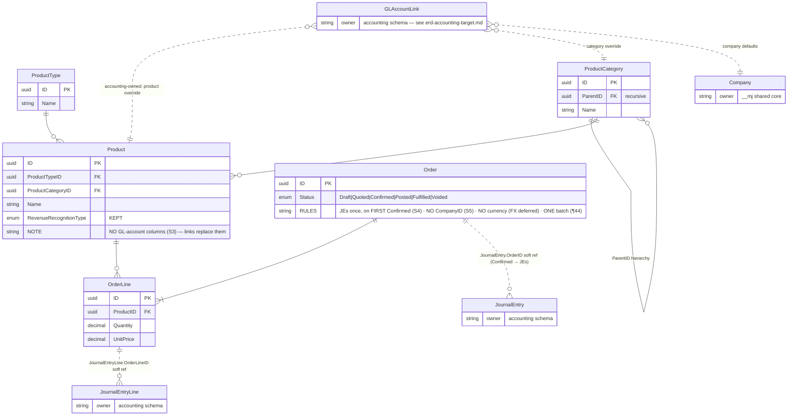
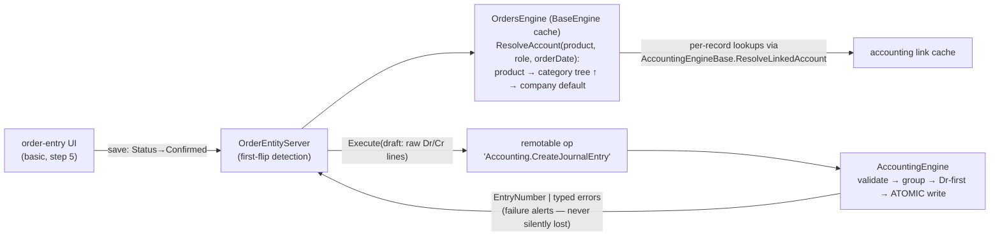

# ERD — bizapps-orders TARGET schema (scope fence, post 2026-07-03)
**v1.2 (RECREATED 2026-07-06 — original lost with the `accounting-engine-work` instance)**

Companion to `2026-07-02-engine-meeting-amendment.md` §3-4. System-wide views:
`~/MJDev/instances/develop-accounting-engine/erd-orders-accounting-interface.md` + `erd-full-system.md`.
Authority: AM-1..7 > 07-02 transcript (¶). Review artifact — no orders schema exists yet (first build).

**Orders builds NO GL-mapping tables** — accounting's polymorphic `GLAccountLink` points AT these records
(shown dotted). Deferred domains (payments, subscriptions, tax, pricing, FX) have no schema yet.

## The scope-fence tables

Lifecycle rules: Voided only from Draft/Quoted; post-Confirmed cancellation = a **cancelling order**
booking reverting JEs (`EntryType='Reversal'` + `ReversesJournalEntryID`), partial reverts supported (S9).

## Runtime flow — Order → Confirmed → JE

## Resolution example (Amith's Izzy scenario)

Izzy has three products. One company-level `GLAccountLink` (role **Sales** → account 40000) covers all
three by default. Jeremy wants t-shirt revenue tracked separately, so the t-shirt Product gets its own
link (role Sales → 40010). Resolution for an order line:

1. t-shirt → **product link found** → 40010 ✓
2. subscription → no product link → walk category tree → no category link → **company default** → 40000 ✓

Filters at every step: `Status='Active'` and StartedAt ≤ orderDate < EndedAt (null = open). Each resolved
link also surfaces its ordered `GLAccountLinkDimension` list (values from order context — ⚠ OQ-I).

## Deferred (no schema designed — S10)

Payments (cash JEs, payment-type→cash-account mapping) · Subscriptions/rev-rec (domain entity servers
generate SJEs, AM-6) · Tax calc (self-calc + jurisdictions/exemptions) · Pricing · FX · Intercompany (S11
— unaddressed, re-raise) · Approvals (later: MJ Tasks "Batch Review" task types + Flow Agent, ¶193-201).
