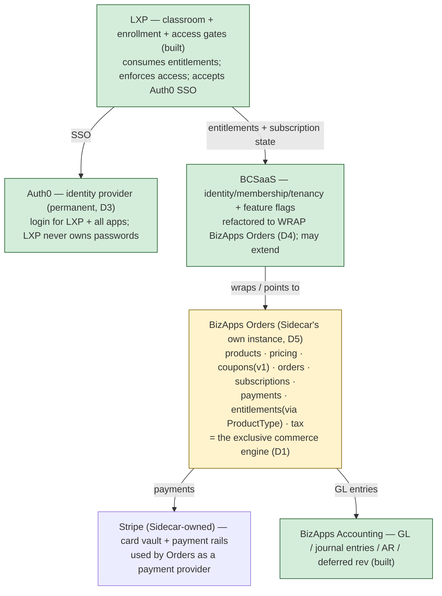

> ✅ **PROCESSED 2026-07-14 (Task 46a)** — triaged per the planning system, Marcelo-reviewed (P1–P6):
> UPD-6 (LXP = first integrating consumer; D1–D16 record; IsOverdue computed surface; CONFIGURABLE
> DunningGracePeriodDays) · MOD-6 extended (coupons v1 → S7/F10; dedicated plan
> `action-plans/ActionPlan - Coupons (schema to UI).md` awaiting Robert's schema review) · DEFERRALS
> updated (Stripe: stub-first then F3.5b checkout subset; tax: stays deferred, LXP dependency noted) ·
> QUESTIONS Q21 (tax structure, HIGH, Robert) · A1 answered in place (DueDate exists, S1) · D14/D15
> need no build (standard MJ / computed field). A7 (BAO date): Marcelo responding to Ethan.

# Intro

Hi 
Marcelo Torres, as you asked I've put together a requirements doc: "What the LXP Needs from BizApps Orders & Accounting." 
 
It's framed as what the LXP will need to consume when it replaces LearnWorlds — not a design for your side. Keep Orders/Accounting generic and reusable; the doc just lays out the needs (with a per-requirement gap analysis against the current Orders plan) so we can confirm they're satisfiable when the LXP plugs in. 
 
The most useful parts for you are the requirements catalog (§5) and the open questions (§6) — especially reconciling with the subscription stack BCSaaS already ships, an entitlement-change event/hook vs. pull-only, the missing past-due signal, and the v1/v2 line for coupons/overage/provisioning. 
 
Sharing it early on purpose: these are cheap to shape now, before schema lock. 


# LXP Commerce & Fulfillment — Decisions, Target Architecture, and the Launch Path

> **Status:** Decisions landed (Amith + John, 2026-07-14). Active working doc.
> **Date:** 2026-07-14 (v3).
> **Owner:** LXP team (Ethan).
> **Audience:** the **BizApps Order/Accounting team** (Marcelo, @rkihm-BC), **Amith** (architecture), **CDP/AIDP team** (Soham), **non-engineer Sidecar staff** (sales, CS, finance, John), and **LXP engineers**.
> **Purpose:** record how Sidecar sells and provisions learning **today**, the **decisions the team has now made** about how the LXP will do it going forward, the **target architecture**, and the **one remaining open item (launch timing)**. This is a working reference for the ~1-month launch and for the BizApps-Orders integration once it lands.
>
> **What changed v2 → v3:** v2 framed an *open fork* (keep CDP vs. adopt BizApps Orders) and leaned toward keeping CDP for launch. **Amith and John have now decided it.** The fork is closed: **BizApps Orders is the exclusive go-forward order/payment engine; CDP will not run checkout; Auth0 stays the identity provider permanently; merchant model is Model 1 (Sidecar sells to associations) at launch.** This version records those decisions and reframes the remaining work around them. The only thing still open is *timing/sequencing* against the ~30-day launch (§8).

---

## 🧭 Who should read what

| You are… | Read | Skip |
|---|---|---|
| **Non-engineer Sidecar staff** (sales, CS, finance, John) | §0 Executive summary · §1 Decisions · §2 The two offerings · §3 Glossary · §5 (merchant models) | §4, §6, §7, §8 (engineering detail) |
| **Amith / architecture** | §1 Decisions · §6 Target architecture · §8 Launch timing (the item handed back to you + Robert) | — |
| **BizApps Order/Accounting team** (Marcelo, @rkihm-BC) | §1 Decisions · §6 Target architecture · **§7 requirements + action items** · §8 | §2 (skim) |
| **CDP/AIDP team** (Soham) | §1 Decisions · §4 (current state, being replaced) · §8 | — |
| **LXP engineers** | Everything; cross-reference `docs/lxp-planning/foundation/02-subscriptions-billing.md` (needs a sync — see §6) | — |

---

## §0. Executive summary (plain language)

Sidecar is building a new learning platform (the **LXP**) to replace **LearnWorlds**. LearnWorlds is both our **classroom** and part of our **selling/fulfillment** chain today. The LXP already replaces the classroom; this doc is about **selling, subscriptions, and giving people access**.

Two facts frame everything:

1. **Today, our "cash register" for *individual* buyers lives in CDP** (also called AIDP): it takes payment on Sidecar's Stripe, creates the login in Auth0, enrolls the buyer in LearnWorlds, records the subscription, and handles renewals — live since March 2026. **Team/association deals are handled manually today** (Account Directors + a separate process), not through that checkout.
2. **The team has now decided the go-forward architecture.** All order entry and payment processing moves to **BizApps Orders** — BlueCypress's new, generic commerce engine — used **exclusively**. **CDP will not run checkout going forward.** **Auth0 stays our login system, permanently.** And Sidecar sells *to* associations (we collect the money) — we are the merchant.

The launch scope is smaller than it first looked, because our **primary offering (Teams) is sold by Account Directors, not self-serve.** So the only *self-serve* commerce the LXP must stand up is the **individual 3-tier purchase flow**. The **one open item** is timing: BizApps Orders is still being built, and launch is ~1 month out — so §8 lays out how we fit Orders into that window (scope + wiring + sequencing), **not** whether to use it (we are).

---

## §1. Decisions locked (Amith + John, 2026-07-14)

The spine of this doc. Everything below is downstream of these.

| # | Decision | Detail | By |
|---|---|---|---|
| **D1** | **BizApps Orders is the exclusive order/payment engine** | "Universal order entry and payment processing… via BizApps-Orders exclusively going forward." No order processing through CDP or third-party tools (e.g. HubSpot). | Amith |
| **D2** | **CDP will not run checkout** | The current CDP checkout is legacy; it is not the go-forward orchestrator. | Amith |
| **D3** | **Auth0 is the identity provider, permanently** | "We are not in the identity business, ever." The LXP never owns passwords/identity; it accepts SSO from Auth0. | Amith |
| **D4** | **BCSaaS wraps BizApps Orders** | BCSaaS is refactored so its subscriptions/plans/prices/etc. **point to** the central Orders engine; BCSaaS may *extend* some things (e.g. feature flags extending subscription types). | Amith |
| **D5** | **Sidecar gets its own BizApps Orders instance** | Initially separate; may one day unify with a BC-family Orders instance (TBD). | Amith |
| **D6** | **Merchant model = Model 1 at launch** | Sidecar is the merchant of record; associations **pay us**. | John + Amith |
| **D7** | **Model 2 (tenant runs its own top-level school) is a real future, not launch** | e.g. APTA as an LXP customer running their own school; they may *license Sidecar content* (content reuse managed by LXP; **finances not managed directly by LXP**). Build so this can be added **without major rework**. | Amith + John |
| **D8** | **Two offerings: LH4I (self-serve) + LH4T (AD-led)** | LH4I = individuals, 3 tiers, self-serve web + "Grace", Stripe. LH4T = teams/associations, sold by Account Directors via SOW, **not buyable on the website** at launch. | John |
| **D9** | **Seats are mostly unlimited / handled manually at launch** | Most associations don't pay per-seat; users are associated to their org **likely via email domain**; add/remove-user is needed, but paid seat-pools/reclaim are edge cases handled by CS at first. | John |
| **D10** | **Coupons/promo codes = BizApps Orders v1** | Needed; "not hard." Robert to spec if missing. | Amith |
| **D11** | **Learning-track selection → assigns a course bundle** | Individual can pick 1+ tracks (marketing, membership, finance…) which assign that bundle to their account. **Bundles yes; no installments** (paid upfront). | John + Amith |
| **D12** | **Entitlements via ProductType** | Digital product types tie to entitlements; confirm robustness with Robert. | Amith |
| **D13** | **Tax computed by BizApps Orders** | Orders holds the jurisdiction/exemption/category domain data; long-term wants a sales-&-use-tax rate package. | Amith |
| **D14** | **Change notification is standard MJ** | Options: (A) `BaseEntityEvent`, (B) an `LXPOrderEntity` subclass of the extended Orders entity, or (C) a **Scheduled Job + Recordset Processing** poll for updated orders/subs — Amith's pick for fault-tolerance. The "pull-only" worry is resolved. | Amith |
| **D15** | **"Overdue" = computed on the Order** | `Balance > 0 AND DueDate < now`, exposed as a computed/virtual field. **Action:** confirm the Order schema actually has `DueDate` (possible omission). | Amith |
| **D16** | **No free trials by default; ~1-week grace + CS notify** | Trials are AD/CS discretion; on failed payment, ~1 week before cut-off **and CS is notified to chase it**. | John |

### Action items that fall out of these

| # | Action | Owner |
|---|---|---|
| **A1** | Confirm/add `DueDate` on the Order schema (needed for D15) | Robert / Marcelo |
| **A2** | Spec coupons in BizApps Orders v1 (simple but extensible) | Robert |
| **A3** | Confirm the ProductType→entitlement model is robust enough for LH4I tracks/bundles | Robert + LXP |
| **A4** | Sales-&-use-tax calc approach + long-term rate/exemption package | Marcelo / Robert |
| **A5** | Domain-based user↔association association mechanism | LXP |
| **A6** | LH4T (teams) provisioning path — how AD/CS set up an org + grant track/bundle access + associate users | LXP + Soham/CS |
| **A7** | **Launch-timing decision** — realistic BAO-ready date + wire LXP→Orders directly first? (§8) | Ethan + Robert + Amith |

---

## §2. The two offerings that define launch scope

John's answer reshaped the scope: **Teams are sold by Account Directors, not self-serve.** So the launch build splits cleanly.

| | **LH4I — Learning Hub for Individuals** | **LH4T — Learning Hub for Teams** *(primary offering)* |
|---|---|---|
| Who buys | An individual, for themselves | An entire association |
| How | **Self-serve** — website + "Grace", Stripe checkout | **Account Director** conversation → SOW **outside the system**; *not* buyable on the website |
| Pricing | 3 fixed tiers (public pricing page), stable near-term | Consultative / AD-handled |
| Seats | n/a (individual) | Mostly **unlimited**; users associated via **email domain**; add/remove users needed; per-seat paying is rare (CS handles edge cases) |
| Payment | Upfront, card (Stripe) | Handled by AD process |
| **Launch build** | **The one self-serve commerce surface to stand up** — tiers + coupons + track/bundle selection + payment + provision into LXP (Auth0 SSO) + renewals | **Mostly admin/manual** — a way for AD/CS to set up the org, grant the purchased tracks/bundles, associate users, and let them in. **No self-serve seat-purchase build at launch.** |

> **The scope insight:** because **Teams (the primary offering) are AD-manual**, the LXP's only *self-serve* commerce dependency at launch is **LH4I** — a small, well-bounded flow. This is what makes the timing question in §8 tractable.

---

## §3. Glossary

| Term | Meaning |
|---|---|
| **BizApps Orders** | BlueCypress's new, generic order-entry + payment-processing engine. **The go-forward system for all Sidecar commerce** (D1). In active development. |
| **BizApps Accounting** | The financial ledger (general ledger, journal entries, AR/deferred-revenue reports). Built. Orders emits accounting entries into it. |
| **BCSaaS** | The shared multi-tenant SaaS layer the LXP already uses (identity/membership/tenancy + feature flags). Being refactored to **wrap** BizApps Orders (D4). |
| **CDP / AIDP** | Sidecar's existing data/orchestration platform. Runs today's **individual** checkout; **being replaced** for commerce (D2). |
| **Auth0** | Sidecar's identity provider (login). Stays, permanently (D3). |
| **Order / Subscription / Product / Price** | One-time purchase vs. recurring commitment; what you sell vs. how much/how often. |
| **Entitlement** | The record that says "this customer may access this content." The app reads it to gate access. Modeled via **ProductType** in Orders (D12). |
| **Enrollment** | The learning-side record that a specific learner is in a specific course/path (progress, certificate). LXP owns this. |
| **Merchant of record (MoR)** | The party that legally makes the sale — receives payment, appears on the receipt, owns tax/refunds/chargebacks. **Sidecar** (Model 1, D6). ([Stripe](https://stripe.com/resources/more/merchant-of-record)) |
| **Model 1 / Model 2** | Platform-as-merchant (Sidecar collects — **us at launch**) vs. tenant-as-merchant (each tenant collects its own money — future, D7). |
| **Stripe Connect** | Stripe's product for routing money to *third parties* (per-tenant payout accounts). Only needed for Model 2. Not built today. ([Stripe](https://docs.stripe.com/connect)) |
| **LH4I / LH4T** | Learning Hub for Individuals (self-serve) / for Teams (AD-led). (D8) |
| **Learning track** | A themed bundle of courses (marketing, membership, finance…) a buyer selects, which assigns that bundle to their account. (D11) |

---

## §4. How Sidecar sells learning *today* (being replaced)

Context for the migration — this is what BizApps Orders replaces.

**Individuals (LH4I) run through CDP today.** CDP sells 3 individual products via a self-serve checkout on Sidecar's Stripe, then a 7-step pipeline provisions the buyer:

```
   individual buyer ─▶ ┌──────────── CDP checkout pipeline (today, being replaced) ──────────┐
                       │ 1 Stripe payment ─▶ 2 plan lookup ─▶ 3 HubSpot deal ─▶ 4 Auth0 user │
                       │ 5 LearnWorlds onboard ─▶ 6 LearnWorlds enroll ─▶ 7 subscription rec  │
                       └───────────────────────────────────────────────────────────────────────┘
   Stripe (Sidecar-owned) ◀── renewals ──▶ CDP renewal workflow
```

- CDP keeps this in its **own `LMS.*` schema** (subscription/plan/event tables) — *not* BizApps, *not* `bizapps-common` identity.
- **Teams (LH4T) are handled manually today** (Soham: "team purchases run through a different system… done manually") — no self-serve checkout.
- **LearnWorlds** is today's classroom + fulfillment target; access gating there is client-side, tag-based (`"UG:"` team tags) — which the LXP replaces with **server-enforced** access.

**What carries over vs. changes:** the *facts* CDP proves are useful (Sidecar-owned Stripe works; Auth0 provisioning works; renewals work) — but per D1/D2 the *orchestration and state* move to **BizApps Orders**, and identity stays in **Auth0**. Existing paying customers must migrate without disruption (A6/§7).

---

## §5. Industry baseline + merchant-of-record models

The neutral, cited frame — and where our decisions land within it. **(Non-engineers: worth a read.)**

### The four-layer model

Commerce in learning splits into four separable concerns (true across LearnWorlds, Docebo, TalentLMS, Thought Industries):

```
  LAYER 1: SELL          LAYER 2: ENTITLEMENT      LAYER 3: ENROLLMENT      LAYER 4: ACCESS
  (the transaction)      (the right to access)     (learner ↔ content)      (runtime gate)
 ┌──────────────────┐   ┌────────────────────┐   ┌────────────────────┐   ┌──────────────────┐
 │ order / payment  │──▶│ entitlement /      │──▶│ enrollment record  │──▶│ can this learner │
 │ subscription /   │   │  track-bundle /    │   │ progress / cert    │   │ open this now?   │
 │ bundle           │   │  (what, how long)  │   │                    │   │ in good standing?│
 └──────────────────┘   └────────────────────┘   └────────────────────┘   └──────────────────┘
   BizApps Orders          BizApps Orders            LXP (built)              LXP (built)
   (D1)                    (via ProductType, D12)
```

The LXP already owns Layers 3–4. **BizApps Orders now owns Layers 1–2** (D1, D12). The entitlement (Layer 2) is the contract the LXP consumes to grant access.

### Who is the merchant of record? (decided: Model 1 now, Model 2 later)

Multi-tenancy does **not** decide who collects the money — Stripe offers the same multi-tenant platform in both configurations ([Stripe](https://docs.stripe.com/connect/saas-platforms-and-marketplaces)). Two models:

- **Model 1 — Platform-as-merchant.** Associations *buy from Sidecar*; Sidecar is the single merchant of record; one payment account; no Stripe Connect. **← This is us at launch (D6).**
- **Model 2 — Tenant-as-merchant.** Each tenant *resells* to its own learners and collects its own money via per-tenant payout accounts (Stripe Connect). **← Future (D7): APTA-style tenant running its own top-level school. Needs Stripe Connect, which nothing we have supports yet — so it's net-new when we do it.**

```
  Model 1 (launch):  Assoc A ─pay─▶ SIDECAR (MoR, one account) ─▶ members get access
  Model 2 (future):  learners ─pay─▶ Assoc A's own Stripe (Assoc A = MoR) ; Sidecar facilitates
```

Where real platforms land (splits by *business model*, not "how multi-tenant"): corporate LMSs (Cornerstone, Docebo, Absorb) sell the platform **Model 1**; creator platforms (Thinkific, Teachable, Kajabi, **LearnWorlds**) are **Model 2**; Thought Industries Panorama runs **both** — proof a hybrid is normal, so **choosing Model 1 now does not preclude Model 2 later** (D7). ([educate-me](https://www.educate-me.co/blog/cornerstone-lms-pricing), [LearnWorlds](https://www.learnworlds.com/product/features/checkout-and-payments/), [TI](https://support.thoughtindustries.com/hc/en-us/articles/15080796984727-Creating-B2B-Group-Subscriptions))

> **Telling irony:** LearnWorlds is a Model-2 platform, and on it **Sidecar is the tenant-merchant** (we connected our own Stripe). Building our own LXP to sell to associations flips us to Model 1 — us as the platform.

### Other baseline principles (all consistent with the decisions)

- **Never store card data** — hosted checkout + tokenization (Orders holds tokens, not card numbers). ([Stripe PCI](https://stripe.com/guides/pci-compliance))
- **Billed ≠ recognized** — deferred revenue / ASC 606; Orders emits GL to Accounting. ([Maxio](https://www.maxio.com/blog/saas-revenue-recognition-asc-606))
- **Don't build billing from scratch** — delegate behind a clean interface. This is exactly the LXP↔Orders posture. ([Schematic](https://schematichq.com/blog/build-vs-buy-the-real-cost-of-diy-billing-systems))
- **Decouple durable credentials from revocable access** — a lapsed subscription must not un-issue an earned certificate (LXP owns certs).

---

## §6. Target architecture (the decided end state)



Key points of the decided architecture:
- **BizApps Orders is the single commerce engine** (D1) — owns products, pricing, coupons, orders, subscriptions, payments, entitlements, and **tax computation** (D13). It uses **Stripe** as a payment provider underneath.
- **BCSaaS wraps Orders** (D4): its subscription/plan primitives re-root onto Orders; it may *extend* (e.g. feature flags).
- **The LXP consumes** entitlement + subscription state from this stack and enforces access; it **accepts Auth0 SSO** (D3) and never owns identity.
- **Sidecar runs its own Orders instance** (D5).
- **How the LXP learns of changes** (subscription lapse, new order): standard MJ — `BaseEntityEvent`, an `LXPOrderEntity` subclass, or a Scheduled-Job + Recordset-Processing poll (Amith recommends the poll for fault-tolerance) (D14).
- **"Overdue"** is a computed field on the Order (`Balance>0 AND DueDate<now`) (D15) — pending the `DueDate` schema check (A1).

> **Note — internal doc 02 needs a sync.** `docs/lxp-planning/foundation/02-subscriptions-billing.md` still describes a "Stripe owns the billing cadence; Orders mirrors it, with a Plan-B fallback" model. That is **superseded**: Orders owns order/subscription state and computes overdue itself. Doc 02 should be updated to match D1–D16 (separate task).

---

## §7. What the LXP builds & consumes — requirements + status

Updated against the decisions. **Legend:** ✅ decided/covered · 🛠 action/build · 🟡 confirm · ⬇ deferred (not launch).

| Area | What's needed | Status |
|---|---|---|
| **Order/payment backend** | All commerce via BizApps Orders | ✅ D1 |
| **Individual checkout (LH4I)** | 3 tiers + coupons + track/bundle selection + upfront card payment | 🛠 build on Orders (the one self-serve launch surface) |
| **Coupons / promo codes** | Discount codes at checkout | ✅ v1 (D10) · 🛠 spec (A2) |
| **Learning-track → bundle** | Pick 1+ tracks → assigns course bundle to account | ✅ D11 · 🟡 confirm via ProductType/entitlement (A3) |
| **Installments** | — | ✅ *not needed* (D11) |
| **Entitlements** | Purchase grants access; LXP reads to gate | ✅ via ProductType (D12) · 🟡 confirm robustness (A3) |
| **Change notification** | LXP learns of new/changed/lapsed subs to grant/revoke access | ✅ resolved — BaseEntityEvent / subclass / Scheduled-Job+Recordset (D14) |
| **Overdue / good-standing signal** | Drive dunning UI + grace | ✅ computed on Order (D15) · 🛠 confirm `DueDate` field (A1) |
| **Grace on failed payment** | ~1 week, then cut off; **notify CS** | ✅ policy (D16) · 🛠 LXP gate + CS notification |
| **Free trials** | — | ✅ not by default (AD/CS discretion, D16) |
| **Tax** | Sales/use tax at checkout/invoice | ✅ Orders computes (D13) · 🛠 approach + long-term package (A4) |
| **Identity / SSO** | Buyer lands in LXP authenticated | ✅ Auth0 SSO (D3); LXP builds SSO acceptance |
| **Provision buyer into LXP** | On purchase, create/associate the learner + grant access | 🛠 LXP onboarding path from Orders |
| **Teams (LH4T) admin setup** | AD/CS create org, grant tracks/bundles, associate users (email domain) | 🛠 admin/manual (A5, A6) — no self-serve at launch |
| **Seat pools / reclaim / enforcement** | Per-seat counting | ⬇ deferred — mostly unlimited/manual at launch (D9) |
| **GL emission** | Deferred revenue / AR entries | ✅ Accounting built; 🛠 wire Orders→Accounting hook |
| **Migrate existing customers** | Move current individual subs + learners onto the LXP/Orders without disruption | 🛠 LXP/partner-owned (A6) |
| **No card data on our side** | Hosted checkout, token-only | ✅ Orders token vault |
| **Model 2 readiness** | Don't preclude tenant-as-merchant later | ✅ design-for, not build (D7) |

---

## §8. The one open item — launch timing (we ARE using Orders)

**Decided:** BizApps Orders, full stop (D1). This section is **not** "whether" — it's **how to fit Orders into the ~30-day launch**, which is the concern Amith raised and handed to Ethan + Robert Kihm ("finishing BAO, then wiring into BCSaaS, then into LXP, all in time… is a concern").

We manage that risk **within an Orders-only world** using three levers:

1. **Scope — the launch surface is small.** Teams (LH4T, the primary offering) are AD/manual (D8), so they need **no self-serve checkout**. The only self-serve commerce that depends on Orders at launch is **LH4I** (3 fixed tiers + coupons + track/bundle + Stripe). Bounded and simple.

2. **Wiring path — go LXP → Orders directly for launch.** Amith's ideal end state is `LXP → BCSaaS → BizApps Orders` (D4), but the **BCSaaS-wrap does not have to be on the launch critical path.** Wiring the LXP to consume BizApps Orders **directly** for the LH4I flow removes one integration layer from the 30-day window; the BCSaaS-wrap becomes a fast-follow. (This is exactly the trade Amith asked us to weigh.)

3. **Sequencing contingency — Teams-first if Orders slips.** If BAO can't be ready for LH4I self-serve by launch, **launch Teams on the LXP first** (manual/AD, zero checkout dependency) and switch on LH4I self-serve **the moment Orders lands**. Existing individual customers keep their current access and are migrated only once Orders can take over — **no new CDP wiring, no bridge.**

### 🧭 The LXP team's lean (editable — the answer to hand back to Amith + Robert)

- **Commit LXP → BizApps Orders directly for the LH4I flow at launch; BCSaaS-wrap as a fast-follow.**
- **Keep the launch commerce surface to LH4I only** (Teams stay AD-manual).
- **If BAO can't make it, sequence Teams-first** and turn on individual self-serve when Orders is ready — still Orders, never CDP.
- **The number we need from Robert + Marcelo:** a realistic date for a **minimal BizApps Orders** that can support LH4I (products/tiers, coupons, entitlement-via-ProductType, payment, the `DueDate`/overdue field, and a read/notify path). That date decides whether LH4I self-serve is *at* launch or a short fast-follow.

**Open (A7):** confirm the BAO-ready date + agree LXP→Orders-direct-for-launch with Amith, Robert, Marcelo.

---

## §9. Summary

```
   DECIDED END STATE
   Auth0 (identity, forever) ─ SSO ─▶ LXP (classroom + access gates)
                                        │ consumes entitlements + sub state
                                        ▼
                                     BCSaaS (wraps Orders) ─▶ BizApps Orders ─▶ Stripe
                                                               (exclusive commerce engine)   │
                                                               entitlements · coupons · tax  ▼
                                                                                        BizApps Accounting (GL)

   LAUNCH (~1 month)
   • LH4I (individuals): the one self-serve surface — build on Orders (LXP→Orders direct)
   • LH4T (teams, primary): AD-led / manual — no self-serve checkout to build
   • Open: BAO-ready date → is LH4I self-serve AT launch or a short fast-follow? (§8, A7)
```

The posture: **we consume Orders, we don't rebuild commerce, and we don't own identity (Auth0).** The architecture is decided (§1); the launch surface is small because Teams are AD-led; the only thing left to nail is timing the BizApps-Orders integration for the individual flow (§8).

---

## Appendix — sources & references

### Internal
- **Decision thread (Amith + John, 2026-07-14)** — the source for §1 (D1–D16).
- `docs/lxp-planning/foundation/02-subscriptions-billing.md` — internal billing design; **needs a sync** to D1–D16 (its Stripe-owns-cadence / Plan-B framing is superseded — see §6).
- `docs/lxp-implementation/12-lxp-multi-tenant-architecture.md` — LXP multi-tenancy (`Organization`/`Person`, roles, access gates).
- CDP issue [#1202](https://github.com/BlueCypress/CDP/issues/1202) — CDP's pluggable-fulfillment PRD (context for the current/legacy checkout being replaced).
- `docs/LeanrWorldAPI.yaml` — the LearnWorlds API (today's classroom + fulfillment target).
- CDP repo (`/CDP`) `apps/Public/src/routes/stripe.ts`, `migrations/LMS/*.sql` — today's individual checkout + `LMS.*` schema.
- Upstream: BCSaaS (`SaaS/`), bizapps-common, bizapps-orders (`plans/bizapps-orders-master.md`), bizapps-accounting (`plans/bizapps-accounting-master-plan-v2.md`).

### External (credible sources)
- **Stripe** — [products & prices](https://docs.stripe.com/products-prices/how-products-and-prices-work), [subscriptions](https://docs.stripe.com/billing/subscriptions/overview), [pricing models](https://docs.stripe.com/products-prices/pricing-models), [entitlements](https://docs.stripe.com/billing/entitlements), [Connect](https://docs.stripe.com/connect), [merchant of record](https://docs.stripe.com/connect/merchant-of-record), [Stripe Tax](https://docs.stripe.com/tax), [PCI](https://stripe.com/guides/pci-compliance).
- **LMS platforms** — [LearnWorlds checkout](https://www.learnworlds.com/product/features/checkout-and-payments/), [Docebo seat-vs-license](https://help.docebo.com/hc/en-us/articles/360020080900-Creating-and-managing-subscription-plans), [Thinkific Stripe](https://support.thinkific.com/hc/en-us/articles/360030723513-Accept-Payments-with-Stripe), [Teachable gateways](https://support.teachable.com/en/articles/11682558-custom-payment-gateways), [Kajabi](https://help.kajabi.com/en/articles/12696433-payment-options-available-with-kajabi), [Thought Industries B2B](https://support.thoughtindustries.com/hc/en-us/articles/15080796984727-Creating-B2B-Group-Subscriptions), [Cornerstone/Absorb pricing](https://www.educate-me.co/blog/cornerstone-lms-pricing).
- **Multi-tenant billing / rev-rec** — [Kinde](https://www.kinde.com/learn/billing/billing-infrastructure/multi-tenant-billing-architecture-scaling-b2b-saas-across-enterprise-hierarchies/), [Maxio: ASC 606](https://www.maxio.com/blog/saas-revenue-recognition-asc-606), [Schematic: build-vs-buy](https://schematichq.com/blog/build-vs-buy-the-real-cost-of-diy-billing-systems), [Okta: SCIM](https://developer.okta.com/docs/concepts/scim/).
